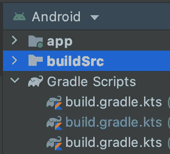
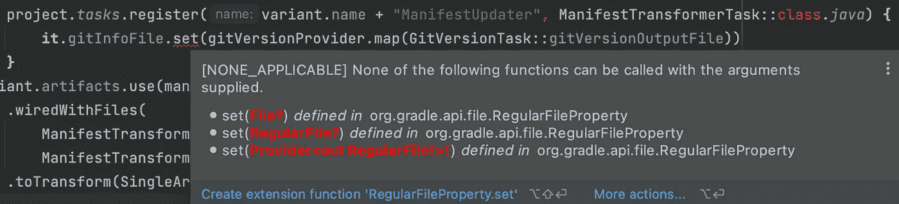

# 格雷尔和 AGP 构建 API:让你的插件更上一层楼！

> 原文：<https://medium.com/androiddevelopers/gradle-and-agp-build-apis-taking-your-plugin-to-the-next-step-95e7bd1cd4c9?source=collection_archive---------2----------------------->


欢迎阅读 MAD 技能系列中关于 Gradle 和 Android Gradle 插件 API 的一篇新文章。在上一篇文章中，你学习了如何编写自己的插件和使用新的[变体 API](https://developer.android.com/studio/build/extend-agp#variant-api-artifacts-tasks) 。如果你喜欢看而不是读，这里有一些东西可以看看:

在本文中，您将了解到 Gradle 任务、提供者、属性以及使用任务输入和输出。您还将进一步开发您的插件，并学习如何使用新的[构件 API](https://developer.android.com/studio/build/extend-agp#variant-api-artifacts-tasks) 访问各种构建构件。

## 性能

比方说，我想构建一个插件，它可以用 git 版本自动更新应用程序清单中指定的版本代码。为此，我需要在我的构建中添加两个任务。第一个任务将获取 git 版本，第二个任务将使用该 git 版本更新清单文件。

让我们从创建一个名为`GitVersionTask`的新任务开始。这个类需要扩展`DefaultTask`并实现带注释的`taskAction`函数。下面是一些查询 git 树顶端的代码。

```
abstract class GitVersionTask: DefaultTask() { @TaskAction
    fun taskAction(){
        // this would be the code to get the tip of tree version,
        val process = ProcessBuilder(
            "git", 
            "rev-parse --short HEAD"
        ).start()
        val error = process.errorStream.readBytes().toString()
        if (error.isNotBlank()) {
            System.err.println("Git error : $error")
        }
        var gitVersion = process.inputStream.readBytes().toString() //... }
}
```

我不能缓存这个值，我想将版本信息存储在一个中间文件中，以便其他任务可以读取和使用这个值。为此，我需要使用一个`[RegularFileProperty](https://docs.gradle.org/current/javadoc/org/gradle/api/file/RegularFileProperty.html)`。属性可用于任务输入和输出。在这种情况下，`[Property](https://docs.gradle.org/current/javadoc/org/gradle/api/provider/Property.html)`将作为一个容器来表示任务输出。我创建了一个`RegularFileProperty`，并用`@get:OutputFile`对其进行了注释。`[OutputFile](https://docs.gradle.org/current/javadoc/org/gradle/api/tasks/OutputFile.html)`是附加到 getter 函数的标记注释。这样，`Property`被标记为该任务的输出文件。

```
@get:OutputFile
abstract val gitVersionOutputFile: RegularFileProperty
```

现在我已经声明了我的任务输出，让我们跳回到`taskAction()`中，在那里我可以访问文件并写入我想要存储的文本。在这种情况下，我将存储 git 版本，它将是该任务的输出。为了简单起见，我用硬编码的字符串替换了 git 版本查询。

```
abstract class GitVersionTask: DefaultTask() {
    @get:OutputFile
    abstract val gitVersionOutputFile: RegularFileProperty @TaskAction
    fun taskAction() {
        gitVersionOutputFile.get().asFile.writeText("1234")
    }
}
```

现在任务已经准备好了，让我们在插件代码中注册这个任务。首先，我将创建一个名为`ExamplePlugin`的新插件类，并实现`[Plugin](https://docs.gradle.org/current/javadoc/org/gradle/api/Plugin.html)`。如果你不熟悉在`buildSrc`文件夹中创建插件，一定要看看本系列之前的视频[ [1](/androiddevelopers/gradle-and-agp-build-apis-configure-your-build-9a10db5b2262) ]、[ [2](/androiddevelopers/gradle-and-agp-build-apis-how-to-write-a-plugin-1695b590e4ec) 。



buildSrc folder

接下来，我将注册`GitVersionTask`，并将输出文件`Property`设置为构建文件夹中的一个中间文件。我还将`upToDateWhen`设置为`false`，这样这个任务以前执行的输出就不会被重用。这也意味着该任务将在每次构建时执行，因为它永远不会是最新的。

```
override fun apply(project: Project) {
    project.tasks.register(
        "gitVersionProvider", 
        GitVersionTask::class.java
    ) {
        it.gitVersionOutputFile.set( 
            File(
                project.buildDir,   
                "intermediates/gitVersionProvider/output"
            )
        )
        it.outputs.upToDateWhen { false }
     }}
```

执行完任务后，我可以检查`build/intermediates`文件夹下的`output`文件，并验证该任务存储了我在任务中硬编码的值。

现在让我们切换到第二个任务，它将更新清单文件中的版本。我调用任务`ManifestTransformTask` 并使用两个`RegularFileProperty`对象作为这个任务的输入。

```
abstract class ManifestTransformerTask: DefaultTask() { @get:InputFile
    abstract val gitInfoFile: RegularFileProperty @get:InputFile
    abstract val mergedManifest: RegularFileProperty}
```

我将使用第一个`RegularFileProperty`来读取由`GitVersionTask`生成的输出文件的内容。我将使用第二个`RegularFileProperty`来读取 app 的清单文件。接下来，我可以用存储在来自`gitInfoFile`的`gitVersion`变量中的版本代码替换清单中的版本代码。

```
@TaskAction
fun taskAction() {
    val gitVersion = gitInfoFile.get().asFile.readText()
    var manifest = mergedManifest.asFile.get().readText()
    manifest = manifest.replace(
        "android:versionCode=\"1\"",     
        "android:versionCode=\"${gitVersion}\""
    )

}
```

现在我可以编写更新的清单了。为此，首先我将为输出创建另一个`RegularFileProperty`，并用`@get:OutputFile`对其进行注释。

```
**@get:OutputFile**
abstract val updatedManifest: RegularFileProperty
```

> [注意，我实际上可以使用 VariantOutput 来直接设置 versionCode，而不必重写清单，但是我将使用这个示例向您展示如何使用工件转换来获得相同的效果。](https://www.google.com/url?q=https://developer.android.com/reference/tools/gradle-api/7.1/com/android/build/api/variant/VariantOutput?hl%3Den%23versionCode:org.gradle.api.provider.Property&sa=D&source=docs&ust=1636756364563000&usg=AOvVaw1QJ3UW-VhsOQ6T_0hhP2ei)

让我们回到插件来连接东西。首先我得到了`[AndroidComponentsExtension](https://developer.android.com/reference/tools/gradle-api/7.0/com/android/build/api/extension/AndroidComponentsExtension)`。我希望这个新任务在 AGP 决定创建哪些变量之后运行，但在值被锁定且无法修改之前运行。在`onVariants()`回调之后是`beforeVariants()`回调，你可能还记得[上一篇文章](/androiddevelopers/gradle-and-agp-build-apis-how-to-write-a-plugin-1695b590e4ec)。

```
val androidComponents = project.extensions.getByType(
    AndroidComponentsExtension::class.java
)androidComponents.onVariants { variant ->
    //...
}
```

## 提供者

您可以使用`[Provider](https://docs.gradle.org/current/javadoc/org/gradle/api/provider/Provider.html)` [s](https://docs.gradle.org/current/javadoc/org/gradle/api/provider/Provider.html) 将`Property`连接到其他需要执行耗时操作的任务，例如从文件或网络等外部输入中读取数据。

我先从注册`ManifestTransformerTask`开始。该任务需要前一任务输出的`gitVersionOutput`文件。为了访问这个`Property`，我将使用一个`Provider`。

```
val manifestUpdater: TaskProvider = project.tasks.register(
    variant.name + "ManifestUpdater",   
    ManifestTransformerTask::class.java
) {
    it.gitInfoFile.set(
        //...
    )
}
```

一个`Provider`可以用来访问一个给定类型的值，或者直接通过使用`[get()](https://docs.gradle.org/current/javadoc/org/gradle/api/provider/Provider.html#get--)`函数，或者通过使用运算符函数如`[map()](https://docs.gradle.org/current/javadoc/org/gradle/api/provider/Provider.html#map-org.gradle.api.Transformer-)`和`[flatMap()](https://docs.gradle.org/current/javadoc/org/gradle/api/provider/Provider.html#flatMap-org.gradle.api.Transformer-)`将该值转换成一个新的`Provider`。当我回头看`Property`接口时，它实现了`Provider`接口。您可以在`Property`上延迟设置值，然后使用`Provider`延迟访问这些值。

当我查看`[register()](https://docs.gradle.org/current/javadoc/org/gradle/api/tasks/TaskContainer.html#register-java.lang.String-)`函数的返回类型时，它返回给定类型的`[TaskProvider](https://docs.gradle.org/current/javadoc/org/gradle/api/tasks/TaskProvider.html)`。我将把它分配给新的`val`。

```
**val gitVersionProvider** = project.tasks.register(
    "gitVersionProvider", 
    GitVersionTask::class.java
) {
    it.gitVersionOutputFile.set(
        File(
            project.buildDir, 
            "intermediates/gitVersionProvider/output"
        )
     )
     it.outputs.upToDateWhen { false }
}
```

现在回到设置`ManifestTransformerTask`的输入。当我试图将值从`Provider`映射到输入`Property`时，我得到一个错误。`map()`的 lambda 参数接受一个值，如`T`，并产生另一个值类型，如`S`。



Error when using `map()`

然而，在这种情况下，set 函数需要一个`Provider`。我可以使用`flatMap()`函数，它同样接受一个值，比如`T`，但是这次产生一个`S`类型的`Provider`，而不是直接产生值`S`。

```
it.gitInfoFile.set(
    gitVersionProvider.**flatMap**(
        GitVersionTask::gitVersionOutputFile
    )
)
```

## 转换

接下来，我需要告诉这个变体的工件使用`manifestUpdater`，并将清单作为输入，将更新后的清单作为输出。最后，我调用`[toTransform()](https://developer.android.com/reference/tools/gradle-api/7.1/com/android/build/api/artifact/InAndOutFileOperationRequest#toTransform(com.android.build.api.artifact.InAndOutFileOperationRequest.toTransform.ArtifactTypeT))`函数来转换单个工件类型。

```
variant.artifacts.use(manifestUpdater)
   .wiredWithFiles(
       ManifestTransformerTask::mergedManifest,
       ManifestTransformerTask::updatedManifest
   ).**toTransform**(SingleArtifact.MERGED_MANIFEST)
```

当我运行这个任务时，我可以看到应用程序清单中的版本代码现在用`gitVersion`文件中的值更新了。注意，我没有明确要求`GitProviderTask`运行。执行`GitProviderTask`是因为这个任务的输出被用作我请求运行的`ManifestTransformerTask`的输入。

## BuiltArtifactsLoader

让我们添加另一个任务，看看如何访问更新后的清单，并验证它是否更新成功。我将创建一个名为`VerifyManifestTask`的新任务。为了读取清单，我需要访问 APK 文件，这是构建任务的一个工件。为此，我需要将构建 APK 文件夹设置为该任务的输入。

注意这一次我使用了`[DirectoryProperty](https://docs.gradle.org/current/javadoc/org/gradle/api/file/DirectoryProperty.html)`而不是`[FileProperty](https://docs.gradle.org/current/javadoc/org/gradle/api/file/RegularFileProperty.html)`，因为`[SingleArticfact.APK](https://developer.android.com/reference/tools/gradle-api/7.0/com/android/build/api/artifact/SingleArtifact.APK)`对象表示构建后 APK 文件所在的目录。

作为该任务的第二个输入，我需要另一个类型为`[BuiltArtifactsLoader](https://developer.android.com/reference/tools/gradle-api/7.0/com/android/build/api/variant/BuiltArtifactsLoader)`的`Property`，我将使用它从描述 APK 目录中文件的元数据文件中加载`[BuiltArtifacts](https://developer.android.com/reference/tools/gradle-api/7.0/com/android/build/api/variant/BuiltArtifacts)`实例。当您拥有本地组件、各种语言等等时，构建可以产生几个 apk。`BuiltArtifactsLoader`抽象出识别每个 apk 的过程以及它们的属性，如 ABI 和语言。

```
@get:Internal
abstract val builtArtifactsLoader: Property<BuiltArtifactsLoader>
```

现在是执行任务的时候了。首先我加载`buildArtifacts`，确保它只包含一个 APK，然后加载这个 APK 作为一个`File`实例。

```
val builtArtifacts = builtArtifactsLoader.get().load(
    apkFolder.get()
)?: throw RuntimeException("Cannot load APKs")if (builtArtifacts.elements.size != 1)
   throw RuntimeException("Expected one APK !")val apk = File(builtArtifacts.elements.single().outputFile).toPath()
```

此时，我可以访问 APK 中的清单，并验证版本是否已更新。为了简单起见，我只检查 APK 是否存在，在这里添加一个检查清单的提示并打印一条成功消息。

```
println("Insert code to verify manifest file in ${apk}")
println("SUCCESS")
```

现在回到插件代码来注册这个任务。在插件代码中，我将新任务注册为`Verifier`，传入 APK 文件夹和当前变体工件的`buildArtifactLoader`对象。

```
project.tasks.register(
    variant.name + "Verifier", 
    VerifyManifestTask::class.java
) {
    it.apkFolder.set(variant.artifacts.get(SingleArtifact.APK))
    it.builtArtifactsLoader.set(
        variant.artifacts.getBuiltArtifactsLoader()
    )
}
```

这一次，当我运行任务时，我可以看到新任务加载了 APK 并打印了成功消息。注意，我没有明确地请求清单转换发生，但是因为`VerifierTask`请求了清单工件的最终版本，转换自动发生了。

## 摘要

我的[插件](https://github.com/android/gradle-recipes/blob/agp-7.1/BuildSrc/manifestUpdaterTest/buildSrc/src/main/kotlin/ExamplePlugin.kt)有三个任务:我的插件[首先检查](https://github.com/android/gradle-recipes/blob/agp-7.1/BuildSrc/manifestUpdaterTest/buildSrc/src/main/kotlin/GitVersion.kt)当前 git 版本树，并将版本存储在中间文件中。[接下来](https://github.com/android/gradle-recipes/blob/agp-7.1/BuildSrc/manifestUpdaterTest/buildSrc/src/main/kotlin/ManifestTransformerTask.kt)，我的插件使用这个任务的输出，使用一个提供者用版本代码更新当前清单。[最后](https://github.com/android/gradle-recipes/blob/agp-7.1/BuildSrc/manifestUpdaterTest/buildSrc/src/main/kotlin/VerifyManifestTask.kt)，我的插件使用另一个任务来访问构建工件并检查清单是否更新。

就是这样！从 7.0 版本开始，Android Gradle 插件提供了官方扩展点，这样你就可以编写自己的插件了！有了这些新的 API，您可以控制构建输入，读取、修改甚至替换中间和最终的工件。

要了解更多并保持构建高效，请确保查看[文档](https://developer.android.com/studio/build/extend-agp)和[配方](https://github.com/android/gradle-recipes)。