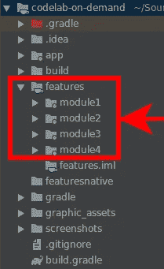
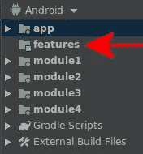
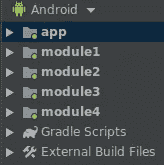

# 关于 Android 模块路径的一件小事

> 原文：<https://medium.com/androiddevelopers/gradle-path-configuration-dc523f0ed25c?source=collection_archive---------0----------------------->


Illustration by [Virginia Poltrack](https://twitter.com/VPoltrack)

## 如何配置你的模块路径，而不是使用 Gradle 的默认路径。

为了使我们的 Android 应用程序更加模块化，我最终制作了一个示例，其中包括一组分组在一个文件夹中的按需功能:



You are going to have more meaningful names, depending on how you modularize your application

非常标准的设置，所有的点播模块都在一个“功能”文件夹中；干净。

这些模块包含在 settings.gradle 文件中，如下所示:

```
include ':app'
include ':features:module1'
include ':features:module2'
include ':features:module3'
include ':features:module4'
```

这些设置很好地解决了一个“小”问题:Android Studio 的 Android 视图中有一个名为`features`的空模块:



By default, we have an empty module in Android Studio’s Android view

我可以接受，但是我更愿意从我的项目中删除这个空模块！

# 如果您不能删除它，只需重命名它！

在 I/O 大会上，我有幸参加了“ *Android Studio:提示和技巧*”讲座，来自谷歌的 Ivan Gravilovic 分享了一些惊人的技巧。其中之一是我的问题的一个可能的解决方案:为我的模块设置一个自定义路径。

Ivan Gavrilovic from Google sharing Gradle’s tips and tricks

在这种特殊情况下，我们的`settings.gradle`变成了:

```
include ':app'
include ':module1'
include ':module2'
include ':module3'
include ':module4'// Set a custom path for the four features modules.
// This avoid to have an empty "features" module in  Android Studio.
project(":module1").projectDir=new File(rootDir, "features/module1")
project(":module2").projectDir=new File(rootDir, "features/module2")
project(":module3").projectDir=new File(rootDir, "features/module3")
project(":module4").projectDir=new File(rootDir, "features/module4")
```

Android Studio 中的布局现在是:



No more empty modules!

# 结论

正如标题所言，这确实是一件小事，但它有助于保持我的项目有序，它显示了一个小的 Gradle 配置如何有助于保持您的项目整洁。

> 你可以在最新版本的[点播模块 codelab](https://codelabs.developers.google.com/codelabs/on-demand-dynamic-delivery/index.html) 中找到这个更新。

# 资源

*   [安卓工作室:技巧和窍门(谷歌 I/O’19)](https://www.youtube.com/watch?v=ihF-PwDfRZ4&list=PLWz5rJ2EKKc9FfSQIRXEWyWpHD6TtwxMM&index=32&t=0s)
*   [按需模块 codelab](https://codelabs.developers.google.com/codelabs/on-demand-dynamic-delivery/index.html)
*   [拼布格子——一个模块化的故事](/androiddevelopers/a-patchwork-plaid-monolith-to-modularized-app-60235d9f212e)