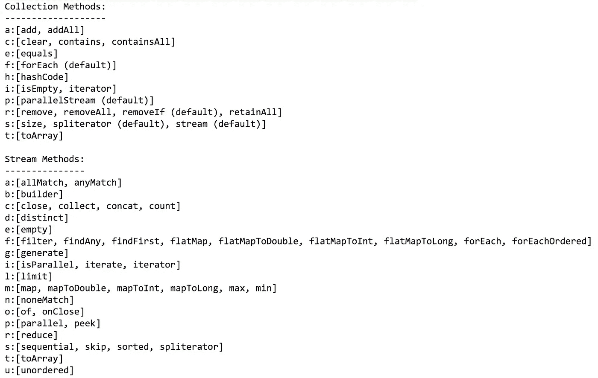
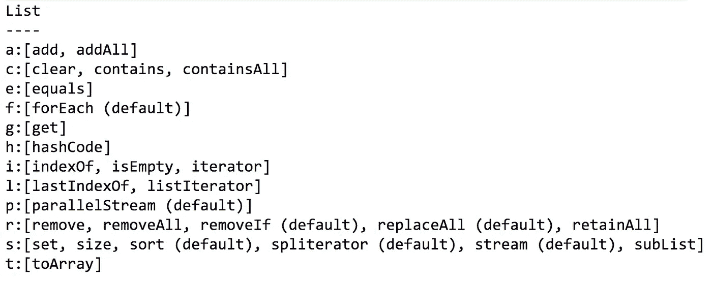
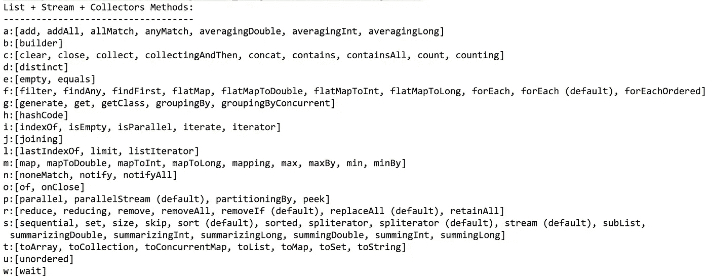
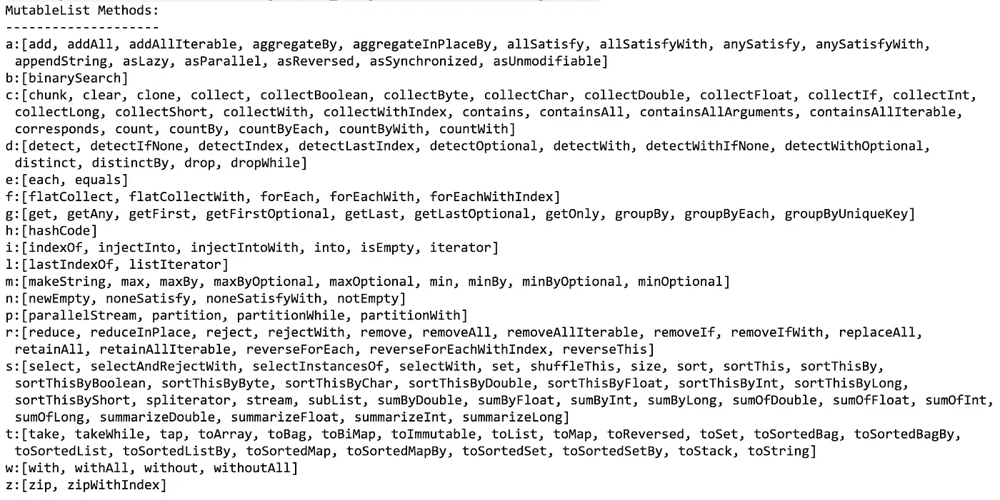
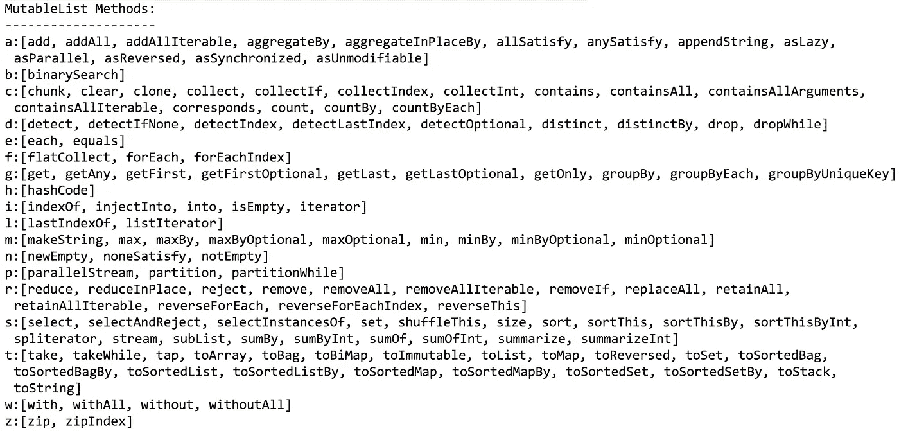
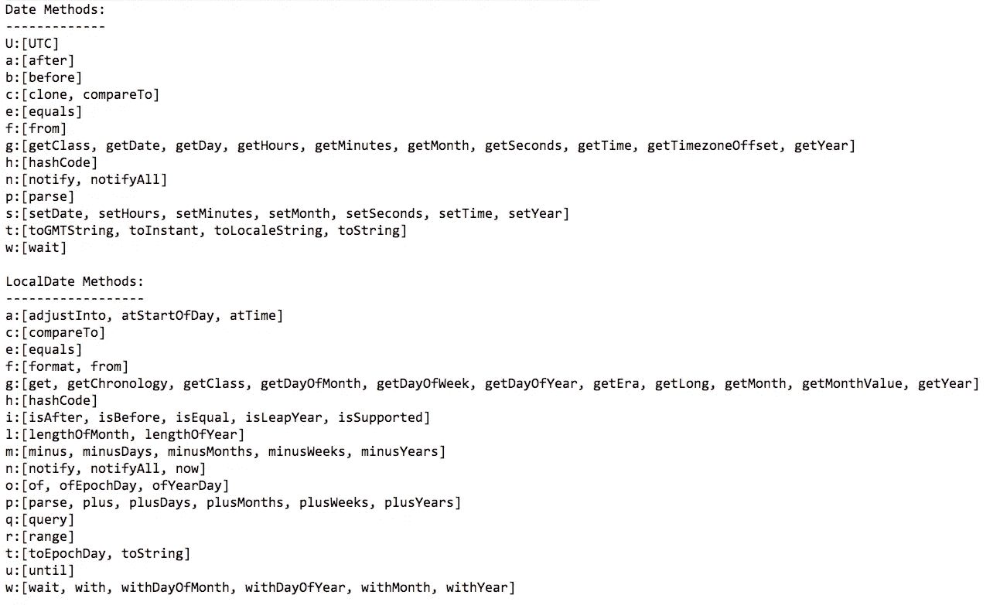
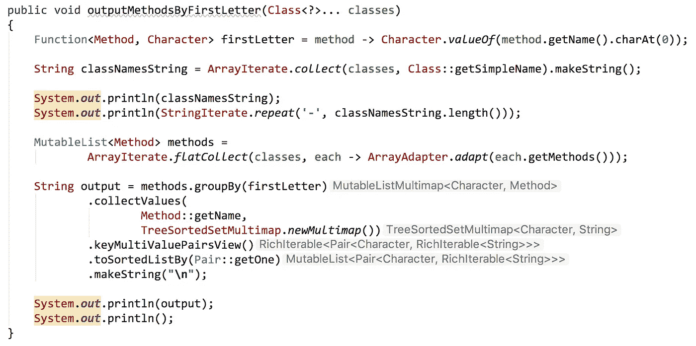

# 从最简到丰富的 Java APIs

> 原文：<https://medium.com/oracledevs/graduating-from-minimal-to-rich-java-apis-c50192c8322f?source=collection_archive---------3----------------------->

将简单易学与减少代码重复相结合，以提高生产率。


Happy Birthday Java!

# 生日快乐，爪哇

2019 年 5 月 23 日 Java 满 24 岁。对于一门成功的编程语言来说，这是一段令人印象深刻的时间，同时也是继续发展其开发者社区的时间。Java 在不断发展，Java 社区也在不断创新和成长。

直到 Java 8(2014 年发布)之前，Java 或多或少都遵循着最小 API 设计理念。这对于 Java 来说效果非常好，因为最小化的 API 设计往往会降低初始学习曲线，并且通过只要求开发人员学习一些基本概念来提高采用率。

# 集合的最小 API 设计

自从 1998 年 12 月 Java 2 发布以来,`[Collection](https://docs.oracle.com/javase/8/docs/api/java/util/Collection.html)`接口就可以在 Java 中使用了。`Collection`有几种变异方式，包括`add`、`addAll`、`remove`、`removeAll`、`retainAll`、`clear`。有几种测试方法，包括`contains`、`containsAll`、`isEmpty`和`size`。每个`Collection`都可以使用方法`toArray`返回其内容。方法`iterator`允许使用 for 循环或 while 循环实现任何迭代模式。2014 年 3 月，Java 8 发布，`[Stream](https://docs.oracle.com/javase/8/docs/api/java/util/stream/Stream.html)`接口增加了内置迭代模式(如`filter`、`map`、`reduce`)。更新了`Collection`界面，以包含新的默认方法，包括`forEach`、`stream`和`parallelStream`方法。



Collection API (1998), and Stream API (2014), with new default methods added on Collection

# 升级到更高级别的 API

随着编程语言的成熟和被广泛采用，满足更有经验的开发人员的需求并保持与更新、更灵活的编程语言的竞争力变得非常重要，这些编程语言可能不太关心保持版本之间的向后兼容性。Java 开发人员(估计现在大约有 1200 万人)已经非常熟悉 Java Collections API，它已经存在了 20 多年。Java 是一种优秀的通用编程语言，它为开发人员提供了创建优秀应用程序所需的基本工具。自从 Java 8 发布以来，Java 已经开始引入更高级别的 API，尤其是在集合领域。Java 8 中添加的`Stream` API 增加了与现有的`Collection`接口一起工作的函数方法。

从 Java 8 开始，`[List](https://docs.oracle.com/javase/8/docs/api/java/util/List.html)`接口也增加了一些新的默认方法。例如，我们终于有了一个直接在`List`上可用的`sort`方法。从 Java 2 开始，开发人员就一直使用`Collections`类对`List`的实例进行排序。下面是 Java 8 以后的`List`界面。



List interface (December 1998) with default methods added (March 2014)

Java 8 中为`Collection`和`List`提供的大多数新功能都可以通过调用`stream`方法，然后调用`Stream`接口上可用的适当方法来实现。在`Stream`界面上可用的行为被`collect`方法进一步扩展，该方法可以被传递一个`Collector`。在`Stream`上名为`collect`的方法通常被描述为*可变归约*。从 Java 8 开始，在`[Collectors](https://docs.oracle.com/javase/8/docs/api/java/util/stream/Collectors.html)`类上有一组可用的`Collector`实现。 [Eclipse Collections](https://github.com/donraab/eclipse-collections) 在其`[Collectors2](https://www.eclipse.org/collections/javadoc/9.2.0/org/eclipse/collections/impl/collector/Collectors2.html)`类中添加了自己的一组`Collector`实现。

如果我们将`List`、`Stream`和`Collectors`类中所有可用的功能结合起来，您将看到从旧的最小 API 设计到新的更丰富的 API 设计的演变。



Combining the List, Stream and Collectors APIs

将`List`、`Stream`和`Collectors`的组合 API 与[Eclipse Collections](https://github.com/donraab/eclipse-collections)`[MutableList](https://www.eclipse.org/collections/javadoc/9.2.0/org/eclipse/collections/api/list/MutableList.html)`类中已有的丰富 API 设计进行比较，你会开始看到它们之间的一些共同模式(有时名称不同)。这些模式并不新鲜。它们在不同的编程语言中已经存在了很长时间，但是现在才被 Java 开发人员社区发现和学习。



MutableList methods in Eclipse Collections

更高级别的 API 帮助开发人员解决一个基本问题，最小的 API 可以帮助创建——**代码复制**。在 [Eclipse Collections](https://github.com/donraab/eclipse-collections) `MutableList`接口中可以看到，有大量的迭代模式没有包含在 Java `List`接口最初的最小 API 设计中。因为这些迭代模式没有随语言一起在高级 Java APIs 中提供，所以开发人员需要使用迭代器和索引列表访问的基本构建块来自己实现这些模式。

参见我之前关于[代码复制](/@donraab/code-duplication-1e1f759a7fe3)的博客，了解更多关于迭代模式的知识。

# 高级学习与基本复制

最小 API 设计的支持者通常会认为最小 API 更容易学习。这是真的。如果你认为用集合编写代码只需要一个迭代器和一个 for 循环，那你就对了。但是，如果你只有一个迭代器，你将不得不反复迭代相同的模式(锤子，遇见钉子)。更重要的是，你将会留下重复的代码给将来的读者阅读。

> 你要写的代码越多，别人要读的代码就越多。

最小的 API 设计导致应用程序开发人员必须编写、测试和维护更多的代码。丰富的 API 设计导致库开发人员必须编写、测试和维护更多的代码。如果我们对世界上编写的所有代码都拥有共享的代码所有权，我们可能会同意成本最低的替代方案是在适当的时候依靠库和语言开发人员来提供丰富的 API 供开发人员使用。

> 一旦你知道了基础知识，学习更高级的概念是一件好事

在 Java 的前 24 年里，最小 API 设计很好地服务了它的目的。它导致了 Java 编程语言的广泛采用。Java 开发人员已经学习了使用迭代器的基本模式，并且准备好并愿意学习和逐步过渡到使用更高级别的 API。

# 太少=贫血&&太多=臃肿

API 太少或太多都有可能。在中间的某个地方，一个 API 会觉得“刚刚好”。Java 同时支持对象和原语类型，这使得 API 设计者的目标变得复杂。

Eclipse 集合在 Java 中提供了尽可能多的对象和基本类型之间的互操作性。这有时会导致所需的接口、类和方法的数量成倍增加。例如，`MutableList`上的`collect`和`sort`方法都有每种基本类型的基本版本。如果我们将方法的总数减少到核心概念的总数，那么开发人员需要学习的新概念的数量会更合理。例如，如果您学习了 Eclipse 集合中的`collect`模式，这是一个核心概念，您将已经知道所有的`collect` *** (例如`collectInt`、`collectShort`等等。)方法管用。

在下图中，我只包含了 MutableList 的核心概念 API。我已经放弃了所有的"`With`"方法和除了"`Int`"之外的所有原始方法。这总共从输出中删除了大约 40 个方法。



MutableList Core Concepts

为了理解所有其他基本方法是如何工作的，知道一个基本方法是如何工作的就足够了。如果一个 API 的开发者有[对称的同情心](/@donraab/symmetric-sympathy-2c59d4541d60)，你将能够容易地理解和使用每一个核心概念。

# Java 日期和时间的演变

从最小 API 到丰富 API 的进化变化的另一个例子是在 Java 时间库中。比较 Java 8 以来可用的`Date`类和`LocalDate`类上的方法。



Date compared to LocalDate

Java 时间库有一个更加人性化的 API 来处理日期和时间。它很好地平衡了丰富性和极简主义。

# 来源的来源

下面的源代码用于输出上述接口和类中的所有方法。你可以用它输出你想要的任何类的任何方法。尝试更改分组的函数，以获得类或接口的 API 的不同视图。



```
public void outputMethodsByFirstLetter(Class<?>... classes)
{
    Function<Method, Character> firstLetter =
            method -> Character.*valueOf*(method.getName().charAt(0));

    String classNamesString =
            ArrayIterate.*collect*(classes, Class::getSimpleName)
                    .makeString();

    System.***out***.println(
            classNamesString);
    System.***out***.println(
            StringIterate.*repeat*(**'-'**, classNamesString.length()));

    MutableList<Method> methods =
            ArrayIterate.*flatCollect*(
                    classes,
                    each -> ArrayAdapter.*adapt*(each.getMethods()));

    String output = methods.groupBy(firstLetter)
            .collectValues(
                    Method::getName,
                    TreeSortedSetMultimap.*newMultimap*())
            .keyMultiValuePairsView()
            .toSortedListBy(Pair::getOne)
            .makeString(**"\n"**);

    System.***out***.println(output);
    System.***out***.println();
}
```

## 更新:2019 年 6 月 3 日

下面的源代码将向您展示两个类中方法的对称差异和交集。只需在第一个方法中改变你想要比较的两个类。

```
@Test
public void symmetricDifferenceAndIntersectionOfApis()
{
    this.symmetricDiffAndIntersectionOfApis(Collectors.class, Collectors2.class);
}

public void symmetricDiffAndIntersectionOfApis(Class<?> classOne, Class<?> classTwo)
{
    MutableSet<String> leftMethods =
            Sets.***mutable***.with(classOne.getMethods())
                    .collect(this::methodNamePlusParms);
    MutableSet<String> rightMethods =
            Sets.***mutable***.with(classTwo.getMethods())
                    .collect(this::methodNamePlusParms);

    String classNames = classOne.getSimpleName() + 
            **", "** + 
            classTwo.getSimpleName();
    this.symmetricDifference(leftMethods, rightMethods, classNames);
    this.intersection(leftMethods, rightMethods, classNames);
}

private String methodNamePlusParms(Method method)
{
    return method.getName() + **"("** +
            ArrayIterate.*collect*(method.getParameters(), Parameter::getType)
                    .collect(Class::getSimpleName)
                    .makeString() + **")"**;
}

private void symmetricDifference(
        MutableSet<String> leftMethods,
        MutableSet<String> rightMethods,
        String classNames)
{
    System.***out***.println(**"Symmetric Difference ("** + classNames + **")"**);
    System.***out***.println(
            StringIterate.*repeat*(**'-'**, 
                    (**"Symmetric Difference ("** + classNames + **")"**)
                    .length()));
    this.outputGroupByToString(leftMethods.symmetricDifference(rightMethods));
}

private void intersection(
        MutableSet<String> leftMethods,
        MutableSet<String> rightMethods,
        String classNames)
{
    System.***out***.println(**"Intersection ("** + classNames + **")"**);
    System.***out***.println(
            StringIterate.*repeat*(**'-'**, 
                    (**"Intersection ("** + classNames + **")"**)
                    .length()));
    this.outputGroupByToString(leftMethods.intersect(rightMethods));
}

private void outputGroupByToString(RichIterable<String> methods)
{
    Function<String, Character> firstLetter = string -> Character.*valueOf*(string.charAt(0));

    String output = methods.groupBy(firstLetter)
            .collectValues(
                    each -> each,
                    TreeSortedSetMultimap.*newMultimap*())
            .keyMultiValuePairsView()
            .toSortedListBy(Pair::getOne)
            .makeString(**"\n"**);

    System.***out***.println(output);
    System.***out***.println();
}
```

## 更新:2019 年 6 月 5 日

我重构了计算对称差和交集的代码，用`MutableSortedSet`代替`MutableSet`。

# 每天都学些新东西

一些开发人员可能会觉得像 Eclipse Collections 这样全面的 API 令人生畏。好消息是，有了 Eclipse 集合，您可以按照自己的节奏学习和使用 API。例如，`MutableList`扩展了`java.util.List`，所以如果您熟悉 Java 中的`List` API，那么您已经熟悉了 Eclipse 集合中的`MutableList` API 的基础。如果您已经投资学习 Java `Stream`和`Collectors`，您也可以将这些概念用于 Eclipse 集合类型。还有更方便的直接在集合类型上使用的方法，比如`MutableList`本身。如果 Eclipse 集合中的一些不同方法名称看起来很奇怪，不要担心，有一个[博客可以帮助您将 Streams 方法名称转换为 Eclipse 集合方法名称](/@donraab/a-rose-by-any-other-name-e15060d4c98e)。

学习像迭代模式这样的新事物将帮助你成为一个更好的开发人员，不管你用什么语言编程。这些年来，我在 Smalltalk、Ruby、Scala、Groovy、Haskell、Clojure、Python 和 JavaScript 中学习并尝试了迭代模式 API。我还写过比较五种不同 Java 集合框架的 katas。这使得我在处理集合时可以更容易地在这些语言和库之间转换。

*我是*[*Eclipse Collections*](https://github.com/eclipse/eclipse-collections)*OSS 项目在*[*Eclipse Foundation*](https://projects.eclipse.org/projects/technology.collections)*的项目负责人和提交人。* [*月食收藏*](https://github.com/eclipse/eclipse-collections) *为* [*投稿*](https://github.com/eclipse/eclipse-collections/blob/master/CONTRIBUTING.md) *。如果你喜欢这个库，你可以在 GitHub 上让我们知道。*