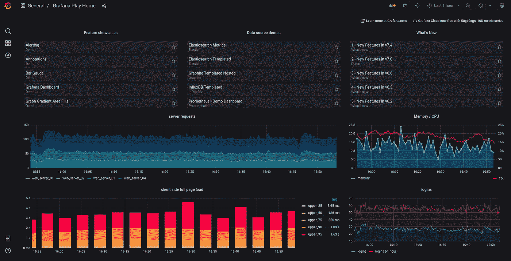
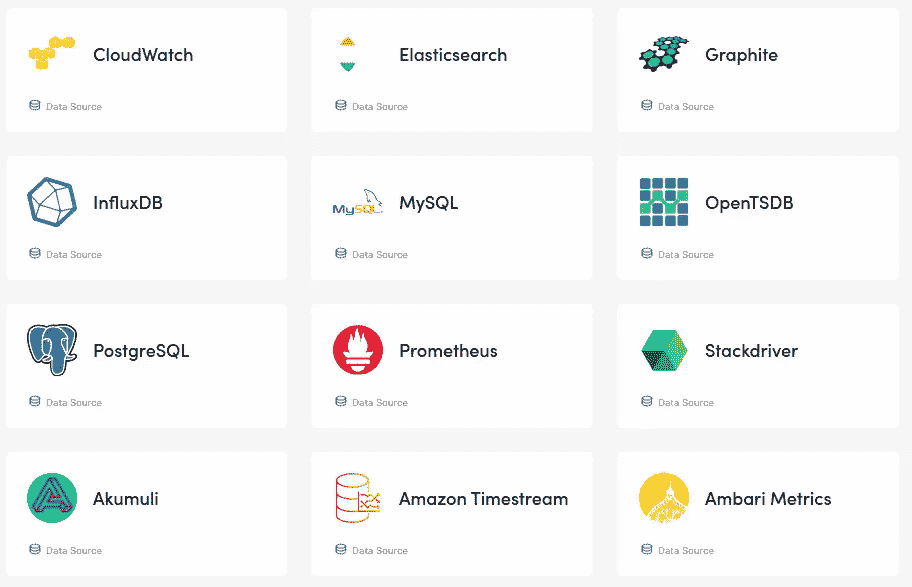
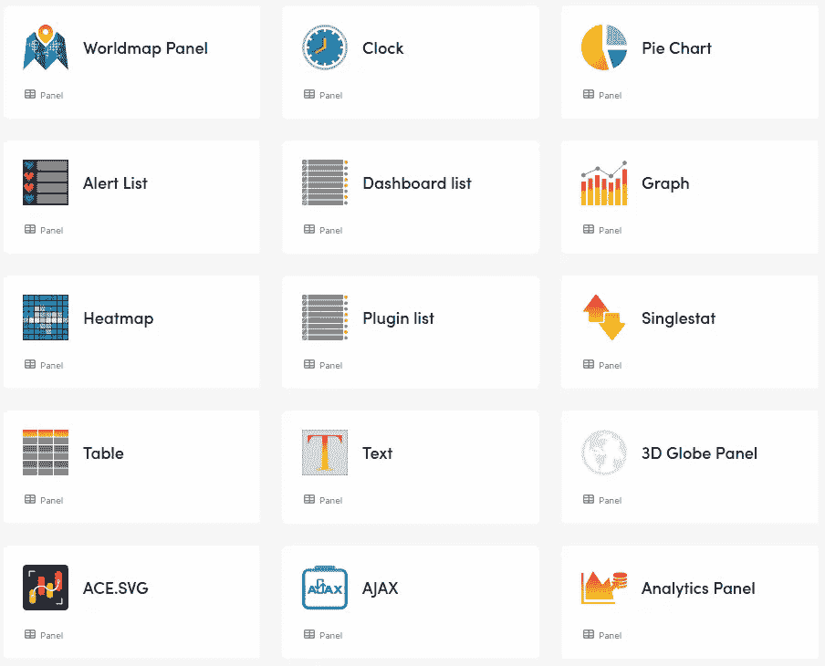
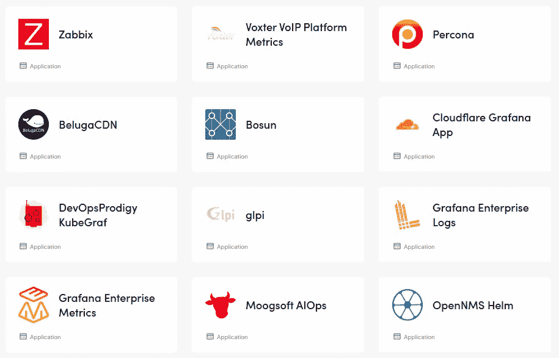
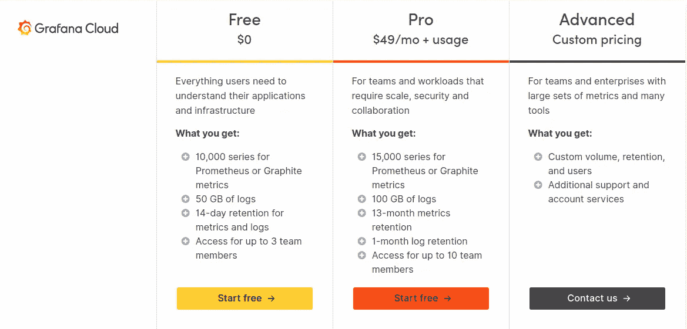
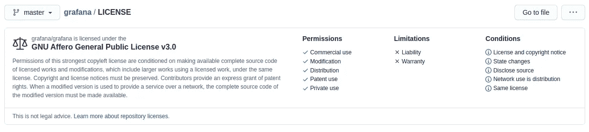

# Grafana 启动并运行——Grafana 是什么？

> 原文：<https://medium.com/globant/grafana-up-and-running-what-is-grafana-f519e9ae8749?source=collection_archive---------0----------------------->

# 介绍

这是我写的关于 Grafana 的系列文章的第一篇。我将向您解释 Grafana 是什么，以及为什么它是一个关键工具，可以代表任何业务和监控领域的潜在优势。

这篇介绍性的文章将呈现关于 Grafana 的总体观点，但并不打算成为安装指南(目前还不是)、技术比较或对其特征的深入探讨。

**本文涵盖以下几点:**

1.  关于格拉夫纳
2.  插件
    2.1 数据源
    2.2 面板
    3.3 应用
3.  格拉夫纳风味
    3.1 格拉夫纳云
    3.2 格拉夫纳企业
    3.3 格拉夫纳开源
4.  用例
5.  资源
6.  结论

# 1.关于格拉夫纳

Taken from [https://play.grafana.org](https://play.grafana.org/d/000000012/grafana-play-home)

简而言之，Grafana 作为一个工具脱颖而出，它提供了使用各种统计可视化的监控功能，允许您在同一平台上集成多个数据源。因此，例如，您可以构建一个独特的仪表板，显示一些面板，其中包含您最近的弹性搜索、Datadog 和 Prometheus 指标，以及其他面板，这些面板显示基于从不同的 SQL Server、MySQL 和 PostgreSQL 查询中检索的信息的混合统计图形表示。

我发现 Grafana 非常有趣，甚至有潜力的一点是，它为您提供了开发您需要的非常具体的指标的能力。你只需要处理你需要的信息，仅此而已。把它想象成一块白板，你可以在上面逐步填充你的团队和公司需要的所有重要信息。因此，这个工具的多功能性和可能性是非常巨大的。

说到这里，我将更详细地总结 Grafana 的特点，以便您能更好地了解它。

# 2.插件

Grafana 拥有不断扩展的自有和社区插件，分为三个部分:

*   数据源
*   嵌板
*   应用程序

这套插件包含了丰富 Grafana 功能的所有组件，以满足我们的需求。为了让你对这些有更多的了解，接下来我会解释每一个类别。Grafana 插件的完整列表可以在这里查阅[。](https://grafana.com/grafana/plugins/)

## 2.1 数据源

如前所述，Grafana 可以处理混合数据源，并且有许多——很多——支持监控您需要放在仪表板上的几乎所有东西。

为了使用数据源，你必须安装一个插件。接下来，您可以看到其中一些的截图，但您可以在这里找到完整的列表和相关信息:

Some panel plugins. Image Taken from [grafana.com](https://grafana.com/grafana/plugins/?type=datasource)

## 2.2 面板

在这一部分中，您有一套完整的可视化工具可以集成到您的仪表板中，例如地图、饼图、列表、时钟、直方图、表格、热图等。

Some panel plugins. Image Taken from [grafana.com](https://grafana.com/grafana/plugins/?type=panel)

## 2.3 应用程序

这些是数据源和面板的组合，为您提供集成给定技术所需的组件。

Some panel plugins. Image Taken from [grafana.com](https://grafana.com/grafana/plugins/?type=app)

# 3.格拉夫纳风味

Grafana 提供了三种方法来启动和运行软件:

*   格拉夫纳云
*   格拉夫纳企业
*   Grafana 开源

## 3.1 格拉法纳云

这是 Grafana 的 [SaaS](https://en.wikipedia.org/wiki/Software_as_a_service) 版本，在这个版本中，你为软件的使用付费，同时拥有云上软件的所有继承优势，例如自动更新和不需要管理底层基础设施。

它有一个*免费*层以及一个*专业*和*高级*层，在这两层之间，它们的特性和价格当然各不相同。在 Grafana 网站的下一张截图中，您可以看到这些图层的简要对比:

Taken from [https://grafana.com/products/cloud/pricing/](https://grafana.com/products/cloud/pricing/)

有关特性和当前价格的更多信息，请参考 [Grafana 云定价部分](https://grafana.com/products/cloud/pricing/)。

## 3.2 格拉法纳企业

[Grafana 企业堆栈](https://grafana.com/products/enterprise/)的一部分，包括:

*   格拉夫纳企业，
*   普罗米修斯企业指标和
*   企业日志。

如果您更喜欢或需要在您当前的基础设施上安装 Grafana *内部部署*功能，例如 Grafana 安装的合规性和安全性、访问企业插件、团队协作以及 Prometheus、Graphite 和 Grafana 的专业支持，这是一个不错的选择。

您必须[联系 Grafana 团队](https://grafana.com/contact?about=grafana-enterprise-stack&plcmt=prod-ent-stack-sub-nav)以获取更多信息，并请求根据您的公司案例定制演示。

## 3.3 Grafana 开源

这是 Grafana 团队提供的特殊版本，作为 GitHub 中托管的[开源项目，这确实是最受欢迎的开源项目之一。](https://github.com/grafana/grafana)

当然，这个版本包含 Grafana 的完整核心，以及一个允许个人和公司充分利用这个软件并在他们的项目中公开使用的许可。

你可以在下一张截图中看到它的许可证简介:

Taken from [https://github.com/grafana/grafana/blob/master/LICENSE](https://github.com/grafana/grafana/blob/master/LICENSE)

你可以在本地安装 Grafana 开源*，在任何 *IaaS* 云供应商上运行，在 *Kubernetes* 集群上运行，或者作为 *Docker* 容器在你想要的任何地方运行。*

您可以将它用于商业目的。所以…好吧，我认为你有这个选择。

你可以在 [Grafana 开源网站](https://grafana.com/oss/grafana/)上获得关于这个选项的更多信息。

# 4.用例

Grafana 可用于不同的场景，例如:

*   业务仪表板:在这里，您可以使用 SQL 或非 SQL 数据源，根据您的查询获得指标。这使得管理层和决策者能够基于依赖于混合数据源查询的可视化统计来支持他们的决策。都在一个地方。
*   技术仪表板:您可以从其他日志记录系统收集指标，并在 Grafana 中显示它们。可以获取你的容器、微服务、物联网设备、云实例、物理机等信息。选择是广泛和多样的。
*   特定公司范围:您的公司可能有不同的领域，每个领域都可以创建自己的仪表板来支持其需求。
*   自动监控:因为 Grafana 中的仪表板是 JSON 文件。您可以使用 CI/CD 策略(即 Jenkins、Travis CI、Gitlab CI 等)。)和一个源代码管理系统(即 Github、GitLab 等。)，以便自动化和管理您的基础架构或微服务的自动仪表板的生成。

# 5.资源

接下来，我会给你留下一些有用的链接，可以帮助你的 Grafana 之旅:

*   [官方文件](https://grafana.com/docs/)——在这里你可以找到格拉夫纳的一切
*   [官方教程](https://grafana.com/tutorials/)——在这里你可以学习如何管理和使用 Grafana
*   [入门网络研讨会](https://grafana.com/go/webinar/getting-started-with-grafana/?pg=oss-graf&plcmt=hero-txt) —这是一个循序渐进的入门指南
*   [游乐场！](https://play.grafana.org/d/000000012/grafana-play-home?orgId=1) —一个现成的和免费的使用 Grafana 来测试和玩它
*   [良好仪表板设计的初学者指南](https://grafana.com/go/webinar/guide-to-dashboard-design/?pg=oss-graf&plcmt=hero-txt)——改进仪表板设计的指南
*   [Grafana 社区网站](https://community.grafana.com/) —当您需要 Grafana 的帮助时可以去的地方

# 6.结论

我们已经讨论了 Grafana、它的优势、功能和使用案例。我们也指出了得到格拉夫纳的可行方案。然而，重要的是要说，有而且肯定会出现更多的替代方案来运行和工作 Grafana 安装，例如 Grafana 的 [AWS 托管服务](https://aws.amazon.com/grafana/)。

最后，我们可以总结说，Grafana 为我们提供了以下好处:

*   使用异构数据源的集中监控平台
*   您可以配置 Grafana alerts，以便在超过预定义的阈值时联系您的团队。
*   您可以在您的文件夹和/或仪表板中设置用户级和团队级权限，以便在您的团队中实现受控的协作工作。
*   它的开源版本可以用于我们的业务需求，并使用不同的策略(如容器)安装在我们自己的底层基础设施中。
*   Grafana 提供了优秀的文档、教程、游戏和所有需要的东西，所以我们可以充分利用这个工具
*   为特定用户提供非常有趣的 SaaS 产品。
*   为有需要的公司提供全面的支持/法规遵从性企业版。

在下一篇文章中，我将更多地介绍我们的替代方案，以便让 Grafana 安装正常运行！

