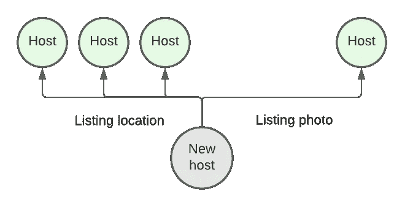
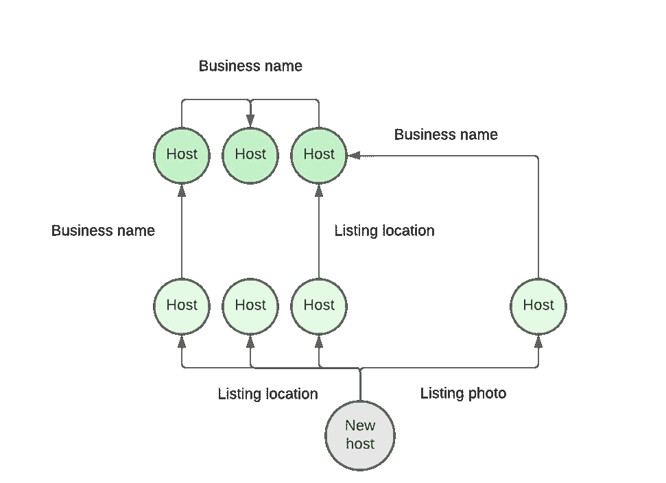
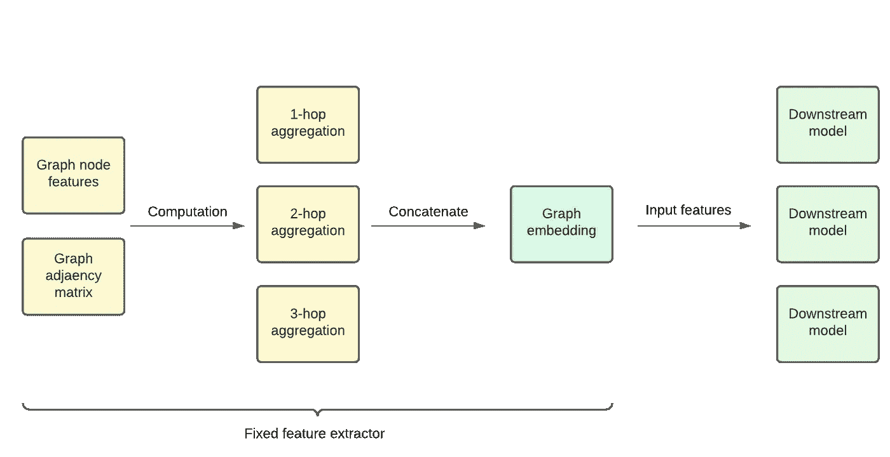

# Airbnb 的图形机器学习

> 原文：<https://medium.com/airbnb-engineering/graph-machine-learning-at-airbnb-f868d65f36ee?source=collection_archive---------0----------------------->

## **Airbnb 如何利用图形神经网络来提升我们的机器学习**

作者:[德文·索尼](https://www.linkedin.com/in/devinsoni/)

# 介绍

许多现实世界的机器学习问题可以被框架化为图问题。在在线平台上，用户经常共享资产(例如照片)并相互交互(例如消息、预订、评论)。用户之间的这些联系自然形成了可用于创建图表的边。

然而，在许多情况下，机器学习实践者在构建机器学习模型时并没有利用这些联系，而是将节点(在这种情况下是用户)视为完全独立的实体。虽然这确实简化了事情，但是忽略节点连接周围的信息可能会由于忽略该节点在整个图的上下文中的位置而降低模型性能。

在这篇博客文章中，我们将解释使用图表进行机器学习的好处，并展示如何利用图表信息让我们了解更多关于用户的信息，以及建立更多的用户上下文表示[4]。然后，我们将介绍特定的图形机器学习方法，如图形卷积网络，Airbnb 正在使用这些方法来改进现有的机器学习模型。

这项工作的激励用例是建立机器学习模型，保护我们的社区免受伤害，但许多要点和正在建立的系统都非常通用，也可以应用于其他任务。

# 挑战

## **问题**

当围绕用户或列表等实体建立信任与安全机器学习模型时，我们通常从直接描述实体的特征开始。例如，就用户而言，我们可能会使用他们的位置、帐户年龄或预订数量等特征。然而，这些简单的特征不足以描述 Airbnb 平台整体环境中的用户以及他们与其他用户的交互。

考虑一个假设场景，一个新的主机加入 Airbnb。他们的主机之旅已经进行了一周，除了他们直接告诉我们的，我们可能没有太多关于他们的信息。这可能包括他们的上市地点或他们的电话号码。主人给我们的这些直接属性都是比较表面的，并不一定有助于我们了解他们的可信度或声誉。

在这种情况下，Airbnb 很难为这个新主机提供最好的体验，因为我们不知道他们对该平台的使用模式会是什么。如果缺乏信息，我们可能会让这个新主机经历一个较慢的入职流程，或者预先请求大量信息。了解该用户与平台其他部分的关系是我们可以利用的数据，以便为他们提供更好的体验。

## **图表用途的说明**

虽然我们没有太多关于新宿主的直接信息，但我们能做的是利用它们的环境来尝试和了解更多。这方面的一个例子是他们与其他用户的联系。

我们可以先看看它们的单跳邻居，或者换句话说，这台主机与之有直接连接的一组用户。在本例中，我们可以看到这个新主机与一个现有的终身主机共享一张列表照片。我们还可以看到，新主机的列表与其他三个主机的列表位于同一房子中。有了这些额外的知识，我们现在对新的宿主有了更多的了解；他们可能与在同一间房子里有房间的其他主人一起工作。但是，如果不查看更多图表，我们无法完全确定所有连接的主机之间的关系。

让我们进一步扩展我们的视野，考虑新主机的两跳邻居。这将我们的视野扩展到不一定直接连接到新主机的用户。在这个扩展的网络中，我们现在可以看到，在该位置有列表的许多主机通过一个共享的企业名称相互连接。现在很有可能这个新的主机是在同一房屋中出租房间的现有主机组的一部分，并且还没有更新他们的简档来反映这一点。

利用图表的力量，我们能够简单地通过检查他们与 Airbnb 中其他用户的联系来了解一个新的主机。从图表中提取的这些额外知识让我们更好地了解我们的新宿主是谁。随后，我们能够向这位新主人提供更好的体验，而无需他们向 Airbnb 提供更多信息。

用图形信息补充我们的模型是引导我们的模型的一种方式。使用图表，我们可以在我们几乎没有关于用户的历史数据或观察的场景中构建对用户的详细理解。虽然我们从图中获得的语义信息通常是推断出来的，而不是由用户直接告诉我们的，但它可以给我们一个强大的知识基线水平，直到我们有更多关于用户的事实信息。

# **图形机器学习**

我们已经确定，我们希望我们的机器学习模型能够摄取图表信息。主要的挑战是弄清楚如何最好地将一个图所能表示的一切浓缩成我们的模型可以使用的格式。让我们深入研究一些选项，并探索我们最终实现的解决方案。

一个简单的选择是计算关于节点的统计数据，并将它们用作数字特征。例如，我们可以计算用户连接的用户数量，或者他们与其他主机共享的列表照片数量。这些指标计算起来很简单，让我们对节点在图的整体结构中的作用有了一个基本的了解。这些指标很有价值，但没有利用节点的功能。因此，简单的统计不能超越表示图形结构。

我们真正想要的是能够在图中生成一个节点邻域的聚合，该聚合捕获了节点在图中的结构角色及其节点特征。例如，我们想知道的不仅仅是一个用户连接了多少个用户；我们还想了解他们所联系的用户的类型(例如，他们的帐户期限，或过去的预订计数)，因为这比简单的边缘计数为我们提供了更多关于原始用户的线索。

## **图卷积网络**

为了捕捉图形结构和节点特征，我们可以使用一种称为图形卷积网络的图形神经网络架构。图卷积网络(GCN)是一种神经网络，除了图的邻接矩阵之外，通常还将节点特征矩阵作为输入，并输出节点级输出。这种类型的网络架构优于简单地将预先计算的结构特征与节点特征连接，因为它能够联合表示两种类型的信息，可能产生更丰富的嵌入。

图卷积网络由多层组成。单个 GCN 图层旨在获取聚合其邻域信息的结点的表示(在大多数情况下，将邻域信息与其自身的要素相结合)。以我们新创建的主机帐户为例，一个 GCN 图层将是主机的一跳邻域。可以引入代表主机的两跳邻域的第二 GCN 层来捕获附加信息。由于 GCN 图层 N 的输出用于生成 GCN 图层 N+1 中使用的制图表达，因此添加图层会增加用于生成结点制图表达的聚合范围[1]。

根据上一节中的例子，我们需要一个有两层的 GCN 来生成一个图嵌入，这个图嵌入捕获了图示的子图。我们可以更深入，进一步扩展到三阶、四阶等等。然而，在实践中，少量的层(例如 2-4 层)就足够了，因为超过该点的连接可能会非常嘈杂，并且不太可能与原始用户相关。

## **模型建筑&培训**

决定使用 GCNs 后，我们现在必须考虑我们希望每个图层聚合相邻节点要素的方法有多复杂。有各种各样的聚集方法可以使用。这些包括平均池，总和池，以及更复杂的涉及注意机制的聚合器[5]。

当谈到信任和安全时，我们经常在对立的问题领域中工作，由于概念漂移，需要频繁的模型再训练。限制模型的复杂性，以及限制必须重新训练的模型的数量，对于降低维护的复杂性是很重要的。

有人可能会认为，具有更复杂、更具表现力的聚合函数的 gcn 总是更好。不一定是这样的。事实上，一些论文已经表明，在许多情况下，非常简单的图卷积网络是在实际任务中实现最先进性能所需的全部[2，3]。简化的 GCN (SGC)架构表明，使用没有可训练权重的 GCN 层，我们可以获得与更复杂的聚合器相当的性能[2]。可扩展图初始网络(SIGN)架构表明，一般而言，我们可以预先计算多个聚合，而无需可训练的权重，并将其并行用作下游模型的输入[3]。星座和 SGC 很有关系；SIGN 为预计算图形聚合提供了一个通用框架，而 SGC 提供了在 SIGN 框架中使用的最简单的聚合器。

使用符号和 SGC，GCN 纯粹是一个固定的特征提取器，它本身不需要学习任何东西——它没有必须在训练期间调整的权重。在这种情况下，我们能够从根本上将 GCN 视为应用于其输入的固定数学公式。这方面非常方便，因为我们不需要担心监督训练或 GCN 本身的预训练。

## **模型服务**

为图形神经网络提供服务时，主要考虑的是数据的新鲜度以及如何在生产环境中获取模型的输入。我们主要关心的是与数据新鲜度相关的权衡。实时方法或批处理方法之间的决策会影响信息的更新程度。

实时方法可以为下游模型提供最新的信息。然而，这种增加的新鲜度确实需要更多的努力来服务于嵌入。此外，它通常依赖于图形的下采样版本来处理具有许多边的节点，例如在 GraphSAGE 算法中[4]。

离线批处理方法能够一次计算所有节点嵌入。这通过降低实现复杂度提供了优于实时方法的明显优势。不幸的是，这种权衡是有代价的。我们不一定能够服务于最近的节点嵌入，因为我们将只能利用在管道的最后运行中存在的信息。

# **选好方案**

考虑到所有的权衡和我们的需求，我们最终决定使用一个周期性的离线管道，它利用 SIGN 方法来实现我们的初始实现。批处理管道的易维护性和 SIGN 的相对简单性使我们最初可以针对学习而不是性能进行优化。

尽管我们的许多信任和安全模型是实时在线运行的，但我们决定从离线图模型开始。使用图表和节点特征的快照来计算特征。当在线获取这些特征时，下游模型简单地从我们的特征存储中查找先前运行的输出，而不必实时计算嵌入。实时图形嵌入解决方案的替代方案将涉及大量额外的实现复杂性。

# 实现的效益

随着批处理管道的实现，我们现在可以在下游模型中访问新的信息。我们现有的特征集没有捕捉到这些信息，但这已经在我们的模型中产生了显著的收益。基于使用[SHAP 方法](https://github.com/slundberg/shap)计算的特征重要性，嵌入的组件通常在下游模型的前 10 个特征中。

这些积极的结果鼓励了在图嵌入和图信号领域的进一步投资，我们计划探索其他类型的图&图边。研究如何通过提高数据的新鲜度或使用其他算法来使我们的嵌入更加强大，已经成为我们的优先事项，因为我们成功地用图形知识扩充了现有的模型。

# 结论

在这篇博文中，我们展示了利用图形信息是如何广泛有用的，并讨论了我们实现图形机器学习的方法。我们最终决定使用 SIGN 架构，利用批处理管道来计算图形嵌入。这些随后作为特征输入到下游模型中。许多新特性使得下游型号的性能显著提高。

我们希望这些信息能帮助其他人理解如何利用图表信息来改进他们的模型。我们的各种考虑提供了在决定实现图形机器学习系统时必须意识到的洞察力。

图形机器学习是 Airbnb 中一个令人兴奋的研究领域，而这仅仅是一个开始。如果你对这类工作感兴趣，可以看看我们的相关职位:

[高级机器学习工程师](https://careers.airbnb.com/positions/3910069/)

[高级软件工程师，信托](https://careers.airbnb.com/positions/4113532/)

# 感谢

没有许多人和团队的努力，这个项目是不可能完成的。我们要感谢:

*   Owen Sconzo 在这个项目上的工作和审查所有的代码。
*   信任基础建模团队，为图形建模提供基础数据。
*   欺诈与滥用工作组成员支持本项目、审阅此博客帖子并提供建议。

# 参考

图卷积网络的半监督分类。

[2] [简化图卷积网络](https://arxiv.org/abs/1902.07153)

[3] [符号:可扩展的初始图神经网络](https://arxiv.org/abs/2004.11198)

[4] [大型图上的归纳表示学习](https://arxiv.org/abs/1706.02216)

【5】[图形注意网络](https://arxiv.org/abs/1710.10903)

****************

*所有产品名称、标识和品牌均为其各自所有者的财产。本网站中使用的所有公司、产品和服务名称仅用于识别目的。使用这些名称、标志和品牌并不意味着认可。*