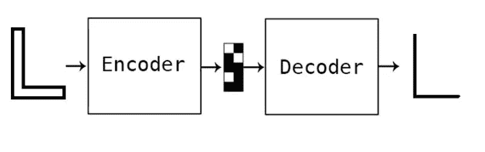

# graph2graph 的神经网络？

> 原文：<https://medium.com/google-developer-experts/graph2graph-neural-network-53313a478f5c?source=collection_archive---------3----------------------->

## 图形汇总(也称为降维、压缩)

这是一个我在业余时间继续研究的问题，我最初开始研究它，作为我在几何建模领域的博士工作的一个子课题。

## 问题

类似于 Seq2Seq 模型，有 graph2graph 神经网络可能/可用吗？

## 语境

我博士工作的副题是关于生成中间曲线，2D 形状的降维问题。当时我尝试使用基于规则的编程。后来，随着我对机器/深度学习越来越熟悉，我想尝试使用图形神经网络技术，其中:

*   形状以图表的形式表示。
*   顶点作为节点。
*   将曲线连接为边。
*   降维操作称为中间曲线生成。
*   输入是 2D 轮廓，比如一个封闭的多边形。示例:下图左侧的厚“L”轮廓。
*   输出是轮廓中间的 1D 曲线。示例:下图右侧的细“L”曲线。

希望建立一个编码器-解码器网络，接受图形作为输入以及输出。我有一个这样的输入和输出图的训练集，一个监督集。

由于我找不到现成的 graph2graph 网络，我将问题转换为 image2image(比如说 pix2pix like ),然后作为中间步骤来解决它。

有关当前解决方案的更多信息，请访问我的 GitHub repo:[yogeshk/MidcurveNN](https://github.com/yogeshhk/MidcurveNN)。到目前为止，数据集和代码都是开源的。如果感兴趣的话，请随意处理。

我的下一步是研究 graph2graph 网络是否可能，如何建立这样的编码解码网络？在“几何深度学习”或“图形神经网络”下有这样的工作正在进行吗？

请注意，由于输入和输出是不同的，这不能是自动编码器。

有什么想法吗？

## 参考

*   Vixra 论文 MidcurveNN:用于计算细多边形中曲线的编码器-解码器神经网络， [viXra:1904.0429](http://vixra.org/abs/1904.0429)
*   ODSC [求婚](https://confengine.com/odsc-india-2019/proposal/10090/midcurvenn-encoder-decoder-neural-network-for-computing-midcurve-of-a-thin-polygon)，[谈话视频](https://www.youtube.com/watch?v=ZY0nuykqgoE)
*   2021 年巴塞罗那 CAD 会议，[第 223–225 页](http://www.cad-conference.net/files/CAD21/CAD21_223-225.pdf)
*   CAD 与应用 2022 [期刊论文](http://www.cad-journal.net/files/vol_19/CAD_19(6)_2022_1154-1161.pdf) 19(6)
*   谷歌开发人员[开发库](https://devlibrary.withgoogle.com/products/ml/repos/yogeshhk-MidcurveNN)