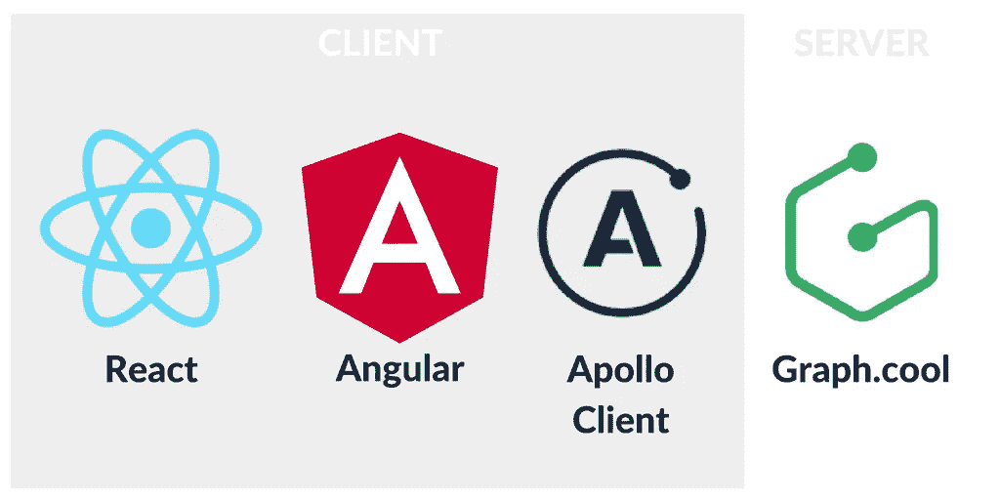
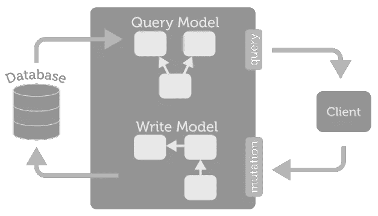
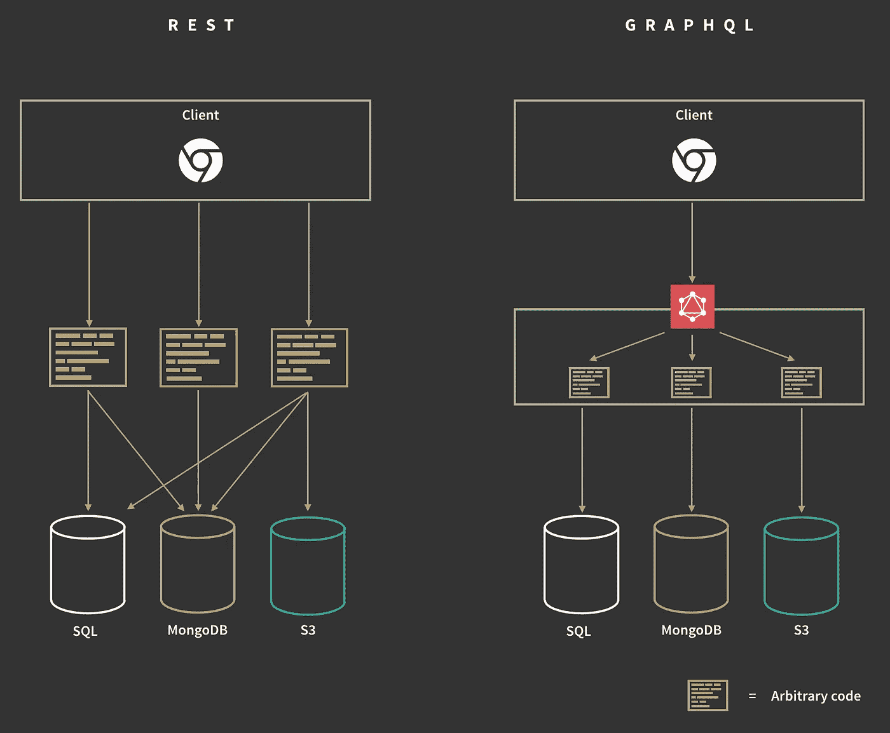
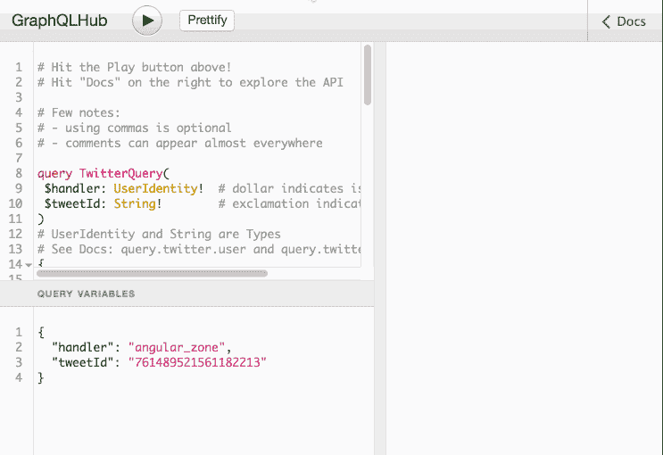
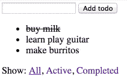
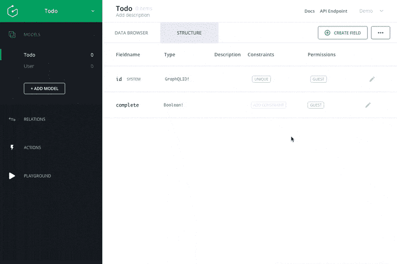

# GraphQL 和神奇的阿波罗客户端

> 原文：<https://medium.com/google-developer-experts/graphql-and-the-amazing-apollo-client-fe57e162a70c?source=collection_archive---------0----------------------->

探索使用 React 和 Angular 构建的应用程序


[Geometric Shapes / 160327](http://sasj.tumblr.com/post/141785443780/geometric-shapes-160327) by Sasj Ecoline

> **更新 7-11 月:所有代码更新至** [**阿波罗客户端 0.5**](https://dev-blog.apollodata.com/apollo-client-0-5-f1eb3f122ace) **！**

在本文中，我们将使用对[**graph . cool**](https://graph.cool/)a**GraphQL 后端即服务**和 [**Apollo 客户端**](https://github.com/apollostack/apollo-client) 的早期访问来展示如何在 React 和 Angular 中使用 graph QL 实现待办事项列表。

GraphQL 于 2012 年在脸书内部开发。它的主要目标是允许本地移动团队在不中断现有数据服务的情况下，在大型脸书生态系统内快速构建新产品和协作。2015 年 7 月，脸书决定对其进行开源。他们发布了一个 [**规范**](https://facebook.github.io/graphql/)**，并提供了一个参考实现，使用 JavaScript ( [graphql-js](https://github.com/graphql/graphql-js) )，以获得社区的反馈，并允许其他实现出现。**

**Apollo Client 是一个框架无关的 GraphQL 客户端，它可以帮助你获取数据并保持客户端状态与服务器同步。**

****

# **GraphQL 简介**

****GraphQL** 既可以用来引用 [**GraphQL 规范**](https://facebook.github.io/graphql/) ，也可以用来引用 **GraphQL 服务器**或**数据查询语言**的实现。**

****

****GraphQL Server** ([Source](https://gist.github.com/OlegIlyenko/a5a9ab1b000ba0b5b1ad))**

**有很多 **GraphQL 服务器**实现使用:Python ( [graphene](https://github.com/graphql-python/graphene) )、Scala ( [sangria](https://github.com/sangria-graphql/sangria) )、 [Go](https://github.com/graphql-go/graphql) 、 [PHP](https://github.com/webonyx/graphql-php) 、 [Java](https://github.com/graphql-java/graphql-java) 和 [more](https://github.com/chentsulin/awesome-graphql) ！**

**[](http://www.meetup.com/GraphQL-London/) [## 伦敦图表

### 欢迎来到我们的社区。我们的热情是 GraphQL。加入我们吧！🚀](http://www.meetup.com/GraphQL-London/) 

## 为什么要使用 GraphQL？

这些是使用它的人给出的一些理由

*   **超快:**单往返，只取所需，专为低延迟设计。
*   **与存储分离** : 以视图为中心、客户指定的查询，可与任何当前基础架构集成。
*   **声明式**:定义我们想要什么，而不是我们如何得到它；总是向后兼容。
*   **验证和结构化:**通过分层模式进行强类型化，允许查询验证、嵌套查询和可预测的输出。
*   **促进协作:**通过自省发现，通过浏览器内 IDE 自我记录 **GraphiQL** 。

> GraphQL 已经成熟，但仍是一项不断发展的技术，因此最佳实践仍在不断涌现。

## 实验特性

*   ***订阅:*** 实现实时更新的特性，仅在[实验阶段](https://gist.github.com/OlegIlyenko/a5a9ab1b000ba0b5b1ad)的 [graphql-js](https://github.com/graphql/graphql-js) 中可用，但仍不是[规范](https://facebook.github.io/graphql/)的一部分。

GraphQL 在 React 社区非常受欢迎。通常由使用[express . js](http://expressjs.com/)([express-graph QL](https://github.com/graphql/express-graphql))的 **GraphQL 服务器**和使用 [Relay](https://facebook.github.io/relay/) 、 [Apollo 客户端](https://github.com/apollostack/apollo-client)或 [lokka](https://github.com/kadirahq/lokka) 的 **GraphQL 客户端**组成，通常与 [Redux](https://github.com/reactjs/redux) 结合使用。

## REST vs GraphQL

与 REST 相比，GraphQL 几乎没有什么优势。可能最重要的是:

*   **单客户机端点**:客户机和任何底层数据服务之间的清晰分离。
*   **单往返**:为我们取多个嵌套结构并合并，一次返回。
*   **简单可组合的 API**:**graph QL 查询语言避免了 [REST 端点爆炸](https://edgecoders.com/restful-apis-vs-graphql-apis-by-example-51cb3d64809a)。**
*   **自记录:**通过浏览器内 IDE **GraphiQL** 。

请参见下面的概览图。



[How do I GraphQL? by Jonas Helfer](/apollo-stack/how-do-i-graphql-2fcabfc94a01)

# GraphQL 模式

让我们探索一个基本的模式来熟悉语义和查询语法。

对于上面的模式，我们定义了两个入口点(第 15–16 行) ***查询*** 和 ***变异*** (稍后将介绍)。这些将允许我们读取和修改我们的数据。这个模式定义了两种类型: ***根*** 和 ***用户*** 。其余所有类型都是内置标量类型:Int、Float、String、Boolean、ID。

我们可以使用**感叹号**来表示不可空的类型(第 4 行)或参数(第 11 行)。 ***参数的默认值*** 可以使用 equals 定义(第 11 行)。

## 查询和输出

查询前一个模式的方法是遵循左边的字段定义，并导航到右边的类型。参见下面的一些例子(压缩格式)

```
# Basic queries
**query** { me { id name } }            # anonymous query
      ^1   ^2                       # 1: Root Type; 2: User Type**query** MyQuery { me { id name } }    # named query: MyQuery
{ me { id name } }                  # query keyword is optional# Using arguments
#   *forUser* is mandatory, *limit* default value is 5 (see schema)
**query** { friends(forUser:'cir9') { id name } }
**query** { friends(forUser:'cir9', limit:3) { id name } }# Nested queries
#   Include child Types by adding its name and fields
**query** { me { id name **friends { id name }** } }
```

> 请注意，我们可以省略**查询关键字**，尽管这不是一个推荐的做法

让我们看一个查询及其输出的例子。对于查询(左)，我们将得到下面的输出(右)

```
# query                      # JSON output
                             {
{                              "data": { 
  me {                           "me": { 
    name                           "name": "GraphQL ninja"
  }                              }  
}                              }
                             }
```

查询按照 ***数据*** 下的精确查询结构返回一个 JSON 对象。如果你需要改变输出键，你可以使用 ***别名*** 。

```
# query                      # JSON output
                             {
{                              "data": { 
  **user:** me {                      "user": { 
    **fullName:** name                  "fullName": "GraphQL ninja"
  }                               }  
}                              }
                             }
```

> 通过严格遵循模式，GraphQL 输出是可预测的，并与查询结构保持一致

## 字段组成(片段)

我们也可以通过使用**片段**来重用和分组字段。我们之前提出的嵌套查询可以改为

```
query { 
  me { 
    **...userInfo**
    friends { 
      **...userInfo**
    } 
  } 
}fragment **userInfo** on User {
  id
  name
}
```

> 片段也可以被其他片段使用

## 错误处理

如果由于任何原因，前面的查询有错误，我们将得到如下输出

想了解更多，推荐你:[学习 GraphQL](https://learngraphql.com/) ，由 [Kadira](https://kadira.io/graphql) 制作的互动课程。

# 图形 QL



[Twitter GraphQL Playground](https://www.graphqlhub.com/playground?query=%23%20Hit%20the%20Play%20button%20above!%0A%23%20Hit%20%22Docs%22%20on%20the%20right%20to%20explore%20the%20API%0A%0A%23%20Few%20notes%3A%0A%23%20-%20using%20commas%20is%20optional%0A%23%20-%20comments%20can%20appear%20almost%20everywhere%0A%0Aquery%20TwitterQuery%28%0A%20%24handler%3A%20UserIdentity!%20%20%23%20dollar%20indicates%20is%20a%20query%20variable%0A%20%24tweetId%3A%20String!%09%09%09%09%23%20exclamation%20indicates%20mandatory%0A%29%0A%23%20UserIdentity%20and%20String%20are%20Types%0A%23%20See%20Docs%3A%20query.twitter.user%20and%20query.twitter.tweet%0A%7B%0A%20%20%23%20Preceding%20a%20field%20replaces%20its%20default.%0A%20%20%23%20Remove%20%27_alias_%3A%27%20to%20see%20the%20changes%20on%20the%20output.%0A%20%20_alias_%3A%20twitter%20%7B%0A%20%20%20%20%23%20Query%20a%20user%20by%20name%0A%20%20%20%20%23%20See%20Docs%3A%20query.twitter.user%0A%20%20%20%20user%20%28identifier%3A%20name%2C%20identity%3A%20%24handler%29%20%7B%0A%20%20%20%20%20%20screen_name%0A%20%20%20%20%20%20name%0A%20%20%20%20%20%20description%0A%20%20%20%20%20%20tweets_count%0A%20%20%20%20%20%20followers_count%0A%20%20%20%20%7D%0A%20%20%20%20%23%20Query%20a%20specific%20tweet%20by%20Id%0A%20%20%20%20%23%20See%20Docs%3A%20query.twitter.tweet%0A%20%20%20%20tweet%28id%3A%20%24tweetId%29%20%7B%0A%20%20%20%20%20%20text%0A%20%20%20%20%20%20retweets%28limit%3A%203%29%20%7B%0A%20%20%20%20%20%20%20%20user%20%7B%0A%20%20%20%20%20%20%20%20%20%20screen_name%0A%20%20%20%20%20%20%20%20%20%20name%0A%20%20%20%20%20%20%20%20%20%20followers_count%0A%20%20%20%20%20%20%20%20%7D%0A%20%20%20%20%20%20%7D%0A%20%20%20%20%7D%0A%20%20%20%20%23%20Execute%20a%20search%0A%20%20%20%20%23%20See%20Docs%3A%20query.twitter.search%0A%20%20%20%20search%28q%3A%20%22ngcruise%22%2C%20count%3A%201%2C%20result_type%3A%20mixed%29%20%7B%0A%20%20%20%20%20%20text%0A%20%20%20%20%20%20user%20%7B%0A%20%20%20%20%20%20%20%20screen_name%0A%20%20%20%20%20%20%20%20name%0A%20%20%20%20%20%20%7D%0A%20%20%20%20%7D%0A%20%20%7D%0A%7D&variables=%7B%0A%09%22handler%22%3A%20%22angular_zone%22%2C%0A%20%20%22tweetId%22%3A%20%22761489521561182213%22%0A%7D)

[**GraphQL**](https://github.com/graphql/graphiql)，读作 */ˈɡrafək(ə)l/，*是 graph QL 的浏览器内 IDE。通过使用这个 IDE，我们可以运行查询和突变；看输出；调试；更重要的是浏览作为文档的 GraphQL 模式。借助 [**GraphQL Hub**](https://www.graphqlhub.com/) ，使用 [Twitter GraphQL API](https://www.graphqlhub.com/playground?query=%23%20Hit%20the%20Play%20button%20above!%0A%23%20Hit%20%22Docs%22%20on%20the%20right%20to%20explore%20the%20API%0A%0A%23%20Few%20notes%3A%0A%23%20-%20using%20commas%20is%20optional%0A%23%20-%20comments%20can%20appear%20almost%20everywhere%0A%23%20-%20we%20can%20run%20multiple%20queries%20at%20once%3A%20user%2C%20tweet%20and%20search.%0A%23%20-%20note%20how%20we%20passed%20in%20query%20variables%3A%20handler%20and%20tweetId%0A%23%20-%20find%20a%20fragment%20example%20in%20last%20search%20query%0A%0Aquery%20TwitterQuery(%0A%20%24handler%3A%20UserIdentity!%20%20%23%20dollar%20indicates%20is%20a%20query%20variable%0A%20%24tweetId%3A%20String!%09%09%09%09%23%20exclamation%20indicates%20mandatory%0A)%0A%23%20UserIdentity%20and%20String%20are%20Types%0A%23%20See%20Docs%3A%20query.twitter.user%20and%20query.twitter.tweet%0A%7B%0A%20%20%23%20Preceding%20a%20field%20replaces%20its%20default%20output.%20Eg%3A%20from%20%22twitter%22%20to%20%22_alias_%22%0A%20%20%23%20Remove%20%27_alias_%3A%27%20to%20see%20the%20changes%20in%20the%20output.%0A%20%20_alias_%3A%20twitter%20%7B%0A%20%20%20%20%23%20Query%20a%20user%20by%20name%0A%20%20%20%20%23%20See%20Docs%3A%20query.twitter.user%0A%20%20%20%20user%20(identifier%3A%20name%2C%20identity%3A%20%24handler)%20%7B%0A%20%20%20%20%20%20screen_name%0A%20%20%20%20%20%20name%0A%20%20%20%20%20%20description%0A%20%20%20%20%20%20tweets_count%0A%20%20%20%20%20%20followers_count%0A%20%20%20%20%7D%0A%20%20%20%20%23%20Query%20a%20specific%20tweet%20by%20Id%0A%20%20%20%20%23%20See%20Docs%3A%20query.twitter.tweet%0A%20%20%20%20tweet(id%3A%20%24tweetId)%20%7B%0A%20%20%20%20%20%20text%0A%20%20%20%20%20%20retweets(limit%3A%203)%20%7B%0A%20%20%20%20%20%20%20%20user%20%7B%0A%20%20%20%20%20%20%20%20%20%20screen_name%0A%20%20%20%20%20%20%20%20%20%20name%0A%20%20%20%20%20%20%20%20%20%20followers_count%0A%20%20%20%20%20%20%20%20%7D%0A%20%20%20%20%20%20%7D%0A%20%20%20%20%7D%0A%20%20%20%20%23%20Execute%20a%20search%20using%20a%20fragment%0A%20%20%20%20%23%20See%20Docs%3A%20query.twitter.search%0A%20%20%20%20search(q%3A%20%22ngcruise%22%2C%20count%3A%201%2C%20result_type%3A%20mixed)%20%7B%0A%20%20%20%20%20%20text%0A%20%20%20%20%20%20user%20%7B%0A%20%20%20%20%20%20%20%20...twitterInfo%0A%20%20%20%20%20%20%7D%0A%20%20%20%20%7D%0A%20%20%7D%0A%7D%0A%0Afragment%20twitterInfo%20on%20TwitterUser%20%7B%0A%20%20screen_name%0A%20%20name%0A%7D&variables=%7B%0A%09%22handler%22%3A%20%22angular_zone%22%2C%0A%20%20%22tweetId%22%3A%20%22763698490543308801%22%0A%7D) 来体验这个更高级的模式和示例查询。

# 待办事项列表应用程序

我们将创建一个基本的**待办事项列表**应用程序，我们可以在其中添加新的待办事项，将它们标记为完成，并按照下面的演示过滤它们。



这是一个简化的 HTML 版本。

## 后端

我们使用[**graph . cool**](https://graph.cool/)**来快速创建下面的模式(简体)。**

****

> **请求提前访问 **Graph.cool** 就像我在这里做[一样](https://graph.cool)❤️**

# **反应版本**

**为了设置**阿波罗客户端** ( [阿波罗客户端](https://github.com/apollostack/apollo-client))我们需要首先通知 **GraphQL 服务器**端点。**

> **[**dataIdFromObject**](http://dev.apollodata.com/react/cache-updates.html#dataIdFromObject)属性允许我们通知 Apollo 客户端使用记录 id 进行缓存**

## **自举设置**

**让我们看看我们需要如何设置我们的引导程序来让 **Apollo 客户机**与 React 一起工作。我们将使用 [react-apollo](https://github.com/apollostack/react-apollo) 来做这件事。**

****Apollo 客户端**使用自己的缩减器，我们需要使用 [*合并缩减器*](http://redux.js.org/docs/api/combineReducers.html) 将它添加到 Redux 设置中(第 9 行)。除此之外，我们还需要添加 apollo 中间件(第 14 行)来包含对查询和变异的 Redux 支持。最后，我们将添加 **ApolloProvider** 元素来注入**客户端**，指向我们后端的 Apollo 客户端实例，以及**存储**以反应 React 的视图层次结构(第 19–21 行)。设置完成后，我们的商店将具有以下结构。**

```
{
  filter: 'SHOW_ALL',
  apollo: ...            // queries, mutations, data, optimistic
}
```

> *****过滤器*** 缩减器对于客户端来说是暂时的和本地的**

## **反应积分**

**下面的代码(简化的)显示了我们如何在我们的 **TodoApp** 组件中集成查询和变异。**

**我们使用由 **graphql** 返回的一系列包装函数将我们的查询和变化绑定到我们的 **TodoApp** 组件中的 props。这些道具将如下图所示创建，因此我们可以将它们传递给子组件:**

```
this.props.todos 
this.props.addTodo
this.props.toggleTodo
```

**为了更好地控制，我们使用 **props** 键来精确定义我们希望在每个案例中绑定什么，是数据结果(第 9-11 行)还是突变调用(第 15-17、21-23 行)。**

## **正在检索待办事项列表**

**让我们看一下获取 todos 列表的查询， **todosQuery** 对象(第 8 行)。**

**这是一个命名查询 **todos** 获取所有 todos，在模式中定义为 **allTodoes** 并使用字段:id、complete 和 text。标志表示即使我们有数据的缓存版本，我们也要获取后端。默认情况下， **Apollo 客户机**在引导期间获取所有查询。**

> ****gql** 在查询之前，是一个解析 GraphQL 查询语言的模板文字标签**

****Apollo 客户端**通过 props 绑定结果，因此我们可以将它们传递给 **TodoList** 组件，如下所示**

```
<TodoList todos={**this.props.todos**} />
```

**为了在 **TodoList** 中呈现列表，我们可以使用 **todos** prop**

**TodoList.js**

**这些例子应该足以让你开始。你可以在最后找到如何在最终代码的变异中使用 **updateQueries** 的例子。**

> **查看[官方文件](http://docs.apollostack.com/apollo-client/react.html)中关于 **react-apollo** 的最新文件。**

# **有角版本**

**与我们在 React 中所做的一样，为了设置**阿波罗客户端** ( [阿波罗客户端](https://github.com/apollostack/apollo-client))我们需要通知 **GraphQL 服务器**端点。**

**对于 Angular，我们将使用 [angular2-apollo](https://github.com/apollostack/angular2-apollo) 与 **Apollo 客户端**集成。**

## **正在检索待办事项列表**

**让我们看看如何显示待办事项列表。首先，我们需要从 **GraphQL 服务器**中检索任何现有的 todos。我们将在我们的根组件**应用**上这样做。**

**我们在构造函数上使用依赖注入来注入 **apollo** 实例(第 11 行)。我们将使用**查询**(第 13 行)返回一个承诺来检索待办事项列表。一旦我们得到结果，我们将使用一个助手分派 INTIAL _ LOAD 操作。我们可以通过使用 Promise **catch** 错误处理程序来捕捉任何错误(第 27–29 行)。**

## **添加新的待办事项**

**为了添加新的 todo，我们将使用一个**突变**。突变允许我们在一次操作中改变数据并获取结果。**

****addTodo** 变异(第 18–21 行)将一个字符串**文本、**作为强制输入(感叹号)，并使用两个参数调用**create todo**:**文本**和**完成**，值为 false。这将创建一个具有相应值的新 todo，并返回其结果 **id** 。在 **Apollo 客户端**中，我们可以使用**变量**对象(第 23 行)向突变传递参数。**

**一旦我们得到响应，我们就使用新创建的 **id** 来调度一个使用助手的 ADD_TODO 动作，更新 UI(第 27–31 行)。**

> **查看[官方文件](http://docs.apollostack.com/apollo-client/angular2.html)中关于 **angular2-apollo** 的最新文件。**

**[](http://www.meetup.com/AngularZone/events/233444689/) [## 网络研讨会:与阿波罗一起进入太空

### 进入航天飞机了解阿波罗——一个由脸书制造的数据查询语言 GraphQL 构建的数据堆栈。](http://www.meetup.com/AngularZone/events/233444689/) 

# 包裹

我们简要介绍了 **GraphQL** ，并展示了如何使用 **Apollo 客户端**创建一个使用 **React** 和 **Angular** 的 **Todo List** 应用程序。希望你喜欢并对 **GraphQL** 和 **Apollo 客户端**感到兴奋！感谢阅读。有什么问题吗？在 Twitter 上 Ping 我 [@gerardsans](https://twitter.com/intent/user?screen_name=gerardsans) 。

> **React**([React-Apollo](https://github.com/apollostack/react-apollo))和**Angular**([Angular 2-Apollo](https://github.com/apollostack/angular2-apollo))的集成变化很快，敬请关注改进和新功能。

# 资源

*   [todo-react](https://github.com/gsans/todo-react)(GitHub)react 15 . 4 . 2， *apollo-client 0.10，react-apollo 0.13*
*   [todo-angular 2](https://github.com/gsans/todo-angular2)(GitHub)*angular 2 . 1 . 1，apollo-client 0.5，angular2-apollo 0.7.0*
*   [angular2-apollo-examples](https://github.com/kamilkisiela/angular2-apollo-examples) 由[卡米尔·基希拉](https://medium.com/u/627fc8b15105?source=post_page-----fe57e162a70c--------------------------------)编译，来自阿波罗核心团队[@卡米尔基希拉](https://twitter.com/kamilkisiela)
*   查看阿波罗出版物，上面有阿波罗核心团队的顶级博客文章
*   [GraphQL 作为现代角度应用的最佳实践](/apollo-stack/graphql-as-the-new-standard-for-modern-angular-apps-c84cb21e1037)作者 [Urigo](https://medium.com/u/d844f9bb25b8?source=post_page-----fe57e162a70c--------------------------------)

[](http://www.meetup.com/GraphQL-London/) [## GraphQL 伦敦

### 欢迎来到我们的社区。我们的热情是 GraphQL。加入我们吧！🚀](http://www.meetup.com/GraphQL-London/) [](https://twitter.com/intent/user?screen_name=gerardsans)****