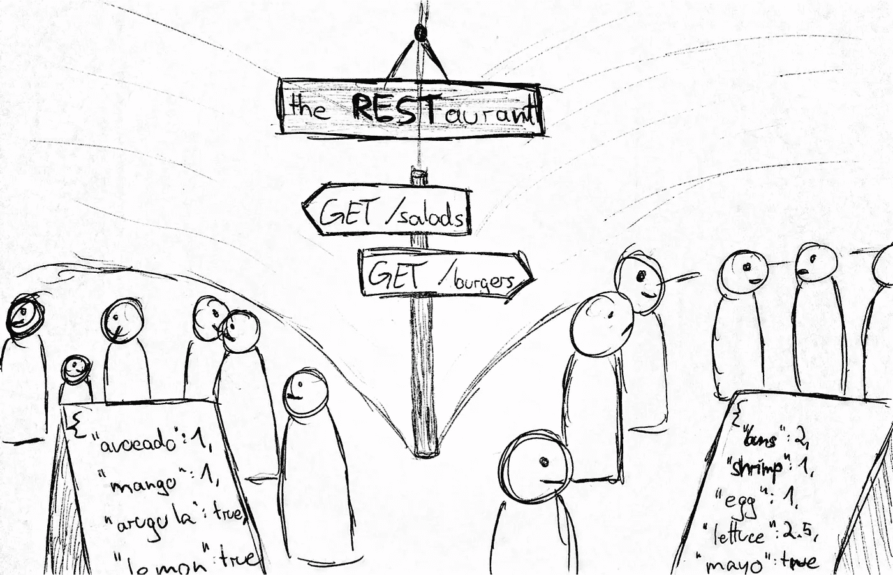
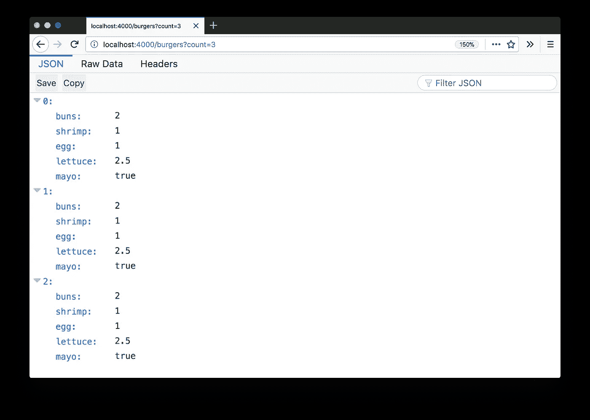
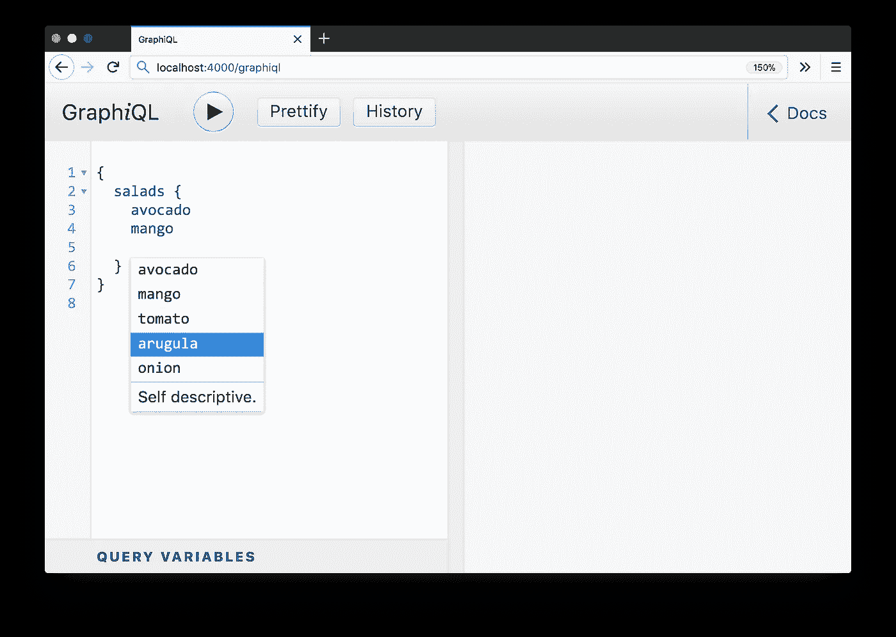
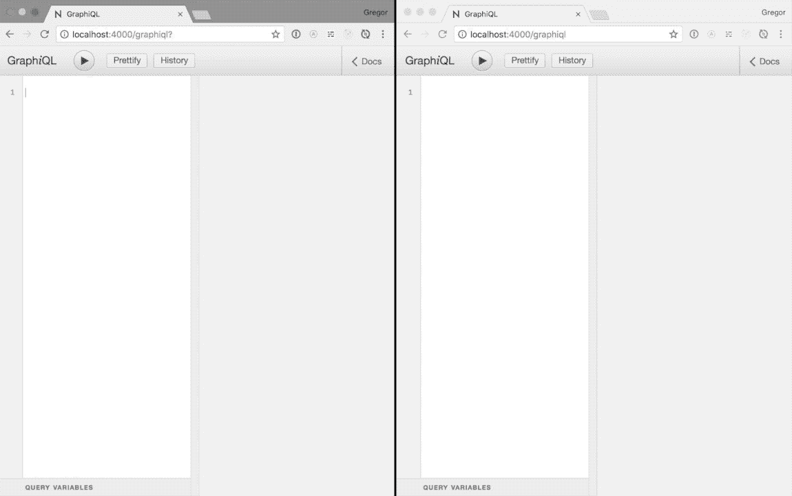

# 休息时的 graph QL-aurant

> 原文：<https://medium.com/javascript-scene/graphql-at-the-rest-aurant-f4091054e82a?source=collection_archive---------1----------------------->

## GraphQL 的有趣介绍

A screencast version with of this post

这是周三晚上，另一个很棒的聚会在我最喜欢的活动场所举办:the REST-aurant。

讲座结束后，与会者可以在不同的“路线”上获得不同的食物。



Different routes to get salads or burgers at the REST-aurant.

他们通常有同样的两种选择:鳄梨沙拉和虾汉堡。鳄梨*沙拉*，还有*虾*汉堡。但是我真正渴望的是*虾沙拉*！但遗憾的是，没有`GET /salads?with=shrimps`路线。那么我能做什么呢？

我当然是从汉堡里拿虾了！

所以我去了`GET /salads`路线，然后排队从`GET /burgers`买了 3 个汉堡。我走到餐桌旁的一个空座位上，从汉堡里挑出虾，然后扔掉其余的。男孩，我很高兴有我的虾沙拉。

# 提取不足和提取过多

吃完虾沙拉后，我有点难过。我不仅浪费时间排队两次，而不是和我的朋友出去玩，我还不得不扔掉许多食物。

但至少我现在有一个很好的例子来解释蚀刻不足和蚀刻过度的概念。来做点编码吧！

*(您可以在*[*github.com/gr2m/restaurant-graphql*](https://github.com/gr2m/restaurant-graphql)*找到所有代码示例)*

这是一个用 [express](https://expressjs.com) 构建的简单 Node.js 服务器，它公开了沙拉和汉堡的两条路径。默认情况下，两者都分别返回一个沙拉/汉堡，并接受一个可选的`?count`查询参数，通过一个请求获取多个沙拉/汉堡

```
const express = require(“express”);
const app = express();// define a salad and a burger
const salad = { avocado: 1, mango: 1, tomato: 0.2, arugula: true, onion: true };
const burger = { buns: 2, shrimp: 1, egg: 1, lettuce: 2.5, mayo: true };// define arrays of 100 each
const salads = new Array(100).fill(salad);
const burgers = new Array(100).fill(burger);// define the routes with the optional count query parameter
app.get(“/salads”, ({ query: { count } }, res) => res.json(get(salads, count)));
app.get(“/burgers”, ({ query: { count } }, res) =>
 res.json(get(burgers, count))
);// helper method to get a slice of the array based on count
const get = (what, count) => what.splice(0, parseInt(count) || 1);// start the server at localhost:4000
app.listen(4000);
```

打开[http://localhost:4000/salads](http://localhost:4000/salads)会是这样的



Firefox renders JSON responses nicely by default

切换到客户端。

*(注意:如果你在浏览器中遇到错误，请在 Chrome 中尝试，因为它对 async/await 有最好的支持，这使得代码示例更简单)*

```
// helper function to send a GET request to given route
function get(path) {
  return (await fetch(`${location.protocol}//${location.host}${path}`)).json()
}
let [salad] = await get("/salads");
// salad: {"avocado":1,"mango":1,"tomato":0.2,"arugula":true,"onion":true}
delete salad.tomato;
// TODO: Tell the team to list tomato in the salds route menu!
let burgers = await get("/burgers?count=3");
// burgers: [
// {"buns":2,"shrimp":1,"egg":1,"lettuce":2.5,"mayo":true},
// {"buns":2,"shrimp":1,"egg":1,"lettuce":2.5,"mayo":true},
// {"buns":2,"shrimp":1,"egg":1,"lettuce":2.5,"mayo":true}]
Object.assign(salad, {
  shrimps: burgers.reduce(
    (numShrimps, burger) => numShrimps + burger.shrimp,
    0
  )
});
// salad: {"avocado":1,"mango":1,"arugula":true,"onion":true, shrimp: 3}
```

我通过取`GET /salads`路线得到一份沙拉。在第一次请求后，我仍然缺少配料，所以我必须发送另一个请求。这就是所谓的**欠取**。

然后我从`GET /burgers?count=3`拿了 3 个汉堡。之后，我把汉堡减少到虾的总数。我的虾沙拉需要 3 只虾，但我收到的却是 3 个汉堡，配料齐全。这就是所谓的**超取**。

概括起来

1.  给我拿了沙拉，但是没有虾
2.  **给我买了虾，但我不得不扔掉剩下的汉堡。**

# GraphQL 简介

REST-aurant 团队是非常善良和有环保意识的人。他们不想看到食物被浪费，经过一些研究后，他们发现 GraphQL 似乎完美地解决了这个问题。

对于下一次聚会，团队设置了第三条路线:`POST /graphql`。

GraphQL 不需要书面菜单，相反，他们设置了一个嵌入文档的终端，与会者可以使用它来编写和发布他们的查询。他们称之为 GraphQL Query-aitor 3000！


GraphQL Query-aitor 3000 只是 GraphQL 的一个别出心裁的名字(注意 *i* )，这是一个简单的 web 表单，用于发送带有内置自动完成功能的 GraphQL 查询。如果你不知道 GraphiQL，它的发音有点难，所以人们给它起了不同的名字，比如 GitHub 的 explorer。顺便说一下，它的发音像“图形:)



The GraphiQL web application

Graphiql 会在您键入时显示所有可用选项。不再需要猜测，不再需要查找属性名，最重要的是，不再需要不同步的文档，因为文档是从服务器和客户机使用的相同模式中生成的。例如，您可以在 GraphiQL 的自动完成下拉列表中看到“tomato ”,而在`GET /salads`路线的菜单中却找不到它。

除了一份沙拉中的番茄和三个汉堡中的虾之外，请求所有配料的完整查询如下所示

```
{
  salads {
    avocado
    arugula
    mango
    onion
  }
  burgers(count:3) {
    shrimp
  }
}
```

来自服务器的响应遵循我的查询的树结构，并且它完全包括我所要求的，不多也不少。

```
{
  "data": {
    "salads": [{"avocado":1,"arugula":true,"mango":1,"onion":true}],
    "burgers": [{"shrimp":1},{"shrimp":1},{"shrimp":1}]
  }
}
```

# GraphQL:你需要的就是你得到的。

以下是一些关于 GraphQL 的事实:

*   就像 REST 一样，GraphQL 是一个**规范，而不是一个工具**。
*   对于服务器和客户端来说，它是**语言不可知的**
*   GraphQL API 是围绕一个模式构建的
*   **模式是一个简单的文本文档，用作客户机和服务器之间的契约。**

**我们一会儿将深入研究我们的示例应用程序的 GraphQL 模式。但我想强调的是，GraphQL 是语言不可知的，因为它通常与 React 和 Node.js 一起出现。原因是 React 和 GraphQL 都是脸书的项目。React 是一个实际的 JavaScript 库，而 GraphQL 只是一个规范，在许多编程语言中已经有了实现。**

**现在，让我们创建一个名为`schema.graphql`的简单文本文件。GraphQL 模式必须遵循所述 GraphQL 规范的语法。对于我们的示例应用程序，整个模式只有 20 行:**

```
type Query {
  burgers(count: Int = 1): [Burger]
  salads(count: Int = 1): [Salad]
}type Burger {
  buns: Int!
  shrimp: Float!
  egg: Float!
  lettuce: Boolean!
  mayo: Boolean!
}type Salad {
  avocado: Float!
  mango: Float!
  tomato: Float!
  arugula: Boolean!
  onion: Boolean!
}
```

**`Query`类型定义了可以在根请求什么，在这个例子中是沙拉和汉堡。可以传递一个可选的`count`整数。它默认为 1。您可以在上面显示的 GraphQL 查询中看到这一点。**

**`salads`返回一个包含沙拉类型项目的数组。沙拉的类型决定了它所有的配料。例如，avocado 是一个允许小数点的浮点数。芒果、黄瓜和西红柿也一样。洋葱是一个布尔值，它可以是`true`或`false`。**

**汉堡包子是`Int`型的，因为谁要半个包子的汉堡？虾和蛋是浮动的，莴苣和蛋黄酱是布尔的。**

**在服务器上，添加的代码如下。**

```
const { readFileSync } = require("fs");
const bodyParser = require("body-parser");
const { graphqlExpress, graphiqlExpress } = require("apollo-server-express");
const { makeExecutableSchema } = require("graphql-tools");const schema = makeExecutableSchema({
  typeDefs: readFileSync("schema.graphql", "utf8"),
  resolvers: {
    Query: {
      salads: (_, { count }) => get(salads, count),
      burgers: (_, { count }) => get(burgers, count)
    }
  }
});app.use("/graphql", bodyParser.json(), graphqlExpress({ schema }));
app.use("/graphiql", graphiqlExpress({ endpointURL: "/graphql" }));
```

**你可以在 github.com/gr2m/restaurant-graphql/tree/master/02-graphql 看到完整的代码。**

**大部分工作由我们需要首先安装的两个 npm 模块完成: [apollo-server-express](https://npmjs.com/package/apollo-server-express) 和 [graphql-tool](https://npmjs.com/package/graphql-tools) 。**

**需要将`schema.graphql`转换成 JavaScript 表示，这样就可以在`/graphql`路由处理程序中处理它。我读出原始文件，并将其作为`typeDefs`属性传递给`makeExecutableSchema`函数。**

**另一个属性`resolvers`定义了类似于路由处理程序的查询解析。我重用了本文开头第一个`server.js`代码中显示的`get`助手，根据可选的 count 参数分别返回沙拉或汉堡数组的切片。**

**最后，我定义了 GraphQL 中间件，它公开了`POST /graphql`路由以及`/graphiql`的 GraphiQL web 应用程序。**

**将查询发送到 JSON 对象的“query”键中的“/graphql”端点。**

```
// helper function to send a POST request to given route
async function post(path, data) {
  return (await fetch(`${location.protocol}//${location.host}${path}`, {
    method: 'post',
    body: JSON.stringify(data),
    headers: {
      'Content-Type': 'application/json'
    }
  })).json()
}let {data: {salads: [salad], burgers}} = await post('/graphql', {
  query: `{
    burgers(count:3) {
      shrimp
    }
    salads {
      avocado
      arugula
      mango
      onion
    }
  }`
})
// salad: {"avocado":1,"mango":1,"arugula":true,"onion":true}
// burgers: [{"shrimp":1},{"shrimp":1},{"shrimp":1}]Object.assign(salad, {
  shrimps: burgers.reduce((numShrimps, burger) => numShrimps + burger.shrimp, 0)
})
// salad: {"avocado":1,"mango":1,"arugula":true,"onion":true, shrimp: 3}
```

**响应返回的正是我需要的配料，我只需要将汉堡减少到 3 只虾，并将其分配给沙拉对象。**

**概括起来**

*   **GraphQL API 通常只是另一个 REST 端点，例如`POST /graphql`**
*   **一个查询提取一个数据树来得到确切需要的东西**
*   **服务器响应匹配查询的树结构**

**耶！我现在可以心安理得地享用我的鳄梨虾沙拉了。**

# **持久化查询**

**在下一次聚会上，每个人都想试用 GraphQL Query-aitor 3000。结果是一条很长的线**

****

**Long lines at the GraphQL terminal**

**准确地得到我们想要的很好，但是每次输入查询比从`GET /burgers`获取一个汉堡要花费更长的时间。并且在发送了`POST /graphql`请求之后，服务器必须当场处理新订单。**

**REST-aurant 团队再次聚在一起，考虑一个解决方案，使 GraphQL 查询的发布和处理更加高效。他们提出了一个解决方案:记住查询！每当有人发布一个查询，他们会被问及是否希望下次记住它，并收到一个参考 ID 作为回报。**

**该团队还在下一次活动之前发送电子邮件，要求与会者预先注册他们的问题。有了这些预先的信息，团队就可以准备一些食物，这也减少了加工时间。**

**持久化查询是用唯一 ID 存储在键/值存储中的查询字符串。在我们的服务器示例中，我将创建一个`persisted-queries.js`，它定义了一个 id 为`1`的查询:**

```
module.exports = {
  1: `{
  burgers(count:3) {
    shrimp
  }
  salads {
    avocado
    arugula
    mango
    onion
  }
}`
};
```

**在服务器上，我必须添加几行代码来加载`persisted-queries.js`文件，并添加中间件来检查是否发布了`id`属性**

```
const persistedQueries = require("./persisted-queries");app.use("/graphql", bodyParser.json(), (req, res, next) => {
  if (persistedQueries[req.body.id]) {
    req.body.query = persistedQueries[req.body.id];
  }
  next();
});
```

**如果已经发布了一个`id`,并且存在一个具有所传递的 ID 的持久化查询，则从持久化查询存储中为该 ID 设置查询，并像以前一样继续查询处理。**

**我不再需要发布查询，取而代之的是我只发布我的 id，这是一个。为了在浏览器中获得如上所示的相同结果，我不再需要发送完整的查询:**

```
let {data: {salads: [salad], burgers}} = await post(‘/graphql’, {
  id: 1
})
```

**结果和以前一样，但是相比之下，请求的大小是最小的。这会对性能产生很大的影响，因为 GraphQL 查询会变得非常复杂，因此请求也会变大。并且上游连接通常也比下游连接差得多。**

**对于 REST-aurant 团队来说，提前知道查询是非常好的。查询可以预先编译，数据可以更好地缓存。一些 GraphQL APIs 甚至完全禁用非持久化查询，以提高安全性和最大化效率。**

**概括起来**

*   **持久化查询不是 GraphQL 规范的一部分，而是一个常见的实现细节**
*   **持久化查询存储在服务器上，客户端只发送查询 id**
*   **只发送一个 ID 而不是一个复杂的查询可以减少请求的大小**
*   **持久化查询可以在服务器上预先编译**
*   **为了提高安全性，可以完全禁用非持久化查询**

# **突变**

**REST-aurant 越来越受欢迎，通常情况下，在每个人都可以吃一口之前，活动的食物就用完了。到目前为止，100 份沙拉和 100 个汉堡由一家餐饮公司提供，但该团队决定他们将雇用一个烹饪团队，可以制作更多的汉堡和沙拉来满足不断增长的需求。**

**突变是 GraphQL 规范的一部分，必须在 GraphQL 模式中定义
。只有 4 条附加线路**

```
type Mutation {
  addBurgers(count: Int = 1): Int
  addSalads(count: Int = 1): Int
}
```

**首先，我添加一个突变来添加沙拉。变异接受一个可选的 count 参数，默认为 1。该突变将返回一个整数，即可用沙拉的总量。汉堡也一样。**

**添加一份沙拉和三个汉堡的 GraphQL 查询如下所示:**

```
mutation {
  addSalads
  addBurgers(count: 3)
}
```

**变异必须从关键字`mutation`开始。您可以在一个请求中发送多个突变，这是 REST APIs 的另一个优点。您不能将变异与查询结合起来，但是如果您愿意，可以定义变异响应。**

**对于上面的查询，响应将如下所示**

```
{
  "data": {
    "addSalads": 1,
    "addBurgers": 3
  }
}
```

**在服务器代码中，我们现在将`salads`和`burgers`设置为空数组，并用`Mutation`属性修改`resolvers`对象:**

```
// start with empty salad & burger arrays now
const salads = [];
const burgers = [];// add mutation resolvers
const schema = makeExecutableSchema({
  typeDefs: readFileSync("schema.graphql", "utf8"),
  resolvers: {
    Query: {
      salads: (_, { count }) => get(salads, count),
      burgers: (_, { count }) => get(burgers, count)
    },
    Mutation: {
      addSalads: (_, { count }) => {
        salads.push(...new Array(count).fill(salad));
        return salads.length;
      },
      addBurgers: (_, { count }) => {
        burgers.push(...new Array(count).fill(burger));
        return burgers.length;
      }
    }
  }
});
```

**调用`addSalads`和`addBurgers`函数时，count 参数默认为模式中定义的`1`。基于`count`参数添加一个或多个沙拉/汉堡。然后这两个函数返回各自数组的长度。**

**从浏览器发送变异与发送查询非常相似:**

```
await post('/graphql', {
  query: `mutation {
    addSalads
    addBurgers(count: 3)
  }`
})
```

**概括起来**

*   **突变用于**创建、更新或删除数据**。**
*   ****多个突变**可通过单个请求发送。它们按顺序被**处理。****
*   **变异不能与查询结合，但是变异响应可以被过滤**

# **GraphQL 订阅**

**当剩下的沙拉或汉堡卖完了，排在队伍前面反复问:“可以吃我的沙拉了吗？”。相反，我希望服务器告诉我什么时候有足够的食物来满足我的查询。这是订阅的一个常见用例。**

**订阅是 GraphQL 的第三种操作类型。GraphiQL 对 websockets 上的订阅有内置的
支持，它们可以像
查询和突变一样提交。提交后，服务器会回复，一旦有更改，数据就会出现。所以让我们做出改变吧！**

****

**Subscription on the left shows updates from mutations on the right.**

**我在一个浏览器中保留订阅，而在另一个浏览器中发布变化。在我发布突变后，第一个窗口上的数字也随之改变。**

**让我们看看实现是什么样子的。**

**对`schema.graphql`的添加也相当简单:**

```
type Subscription {
  foodAdded: Stats
}type Stats {
  burgers: Int
  salads: Int
}
```

**将使用类型`Stats`调用`foodAdded`订阅，该类型具有可用沙拉和汉堡总数的整数属性**

**对服务器的添加稍微复杂一些:**

```
// load additional libraries needed for subscriptions
const { execute, subscribe } = require("graphql");
const { SubscriptionServer } = require("subscriptions-transport-ws");
const { PubSub } = require("graphql-subscriptions");
const pubsub = new PubSub();const getStats = () => ({ salads: salads.length, burgers: burgers.length });const schema = makeExecutableSchema({
  typeDefs: readFileSync("schema.graphql", "utf8"),
  resolvers: {
    Query: {
      salads: (_, { count }) => get(salads, count),
      burgers: (_, { count }) => get(burgers, count)
    },
    Mutation: {
      addSalads: (_, { count }) => {
        salads.push(...new Array(count).fill(salad));
        // publish the foodAdded and pass the stats
        pubsub.publish("foodAdded", { foodAdded: getStats() });
        return salads.length;
      },
      addBurgers: (_, { count }) => {
        burgers.push(...new Array(count).fill(burger));
        // publish the foodAdded and pass the stats
        pubsub.publish("foodAdded", { foodAdded: getStats() });
        return burgers.length;
      }
    },
    // add the Subscription property to schema resolvers
    Subscription: {
      foodAdded: {
        subscribe: () => pubsub.asyncIterator("foodAdded")
      }
    }
  }
});// add the subscriptionsEndpoint to the /graphiql middleware
app.use(
  "/graphiql",
  graphiqlExpress({
    endpointURL: "/graphql",
    subscriptionsEndpoint: "ws://localhost:4000/subscriptions"
  })
);// instead of app.listen(4000), create a new server instance
const server = createServer(app);
server.listen(4000);// ... which can be passed to the SubscriptionServer constructor
new SubscriptionServer(
  { schema, execute, subscribe },
  { path: "/subscriptions", server }
);
```

**可以在[https://github . com/gr2m/restaurant-graph QL/tree/master/05-graph QL](https://github.com/gr2m/restaurant-graphql/tree/master/05-graphql)看到完整代码。**

**一旦发生更改，GraphQL 订阅就会将数据推送到客户端，而不是客户端根据等待更改发生的时间间隔来拉取数据。我们实现的核心是模块[订阅-传输-ws](https://npmjs.com/package/subscriptions-transport-ws) 和[图表 QL-订阅](https://npmjs.com/package/graphql-subscriptions)。后者给了我们`PubSub`，我们用它来发布我们两个突变中的`foodAdded`事件。然后在订阅解析器中，我们返回一个异步迭代器，它通过开放的 web 套接字连接将传递的数据推送到`foodAdded`事件。我们将编译后的模式传递给实现 web 套接字路由的新的`SubscriptionServer`。**

**我知道这很难接受，但一旦它开始工作，也很酷:)**

**概括起来**

*   **当等待更改时，不是基于时间间隔请求数据，而是使用`subscribe to a data stream`。**
*   **一旦`server publishes data`上市。**

# **饿吗？**

*   **🎮[查看&重新混合关于小故障的示例应用](https://restaurant-graphql.glitch.me/)**
*   **🎥[观看此帖子的截屏视频，并进行现场编码](https://youtu.be/801P6PZvF5c)**
*   **👓[探索源代码](https://github.com/gr2m/restaurant-graphql)**
*   **💬[在 twitter 上关注我，获取更多 GraphQL 的好东西](https://twitter.com/gr2m)**