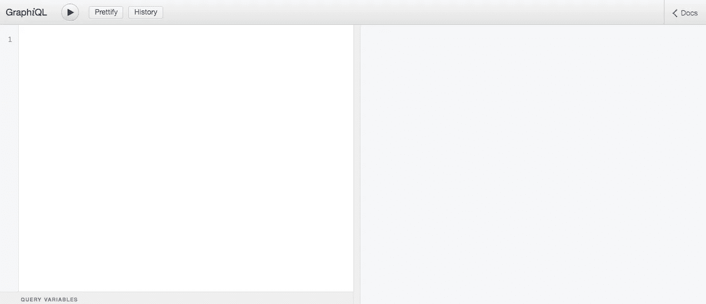

# Golang 清洁建筑的 GraphQL 交付

> 原文：<https://medium.easyread.co/graphql-delivery-on-golangs-clean-architecture-5c995a17b3a8?source=collection_archive---------1----------------------->

## 在 Golang Clean 架构上实现 GraphQL


Photo by [RoseBox رز باکس](https://unsplash.com/@rosebox?utm_source=medium&utm_medium=referral) on [Unsplash](https://unsplash.com?utm_source=medium&utm_medium=referral)

C 精益架构，是编程中流行的架构之一。它以各层之间良好的分离关系而闻名。每一层都不需要知道另一层的实现，所以我们可以很容易地改变实现，而不用在另一层上做任何改变。如果你想了解更多关于洁净建筑的知识，你可以在这里阅读[因为我不会在这篇文章中详细解释。](https://blog.cleancoder.com/uncle-bob/2012/08/13/the-clean-architecture.html)

今天，我想在我的朋友关于 Golang 清洁架构的代码中实现 GraphQL，你可以在这里阅读他的精彩帖子“[在 Golang 上尝试清洁架构](https://medium.com/hackernoon/golang-clean-archithecture-efd6d7c43047)”。在那篇文章中，作者使用 REST API 作为交付层，现在我将尝试添加更多使用 GraphQL 的 HTTP 层。

# GraphQL

GraphQL 是什么？根据他们[网站](https://graphql.org/)的定义:

> GraphQL 是一种 API 查询语言，也是一种用现有数据完成这些查询的运行时语言。GraphQL 为 API 中的数据提供了完整且易于理解的描述，使客户能够准确地要求他们需要的东西，使 API 更容易随时间发展，并支持强大的开发工具。

换句话说，GraphQL 是一种查询语言，让客户只得到他们要求，而不接收未使用的数据。所以如果我们有一个像这样的 article 对象:

```
{
   "id": "article-id",
   "title": "Indonesia won the award of best clean air of South East    Asia",
   "author": "Kurio"
}
```

而客户端只想要`title`字段，服务器只会返回:

```
{
   "title": "Indonesia won the award of best clean air of South East    Asia"
}
```

## GraphQL 模式

要开始使用 GraphQL，我们需要基于我们的`Model`和`Usecase`层定义我们的模式。所以基于这个 [github](https://github.com/bxcodec/go-clean-arch) ，我们有了文章结构:

article struct

我们可以在 GraphQL 模式上创建这样的文章类型:

Type on the GraphQL schema

在 [GraphQL](https://graphql.org/learn/schema/) 上，它有 5 个默认标量类型，有:

*   （同 Internationalorganizations）国际组织
*   浮动
*   线
*   布尔代数学体系的
*   身份证明

这样，我们可以将 Golang `string`和`int64`数据类型映射到 GraphQL 上的`String`和`Int`标量类型。对于 Golang 上的`Time`类型，GraphQL 支持创建自定义标量类型，因此我们需要在我们编写的模式中定义`Time`标量类型。

创建对象类型后，我们需要为 GraphQL 模式创建`Query`和`Mutation`。这两种类型将基于清洁架构代码的`Usecase`接口创建，这里是`usecase`接口的代码:

usecase interface code

GraphQL 中的`Query`和`Mutation`有什么区别？简而言之，`Query`用于检索数据，而`Mutation`用于在服务器上修改或创建数据。所以基于`usecase`接口，我们可以编写这样的查询和变异:

query and mutation schema

你一定在问，

> 等等，FetchArticle 行上的 ArticlesResult *是什么？以前在类型架构中没有 ArticlesResult 类型！为什么不直接返回文章列表呢？*

在`FetchArticle`函数中，我们需要分页和光标功能，所以我们不会通过一个请求得到所有的文章。在 GraphQL 中，有一个实现分页的标准类型，基于这个[页面](https://graphql.org/learn/pagination/)我们需要创建一个连接(edge)和当前对象的信息(pageInfo)，这就是为什么我们需要创建`ArticlesResult`对象。下面是`ArticlesResult`的模式类型:

articles_result GraphQL schema

`Edge`型将有`cursor`带`String`型和`node`带`Article`型。cursor 是当前文章与其相邻文章的连接值。我们可以用这个`cursor`值得到下一篇文章。

`PageInfo`型将有`endCursor`带`String`型和`hasNextPage`带`Boolean`型。`endCursor`是当前边的最后一个光标的值，所以我们可以用这个值得到下一条边。`hasNextPage`将是我们的标志，不管这个边缘列表是否有下一页。

`ArticlesResult`类型将有`edges`类型和`Edge`类型的数组，`pageInfo`和`PageInfo`类型，`totalCount`和`Int`类型。`totalCount`将有当前边的总项数的值。

所有的 GraphQL 类型(对象、变异和模式)都可以写在同一个文件中，所以这里是`schema.graphql`文件:

schema.graphql

# 深入 GraphQL Go

在模式已经定义之后，我们需要把它转换成 Golang 的代码。对于本教程，我们将使用 [graphql](https://github.com/graphql-go/graphql) 包。我选择使用这个包是因为它的模块化，所以我们可以在干净的代码架构中使用它。

## 转换对象类型模式

首先，我们需要根据我们的模式创建 GraphQL 对象，代码如下:

schema go object based on GraphQL schema

## 准备解析程序

为了能够利用解析器的[包](https://github.com/graphql-go/graphql)函数，我们需要创建一个实现`FieldResolveFn`的函数。我们可以只为每个解析器创建一个函数，但是这次我们将创建一个接口，它包含模式中的所有`Query`和`Mutation`函数，因此它可以通过注入文章服务层来启动(并且更容易测试)。

resolver.go

## 创建架构构造函数

我们将需要创建所有类型都显式编写的 GraphQL 对象。我的意思是我们必须为`Mutation`创建一个声明了`UpdateArticle`、`StoreArticle`和`DeleteArticle`的对象。先前的解析器将被注入到 GraphQL 对象模式中，以便能够使用它的方法。代码如下:

schema_object constructor

## 实现解析器

别忘了写`Resolver`接口的实现。我们将创建一个内部结构，它实现了接口的所有必需方法，并且还注入了文章服务层，因此我们可以访问文章数据。

为什么不直接注入文章存储库层呢？这是因为我们将 resolver 作为另一个交付层，交付层不能直接访问存储层，所以我们需要利用服务层。

*   **FetchArticle**

FetchArticle implementation

*   **更新文章**

UpdateArticle implementation

我认为自己编写另一个实现将是一个很好的实践，这样您就可以探索这个包还有哪些其他选项。但总的来说，代码会写成这样:

resolver.go with implementation

## 正在初始化 GraphQL 传递

最后一步，我们需要在`main.go`文件上初始化我们的 GraphQL 交付。只需像这样修改文件:

我们使用[https://github.com/graphql-go/handler](https://github.com/graphql-go/handler)包创建一个 GraphQL HTTP 处理程序，并将该处理程序传递给`echo` WrapHandler 函数，但是如果你不想使用它，可以按照[https://graphql.org/learn/serving-over-http/](https://graphql.org/learn/serving-over-http/)的规则创建自己的处理程序。

现在我们的 [go-clean-arch](https://github.com/bxcodec/go-clean-arch) 已经有了另一个使用 GraphQL 的交付层，只需运行您的应用程序并从`/graphql`路径访问它。我们也将有 GraphQL 用户界面来尝试 graph QL 的查询。



graphiql user interface

希望这篇教程能帮助你理解 GraphQL 和 Golang 中干净架构的有用性。

你可以在这里看到我的 Github 的完整代码:

 [## ridhoperdana/清洁拱门

### 此时您不能执行该操作。您已使用另一个标签页或窗口登录。您已在另一个选项卡中注销，或者…

github.com](https://github.com/ridhoperdana/go-clean-arch) 

祝你愉快，🖖🏼！

感谢 [Iman Tumorang](https://medium.com/u/ef42567fbbae?source=post_page-----5c995a17b3a8--------------------------------) 为 Golang 提供干净的代码架构，[Bastian Paskal sitamorang](https://medium.com/u/eda7c68a1225?source=post_page-----5c995a17b3a8--------------------------------)， [Reza Indra](https://medium.com/u/f007fd80d249?source=post_page-----5c995a17b3a8--------------------------------) ， [Nugroho Cahyono](https://medium.com/u/2432a6a8de52?source=post_page-----5c995a17b3a8--------------------------------) 来自 [Kurio](https://kurio.id/) 帮助我在 Golang 中实现 GraphQL😎