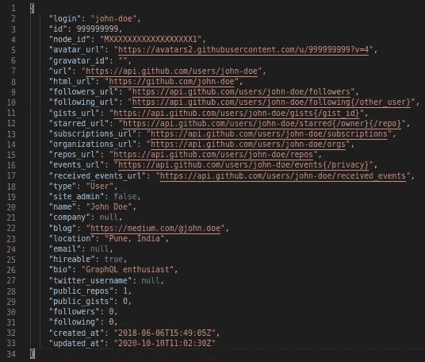

# GraphQL:查询语言

> 原文：<https://medium.com/globant/graphql-the-query-language-3d1b1807a1d1?source=collection_archive---------2----------------------->


我相信你已经看到了使用 GraphQL 的一些有趣的方面，这就是为什么你想更深入地研究它。

如果没有，可以在一篇关于 [**简介:GraphQL**](/@sagar.barawade/introduction-overview-of-graphql-56ac0285077b) **概述中对 GraphQL 进行架构概述。**

到本文结束时，您将对如何在前端应用程序中使用 [GraphQL](https://graphql.org/) 有一个大致的了解。我们将通过一些例子和使用[GitHub API](https://docs.github.com/en/free-pro-team@latest/)来试验 GraphQL 查询。

1.  [GitHub REST API](https://docs.github.com/en/free-pro-team@latest/rest)
2.  [GitHub graph QL API](https://docs.github.com/en/free-pro-team@latest/graphql)

让我们看看 [GraphQL](https://graphql.org/) 对于实时 API 实现有什么意义。

# **入门:真正的快速**

为了把你从探索 GraphQL 的所有设置中解救出来，我们有一个完美的地方，在那里我们可以尽情发挥查询语言及其特性。

你只需要:

1.  下载 [GraphiQL](https://www.electronjs.org/apps/graphiql) 并安装在您的系统上。
2.  为您的 GitHub 帐户创建一个“个人访问令牌”。
3.  用创建的令牌配置 GraphiQL 中的“Authorization”头。
4.  用“[https://api.github.com/graphql](https://api.github.com/graphql)”配置服务器端点。
5.  转到[GitHub graph QL API](https://docs.github.com/en/free-pro-team@latest/graphql)浏览文档。

运筹学

1.  授权 GitHub APIs 使用您的帐户数据。
2.  转到以下链接:

[https://developer.github.com/v4/explorer/](https://developer.github.com/v4/explorer/)

在这里，您已经有了一个现成的 GraphQL 服务器设置，其中包含大量数据和完整的 API 文档。您可以在这里尽情探索 GraphQL。这个工具叫做 [GraphiQL](https://github.com/graphql/graphiql) 。这是一个 GraphQL IDE，相当于其他 API 文档工具，如 [Swagger](https://swagger.io/) 。

当我们在那里探索 [GraphQL](https://graphql.org/) 时，让我们理解 [GraphQL](https://graphql.org/) 的一些基本概念，以便它将帮助您修改查询并对其进行试验。

**构建** [GraphQL](https://graphql.org/) **查询** 假设你想从服务器获取用户的详细信息。如果服务器提供 REST APIs，那么您将使用如下 API 端点:

```
GET /user/john-doe/
```

在 [GraphQL](https://graphql.org/) 中，为了获取相同的数据，典型的 [GraphQL](https://graphql.org/) 查询如下所示:

```
query GetUser {
  user(login: "john-doe") {
    login
    id
    avatarUrl
    ...
  }
}
```

一个 [GraphQL](https://graphql.org/) 查询有一些来自以下的基本构件:

1.  菲尔茨
2.  争论
3.  变量
4.  (计划或理论的)纲要
5.  别名
6.  碎片
7.  指令
8.  突变
9.  接口
10.  联合

# 1.菲尔茨

假设我们想从服务器获取用户的详细信息。我们只想显示其中的`name`和`avatar_url`。

在 REST 中，我们可能有一个类似于`GET /user/:user_id.`的 API 端点，它将返回以下数据:



反响巨大。不是吗？我们只想知道用户的`name`和`avatar_url`。但是在上面的响应中，有太多我们不需要的额外字段。但是在 REST 中，我们通常不能开箱即用地只选择那些必需的字段。

这就是 GraphQL 字段的用处。在 GraphQL 中，您可以灵活地指定希望包含数据的字段。您可以通过以下查询经由 GraphQL 从服务器获取所需的信息:

```
Request:
{
  github {
    user(login: “john-doe”) {
      name
      avatarUrl
    }
  }
}
```

这将返回以下响应数据:

```
Response:
{
  "data": {
    "github": {
      "user": {
        "name": "John Doe",
        "avatarUrl":
            "https://avatars1.githubusercontent.com/u/XXXXXXXX?v=4"
      }
    }
  }
}
```

假设，如果您还想获取用户的 GitHub 存储库信息，那么您将不得不单独调用 API 端点`GET /user/:user_id/repos` 。

但是对于 GraphQL，您可以通过下面的 GraphQL 查询在一个 API 调用中获取这两个细节:

```
Request:
{
  user(login: "john-doe") {
    login
    id
    avatarUrl
    repositories(first: 5) {
      totalCount
      nodes {
        id
        name
      }
    }
  }
}
```

这将为您返回以下数据:

```
Response:
{
  "data": {
    "user": {
      "login": "john-doe",
      "id": "MDQ6VXNlcjE3MDQxNzY=",
      "avatarUrl": "[https://avatars0.githubusercontent.com/u/1704176?v=4](https://avatars0.githubusercontent.com/u/1704176?v=4)",
      "repositories": {
        "totalCount": 1,
        "nodes": [
          {
            "id": "MDEwOlJlcG9zaXRvcnk0MjE5ODgz",
            "name": "my-first-app"
          }
        ]
      }
    }
  }
}
```

从上面的例子中，我们可以说，在从后端查询数据时选择响应中的字段的能力是 GraphQL 最有用的特性，它使前端团队的工作变得更容易。

GraphQL 字段有不同的数据类型。让我们来理解 GraphQL 拥有的这些不同的数据类型。这将有助于我们更好地理解 GraphQL 查询语言。

1.  **根字段:**
    根字段定义了要从中获取数据的服务。您可以指定多个服务，如 github、reddit 等。这样，在将应用程序与多种服务集成时，GraphQL 就派上了用场。
2.  **标量字段:**
    标量字段是具有原始数据类型的字段。例如字符串、整型、布尔型等。
3.  **复杂字段:**
    复杂字段是指数据类型来源于某种预定义模式的字段。例如，用户，它具有由用户模式定义的多个属性，如`id, name, avatar_url`等。

# 2.争论

既然我们现在知道了要使用哪个服务以及要获取哪些字段，那么您可以创建一个示例查询。在上面的查询中，我们提到了用户 ID“John-doe”，它作为参数`username`的一个参数。

# 3.变量

在大多数应用中，这些变量将是动态的。为了使`username`动态，我们将编写如下查询:

```
query GetGitHubUser($input: String!) {
  user(login: $input) {
    login
    id
    avatarUrl
    repositories(first: 5) {
      totalCount
      nodes {
        id
        name
      }
    }
  }
}
```

注意关键词`String`。这样我们就定义了名为`input`的变量的数据类型。此外，感叹号`(!)`将该参数定义为 **required。**

# 4\. (计划或理论的)纲要

GraphQL 是一种类型化语言。服务器定义它返回的数据的数据类型。该数据类型是根据模式定义的。

在我们的例子中，我们获取的用户实体在服务器上有一个定义的类型。它的每个属性都在模式中声明并被赋予一个类型。

另外，注意`repos`字段也有自己的数据类型。那里的用户模式可以定义如下:

```
type GithubUser {
  login: String
  id: Int
  avatar_url: String
  repos: [GithubRepo]
}
```

所以在这里，`repos`字段的类型为`GithubRepo`模式，可以定义为:

```
type GithubRepo  {
  id: Int
  name: String
  commits(limit: Int): [GithubCommit]
  owner: GithubUser
}
```

这里，每个`GithubRepo`都有一个类型为`GithubUser`的`owner`和一个类型为`GithubCommit.`的`commits`数组

模式作为实体的 API 文档。您可以在 GraphiQL 的文档浏览器中看到所有这些模式。

例如，模式`GithubCommit`指定字段`commits`采用名为`limit`的参数来限制要返回的提交数量。

# 5.别名

您一定已经注意到，响应数据包含的属性名称与查询中指定的字段名称完全相同。其实是反过来的。我们提到的字段名等于该实体的模式中指定的属性名。

如果我们想根据自己的选择命名它们，我们使用别名的概念。您可以使用别名为同一属性指定其他名称，如下所示:

```
query GetGitHubUser($input: String!) {
  user(login: $input) {
    username: login
    userId: id
    profileImage: avatarUrl
    repositories(first: 5) {
      totalRepositories: totalCount
      data: nodes {
        repositoryId: id
        repositoryName: name
      }
    }
  }
}
```

这将产生以下结果:

```
{
  "data": {
    "user": {
      "username": "john-doe",
      "userId": "MDQ6VXNlcjE3MDQxNzY=",
      "profileImage": "[https://avatars0.githubusercontent.com/u/1704176?v=4](https://avatars0.githubusercontent.com/u/1704176?v=4)",
      "repositories": {
        "totalRepositories": 1,
        "data": [
          {
            "repositoryId": "MDEwOlJlcG9zaXRvcnk0MjE5ODgz",
            "repositoryName": "my-first-app"
          }
        ]
      }
    }
  }
}
```

当我们希望在一个查询中多次查询同一个实体时，这就很方便了。例如

```
query GetRepositories($input: String!) {
  user(login: $input) {
    username: login
    userId: id
    profileImage: avatarUrl
    ownRepositories: repositories(first: 5, isFork: false) {
      totalRepositories: totalCount
      data: nodes {
        repositoryId: id
        repositoryName: name
      }
    }
    forkedRepositories: repositories(first: 5, isFork: true) {
      totalRepositories: totalCount
      data: nodes {
        repositoryId: id
        repositoryName: name
      }
    }
  }
}
```

# 6.碎片

在上面的例子中，我们重复了`owner`和`contributor`的字段。根据应用程序的要求，我们可能需要多次重复某些字段。

为了帮助我们进行这种重复，GraphQL 提供了称为**片段的可重用单元。**

片段允许您构造字段集，然后在需要时将它们包含在查询中。下面是一个如何使用片段解决上述情况的例子:

```
query GetOwnerAndContributor($input: String!) {
  user(login: $input) {
    username: login
    userId: id
    profileImage: avatarUrl
    ownRepositories: repositories(first: 5, isFork: false) {
      ...repositoryFields
    }
    forkedRepositories: repositories(first: 5, isFork: true) {
      ...repositoryFields
    }
  }
}fragment **repositoryFields** on RepositoryConnection {
  totalRepositories: totalCount
  data: nodes {
    repositoryId: id
    repositoryName: name
  }
}
```

现在，我们可以在任何需要的地方重用`repositoryFields`片段。这些片段还可以在它们被使用的范围内访问这些变量。

# 7.指令

我们讨论了片段如何帮助我们重用查询组件。现在让我们讨论一下我们可以赋予查询的条件行为。

我们已经编写了一个查询来获取包括存储库在内的用户详细信息。如果我们只想在某些地方获取存储库呢？

在这里，指令进入画面。指令可以附加到字段或片段包含中，并且可以以客户端希望服务器执行和构建所需响应的方式影响查询的执行。

核心 GraphQL 规范支持两个指令:

*   `@include(if: Boolean)`仅当参数为`true`时，才在结果中包含该字段。
*   `@skip(if: Boolean)`如果参数为`true`，则跳过该字段。

```
query GetGitHubUser($withRepos: Boolean!) {
  user(login: "john-doe") {
    login
    id
    avatarUrl
    repositories (first: 5) [@include](http://twitter.com/include)(if: $withRepos) {
      totalCount
      nodes {
        id
        name
      }
    }
  }
}------------------------------------------------------
Variables:

{
    "withRepos": true
}
```

服务器可以定义自己的指令来添加自定义行为。

我想说，这足以让你知道 GraphQL 将如何帮助你理解如何使用 GraphQL 来获取数据。

让我们看看如何使用 GraphQL 修改数据。

# 突变

突变用于修改服务器上的数据。变异服务于 RESTful APIs 的 POST、PUT、DELETE 等方法所提供的相似目的。

就像在查询中一样，如果突变字段返回一个对象类型，您可以要求嵌套字段。这对于在更新后获取对象的新状态非常有用。让我们看一个简单的突变例子:

以下突变查询将星号添加到指定的存储库中:

```
mutation addStar($input: AddStarInput!) {
  addStar(input: $input) {
    clientMutationId
    starrable {
      id
      stargazerCount
    }
  }
}
```

以下突变查询从指定的存储库中删除一个星号:

```
mutation removeStar($input: RemoveStarInput!) {
  removeStar(input: $input) {
    clientMutationId
    starrable {
      id
      stargazerCount
    }
  }
}
```

# 接口

作为一种严格类型的语言，GraphQL 支持接口。一个*接口*是一个抽象类型，它包含一组特定的字段，一个类型必须包含这些字段来实现接口。

让我们在这里创建一个自定义界面:

```
interface IMovie {
  id: ID!
  name: String!
  duration: String! 
  casts: [Character]
  rating: Int
}
```

在任何实体类型中实现这个接口意味着实体需要有这些精确的字段，以及这些参数和返回类型。

如果我们创建一个实现接口`IMovie`的类型`Movie`，它将如下所示:

```
type Movie implements IMovie {
  id: ID!
  name: String!
  duration: String! 
  casts: [Character]
  rating: Int
}
```

# 联合

联合是一种对象。但是，当从 union 中选择字段时，我们需要指定从 union 中指定的类型中获取哪种类型。

例如，让我们创建一个联合`SearchResult`，它将包含来自`WebSeries`列表或`Movie`列表的数据。在此，我们将声明该联盟如下:

```
union SearchResult = WebSeries | Movie
```

在获取这些数据时，我们必须根据对象的类型来指定哪些字段要包含在服务器发送的响应中:

```
query GetVideos($searchText: String!) {
  search(text: $searchText) {
    __typename
    ... on WebSeries {
      name
      noOfSeasons
      noOfEpisodes
    }
    ... on Movie {
      name
      duration
    }
  }
}
```

`__typename`字段解析为`String`,让您在客户端区分不同的数据类型。

所以上面的查询会给你下面的结果。

```
{
  "data": {
    "search": [
      {
        "__typename": "Movie",
        "name": "The Matrix",
        "duration": "2h 30m"
      },
      {
        "__typename": "WebSeries",
        "name": "The Big Band Theory",
        "noOfSeasons": 12,
        "noOfEpisodes": 279
      }
    ]
  }
}
```

就是这样。现在您已经了解了 GraphQL 的所有基础知识。您可以先行一步，即 [**实现 GraphQL 后端服务器**](/@rppawar2010/play-it-your-way-poc-on-graphql-bf7e083c8b76) **。**

转到 [**随心所欲:关于 GraphQL 的概念证明**](/@rahul.pawar_25862/play-it-your-way-poc-on-graphql-590d2f0e830e) 文章。在那里，您可以找到一个逐步的指南来创建一个带有 GraphiQL UI 的 GraphQL 服务器。

我希望这有助于您理解 GraphQL:查询语言。

谢谢你。