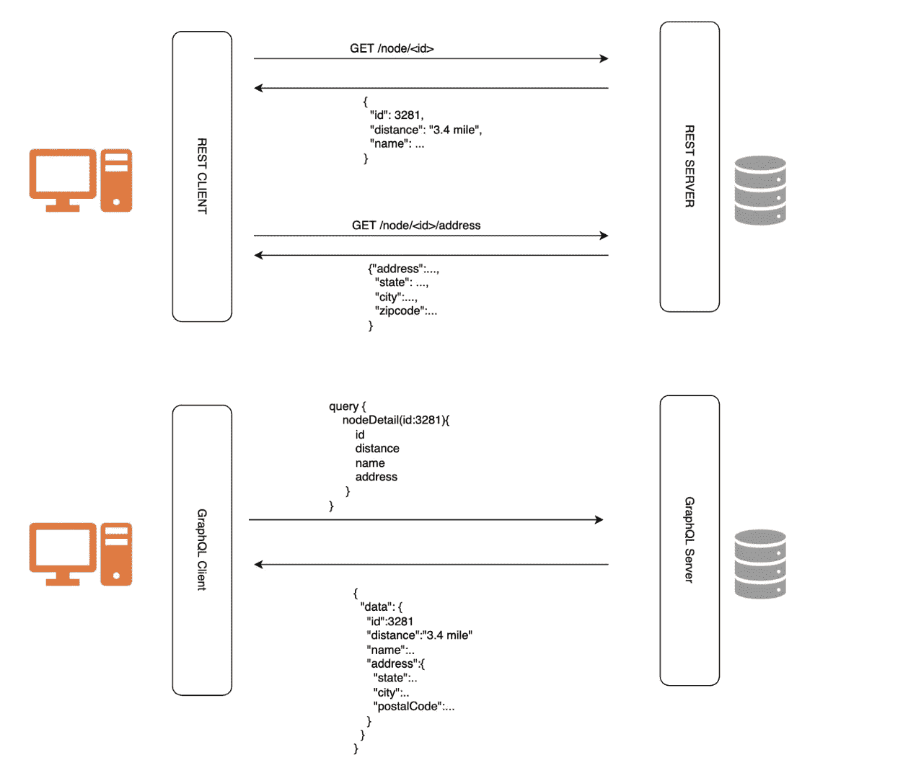
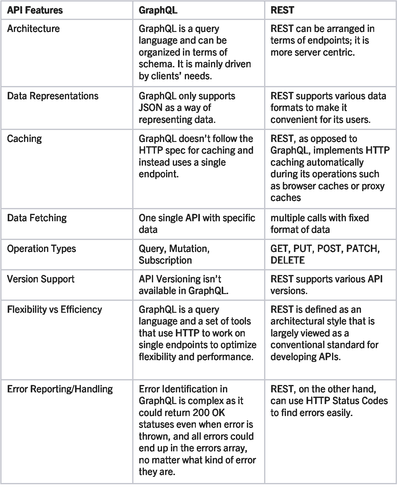

# GraphQL 与 REST

> 原文：<https://medium.com/walmartglobaltech/graphql-vs-rest-f067a79c2230?source=collection_archive---------1----------------------->


## GraphQL 概述

大多数人熟悉 REST API，但可能不熟悉 GraphQL。GraphQL 是一种 API 查询语言，为获取数据提供了更大的灵活性和效率，可以优化 RESTful API 调用。它使程序员能够选择他们想要的请求类型，并且只从服务器获取特定的数据。由于它带来的好处，我们在沃尔玛附属团队中的许多应用程序都采用了 GraphQL，而不是 REST。

GraphQL 有三种操作类型:**查询**、**变异**和**订阅**

查询和变异是最常用的。查询类型用于从服务器获取特定数据，而变异用于更改/更新服务器端数据。

下面的例子:

**GraphQL 请求**

```
query {
  nodeDetail (input: { nodeId: "144"}) {
    id
    distance
    name
    address {
      state
      city
      postalCode
    }
  }
}
```

**GraphQL 响应**

```
{
  "data": {
    "nodeDetail": {
      "id": "144",
      "distance": null,
      "name": "Walmart Supercenter",
      "address": {
        "state": "AR",
        "city": "FAYETTEVILLE",
        "postalCode": "72704"
      }
    }
  }
}
```

带有值的参数可以直接传递到查询中的输入字段，如上所示*输入:{ nodeId: "144"}，*您可以看到查询与结果具有相同的形状。服务器将只获取客户端请求的数据。

在上面的例子中，我们在查询字符串中写入参数。但是在大多数情况下，参数是动态的，所以我们使用另一个名为 *variables* 的字段来传递动态参数。下面是一个使用变量的例子:

```
query nodeDetail($input: NodeIdInput!){
  nodeDetail(input: $input){
    id
    distance
    name
    address {
      state
      city
      postalCode
    }
  }
}
```

变量

```
{"nodeId": "144"}
```

当从应用程序调用 GraphQL API 时，GraphQL 的典型负载如下

```
{
  "query": "SOME QUERY STRING",
  "variables": {}
}
```

所以，使用上面的例子，它将是

```
"query": "query nodeDetail($input: NodeIdInput!){
  nodeDetail(input: $input){
    id
    distance
    name
    address {
      state
      city
      postalCode
    }
  }
}",
"variables": {"input": {"nodeId": "144"}}
```

## 为什么选择 GraphQL

现在我们对 GraphQL 有了一个基本的了解，让我们看看 REST 和 GraphQL 之间的主要区别。



**多次调用 REST，单次调用 GraphQL**

从下图中，您可以看到，使用 REST API，您通常会通过查询多个端点来收集数据。例如，首先您需要查询 */node/ < id >* 来获取节点信息，然后要获取更多的地址信息，您需要调用第二个端点*/node/<id>/address*。然而，使用 GraphQL，只需向服务器发送一个包含具体数据需求的查询，GraphQL 服务器就会响应一个 JSON 对象，满足这些需求。

我们的附属团队应用程序的一个例子是商店服务定位器 API，它被 40 多个合作伙伴用来获取沃尔玛商店的相关信息。该服务必须调用多个内部服务来获取商店信息，即名称、距离等。，这可能会达到大约 1.5 秒的 95%延迟，此外还有多种依赖关系和我们不需要的不必要数据。在切换到单个内部 GraphQL API 后，我们可以只指定我们需要的数据，延迟减少了 10%,依赖性也降低了。

**从 GraphQL** 获取 REST API 的特定数据时溢出或不足

因为对于 REST，客户端从服务器检索数据的唯一方式是通过点击返回固定结构化数据的端点。因此，很难设计 API 来为客户提供他们特定的数据需求。结果可能是 it 从服务器获取了客户需要的数据，例如，客户只想获取用户的姓名和电子邮件地址信息，但最终可能会获取更多不必要的信息，如送货地址或账单信息。或者它可能以欠取结束，例如用户需要商店的地址和基本的商店信息，如名称和距离，但必须首先使 */node/ < id >* 获得基本的商店信息，然后通过使*/node/<id>/address*获得附加的 API 来获得商店地址。

**灵活性和效率**

至于性能，GraphQL 在两个方面优于 REST。REST API 具有严格的数据结构，并且只设计为在命中固定数据时获取固定数据，而 GraphQL 更加灵活，因为您只需要请求所需的数据格式。GraphQL 对移动应用和物联网设备等低资源设备很友好，这些设备可以添加到网络中，而不必担心新的端点和数据检索和处理的增强。此外，使用 GraphQL，您可以通过一次调用获得数据，而 REST API 会过量或不足地获取数据。鉴于这些事实，GraphQL 可以更加灵活和高效。

**graph QL 与 REST 的比较**



## 何时使用 REST

尽管 GraphQL 很棒，但是在某些用例中 REST 会是更好的选择

**缓存机制**

现在，每个浏览器都提供了一个 HTTP 缓存的实现，可以很容易地发现两个资源是否相同，以避免重复获取。使用 GraphQL 时，没有办法获得给定对象的全局唯一标识符，因为我们对所有请求使用相同的 URL。要在 GraphQL 上有缓存，你必须自己设置。但是 REST 可以实现缓存。

**服务对服务通信**

说到服务到服务的通信，REST 由于其简单性而更受欢迎；服务通过 HTTP 直接并同步地相互通信，不需要任何额外的基础设施，这为开发人员提供了为特定业务需求定制 API 的灵活性。

**监控和错误报告**

您可以基于 REST API 响应的响应状态构建一个监控和警报系统。但是对于 GraphQL，即使抛出错误，它也可能返回 200 个 OK 状态，并且所有错误都可能出现在 errors 数组中，不管它们是什么类型的错误，所以找到错误并不简单。例如，来自 GraphQL 的错误响应可能如下:

```
**HTTP 200 OK****{errors: [ {message: ‘Internal Server Error’}]}**
```

## 结论

本文主要对 GraphQL 进行简要介绍，并讨论 GraphQL 与 REST 相比的主要因素，以帮助您更好地理解它们。一般来说，两者各有所长，所以选择 GraphQL 还是 REST 取决于用例。GraphQL 以其声明性和灵活的结构提供了许多优于 REST 的改进，然而，它并不适用于所有情况。例如，如果您计划开发移动应用程序，考虑到带宽使用，GraphQL 是首选，而如果您的系统需要更健壮和更成熟的 API，则应该选择 REST。