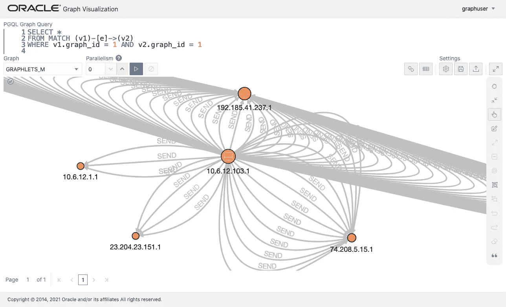
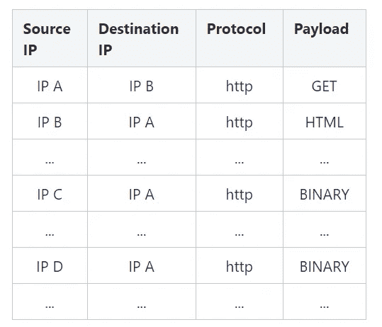
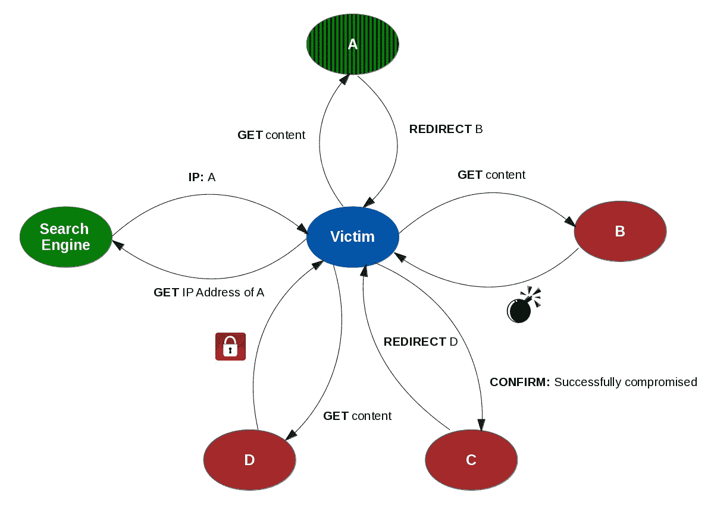
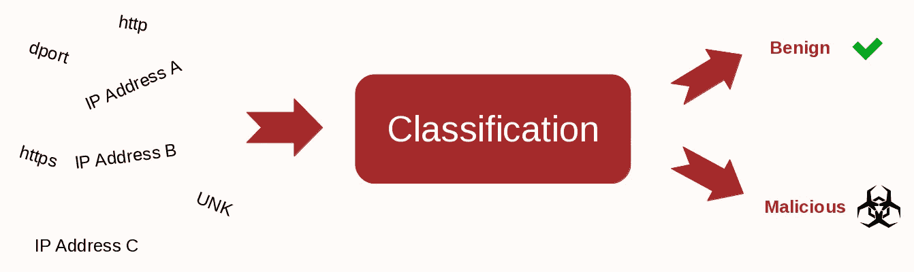
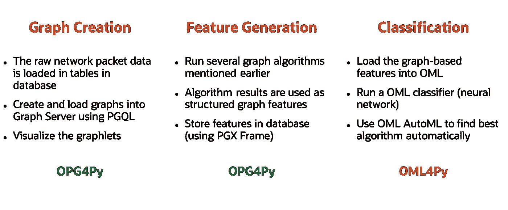
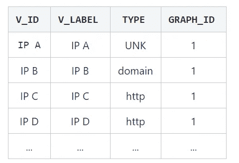
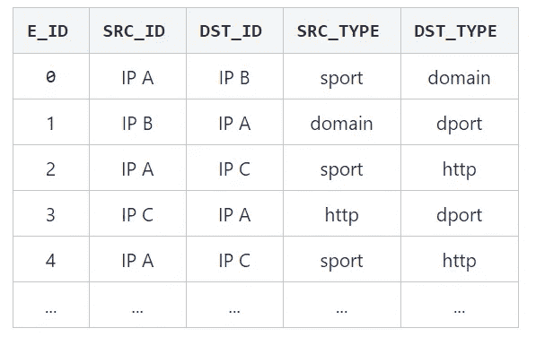
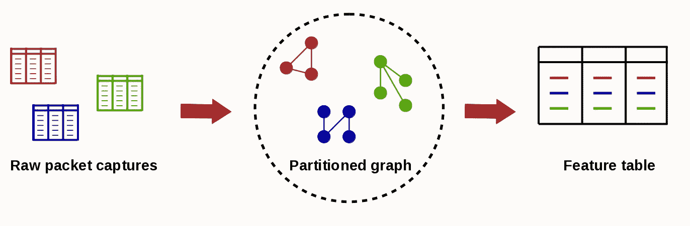

# 网络安全中的图形和机器学习

> 原文：<https://medium.com/oracledevs/graphs-and-machine-learning-for-cybersecurity-7115b9b544b5?source=collection_archive---------1----------------------->



**OPG4Py** 是 Graph Server 的 Python 客户端，是 Oracle 数据库的属性图特性的一个组件。 **OML4Py** 是 [OML](https://www.oracle.com/database/technologies/datawarehouse-bigdata/machine-learning.html) (Oracle 机器学习)的 Python 接口，这是 Oracle 数据库的另一个特性，可以实现可扩展的机器学习。OML 的关键优势在于，所有的机器学习功能都可以在数据库中的数据上运行。这提供了几个优点，从可伸缩性(数据库可以存储大量数据)、性能改进(因为您的数据不需要不断地从数据库中取出并推回)到安全性(您的数据不需要离开数据库的受保护环境)。

OPG4Py 和 OML4Py 相互补充，使用户能够开发快速、可伸缩和安全的图形机器学习应用程序。在本帖中，我们将通过入侵检测的例子来演示这一点。

(原文可以在这里找到，由甲骨文实验室研究经理 Rhicheek Patra 编辑。这里的内容是为 2021 年 7 月 8 日的 [TechCasts](https://analyticsanddatasummit.org/techcasts/) 活动更新的。)

**入侵检测**

入侵检测是一个宽泛的术语，用于监控各种系统和公共/私有网络流量。对于我们的用例，我们将入侵检测定义为监控公共网络(例如万维网)流量和检测恶意活动的问题。在我们的例子中，网络流量是所谓的**数据包捕获**，它是 IP 地址与其他 IP 地址交互的日志。下表是此类数据包捕获的一个示例:



前面的表格可以看作是一个图的边列表表示。结果图可能看起来像这样:通过将 IP 地址视为顶点，并将两个 IP 地址 **A** 和 **B** 之间的交互视为两个顶点 **A** 和 **B** 之间的边，这些数据包捕获自然可以表示为图。



此图显示了一个恶意数据包捕获的示例。

受害者在网络搜索引擎上搜索一些东西。然后，他点击其中一个属于 IP 地址 **A** 的结果，不幸的是，这个地址已经被泄露。 **A** 然后通过几个链接将受害者重定向到 IP 地址 **B** ，让受害者下载一个漏洞。该漏洞试图获得受害者主机的管理员权限，并在成功后向其主人 **C** 报告成功渗透。然后 **C** 将受害者重定向到服务器 **D** 下载进一步的恶意软件(例如，勒索软件将加密您的计算机并要求为其解密付费)。

关于数据包捕获和整个入侵检测问题的更详细的解释，我想让感兴趣的读者看一下这个关于 DynaMiner 和恶意软件检测的报告。

**使用 OPG4Py 和 OML4Py 解决问题**

对于我们的例子，我们有许多不同的数据包捕获，我们的目标是训练一个分类器，可以区分恶意数据包捕获和良性数据包捕获。



我们将分三个主要阶段解决这个问题:

1.  **图形创建:**在此阶段，我们将以表格格式将原始数据包捕获数据加载到数据库中。使用 PGQL 语法，从表中的数据创建图形，并将它们加载到 Graph Server 中。
2.  **特征生成:**第二阶段，使用 OPG4Py 提供的丰富的图形算法库对图形进行广泛的分析。这些分析的结果最初保存在图表中，然后使用 PGQL 查询存储到数据库表中。
3.  **分类:**在第三阶段，我们使用我们创建的特征表来训练各种不同的分类器，以便达到尽可能高的预测精度。为此，我们还将使用 OML 的 AutoML 功能。



**使用 OPG4Py** 生成基于图形的特征

为了使用 OPG4Py 功能，我们首先需要导入`pypgx`包，并使用数据库用户名和密码登录到 Graph Server。

```
import pypgx.pg.rdbms.graph_server as graph_serverbase_url = "[https://<host_name>:7007](https://localhost:7007)"
username = "graphuser"
password = "<password>"instance = graph_server.get_instance(base_url, username, password)
session = instance.create_session("jupyter")
analyst = session.create_analyst()
```

**准备源数据集**

我们有两个数据集。一个数据集用于恶意数据包捕获的图形数据，一个数据集用于良性数据包捕获的图形数据。对于这些图中的每一个，我们准备以下两个表，一个用于顶点，另一个用于边。

`BENIGN_VERTICES`表:



`BENIGN_EDGES`表:



恶意软件图的对应表(`MALWARE_VERTICES`表和`MALWARE_EDGES`表)具有完全相同的模式。

**将数据集加载到图形中充当图形**

在这一步中，我们将使用数据库中的数据集在图形服务器中创建图形。为此，我们首先需要为我们的两个图中的每一个都有一个`CREATE PROPERTY GRAPH`语句。该语句告诉图形服务器表和图形之间的映射。

```
statement = '''CREATE PROPERTY GRAPH graphlets_b
  VERTEX TABLES (
    BENIGN_VERTICES AS ip_address
      LABEL ip_address
      PROPERTIES (V_LABEL, TYPE, GRAPH_ID)
  )
  EDGE TABLES (
    BENIGN_EDGES_v
      KEY (e_id)
      SOURCE KEY(src_id) REFERENCES ip_address
      DESTINATION KEY(dst_id) REFERENCES ip_address
      LABEL send
      PROPERTIES (SRC_ID, DST_ID, SRC_TYPE, DST_TYPE)
  )'''
```

一旦执行了这条语句，就在内存中创建了图形。

```
session.prepare_pgql(statement).execute()
```

附加图形并获得一个代理对象。

```
graphlets_b = session.get_graph("GRAPHLETS_B")
```

**下一步:使用特色表**

让我们回顾一下我们到目前为止所做的工作。

首先，我们确认原始数据包捕获数据在数据库表中。然后我们创建了两个分区图:`GRAPHLETS_B`和`GRAPHLETS_M` ***。这两个图都是由许多小的子图组成的。每个子图代表一个数据包捕获。***

下一步，我们将分析每个小 graphlets，并将它们的信息存储在一个大的特性表中。对于每个 graphlet，我们将在特性表中存储一行。然后，我们将为每一行附加一个标签，说明该行包含的信息是恶意的还是良性的数据包捕获。



所以事不宜迟，让我们继续我们的旅程吧！

**创建 graphlet 特征**

既然我们已经在 Graph Server 中创建了两个图形，我们将使用各种图形算法来分析它们。我们稍后将使用结果信息来训练不同的分类器。对于每个图，我们将使用 Graph Server 提供的丰富的图算法集来分析它，以计算许多属性。

```
def generate_graphlet_features(graphlet):
    analyst.degree_centrality(graphlet)
    analyst.local_clustering_coefficient(graphlet)
    analyst.out_degree_centrality(graphlet)
    analyst.in_degree_centrality(graphlet)
    analyst.vertex_betweenness_centrality(graphlet)
    analyst.pagerank(graphlet)generate_graphlet_features(graphlets_b)
generate_graphlet_features(graphlets_m)
```

**准备分类数据**

请记住，到目前为止，我们每一步都做了两次:第一次是针对存储良性数据包捕获的图，第二次是针对存储恶意数据包捕获的图。现在，我们为每个功能列表添加了一个标签，表示该功能列表属于良性(`ml_label = 0`)还是恶意(`ml_label = 1`)数据包捕获。

```
rs = graphlets_b.query_pgql("""SELECT
  v.graph_id
, 0                  AS ml_label
, COUNT(v)           AS cnt_vertex
, SUM(v.degree) / 2  AS cnt_edge
, AVG(v.degree)      AS avg_degree
, AVG(v.lcc)         AS avg_lcc
, AVG(v.out_degree)  AS avg_out_degree
, AVG(v.in_degree)   AS avg_in_degree
, AVG(v.betweenness) AS avg_betweenness
, AVG(v.pagerank)    AS avg_pagerank
, MAX(v.degree)      AS max_degree
, MAX(v.lcc)         AS max_lcc
, MAX(v.out_degree)  AS max_out_degree
, MAX(v.in_degree)   AS max_in_degree
, MAX(v.betweenness) AS max_betweenness
, MAX(v.pagerank)    AS max_pagerank
, MIN(v.degree)      AS min_degree
, MIN(v.lcc)         AS min_lcc
, MIN(v.out_degree)  AS min_out_degree
, MIN(v.in_degree)   AS min_in_degree
, MIN(v.betweenness) AS min_betweenness
, MIN(v.pagerank)    AS min_pagerank
FROM MATCH (v) ON GRAPHLETS_B
GROUP BY v.graph_id
ORDER BY v.graph_id ASC""")
```

将查询结果存储到数据库表中。

```
rs.to_frame().write().db().table_name("FEATURES_BENIGN") \
  .overwrite(True).owner("GRAPHUSER").store()
```

相同的查询，但是针对具有`ml_label = 1`的恶意软件图。

```
rs = graphlets_m.query_pgql("""SELECT
  v.graph_id
, 1                  AS ml_label
, COUNT(v)           AS cnt_vertex
, SUM(v.degree) / 2  AS cnt_edge
, AVG(v.degree)      AS avg_degree
, AVG(v.lcc)         AS avg_lcc
, AVG(v.out_degree)  AS avg_out_degree
, AVG(v.in_degree)   AS avg_in_degree
, AVG(v.betweenness) AS avg_betweenness
, AVG(v.pagerank)    AS avg_pagerank
, MAX(v.degree)      AS max_degree
, MAX(v.lcc)         AS max_lcc
, MAX(v.out_degree)  AS max_out_degree
, MAX(v.in_degree)   AS max_in_degree
, MAX(v.betweenness) AS max_betweenness
, MAX(v.pagerank)    AS max_pagerank
, MIN(v.degree)      AS min_degree
, MIN(v.lcc)         AS min_lcc
, MIN(v.out_degree)  AS min_out_degree
, MIN(v.in_degree)   AS min_in_degree
, MIN(v.betweenness) AS min_betweenness
, MIN(v.pagerank)    AS min_pagerank
FROM MATCH (v) ON GRAPHLETS_M
GROUP BY v.graph_id
ORDER BY v.graph_id ASC""")
```

将查询结果存储到数据库表中。

```
rs.to_frame().write().db().table_name("FEATURES_MALWARE") \
  .overwrite(True).owner("GRAPHUSER").store()
```

现在，用于训练的基于图形的特征被准备并存储在数据库中。

可视化小图

使用图形可视化 UI，我们可以直观地检查 graphlets:涉及多少顶点和边，它们是如何连接的，等等。这种拓扑信息的一部分应该由前一步骤中的图形算法来量化。

下面的 PGQL 查询用于检索特定 graphlet 中的所有顶点对和连接边，其中它的`GRAPH_ID`是 1。

```
SELECT *
FROM MATCH (v1)-[e]->(v2)
WHERE v1.graph_id = 1 AND v2.graph_id = 1
```

每个顶点保存新的属性，如`pagerank`或`betweeeness`。在下面的屏幕中，顶点的大小代表了 PageRank 分数。


**用 OML 分类器训练数据**

请记住，到目前为止，我们每一步都做了两次:第一次是针对存储良性数据包捕获的图，第二次是针对存储恶意数据包捕获的图。我们最终可以将两个特性列表合并到一个表中:

```
import omlfeatures_oml = oml.sync(query='''SELECT * FROM FEATURES_BENIGN
UNION
SELECT * FROM FEATURES_MALWARE''')
```

我们现在创建了最终表，我们将使用它来训练我们的分类器。为了在这些数据上训练和测试分类器，我们应该将数据分成训练集和测试集。请注意，这样做不需要从数据库中获取数据。OML 为此提供了`split()`函数，它将两个代理对象返回给数据的两个部分:

```
# Split the data for training and test
train_oml, test_oml = features_oml.split(ratio=(.8, .2), seed=0)# training data
train_x_oml = train_oml.drop('ml_label')
train_y_oml = train_oml['ml_label']# test data
test_x_oml = test_oml.drop('ml_label')
test_y_oml = test_oml['ml_label']
```

**先用 OML 分类**

在为分类准备好我们的数据之后，是时候开始训练我们的分类器了！

先说一个神经网络。OML4Py 让你通过`oml.nn()`构造器创建一个神经网络。为了个性化您的神经网络，您可以向该构造函数提供一大组参数。在下面的代码中，我们用不同数量的节点和不同的激活函数创建了四层。

```
params = {# The architecture of the neural network
'nnet_hidden_layers' : 4,
'nnet_nodes_per_layer' : '50, 30, 50, 30',# The differnt activation functions in each layer
'nnet_activations' : "'NNET_ACTIVATIONS_LINEAR', 'NNET_ACTIVATIONS_LINEAR', 'NNET_ACTIVATIONS_LINEAR', 'NNET_ACTIVATIONS_LINEAR'",# Info about the number of rounds to use for fitting
'nnet_iterations' : 500,
'nnet_heldaside_max_fail' : 100,# A seed for reproducibility
'odms_random_seed' : 1}
nn_mod = oml.nn(**params)
```

训练和评分神经网络也很容易。OML4Py 提供了两个函数，`fit()`和`score()` ***，*** ，每个函数都以 OML 代理对象为参数。这些代理对象告诉函数应该对哪些数据应用训练和测试。

```
# Fit the NN model according to the training data and parameters
nn_mod = nn_mod.fit(train_x_oml, train_y_oml)# Score the model
nn_mod.score(test_x_oml, test_y_oml)0.985251
```

在我们的数据上训练这个模型，然后对它进行评分，得到 98.5%的准确率。但是，我们能做得更好吗？

AutoML:让 oML 替你做这件事

OML 提供了大量不同的分类器，从线性分类器上的神经网络到朴素贝叶斯分类器。然而，尝试所有这些不同的分类器来找出哪一个提供最好的结果是很麻烦的，特别是因为每个单独的分类器都有大量可以调整的超参数。但是，OML 有一个解决方案:AutoML。 [AutoML](https://blogs.oracle.com/datascience/how-does-automl-impact-machine-learning) 模型提供了多种功能，您可以使用这些功能让 oML 为您找到最佳模型/功能/超参数。

让我们将自动算法选择应用于我们的数据，以找出哪个模型为我们的数据产生最佳结果:

```
alg_selection = oml.automl.AlgorithmSelection(
    mining_function = 'classification',
    score_metric = 'accuracy',
    parallel = 1
)algo_ranking = alg_selection.select(
    train_x_oml, train_y_oml,
    cv = None, X_valid = test_x_oml, y_valid = test_y_oml, k = 3
)print("The best models are: " + str(algo_ranking))The best models are: [('nb', 0.9970501474926253), ('svm_gaussian', 0.9970501474926253), ('glm_ridge', 0.9941002949852508)]
```

运行上面的代码给我们以下排名:

1.  朴素贝叶斯(准确率:~99.7%)
2.  支持向量机(准确率:~99.7%)
3.  通用线性化模型(精度:~99.4%)

**图机器学习功能**

在这篇博客文章中，我们讨论了基于图形的功能如何促进标准的机器学习。然而，OPG4Py 提供了更复杂的图形机器学习功能，如顶点表示(DeepWalk，图形卷积网络)和子图表示(PG2Vec)。我们将在以后的博客文章中讨论更多。

如果您想分享您的反馈或向社区提问，请点击[此处](https://join.slack.com/t/andouc/shared_invite/zt-mfbk0un9-E7mgQweUfBnJ6BfRgcTeMQ)加入 AnDOUC(分析和数据 Oracle 用户社区)Slack workspace，并在 [#graph](https://andouc.slack.com/archives/C01BMHU02JX) 频道发表您的评论。