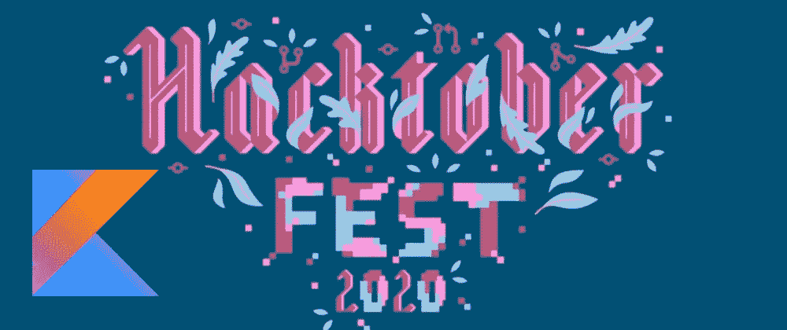
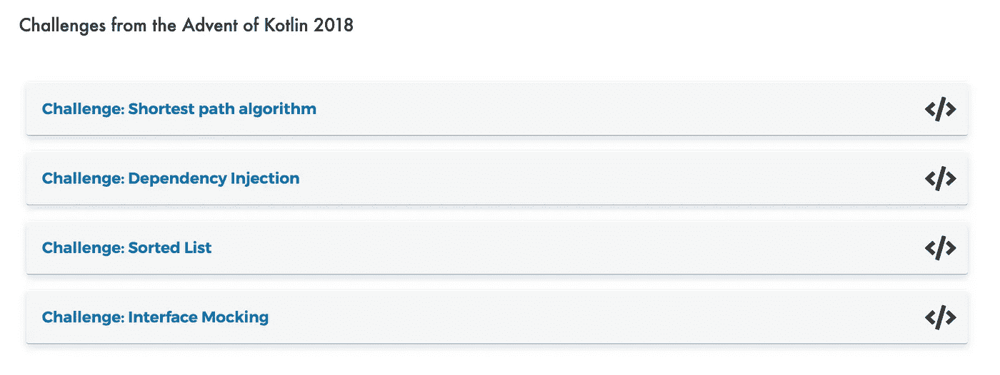
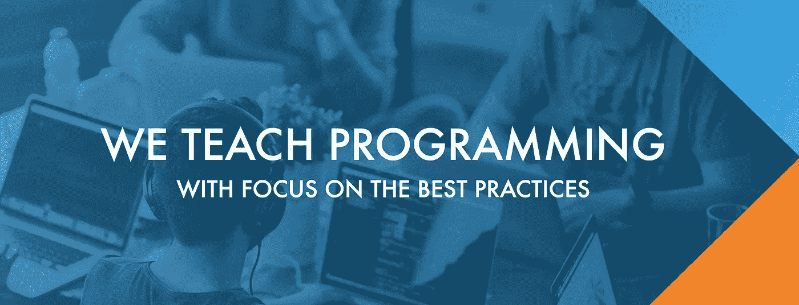

# 新的精彩文章和奖励

> 原文：<https://blog.kotlin-academy.com/great-articles-bonus-8dd34a5d47ab?source=collection_archive---------6----------------------->

自从我们上一期媒体通讯以来，我们已经发表了一些令人惊叹的文章。让我们现在就开始吧！

# **文章**

*   [Kotlin DSL —定义强制参数](/kotlin-dsl-know-your-limits-2deaef1bab66)作者:Hanan Rofe Haim
*   [IJetPack 作曲🏹—阿里·阿扎兹·阿拉姆的《国家管理》](/jetpack-compose-state-management-73ec3f6c74a5)
*   实践中的 TDD
*   避免层叠式 if-else
*   [为什么科特林有可变的收藏](/why-kotlin-has-mutable-collections-3937a515f913)

## 外加额外的东西！

我们要提醒你的是[**Hacktoberfest**](https://hacktoberfest.digitalocean.com/)还在进行中！对于那些还没有听说过它的人来说——这是开发人员为了乐趣、自我发展和做好事而入侵开源项目的时候了。

这里有一篇 Jean-Michel Fayard 写的文章，你可以在那里找到关于它的更多信息— [贡献给科特林图书馆游乐场的 Hacktoberfest！](/contribute-to-the-kotlin-libraries-playground-for-hacktoberfest-2875af740b79)

# 奖金

在 Kotlin 2018 的 [**降临中，我们学习了如何实现 mocks、依赖注入库、排序列表、查找最短路径。这是一个相当大的挑战，我们为此感到自豪！😉**](https://kt.academy/course/advent-of-kotlin-2018)

如果你错过了，你现在可以在我们的新课程中学习。玩得开心！

我们没有放慢脚步，仍然为开发人员举办 [**研讨会**](https://kt.academy/workshop) :

*   [科特林训练，](https://kt.academy/workshop?tag=kotlin#workshops-offer)
*   [最佳实践培训](https://kt.academy/workshop?tag=bestpractices#workshops-offer)。

为了让您的课程之旅更加直观，我们将所有研讨会都集中在一个按钮“[研讨会](https://kt.academy/workshop)”下。

此外，为了使注册过程更容易，我们为公开和私人研讨会增加了价格和单独的表格。

❗All 研讨会可以在网上进行。

欲了解更多信息，请访问[我们的网站](https://kt.academy/workshop)或通过[联系我们。](http://contact@kt.academy)

*编码快乐！
Kt。学院团队*

