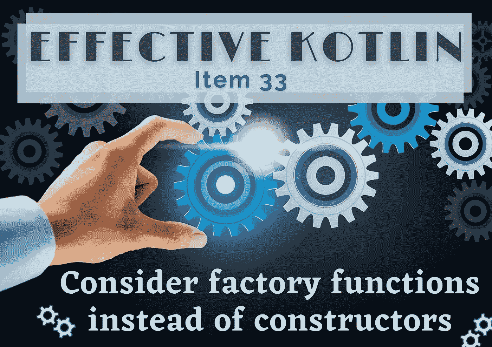
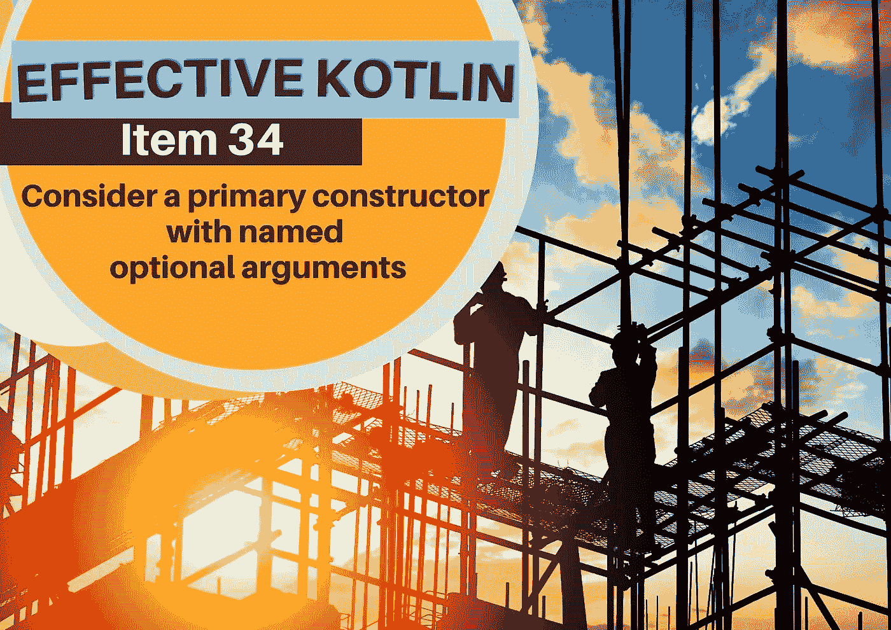
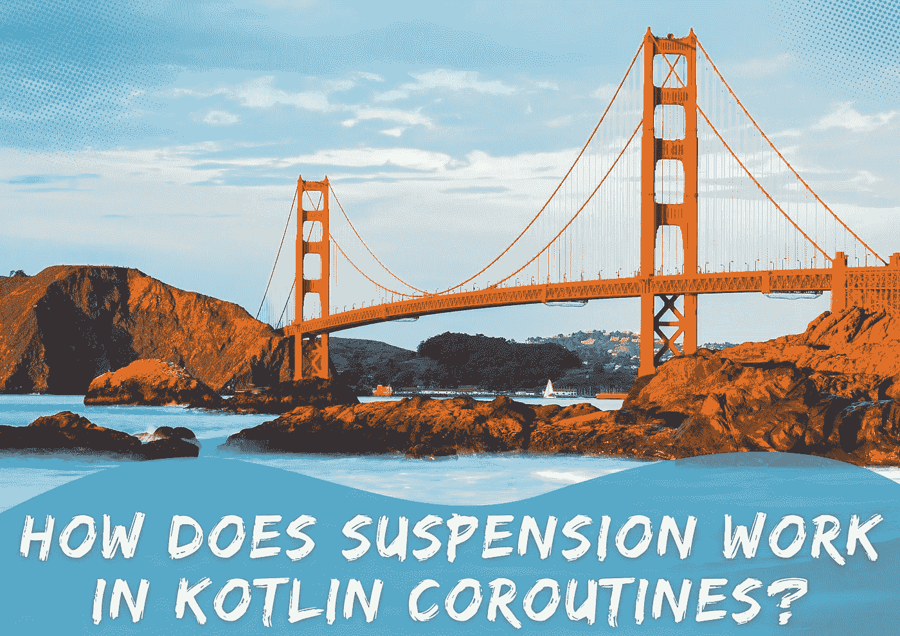

# 来自 Kt 的精彩文章和激动人心的消息。⭐️学院

> 原文：<https://blog.kotlin-academy.com/great-articles-exciting-news-from-kt-academy-%EF%B8%8F-7c8f431c5a6f?source=collection_archive---------1----------------------->

你好！**👋**

你准备好接受大量精彩内容了吗？🔥
如果是的话，看看下面的快捷方式，继续读下去👇

**⇢文章**t5】👉考虑工厂函数而不是构造函数
👉考虑一个带有命名可选参数
的主构造函数👉Kotlin 协程中的挂起是如何工作的？
👉如何保护机密🔑在 Android 中— Android Security-01

**⇢** 新**福利**给我们的研讨会与会者！
⇢**测角&测角要领**课程

尽情享受吧！⏬

什么是工厂函数，为什么它们对对象创建如此重要⚙️

**考虑工厂函数而不是构造函数**👇

[Effective Kotlin Item 33: Consider factory functions instead of constructors](https://kt.academy/article/ek-factory-functions)

为什么伸缩构造器模式和经典构造器模式在 Kotlin 中被认为是过时的🤔

**考虑一个带有命名可选参数的主构造函数**👇

[Effective Kotlin Item 34: Consider a primary constructor with named optional arguments](https://kt.academy/article/ek-constructor)

这里有一个由 Marcin Moskala 编写的关于在 Kotlin 协同程序中悬浮是如何工作的深入解释👇

[How does suspension work in Kotlin coroutines?](https://kt.academy/article/cc-suspension)

“在构建处理 API、从服务器接收的令牌、[…]和许多其他场景的应用程序时，安全性是一项关键要求。”
**如何保密🔑在安卓—安卓安全-01** 阿里·阿扎兹·阿拉姆撰写👇

[How to Secure Secrets 🔑 in Android — Android Security-01](/how-to-secure-secrets-in-android-android-security-01-a345e97c82be)

参加我们的培训的最大好处之一是您可以获得我们的独家在线课程🤩

❗️NEW❗️- [科特林协同](https://kt.academy/course/coroutines-workshop)t29】✅[科特林](https://kt.academy/course/kotlin-workshop)t32】✅[有效科特林](https://kt.academy/course/effective-kotlin)

还有更多！🔥

从现在起，每位参与者还将获得一张**个人优惠券**，免费赠送[有效的科特林电子书](https://leanpub.com/effectivekotlin) 🥳

[Effective Kotlin extras and materials](https://kt.academy/course/effective-kotlin)

❗️There 是我们 offer❗️的两个新车间

[**棱角分明**](https://kt.academy/workshop/angular) 👉从基础到高级用法。
[**角度要领**](https://kt.academy/workshop/angularEssential) 👉一天中最重要的部分。

查看更多详情和其他课程在这里⤵️
[Kt。学院研讨会](https://kt.academy/workshop)

今天就到这里吧！

谢谢，再见！

卡帕头。学院团队

www: [kt.academy](https://kt.academy/)
博客:[blog.kotlin-academy.com](http://blog.kotlin-academy.com/)
Twitter EN:[@ ktdotsacademy](https://twitter.com/ktdotacademy)
Twitter PL:[@ ktdotsacademypl](https://twitter.com/ktdotacademyPL)
FB:[@ ktdotsacademy](https://www.facebook.com/KtDotAcademy)
LinkedIn:[@ Kt。学院](https://www.linkedin.com/company/kt-academy/)

