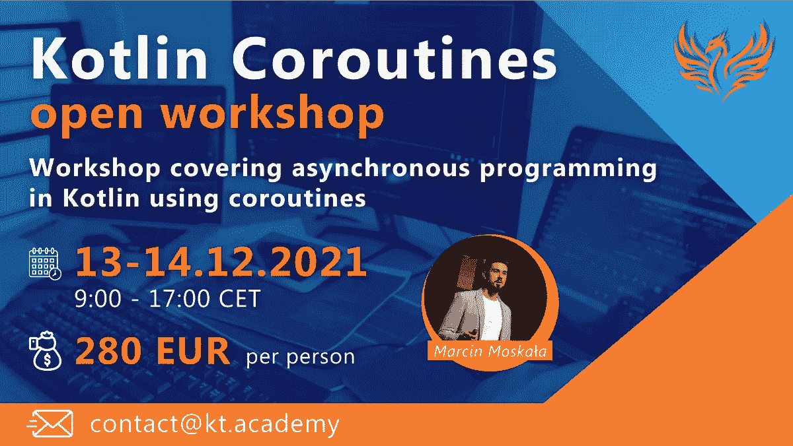

# 来自 Kt 的精彩文章& Kotlin Coroutines 工作坊。学院

> 原文：<https://blog.kotlin-academy.com/great-articles-kotlin-coroutines-workshop-from-kt-academy-8ce7be2fb882?source=collection_archive---------3----------------------->

你好！
Kt。这里是学院**👋**

今天，我们为您准备了 4 篇精彩的编程文章！下面是对它们的简要总结👇

👉[如何保护秘密🔑在安卓(深入)—安卓安全-02](/secure-secrets-in-android-using-jetpack-security-in-depth-android-security-02-4026b8e012f4)
👉[构造协程作用域](https://kt.academy/article/cc-constructing-scope)
👉[协程解决可变状态问题](https://kt.academy/article/cc-state)
👉[考虑具有用于性能关键处理的原语的数组](https://kt.academy/article/ek-arrays)

我们也在准备下一次 **Kotlin 协同程序**公开研讨会🔥

*️⃣:我们很想听听你对这份时事通讯的想法和建议。请回复此邮件与我们分享📩

尽情享受吧！⏬

“在 google I/O 2019 中，Android 团队发布了名为 Jetpack Security 的安全加密库，以方便开发人员构建安全的应用程序。”

**安全保密🔑在 Android 中使用 Jetpack 安全(深入)-Android Security-02**作者:Ali Azaz Alam👇

You can also read the first part on our blog 👇
[**How to Secure Secrets 🔑 in Android — Android Security-01**](/how-to-secure-secrets-in-android-android-security-01-a345e97c82be)

我们一般如何在 Android 和后端定义协程作用域？

**构建协程作用域**Marcin Moskala👇

[Constructing coroutine scope](https://kt.academy/article/cc-constructing-scope)
🔻 This is a chapter from the [Kotlin Coroutines](https://kt.academy/book/coroutines) book. You can find Early Access on [LeanPub](https://leanpub.com/coroutines/).

我们应该在 Kotlin 协程中使用什么线程安全机制。

**协程程序对可变状态问题的回答👇**

[Coroutines answer to the problem with mutable state](https://kt.academy/article/cc-state)
🔻 This is a chapter from the [Kotlin Coroutines](https://kt.academy/book/coroutines) book. You can find Early Access on [LeanPub](https://leanpub.com/coroutines/).

使用集合和基元数组有什么区别？

**考虑具有用于性能关键处理的原语的数组**👇

[Effective Kotlin Item 55: Consider Arrays with primitives for performance-critical processing](https://kt.academy/article/ek-arrays) 🔻 This is a chapter from the [Effective Kotlin](https://kt.academy/book/effectivekotlin) book. You can find it on [LeanPub](https://leanpub.com/effectivekotlin) or [Amazon](https://www.amazon.com/Effective-Kotlin-practices-Marcin-Moskala/dp/8395452837/ref=sr_1_1?dchild=1&keywords=effective+kotlin&qid=1615033955&sr=8-1).

我们正在准备由 Marcin Moskala 主持的下一次**公开 Kotlin 协同程序研讨会**🔥

日期:**2021 年 12 月 13-14 日**
时间:**9:00-17:00 CET**(GMT+1，华沙时区)
价格: **280 欧元**每人
郎:**恩**

查看详细信息并在此注册👇
[Kotlin Coroutines 开放式车间](https://kt.academy/workshop/coroutines)

今天就到这里吧！

谢谢，再见！

卡帕头。学院团队

www: [kt.academy](https://kt.academy/)
博客:[blog.kotlin-academy.com](http://blog.kotlin-academy.com/)
Twitter EN:[@ ktdotsacademy](https://twitter.com/ktdotacademy)
Twitter PL:[@ ktdotsacademypl](https://twitter.com/ktdotacademyPL)
FB:[@ ktdotsacademy](https://www.facebook.com/KtDotAcademy)
LinkedIn:[@ Kt。学院](https://www.linkedin.com/company/kt-academy/)

