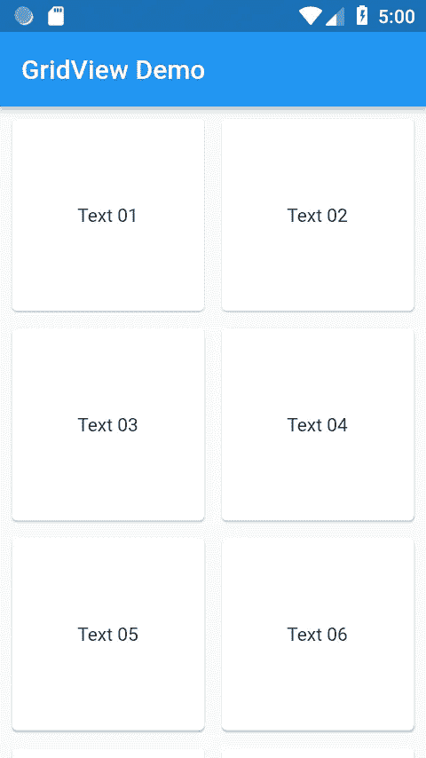

# 颤动:GridView

> 原文：<https://medium.com/globant/gridview-in-flutter-ede1df032fe7?source=collection_archive---------0----------------------->


*   **GridView** 是一个丰富多样的特性**控件**，用于接受、显示和编辑数据。
*   使用 **GridView** 后，你的条目就像一个网格，而不是一个接一个的普通条目列表。
*   我们必须使用 **GridView** 小部件。
*   我们必须使用`GridView.count() constructor,` ,因为它允许您指定想要多少行或列。
*   下面是一个关于 GridView 如何工作的例子

```
void main() => runApp(MyApp());

class MyApp extends StatelessWidget {

  @override
  Widget build(BuildContext context) {
    return MaterialApp(
      title: 'GridView Demo',
      debugShowCheckedModeBanner: false,
      theme: ThemeData(

        primarySwatch: Colors.*blue*,
      ),

      home: GridList(),
    );
  }
}
```

*   我创建了一个扩展 StatelessWidget 的 GridList 类。

```
class GridList extends StatelessWidget {
  final List<String> _list = [
    "Text 01",
    "Text 02",
    "Text 03",
    "Text 04",
    "Text 05",
    "Text 06",
  ];
//list of strings to display in grid@override
  Widget build(BuildContext context) {
    return Scaffold(
      appBar: AppBar(
        title: Text('GridView Demo'),
      ),
      body: GridView.count(
        crossAxisCount: 2,
        padding: EdgeInsets.all(5.0),
        crossAxisSpacing: 5.0,
        mainAxisSpacing: 5.0,
        children: _list
            .map((data) => Card(
          child: Center(
              child: Padding(
                padding: const EdgeInsets.all(8.0),
                child: Text(data),
              )),
        ))
            .toList(),
      ),
    );
  }
}
```

*   我将 crossAxisCount 设置为 2，因此每行将显示 2 个网格。
*   这个 toList()方法将在一个列表中收集这个流的所有元素。创建一个列表<t>并将该流的所有元素按照到达的顺序添加到列表中。当这个流结束时，返回的未来用那个列表完成。</t>



*   上面的图像是 Gridview 示例的输出，它只在特定的网格中显示一个文本，你可以在列表中提供任何图像来获取网格中的图像。

快乐阅读:)