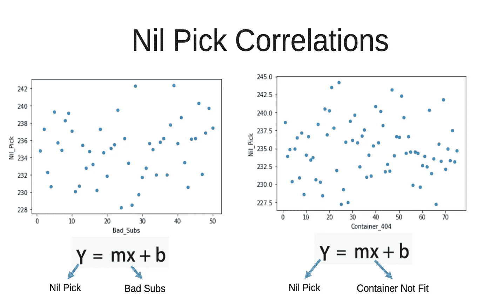
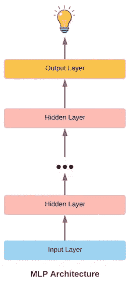

# 使用机器学习模型预测杂货项目的零拣选

> 原文：<https://medium.com/walmartglobaltech/grocery-items-nil-pick-prediction-using-a-machine-learning-model-191e273f2795?source=collection_archive---------0----------------------->

## 当所订购的商品不可用时，物品替代品在客户满意度方面发挥着关键作用，因此是客户订单不可或缺的一部分。


Photo by [Justin Lim](https://unsplash.com/@justinlim?utm_source=medium&utm_medium=referral) on [Unsplash](https://unsplash.com?utm_source=medium&utm_medium=referral)

# 它是如何工作的…

电子商务平台已经将购物提升到了一个完全不同的水平，顾客可以舒舒服服地坐在沙发上，从成千上万的商品中挑选，然后送货上门，但这说起来容易做起来难。

电子商务订单履行是一个复杂的过程，涉及供应链、商店/仓库、物流、支付等多个团队的协作。让我们讨论一下订单是如何体现在实际包装/装运中的。

订单由电子商务平台提供的属于不同类别的各种项目组成。为了完成订单，员工将从商店/仓库的不同区域挑选这些商品，将它们放入手推车/篮子中，最后准备发货。从技术上讲，订单履行之旅始于商店提货人(员工的术语)，他下载订单详细信息，其中包含要从商店或仓库提货的商品。随后，生成一条优化路径(称为挑选行走)来挑选订购的商品，以便最大限度地减少收集所有订购商品的时间。现在，这就是物品替代发挥作用的地方，它构成了我们打算讨论的问题的核心。

## 问题陈述…

在提货过程中，商品可能缺货，或者其包装存在质量问题。在这种情况下，提货人会依靠某个商品的替代品来替换原来订购的商品。但有时，即使是替补队员也没有资格入选

1.  与原项目相比，替代品**不合适**。


Photo reference [https://images.app.goo.gl/fnwj6DKTgsqpvj6X7](https://images.app.goo.gl/fnwj6DKTgsqpvj6X7)

2.替代品**缺货**。


Photo by [Simon Ray](https://unsplash.com/@simonbhray?utm_source=medium&utm_medium=referral) on [Unsplash](https://unsplash.com?utm_source=medium&utm_medium=referral)

3.替代品有**体积问题**，因为它可能不适合用于提货的手提袋/手推车。


Photo Reference [https://www.flickr.com/photos/schuminweb/12231549264/in/photostream/](https://www.flickr.com/photos/schuminweb/12231549264/in/photostream/)

这就导致了零提货(即商品或其替代品无法提货，因此无法在订单中履行)或人工提货(提货人根据自己的判断和尽职调查选择商品)。这种情况导致了

1.  客户拒绝的增加——因为客户不喜欢我们提供的替代品。
2.  整体履行时间增加——因为手动挑选的替代品可能需要商店经理的批准。

## 建议的解决方案…

机器学习是目前科技行业最受欢迎的工具之一。这些数学模型的应用范围从无人驾驶汽车到虚拟助手。我们希望利用机器学习的数学方法，根据上面讨论的原因来预测零拣选和人工拣选。因此，我们首先建立一个假设，即机器学习模型将有助于以纯数学的方式证明。

假设验证将包括:

1.  商店数据的处理和分析。
2.  创建一个数据管道，并开发一个基于回归的机器学习模型来预测零拣货。可以遵循类似的方法来预测人工挑选。
3.  执行模型来解释结果。

## 选择机器学习模型的困惑

人工智能使用的人工神经网络有三类。

1.  前馈神经网络/多层感知器
2.  卷积神经网络
3.  递归神经网络

***前向神经网络*** 是第一种被创造出来的人工神经网络，可以认为是当今最常用的人工神经网络。这些神经网络被称为前馈神经网络，因为通过网络的信息流是单向的，不经过环路。

> 基于中间隐藏层的存在，前馈神经网络可以进一步分为单层网络或多层网络。


层数取决于需要执行的功能的复杂程度。单层前馈神经网络仅由两层神经元组成，并且在它们之间没有隐藏层。多层感知器由输入和输出层之间的多个隐藏层组成，允许多阶段的信息处理。

***使用 MLPs 为:***

*   表格数据集
*   分类预测问题
*   回归预测问题

***优点***

*   高度灵活，可应用于各种数据集，如表格、图像和文本等。
*   适用于在给定一组输入的情况下预测实数值的回归预测问题。

***缺点***

*   由于它是一个完全连接的模型，总参数可能会增长到非常高的数量，这可能会在更高层中造成冗余和低效。

> 第 1 层感知器的数量乘以第 2 层 p 的#乘以第 3 层 p 的#等等。

*   不适用于影像数据集，因为它忽略了空间信息。

***卷积神经网络*** ，自从它的概念提出以来，几乎只与计算机视觉应用有关。这是因为他们的架构特别适合执行复杂的可视化分析。

卷积神经网络架构由神经元的三维排列来定义，而不是标准的二维阵列。


Image Reference [https://images.app.goo.gl/JaNc7quRC6CJRV61A](https://images.app.goo.gl/JaNc7quRC6CJRV61A)

这种神经网络的第一层称为卷积层。卷积层中的每个神经元只处理来自一小部分视野的信息。卷积层之后是整流层单元或 ReLU，这使 CNN 能够处理复杂的信息，并有助于分类/识别。

***使用 CNN 进行:***

*   机器视觉和自动驾驶汽车等物体识别应用。
*   用于情感分析的文档分类及相关问题。

***【RNN】***递归神经网络，顾名思义，涉及循环形式的递归运算。这些比前馈网络复杂得多，并且可以执行比基本图像识别更复杂的任务


Image Reference [https://images.app.goo.gl/FUW6XCinS3uL9i5W6](https://images.app.goo.gl/FUW6XCinS3uL9i5W6)

***使用 RNNs 进行:***

*   序列预测问题。
*   语音和文本预测。
*   自然语言生成。

递归神经网络不适用于表格和图像数据集。它们很难训练，而且短期记忆很差，这限制了它们的功能。为了克服记忆的限制，一种新形式的 RNN，被称为 LSTM 或长短期记忆网络被使用。

> 在比较了上面讨论的机器学习模型之后，我们选择为我们的尼克选择预测构建一个预测性的**多层感知器**，因为它最适合我们的问题陈述，原因如下:
> 1 .我们的训练数据集是与错误替换和容量问题相关的逗号分隔存储数据。CNN 和 RNN 都不适合 CSV/表格数据集。
> 2。我们打算建立一个预测模型。CNN 适合于图像分析用例，而 RNN 适合于序列预测问题。此外，RNNs 和 LSTMs 已经在预测问题上进行了测试，但是已经被应用于相同数据的基于简单 MLPs 的回归模型所超越。

## TensorFlow Docker 设置

TensorFlow 启动 Docker 命令

```
$ docker run -it -p 8888:8888 -p 6006:6006 -v <NOTEBOOK_PATH_ON_LOCAL_SYSTEM>:/tf/notebooks tensorflow/tensorflow:latest-jupyter
```

在 Docker 容器中安装熊猫

```
$ pip install --trusted-host pypi.org --trusted-host files.pythonhosted.org pandas
```

## 商店数据分析

来自不同商店的数据被收集以形成训练和评估数据集。该数据是每周的不良替换、体积问题实例和零选择的计数。

> 1.熊猫数据帧:将 CSV 数据读入熊猫数据帧。

> 2.散点图:解释数据的最重要部分是能够可视化数据集特征之间的趋势和相关性，在我们的情况下，这包括错误的替换、体积问题和零选择。我们通过数据图来做到这一点，这使我们能够轻松地发现数据集中有趣的模式/相关性，并决定数据集是否适用于训练机器学习模型。

我们使用 Matplotlib 的[***py plot***](https://matplotlib.org/api/pyplot_api.html)API 创建数据图。数据分析最常用的图之一是二维散点图。它用于绘制数值相关特征(Y 轴)和数值无关特征(X 轴)之间的关系。零选择和手动选择代表我们用例的因变量



Figure 1\. Nil Pick Scatter Plots

> 3.解释图:创建数据集图后，我们分析它们以确定 Nil Pick 是否与不良 Subs 或容器不适合特性有任何关联。在图中要注意的主要事情是非均匀分布的。诸如正态分布或多模态分布的非均匀分布示出了不良接头和/或容器不适合特征可能被机器学习模型用来预测零拣选。因此，相关性(图 1。)之间的差异为构建机器学习模型来预测零拣选提供了强有力的理由。

## 数据处理

在本节中，我们打算为训练和评估 Nil Pick 机器学习模型构建输入管道。

输入管道表示在训练或评估的每个步骤中，数据将如何传递到模型中。由于训练模型需要数千个步骤，输入管道必须尽可能高效。

我们创建的商店数据集存储在 pandas data frame***store _ dataset***中。由于数据帧对于输入管道来说不是最有效的数据存储，我们需要执行额外的处理来创建一个更有效的解决方案。

***拆分商店数据集***

创建机器学习模型有两个主要部分:训练和评估。训练是机器学习的基础，但评测同样重要。模型评估让我们具体了解模型在训练后有多好，并允许我们比较模型不同配置的性能。


Figure 2\. Splitting Dataset

现在，我们如何决定用于训练和评估的数据量。在训练中使用更多的数据可能会提高模型的性能，但由于评估集大小有限，这将限制我们评估的准确性。另一方面，拥有更大的评估集会让我们对评估过程的准确性更有信心，但这可能会限制训练中数据的数量和多样性。

根据使用情况做出谨慎的选择，我们选择 90–10 分割，这意味着训练集占最终数据集的 90%，而评估集占 10%。

***张量流示例对象***

为了优化输入管道，我们希望将每个 DataFrame 行转换成一个 TensorFlow 示例对象。通过在输入管道中使用示例对象，我们能够有效地将数据输入到机器学习模型中。

***将示例数据写入 TensorFlow 记录***

既然我们已经完成了将每个 DataFrame 行转换为示例对象的函数，我们就可以为训练集和评估集创建高效的输入管道存储了。数据存储将采用 TFRecords 文件的形式，其中包含序列化的示例对象。

`write_tfrecords`函数(如下所示)将数据从给定的数据帧写入 TFRecords 文件。它使用`create_example`函数将数据集的每一行转换成一个示例对象。然后，每个示例对象被序列化并写入 TFRecords 文件。

然后，我们使用***write _ tfrecords***函数将训练集的序列化示例数据写入名为***train . TFRecords***的 TF records 文件，将评估集的序列化示例数据写入名为***eval . TF records***的 TF records 文件。然后，这些文件将用于机器学习模型的输入管道中。

***序列化 TFRecords***

数据作为序列化的示例对象存储在 TFRecords 文件中。为了有效地解析输入管道中的示例对象，我们需要创建一个示例规范。

示例规范是一个 Python 字典，将特征名称映射到`FixedLenFeature`对象。对于我们的商店数据集，每个`FixedLenFeature`对象都有形状`()`。这是因为每个要素包含每个数据观察的单个值。

对于训练和评估，我们都需要对数据进行标记，以计算我们的机器学习模型的损失。由于我们的模型被训练来预测`Nil Pick`，我们使用`'Nil Pick'`特征作为每个数据观察的**标签**。

然后，我们使用`tf.parse_single_example`函数解析单个示例的特征数据(代表一个 DataFrame 行的数据)。

***模型*** 的训练和评估 TFRecords 数据集

我们最终准备好从 TFRecords 文件创建 TensorFlow 数据集，用于训练和评估。

TFRecords 数据集包含序列化的示例对象。然后，我们使用示例规范和特征解析函数，将每个序列化的示例转换为一个元组，该元组包含示例的特征数据以及训练和评估数据的标签。

TFRecords 数据集的`map`函数允许我们将解析函数(`parse_fn`)应用于数据集中的每个序列化示例。由于`parse_features`函数接受两个参数，而`map`只能用于只有一个参数的函数，我们使用一个单参数 lambda 函数来包装`parse_features`。

此外，我们应用具有 100000 缓冲区大小的均匀随机洗牌，并配置数据集批次(用于训练和评估)，以便每个训练/评估步骤包含多个数据观察。

## ***模型输入层***

我们的数据集现在包含每个观测的要素数据和标注。我们必须将这些特征数据转换成机器学习模型的输入层。为此，我们首先需要设置必要的特性列。

数字特征列用于数据集中的数字数据，即可量化的数据。三个特征包含数字数据:`'Store'`、`'Containter_404'`和`'Bad_Subs'`。

我们为每个输入数据要素创建要素列的原因是，我们可以轻松地为机器学习模型创建输入图层矢量。


Figure 3\. Input Feature Vector

> 我们的机器学习模型遵循标准的 MLP 架构。这意味着它由多个完全连接的层组成，其中每个隐藏层使用 ReLU 激活，最后一层不使用激活。MLP 的输入图层由来自输入管道的一批数据观测值组成。



Figure 4\. Machine Learning Architecture

***注*** *:更大的模型(即更多的隐藏层和节点)有更高的潜力做出更准确的预测，但它们也可能需要更长的训练时间，并且有更高的过拟合几率。尝试不同的模型大小是很好的，这样我们可以最终选择最好的模型。*

对于我们的 MLP 模型，我们从两个隐藏层开始。第一个隐藏层包含 200 个节点，而第二个包含 100 个节点。

我们在 **SubstitutionModel** 类的构造函数中初始化隐藏层。

***分类 vs 回归***

MLP 在行业中有两个主要的用例:分类和回归。

> 分类是指在给定其特征数据的情况下，为数据观察预测一个*类*。MLP 在行业中的另一个主要用途是回归。
> 
> 回归指的是在给定其特征数据的情况下，预测数据观测的实数值。

对于我们的问题陈述，我们打算利用回归函数基于`Bad Subs`和`Volumetric Issue`特征来预测`Nil Pick`。

***回归损失***

对于回归模型，可以使用两个主要的损失函数来训练模型:平均绝对误差`MAE`和均方误差`MSE`。平均绝对误差取标签(在我们的例子中，是零选择的实际值)和模型预测值之间的平均绝对差。均方差采用类似的方法，但使用的是平方差而不是绝对差。


Figure 5\. Error Functions

由于平方操作，MSE(也称为 L2 损耗)放大大的误差值(例如，1000 的差值)并最小化小误差值(例如，0.01 的差值)。因为我们预测范围从 50 到 200 的零选择，MAE(也称为 L1 损失)是首选，以避免不必要的误差放大。

使用 ***模型输入层*** 部分的特征列功能，我们为我们的模型创建了输入层。模型的输入图层只是一个矢量，它来自于商店数据集中所有数字特征值的组合。

`[tf.feature_column.input_layer](https://www.tensorflow.org/api_docs/python/tf/feature_column/input_layer)`函数允许我们轻松地将解析的特征值字典和特征列列表转换为模型的输入层。

***带训练模式的张量流估计器规格***

完成机器学习模型有三个阶段:*训练*、*评估*和*预测*。使用 TensorFlow，我们可以很容易地将三个阶段捆绑成一个函数，对每个阶段使用`[EstimatorSpec](https://www.tensorflow.org/api_docs/python/tf/estimator/EstimatorSpec)`对象。

`EstimatorSpec`对象有三种模式，对应三个阶段:

*   训练:`tf.estimator.ModeKeys.TRAIN`
*   评测:`tf.estimator.ModeKeys.EVAL`
*   预测:`tf.estimator.ModeKeys.PREDICT`

然后我们为模型训练创建并返回`EstimatorSpec`对象。

> 返回用`*mode*`作为必需参数、`*loss*`和`*train_op*`作为`*loss*`和`*train_op*`关键字参数初始化的`*tf.estimator.EstimatorSpec*`。

> `***global_step***`用于记录在多次不同的训练运行中进行的总训练步数。等于`***tf.train.get_or_create_global_step***` 不带参数应用。

为了最小化模型在训练期间的损失，我们通过`AdamOptimizer`对象使用了 [ADAM](https://arxiv.org/abs/1412.6980) 优化方法。

> `***adam***` 等于`***tf.train.AdamOptimizer***` 初始化时没有参数。

***带评估预测模式的 tensor flow estimator spec***

*评估模式:*评估模型时，我们使用平均绝对误差作为度量。这是因为我们的目标是让模型的`Nil Pick` **预测**尽可能接近**实际标签**，这相当于最小化预测和标签之间的平均绝对误差。

*预测模式:*对于回归函数中的预测模式，我们初始化并返回一个`EstimatorSpec`对象，该对象包含一个带有模型预测的字典。模型的预测需要采用二维张量格式，形状为`(batch_size, 1)`。

在对 TFRecords 数据集进行预测时，使用 1-D 张量版本(用于计算损失)将导致索引错误。

## ***带估计量对象的回归模型***

整个回归模型，从训练到评估再到预测，都可以封装在一个单独的`[Estimator](https://www.tensorflow.org/api_docs/python/tf/estimator/Estimator)`对象中。`Estimator`对象是用回归函数和一些关键字参数初始化的。

其中一个关键字参数是`model_dir`，它表示包含模型检查点的目录的路径。检查点是我们保存和恢复模型参数以进行训练、评估和预测的方式。

我们使用的另一个关键字参数是`config`，它为模型指定了一个定制配置。对于我们的回归模型，我们设置的唯一自定义配置是记录频率，即模型在训练期间将损耗和全局步长值记录到屏幕的频率。

***同*** `***Estimator***`一起训练

然后，我们使用我们在 *部分*的 ***训练和评估 tfrecords 数据集中创建的 *train.tfrecords* 文件来训练该模型。`Estimator`对象包含一个用于训练模型的`[train](https://www.tensorflow.org/api_docs/python/tf/estimator/Estimator#train)`函数。***

`train`函数唯一需要的参数是一个没有输入参数的函数。这个函数应该为模型训练建立输入管道。

在我们的例子中，它使用 ***训练和评估 TFRecords 数据集的`get_traing_data`函数为模型*** 部分*返回训练数据集。*

***用*** `***Estimator***`评估

> 我们训练模型的时间足够长，以至于损失开始显示收敛的迹象(对于我们的 2 隐藏层 MLP 模型，这是围绕 2M 训练步骤)。

我们使用`Estimator`进行评估的方式几乎与我们训练的方式相同，主要区别在于我们使用`[evaluate](https://www.tensorflow.org/api_docs/python/tf/estimator/Estimator#evaluate)`函数而不是`train`函数。

评估数据集包含在 *eval.tfrecords* 文件中。创建评估 tfrecords 数据集的批量大小仅影响评估速度。较大的批处理大小可以加速计算，尽管您必须确保该批处理足够小，可以包含在内存中。

在我们的评估中，我们使用了 20 个批量，请参考 ***训练和评估 TFRecords 数据集中为模型*** 部分*定义的`get_eval_data`函数。*

***预言同*** `***Estimator***`

在不断训练和评估`Nil Pick`预测模型之后，我们尝试预测测试数据集的`Nil Pick`值。

使用`Estimator`对象的`[predict](https://www.tensorflow.org/api_docs/python/tf/estimator/Estimator#predict)`函数，我们对未标记的数据集进行预测，一次一个观察(即批量大小为 1)。`predict`函数返回一个生成器对象，我们将它转换成一个预测值列表。

***模型图***


Figure 6\. Graph depicting the conceptual view of the ML Model

***最终替代模型类***

## 结论

我们试验了模型的两个隐藏层的节点数，以进行超过 400K 次迭代的训练。


Figure 7\. Model Loss for different hidden layer configurations

在模型的多次运行之后，发现具有 200 和 100 个节点的 2 个隐藏层在预测零选择方面具有更好的准确性。本练习验证了我们的假设，即基于其原因在商店中的数量分布的零拣货预测。

…最后，在开发任何机器学习模型时，最重要的是在趋势中识别和权衡不同的深度学习方法，并进行相同的实验，因为这些技术可能是也可能不是我们用例的理想选择，但它们可能有助于解决我们在大型训练数据集下的一些问题陈述(混合模型)。

## 参考

*   [神经网络模型](https://otexts.com/fpp2/nnetar.html)
*   [平均绝对误差](https://en.wikipedia.org/wiki/Mean_absolute_error)
*   [线性回归分析介绍](https://learning.oreilly.com/library/view/introduction-to-linear/9780470542811/#toc)
*   [开始使用 Tensorflow](https://www.tensorflow.org/tensorboard/get_started)
*   [熊猫文献](https://pandas.pydata.org/docs/)