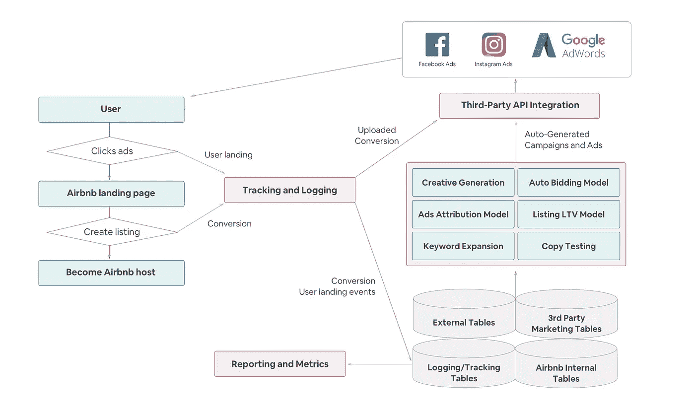
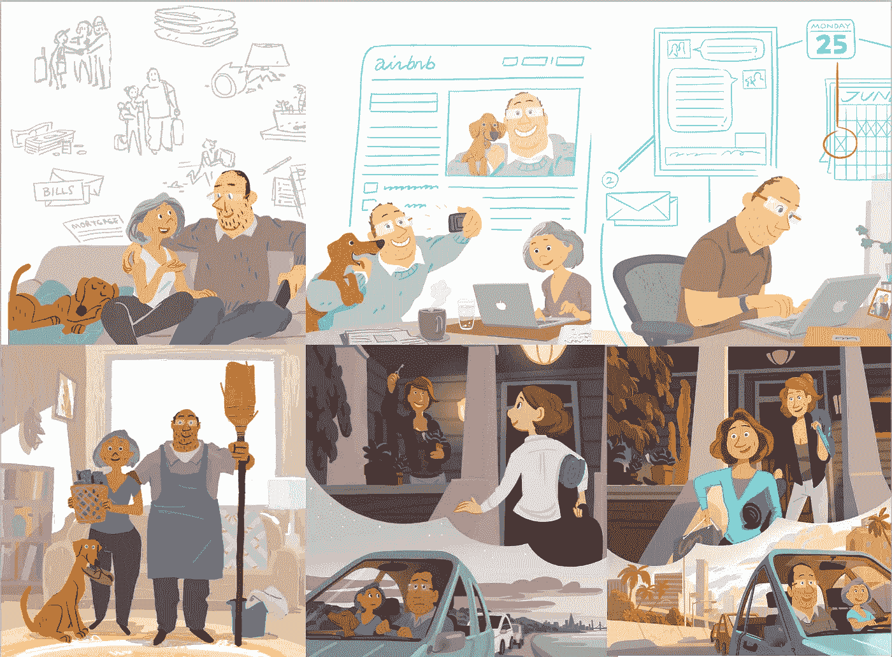
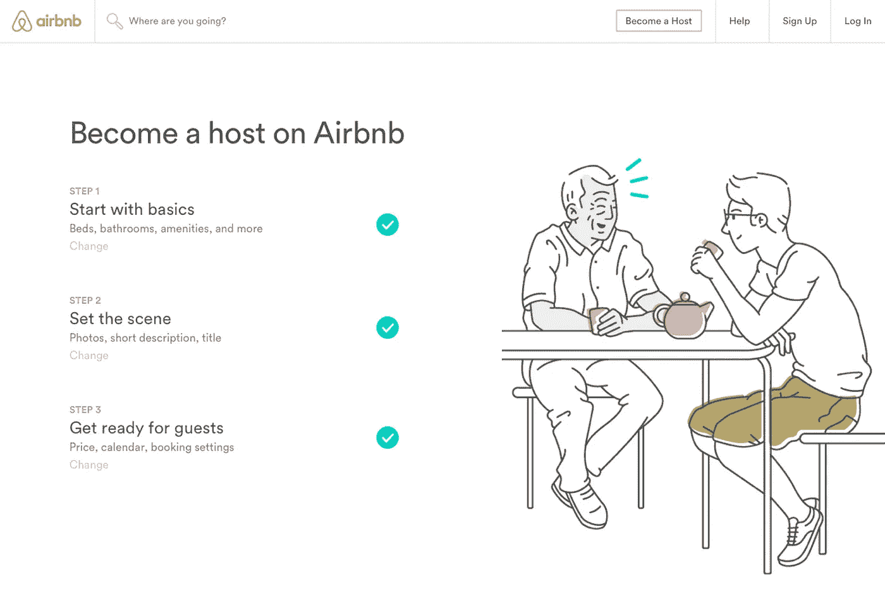
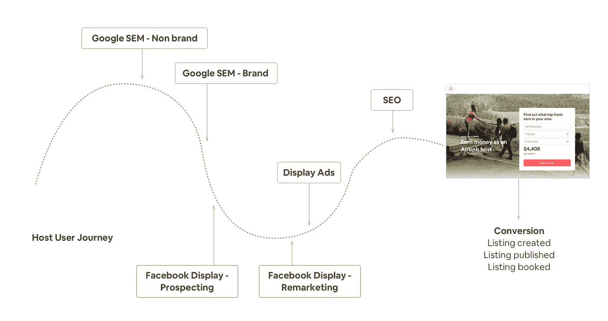
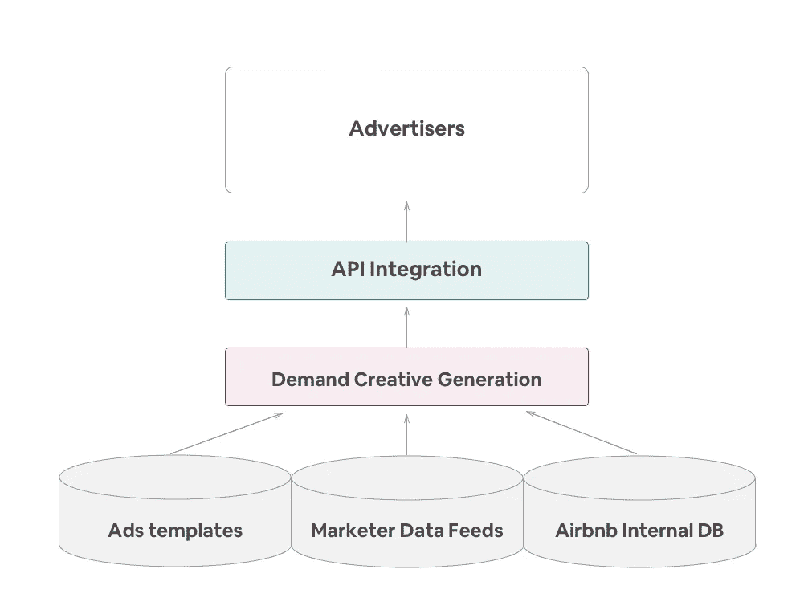
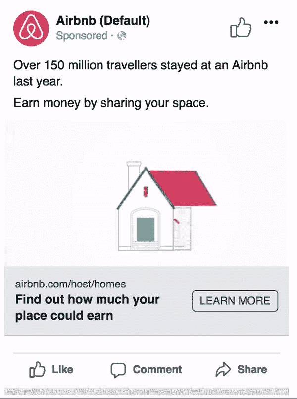

# 通过在线营销扩大我们的主机社区

> 原文：<https://medium.com/airbnb-engineering/growing-our-host-community-with-online-marketing-9b2302299324?source=collection_archive---------3----------------------->

## 我们应该买哪些广告？每个广告我们应该付多少钱？我们应该如何衡量每个广告的表现？我们建立了一个营销系统来帮助回答这些问题。

*由***【王也】和*组成*

**

*归属感是 Airbnb 的核心使命。让人们觉得他们可以“属于任何地方”的一个重要步骤是让世界各地的人们都有自己的家。Airbnb 是一个社区驱动的超级品牌，通过社区的口碑获得主机一直是增长的重要渠道。然而，随着我们的业务不断增长，我们需要找到新的方法来获得主机和房屋，并找到真正帮助人们“属于任何地方”的方法——这不仅意味着在旧金山、伦敦和巴黎等大城市，也包括在玻利维亚和尼泊尔等人口较少的国家，在那里可能只有很少人听说过 Airbnb。*

*[**在线广告**](https://en.wikipedia.org/wiki/Online_advertising) 是接触潜在新主机并提高 Airbnb 知名度的最有效方式之一。包括[邮件营销](https://en.wikipedia.org/wiki/Email_marketing)、[搜索引擎营销](https://en.wikipedia.org/wiki/Search_engine_marketing) (SEM)、[社交媒体营销](https://en.wikipedia.org/wiki/Social_media_marketing)、[展示广告](https://en.wikipedia.org/wiki/Display_advertising)。经过广泛的研究，我们开发了一个内部在线广告系统来扩大我们的主机基础，通过在线广告系统获得的主机数量呈指数级增长。在系统开发期间，我们发现有大量关于谷歌和脸书等广告平台如何利用广告赚钱的信息，但关于 Airbnb 等大型市场如何充分利用这些平台的信息非常有限。*

*这篇文章将提供我们构建的营销系统的架构概述，并讨论系统中解决的主要问题。*

# *有什么问题？*

*我们希望通过在线广告获得新的主机，从而在给定的预算下获得最大的回报。这可以分为两个子问题:*

1.  *我们应该买哪些广告？*
2.  *在一个广告平台上展示每个广告，我们应该付多少钱？*

*简而言之，当你去超市的时候，你应该知道你需要买什么，每样东西该付多少钱。*

*我们营销系统的最终目标是自动生成广告，设置和调整出价，分配预算，以达到关键的商业目标和目的。该系统还应支持性能报告和广告实验分析和可视化。*

# *广告的生命*

*概括地说，下面的图表描述了广告的生命周期:*

**

*Life of an ad*

*广告是在在线营销平台上创建的，并在满足特定标准时显示给用户。用户点击广告，登陆 Airbnb 的主机登陆页面。Airbnb 会记录点击登陆事件。打算在 Airbnb 上列出他们的空间的用户将经历新的主机登机体验——列出你的空间(LYS)流程。当一个房源在 Airbnb 上获得第一个预订时，我们估计这个房源能给 Airbnb 带来的[终身价值](https://en.wikipedia.org/wiki/Customer_lifetime_value) (LTV)。然后，我们来看看之前导致这种列表转换的广告点击事件。这种转换将归功于相关的广告，这将分享上市 LTV。*

*在收集了很多次转化的数据后，我们可以推断出每个广告的价值。所有这些信息将用于计算出价和分配每个广告的预算。最后，在在线营销平台(如脸书或谷歌)上设定出价和预算。这就完成了一个广告的生命周期。通过观察生命周期，我们可以清楚地看到营销系统的几个主要组成部分:点击跟踪，归因，LTV 估计和出价和预算优化。*

# *成为主持人*

*我们首先来看看成为 Airbnb 上的新主机的体验，看看为什么专门为主机增长建立一个营销系统是具有挑战性的。*

**

*For years, Airbnb has described the journey to becoming a host or guest in terms of “Storyboards” to help us remember this is a human journey, not just a “user flow.”*

*说服人们在 Airbnb 上列出他们的空间非常具有挑战性，因为这是一项巨大的承诺。起初，主持人可能会从口口相传或在线营销活动中了解 Airbnb。在做了一些可能需要几天或几周的研究后，主持人可以决定在 Airbnb 上创建一个列表。然后他们需要通过 LYS 流程来提供关于他们自己和商品的信息。为了创建一个安全可信的市场，Airbnb 要求主机遵守服务条款，并对美国的主机进行背景调查。*

*LYS 流确保 Airbnb 是安全的，并剔除低意向观众，以提供最有价值的体验。尽管 Airbnb 一直在努力改善创建房源的体验，但新的潜在主机仍然会在整个流程中不断减少。在完成 LYS 并在 Airbnb 上发布房源后，主人需要管理他们的房源，回复潜在客人的询问，并准备接待已确认预订的客人。*

**

*Current list your space (LYS) flow on Airbnb*

*我们可以看到，选择在 Airbnb 上市是一个经过深思熟虑的决定。在构建营销系统时，这至少会带来两个挑战:*

1.  *从最初的广告点击到列表获得预订之间的转换时间非常长，可能需要几天或几周。*
2.  *转换事件很少发生。由于潜在的主机是谨慎的，我们可能只能从每个广告看到一些转换。*

*这两个挑战都让我们的主机营销优化非常困难。*

# *营销系统的架构*

*那么我们该如何着手呢？*

## *数据记录和跟踪*

*从广告图的生命中，获取营销事件的可靠真实来源是系统的核心。它们不仅对投标和预算分配等下游业务至关重要，而且对战略和战术绩效营销决策也至关重要。然而，进行准确的日志记录和跟踪是非常具有挑战性的。前景广阔，需要营销技术、工程和数据科学技能以及领域专业知识。*

*有两个数据源:内部和外部。我们的内部用户登录日志依赖于 [jitney logging](https://www.slideshare.net/alexismidon/jitney-kafka-at-airbnb) ，这是一个基于 kafka 的消息框架，具有标准化的模式。我们建立了数据管道，以获得 Airbnb 上的完整用户旅程。我们通过第三方 API 获取外部数据。为了确保数据完整性，我们创建了数据管道来跨多个数据源交叉验证关键指标中使用的数据。我们已经建立了一个在线 [Datadog](http://www.datadoghq.com/) 实时仪表板和一个离线每日仪表板来跟踪内部和外部数据之间的差距。异常检测算法用于检测由生产代码更改或 API 连接错误引起的任何异常。对于主机增长，数据完整性极其重要，因为主机转换很少发生。主机数据中的任何数据差异都可能对所有下游操作产生重大影响。*

## ***多点触摸归属***

**

*Concept of multi-touch attribution for a hypothetical user journey*

*通过数据验证和跟踪，我们可以准确了解各种广告的点击量。为了计算投资回报率(ROI)和我们希望为每条广告支付的价格，我们首先需要知道每条广告产生了多少次转化。然而，将转化归因于正确的渠道是困难的，我们需要利用多个渠道来接触不同的受众。当用户首先在平台 1 看到一个广告，然后在平台 2 看到并点击了另一个广告，然后在 Airbnb 上创建了一个房源，最后收到一个预订，将所有的信用都给平台 2 是不公平的，这可能会低估平台 1 的广告价值，高估平台 2 的价值。*

*多点接触归因表征了从每次转换到不同渠道的信贷的正确份额。准确的属性有助于制定精确的投标策略和预算分配。过去，我们一直使用基于 SQL 的上次接触归因模型，该模型难以实施和验证。我们从 SQL 转移到基于[用户定义函数](https://en.wikipedia.org/wiki/User-defined_function) (UDF)的方法。UDF 是用 Java 编写的，可以添加单元测试来测试各个属性组件，并确保属性逻辑按照预期的方式工作。为了确保从 SQL 到 UDF 方法的平稳切换，我们构建了一个验证管道，以确保来自 UDF 管道的指标与来自 SQL 逻辑的指标相匹配。然后，我们可以淘汰基于 SQL 的逻辑。然后，可以在 UDF 之上构建更复杂的基于规则或基于模型的属性逻辑。*

## *LTV 模式*

*在将转化归因于不同的广告之后，我们需要知道这些转化的 LTV——每次转化可以给 Airbnb 带来的增量收入。对于主机增长，LTV 是活跃主机给 Airbnb 带来的[净利润](https://en.wikipedia.org/wiki/Net_profit)的预测。Airbnb 上的主机提供了各种各样的空间，从共享房间到私人岛屿。如此多样的房间类型为客人提供了独特的体验，但同时也对 LTV 估算提出了挑战。*

*在 Airbnb，我们开发了一个机器学习模型来预测 LTV 的上市。更多细节可以在这个[帖子](/airbnb-engineering/using-machine-learning-to-predict-value-of-homes-on-airbnb-9272d3d4739d)中找到。然而，主机转换时间非常长，因为在 Airbnb 上市是一项重大承诺。从最初的广告点击到刊登可能需要几天甚至几周的时间。随着我们积累更多的数据，我们可以提高原始 LTV 模型的准确性，并解决转换时间长的挑战。我们将在另一篇文章中讨论这些新发现。*

## *投标和预算优化*

*随着广告跟踪，归属和 LTV 到位，我们准备好优化每个广告的出价。Airbnb 在 191 个国家的 10，000 多个城市都有房源。对于任何给定的城市，Airbnb 可能只有少量的转化。通过几次转化来估算每个广告的价值是非常具有挑战性的。我们开发了一个数学模型来解决这个问题。更多细节可以在即将发布的帖子中找到。通过了解每个广告的价值，我们可以根据我们希望在不同市场获得的投资回报率来设定不同广告的出价和预算。我们与营销人员密切合作，将我们的系统与广告平台(如 Google Adwords UI)相集成。营销人员可以通过用户界面轻松设定效率目标和预算。这是我们正在积极努力的一个领域，包括开发先进的模型和工具来优化活动。最终，我们希望我们的竞价和预算优化能够实时适应细微的流量变化。*

## *广告和活动管理*

*到目前为止，我们已经讨论了广告的生命周期。以系统的方式管理广告和活动也很重要。随着主机活动的扩大，我们推出了动态内容的广告，这需要生成针对每个市场的信息。这不仅需要在大量活动的创意生成方面投入大量时间，而且可能是一个滞后或容易出错的过程。过去，我们已经在 Airbnb 上看到过几次由手动更改导致的事后检查。我们开发了创造性的自动化工具来生成营销人员可以使用的信息。我们希望减少人为错误的机会，并使流程更加高效。*

**

## *关键词扩展*

*营销系统试图解决的另一个主要问题是“我们应该购买哪些广告？”传统上，关键词和广告文案是由营销人员根据商业感觉、经验、直觉或第三方工具(如 Google keyword planner 和 Google trends)生成的。然而，值得注意的是，用户总是在搜索新事物，即使是最好的营销人员也很难预测我们应该对哪些关键词进行竞价。因此，我们正在开发能够:*

1.  *自动发现新关键字*
2.  *使用这些新关键字创建新的活动*
3.  *评估新关键字的质量，并自动删除无效的关键字*

*以上都很有挑战性。一旦它们成熟，我们将报告进展情况。*

## *实验框架*

*能够衡量上述新思想的增量影响是非常重要的。我们可以把我们的增量测试看作是两个桶中的一个:*

1.  ***相对增量**:一个处理变量带来了多少更多的列表控制(例如:投标模型、广告文案、广告创意等的变化。)*
2.  *绝对增量:如果我们不在一个给定的营销渠道上花钱，Airbnb 上的房源数量会相差多少*

*Airbnb 开发了各种工具和渠道来衡量不同营销渠道的相对增量。我们拥有测试环境和分析工具，可以对搜索、展示和移动广告进行 A/B 和多元测试。我们的工具还可以跟踪收入，进行广告文案测试，并根据支出和绩效数据创建统计数据，以帮助指导未来的活动。*

*我们使用特定于营销渠道的实验方法来测量绝对增量，使我们能够测量广告支出的因果影响。这些实验的输出用于校准我们上面的多点触摸归因模型。方法包括利用[幽灵广告](http://www.msi.org/reports/ghost-ads-improving-the-economics-of-measuring-ad-effectiveness/)开展活动，基于地理的实验，以及[纵向测试](https://en.wikipedia.org/wiki/Longitudinal_study)。*

## *报告*

*来自营销系统的信息最终将被跨职能团队的成员消费:营销人员、产品经理、财务、工程师和数据科学家。构建强大且易于理解的仪表板来跟踪不同渠道和活动的绩效非常重要。关键绩效营销和业务决策是通过查看关键绩效指标做出的，如获得的列表和投资回报率。我们通过使用 Airbnb 开源 [Apache 超集](http://airbnb.io/projects/superset/)构建 dashboard，它提供了一个界面来探索和可视化数据集，并创建交互式仪表盘。*

*感谢您与我们一起踏上广告之旅。我们希望你对营销系统有更好的了解。我们的最终目标是建立一个快速、稳健和可扩展的营销系统，促进 Airbnb 的主机增长。Airbnb 彻底改变了人们旅行甚至生活的方式。随着互联网一直在改变日常生活，在线营销让我们有机会将 Airbnb 带给世界各地越来越多的人，让他们属于任何地方。*

**

*在建立营销体系的过程中，我们正在解决许多有趣且具有挑战性的问题。我们正在寻找人才加入团队，使我们的系统更上一层楼。我们想邀请你在未来成为故事的一部分。您可以在这里 *查看相关岗位* [*。所有第三方商标是其各自所有者的专有财产。*](https://www.airbnb.com/careers/departments/position/13890)*

*我们要感谢 Fatima Husain、Trunal Bhanse、Machiel Schepers、Dmitry Stavitsky、、、Brian Bensch、Judith Henrichsmann、Lenny Rachitsky、George Roumeliotis 和 Ganesh Venkataraman 对本文的评论，感谢 Adam Neary、Tim Rathschmidt、Steve Flanders、Christy Susman 和 Angela Zhu 对设计的帮助。*