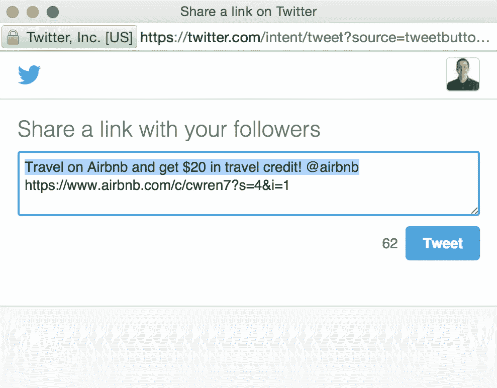

# 规模化增长:获得产品+共享契合度

> 原文：<https://medium.com/airbnb-engineering/growth-at-scale-getting-to-product-sharing-fit-ccb4b501ecf?source=collection_archive---------3----------------------->

## 2015 年优化 Airbnb 的社交分享

由克里斯·雷恩

旅行者喜欢谈论 Airbnb。

这种对话有些发生在 Airbnb 的权限之外(比如面对面的对话或 Airbnb 房源的[快照](https://support.snapchat.com/ca/snaps)，但其他时候发生在 airbnb.com 的、iOS 的[或 Android 的](http://r.airbnb.com/l.c.hskR)或链接到 Airbnb 的网站上。在后一种情况下，我们(Airbnb)有机会影响对话的进行方式。

在这篇文章中，我将分享增长团队在 2015 年推出的一些功能和优化，以帮助旅行者谈论 Airbnb。

**通过 Twitter 推荐 Airbnb**

我在 Airbnb 发布的第一个代码是为推荐页面添加一个 [Twitter 卡](https://dev.twitter.com/cards/overview)。作为一个推特迷，我知道分享由推特卡支持的链接是多么好的事情，这样可以给浏览者更多的背景信息(希望可以增加点击率)。这是目前在 Twitter 上分享 Airbnb 推荐代码的体验(通过[https://www.airbnb.com/invite](https://www.airbnb.com/invite)):

The highlight text gives the Twitter user a default tweet which they can modify. I like how ours has the dollar amount and a short message.

This Twitter Card shows a title, image, and description for the shared link.

通过添加上面的 Twitter 卡，我们向观众保证了推荐链接的真实性，并在推文中加入了用户定制消息中可能遗漏的细节。

**通过电子邮件和脸书发布 Airbnb 房源**

The first iteration of our new listing share widget. See the current version here: [https://www.airbnb.com/rooms/5781222](https://www.airbnb.com/rooms/5781222)

今年早些时候，我们观察了人们分享 Airbnb 房源的方式，发现大多数旅行者更喜欢通过电子邮件和脸书分享房源。因此，我们进行了一些实验，最终改变了我们的共享小工具，将重点放在电子邮件和脸书上，并将其他所有内容放在“更多”下拉列表中。这推动了分享的显著增长，因为我们塑造了我们的产品，以匹配人们的预期对话格式。

**Airbnb 通过 Facebook Messenger**

This US version of the desktop sharing module for Airbnb listings.

我个人最喜欢我们在 2015 年做的一个改变是在脸书时间线分享前添加 Facebook Messenger 作为优先分享选项。我们的实验结果引导我们进一步调整我们的分享，以符合私人旅行协作的心态，而不是对所有朋友和追随者的大规模分享。

**Airbnb 房源照片**

2015 年引入的一种全新的分享类型是分享个人房源照片的功能。我们的工作基于一种直觉，即人们可能希望分享不同的照片，而不仅仅是第一张由主办方挑选的照片。在进行了一次成功的实验后，我们让每张照片都可以通过我们所有的渠道分享，所以现在你可以通过电子邮件、信息、pin，甚至是嵌入任何列表照片！

**2016 年分享 Airbnb**

在成长团队中，我们总是在想新的方法来帮助人们分享 Airbnb 的体验。每次我们成功地向社交分享添加更多元数据，调整用户界面，或者制作令人愉快的上下文文案，我们都会增强关于 Airbnb 的数字对话。敬请期待来年更多的特性和更新！

## 在 [airbnb.io](http://airbnb.io) 查看我们所有的开源项目，并在 Twitter 上关注我们:[@ Airbnb eng](https://twitter.com/AirbnbEng)+[@ Airbnb data](https://twitter.com/AirbnbData)