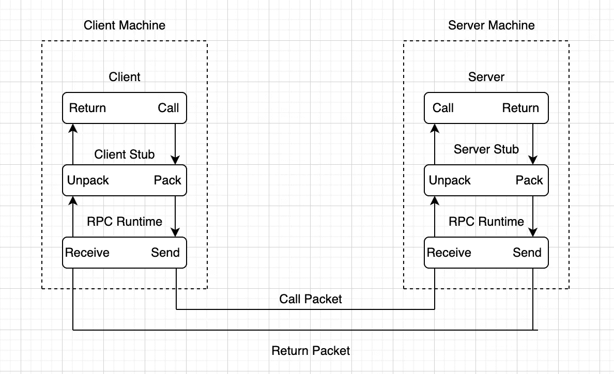

# gRPC 简化版

> 原文：<https://medium.com/globant/grpc-simplified-d3edbec6c56d?source=collection_archive---------1----------------------->

了解如何用 Java 创建基本的 gRPC 客户机和服务器


Photo by [Mathew Schwartz](https://unsplash.com/@cadop?utm_source=medium&utm_medium=referral) on [Unsplash](https://unsplash.com?utm_source=medium&utm_medium=referral)

你一定在想，这个 gRPC 到底是什么？为什么当我们有其他交流方式的时候，这种情况还会存在？这种新技术会有什么帮助呢？嗯，没有什么是“完全符合所有需求”的。我们对一个问题有多种解决方案，但是我们应该知道每种解决方案的利弊，然后从中做出选择。就像在数据传输速度问题上，我们可以选择 gRPC 而不是 REST。

gRPC 是 Google 开发的一种消息传递技术。gRPC 中的“g”不代表“Google”；每个版本都不一样。比如 gRPC `1.12`中的“g”**代表“光荣”，gRPC `1.1`中代表“良好”。**

**gRPC 是一个现代的开源、高性能远程过程调用(RPC)框架，可以在任何环境中运行。它也适用于分布式计算的最后一英里，将设备、移动应用程序和浏览器连接到后端服务。**

**所以，gRPC 没有提供创建 web APIs 的指南；它执行规则。在大多数情况下，gRPC 更快、更健壮，因为它定义了每个请求和响应应该遵守的一组特定的规则。**

# **请求流**

**让我们看看 gRPC 的请求流:**

****

**RPC Mechanism. The client and server are internal services, and the client cannot be a browser.**

1.  **客户端首先打包请求，并将所有必要的数据发送到客户端存根，然后由客户端存根将数据整理并发送到服务器。**
2.  **RPC 运行时包含负责在客户端和服务器存根*之间传输 RPC 数据包的运行时例程。***
3.  **服务器端存根从客户端接收请求，并对请求进行解包(解组)。服务器存根创建并整理响应，然后将其发送给客户端。**
4.  **这个响应是在客户端接收的。客户端存根开始解组(解包)响应。**

**gRPC 的基本构件是`[protobuf](https://developers.google.com/protocol-buffers)`。谷歌的`protobuf`或`proto`只是一种序列化结构化数据的机制。让我们看一个消息发送服务的例子`proto`。**

```
syntax = "proto3";
option java_multiple_files = true;

message MessageRequest {
  string recipient = 1;
  string message = 2;
}

message MessageResponse {
  string response = 1;
}
service MessageService {
  rpc send(MessageRequest) returns (MessageResponse);
}
```

**在上面的代码片段中，我们有一个服务和多个消息块，它们在编译后分别被转换为类和模型。原型编译有多种方式:**

*   **使用`protoc`命令:**

```
protoc -I -java_out=${OUTPUT_DIR} path/to/proto/file
```

*   **使用`[*maven-plugin*](https://mvnrepository.com/artifact/io.grpc/protoc-gen-grpc-java)`并将其添加到 Maven 的编译生命周期阶段进行自动生成。让我们看一个使用消息`proto`的 gRPC 客户机和服务器的例子。**

```
import io.grpc.ManagedChannel;
import io.grpc.ManagedChannelBuilder;

public class Client {
  public static void main(String[] args) throws InterruptedException {
    ManagedChannel channel = ManagedChannelBuilder
      .forAddress("localhost", 8080)
      .usePlaintext()
      .build();

    MessageServiceGrpc.MessageServiceBlockingStub stub = 
      MessageServiceGrpc.newBlockingStub(channel);

    org.example.grpc.MessageResponse messageResponse = stub
      .send(org.example.grpc.MessageRequest.newBuilder()
        .setMessage("Welcome back!!")
        .setRecipient("Daniel")
        .build());

    System.out.println("Response received from server:\n" +
      messageResponse);

    channel.shutdown();
  }
}
```

**在上面的代码片段中，客户端负责创建一个与服务器通信的纯文本通道。`Messaging service stub`被分配给已创建的通道，用于在其上调用`*messageService.send()*`。**

```
import io.grpc.ServerBuilder;

import java.io.IOException;

public class Server {
  public static void main(String[] args) throws IOException,
    InterruptedException {
      Server server = ServerBuilder.forPort(8080)
        .addService(new MessageServiceImpl()).build();

      System.out.println("Starting server...");
      server.start();
      System.out.println("Server started!");
      server.awaitTermination();
    }
}
```

**在上面的代码中，我们使用`ServerBuilder`创建了一个服务器，并通过在其上调用`addService()`附加了一个消息服务。我们在这个服务器上调用 start 方法，并等待传入的客户端连接。**

```
import io.grpc.stub.StreamObserver;

public class MessageServiceImpl extends MessageServiceImplBase{

    @Override
    public void send(org.example.grpc.MessageRequest request, 
StreamObserver<org.example.grpc.MessageResponse> responseObserver) {
        System.out.println("Request received from client:\n" + request);

        String greeting = new StringBuilder().append("Hello, ")
                .append(request.getRecipient())
                .append(" ")
                .append(request.getMessage())
                .toString();

        org.example.grpc.MessageResponse response = 
                 org.example.grpc.MessageResponse.newBuilder()
                .setResponse(greeting)
                .build();

        responseObserver.onNext(response);
        responseObserver.onCompleted();
    }
}
```

**`MessageServiceImpl`类扩展了`MessageServiceImplBase`，是在`proto`文件编译后自动生成的。我们需要实现`*send()*`方法，该方法将读取请求并创建发送给客户端的响应。**

# **优势**

**以下是 gRPC 的一些优势:**

*   **gRPC 使用`protobuff`和 http2，以二进制传输**数据，支持**双工流**。****
*   **`protoc`帮助**自动生成**客户代码。**
*   **gRPC 库受到持续监控，以确保速度可靠性。**
*   **我们可以通过托管通道拥有一个**连接池**。**
*   **gRPC 库有一个用于**负载平衡的内置库。****
*   ****语言无关，**Java 客户端可以无缝连接到 Python 服务器。**

# **限制**

**尽管 gRPC 具有优势，但它也有一些限制:**

*   **没有浏览器支持，所以它只能在内部 API 中使用。**
*   **[新版中对](https://blog.postman.com/postman-now-supports-grpc/)的邮差支持非常有限，但是其他客户端像 [BloomRpc](https://github.com/bloomrpc/bloomrpc) 和 [Kreya](https://kreya.app/) 都有很好的支持。**

# **案例使用**

**以下是 gRPC 的一些使用案例:**

*   **对于内部微服务。**
*   **适用于需要传输大量数据的服务。**

# **结论**

**最后，对于负载较重的服务器，gRPC APIs 的性能要好得多，接收数据的速度快 7 倍，发送数据的速度快 10 倍。这个结论是对应用程序的内部服务进行测试的结果。但是如果服务器只为少数请求服务，REST 就足够了。**

# **参考**

**这些参考资料会有所帮助:**

*   **gRPC 的基础知识在[链接](https://grpc.io/docs/languages/java/basics/)中解释。**
*   **gRPC 与 java [库](https://github.com/grpc/grpc-java)。**
*   **gRPC 客户端和服务器[示例](https://github.com/eugenp/tutorials/tree/master/grpc)。**