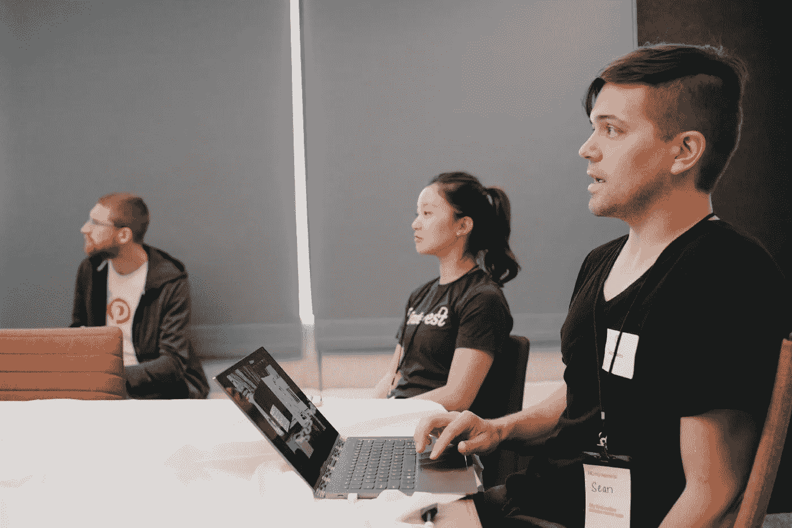
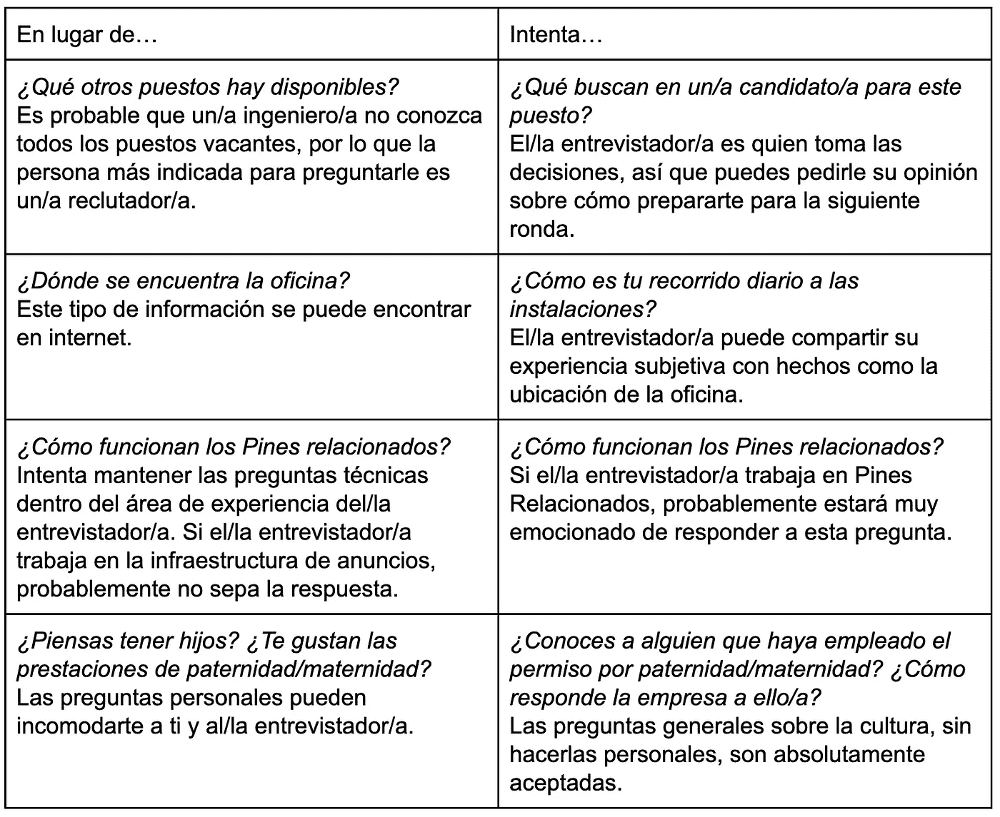

# Pinterest 工程团队技术面试指南

> 原文：<https://medium.com/pinterest-engineering/gu%C3%ADa-del-equipo-de-ingenier%C3%ADa-de-pinterest-para-entrevistas-t%C3%A9cnicas-6410abe40d4f?source=collection_archive---------3----------------------->

Shayda Rahgozar | 招募 Nishant Roy | 软件工程师 Indy Prentice | 软件工程

*这篇文章最初发表于 英语.Read the English version* [*here*](/pinterest-engineering/a-pinterest-engineering-guide-to-technical-interviews-1c2471c2d139) *(T7 )*

技术面试是获得工程团队职位的关键组成部分。从准备到提出正确的问题,所有这些都是面试成功的关键。在本文中,Pinterest 的招聘和工程团队分享了从头到尾成功面试的技巧和技巧。

# 如何为面试做准备

Shayda Rahgozar, 招募

**练习:**在面试中,这不应该是你第一次倾听并思考他们会问的问题。面试前的练习,从可能的问题到概念。它涵盖了计算机基础知识,软件工程的一般知识和大规模系统设计。虽然公司不断更新他们的面试问题集,但你可以使用 [Leetcode](https://leetcode.com/)和 [Interviewing.io](https://interviewing.io/)等网站来寻找优秀的实践问题。不要忘记查看 Pinterest 的开源项目,如 [GitHub](https://github.com/pinterest/) 和 [opensource.pinterest.com](https://opensource.pinterest.com/) 以及我们的技术堆栈 [stackshare.io](https://stackshare.io/pinterest/pinterest) 。

在 Pinterest 上,你通常可以在面试时使用你喜欢的语言进行编程,但要灵活,因为面试官可能会要求你根据团队和职位使用特定的语言。当你完成练习题时,使用这个对你有利,并花时间熟悉语言的细节。

**研究:**表现出对公司的兴趣和热情。如果您还不是该产品的常规用户,请花一些时间了解您可能正在研究的内容。在面试中分享产品的弱点或需要改进的地方,以及你如何参与推动公司的成功。

访问公司自己的渠道,了解最新趋势、发布和技术。例如,请参阅 [我们的](https://medium.com/pinterest-engineering/medium-com-pinterest-engineering-espanol/home) 博客的其余部分,以及 [最新消息](https://newsroom.pinterest.com/es/company) 和我们的 [PinLabs](https://www.pinterestlabs.com/) 计划,以了解有关 Pinterest 工程团队的更多信息。

这是你的机会,不仅要展示你的解决问题和编程技巧,还要向面试官证明你是他们想合作的人。

# 解决问题的战略

Nishant Roy,工程师(T7)

**沟通:**技术面试最重要的一个方面是你与面试官沟通的能力。请记住,所有通信必须是英文。不要急于直接写代码。相反,花几分钟时间思考这个问题,并大声分享你的想法。如果问题需要数据结构或系统设计,面试官可能会在你开始之前等待高级别的讨论。提出澄清性问题也是一个好主意,以确保你对问题的理解与面试官一致。例如,如果您回顾了几个测试用例或绘制了一些图形来说明问题,它将帮助您准确理解对您的期望,并突出您沟通和计划工作的能力。

**注重细节:**这项技能对程序员来说是必不可少的,因此面试官会在编程阶段对其进行评估。面试官通常不会提前向您提供问题的所有细节,例如限制,时间或空间是否更重要,输入格式或有效性,系统规模等。一旦你确信自己理解了问题,就把细节写下来,让面试官知道你正在考虑做一些准备好生产的调整。它还将帮助您更好地理解问题并找到更强有力的解决方案。

**解决方案优化:**一旦你确信自己理解了问题,在编写代码之前,先讨论解决方案的细节。从一个低效的解决方案开始,大声思考,这样面试官就可以跟随你的思维过程。它解释了为什么设计不合适,考虑到空间和时间的复杂性,并尝试识别任何瓶颈。此外,考虑考虑到问题的局限性,有多少空间可以进行优化。通过这种方式,你可以向面试官证明你有能力为问题提供一个天真的解决方案,找出它的弱点,并找到改进的方法。

有几种方法可以识别优化:

*   尝试简化问题,看看如何优化基本版本,并将其应用于所讨论的问题。检查你的设计,看看是否有重复和多余的工作,并考虑如何尽量减少它。
*   想想哪种类型的数据结构最适合这个问题,并尝试将它们集成到你的解决方案中。例如,地图针对搜索进行了优化,堆针对排序进行了优化,等等。

再次,沟通是关键。试着大声思考并提出澄清或指导问题,这样面试官更容易理解你的解决方案,甚至帮助你。一旦你和面试官同意你设计的解决方案,是时候开始编写代码了。

**时间管理:**技术面试面临的最大挑战之一是时间管理。虽然专注于设计完美的解决方案总是一件好事,但请确保您不会在没有时间实施的情况下结束。检查并使用至少一半的面试来编写和调试代码。通常情况下,最好是实施一个幼稚的解决方案,并在剩余时间内继续进行优化,而不是在实施最佳解决方案时浪费时间。

**代码质量:**编写好的、干净的代码总是会让你获得面试官的认可,不管你是在计算机上写代码。良好的编程实践包括:

*   在函数中抽象可重用的代码段
*   编写有意义的变量和函数名称
*   添加输入和 null 检查

这将有助于识别代码中的潜在错误,并帮助面试官理解你的工作。

**假设:**假设是完全可以接受的,只要你解释它们。期望你记住语言的所有细节,或者在有限的时间内实现所有常见的数据结构或算法是不合理的。除非组件的实现对于解决问题至关重要,否则面试官通常会允许甚至希望你不包括一些细节。但是,重要的是你要清楚地表达和解释你的假设。例如,与其实现一个帮助函数,你可以简单地设计方法签名,解释如何以及为什么要使用它,然后继续。

测试你的代码是软件开发中最重要的部分之一。专注于最佳实践和正确的无错误解决方案,而不是解决问题的速度。

*   花点时间逐行重读你的代码,寻找任何明显的错误。
*   考虑一些基本的测试用例,并逐行检查您的代码。
*   注意每一行发生了什么。
*   记下关键变量的值。
*   确保你得到你期望的答案。

最后,改变你的角色,打破你的解决方案,专注于:

*   非凡的案例
*   意外的输入格式和类型。
*   错误或异常处理、系统可靠性等。

你不需要为所有这些问题提供解决方案,但这将向面试官表明你正在考虑你的代码的局限性以及如何改进它。

在技术面试中,不仅仅是编写解决方案。面试官寻找的另一个关键因素是,在一个团队中与你合作会是什么样子。有时,需要帮助但在设计和开发过程中表现出许多优势的候选人比自己快速找到正确解决方案但不计划工作或测试其实施的候选人更有价值。

你的解决问题和编码技巧是你的技术面试通行证。然而,编程并不是给人留下好印象的唯一方法。从你的演讲到你提出的问题,都可以帮助你充分利用面试。

Photo by [ThisIsEngineering](https://www.pexels.com/@thisisengineering?utm_content=attributionCopyText&utm_medium=referral&utm_source=pexels)

# 如何提出正确的问题

Indy Prentice, 工程师(T5)

除了技术问题,大多数面试官都会在最后留出时间来提问。虽然这是另一个给人留下好印象的机会,但最重要的是获得问题的答案。

即使你认为你的问题在面试中得到了回答,也要利用你的研究来准备其他问题,以证明你对公司的价值观和兴趣。这不仅表明面试官认真对待这个机会,并且有兴趣了解更多信息,还可以让你评估公司是否适合你。在面试之前,花点时间想想对你来说重要的事情,比如团队的多样性、工作与生活的平衡、产生影响的机会、参与开源社区或与设计师合作。这是您评估与您交谈的公司是否适合您正在寻找的公司的机会。

除了以价值观为导向的问题之外,您还可以向任何面试官提出许多一般性问题,以获取有关公司的更多信息,并围绕该主题展开对话。这些问题可能侧重于你的研究或面试官的角色。

一些提问的例子:

*   对你来说,典型的一天是什么样的?
*   你最喜欢和最不喜欢你的工作是什么?
*   你为什么选择加入公司,是什么因素让你留下来?

为了充分利用你的时间和面试官的时间,确保你提出的问题最适合这个人。问题应与工程师的经验或专业领域有关,适合与您不认识的人讨论。

例如:

在面试结束时,你可能会有更多的问题要问面试官。除非他们提供您的联系信息以便您跟进,否则最好不要通过询问来打扰他们。一个好的选择是去找招聘人员,找出最好的跟进方法。

虽然你的技术表现有助于确定你的候选资格,但在面试中,你会寻找超出这些技能的员工。在 Pinterest,我们追求的不仅仅是勤奋的工程师。我们的团队由对产品、技术挑战和价值观充满热情的人组成。最终,我们正在寻找那些留在 Pinterest 并感到快乐的人。那些有任何理由想要来到这里的人,无论是因为产品还是技术挑战,都是最令人兴奋的。

利用你作为候选人的时间,找到适合你的公司。充分利用面试的非技术方面可以确保你和公司相处融洽。

有关 Pinterest 面试的更多提示,请参阅文章“ [如何在 Pinterest 上进行工程面试](/pinterest-engineering/cómo-es-el-proceso-de-entrevistas-de-ingeniería-en-pinterest-5cb4edc65dc) ”。

*有关 Pinterest 工程的更多信息,请访问我们的*[*工程博客*](https://medium.com/pinterest-engineering)*,并访问*[*Pinterest Labs*](https://www.pinterestlabs.com?utm_source=medium&utm_medium=blog-article-link&utm_campaign=rahgozar-et-al-january-26-2022&utm_content=spanish-technical-interview-guide) *。要查看可用的机会并申请,请访问我们的*[*就业*](https://www.pinterestcareers.com?utm_source=medium&utm_medium=blog-article-link&utm_campaign=rahgozar-et-al-january-26-2022&utm_content=spanish-technical-interview-guide)*页面。(T19)*