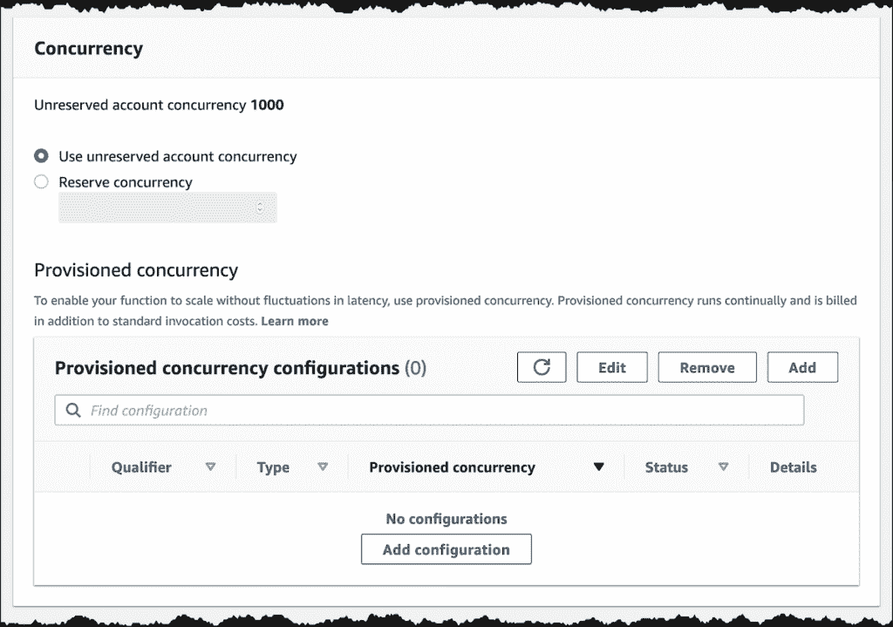

# AWS 事件驱动的无服务器架构的护栏

> 原文：<https://medium.com/capital-one-tech/guardrails-for-aws-event-driven-serverless-architectures-f9bc12ad689f?source=collection_archive---------1----------------------->

## **9 种高效处理的最佳实践&通过 AWS SNS、SQS、EventBridge、& Lambdas** 实现成本优化

事件驱动架构是一种强大的架构风格，它促进了系统之间的解耦、更好的故障隔离、独立伸缩以及独立开发和发布。无服务器体系结构是一种体系结构风格，其优点是不必担心服务器供应或维护，并且具有自动扩展、高容错性和按使用付费。AWS 将这两种架构风格与无服务器计算[λ](https://aws.amazon.com/lambda/)和消息解决方案 *AWS 简单队列服务(* [*SQS*](https://aws.amazon.com/sqs/) *)、AWS 简单通知服务(*[*SNS*](https://aws.amazon.com/sns/?whats-new-cards.sort-by=item.additionalFields.postDateTime&whats-new-cards.sort-order=desc)*)以及 AWS*[*event bridge*](https://aws.amazon.com/eventbridge/)*结合在一起。*

在本文中，我们将探讨工程师在大规模使用事件驱动的无服务器架构时面临的一些挑战，以及如何使用上述 AWS 服务的一些最佳实践来应对这些挑战。让我们直接进入那些最佳实践。

# 1.减轻事件消费者及其依赖关系的压力

在事件驱动的无服务器架构风格中，其中一个防护就是确保消费者能够顺利处理事件，同时保持成本在可控范围内。

## **消费者处理每个事件所需时间的因素**

假设您有一个 Lambda 函数，它是 SNS 主题的订阅者，并且 Lambda 函数需要相当长的时间来处理每个事件。 ***例如:*** *它需要进行一个外部 API 调用，这个调用对请求的响应速度慢得要命。*

在这种情况下，如果您使用 SNS 向 Lambda 广播消息，并且有大量消息，这可能会导致同时运行多个 Lambda 函数。这将降低成本效率，并可能达到最大并发 Lambda 调用的限制。此外，由于这些限制是在帐户级别，这可能会导致同一帐户上的其他应用程序出现容量问题。

这里合适的方法是预先限制流量。您可以使用 SQS 作为 SNS 的目的地，其中 SQS 队列可用于保存消息，直到消费者准备好处理它们，如下图所示。

[SNS distributes events to SQS](https://event-driven-architecture.workshop.aws/4-sns/2-filtering/message-filtering.html)

## 考虑事件消费者的伸缩限制及其依赖性

这与上面的场景略有不同。假设您有一个 Lambda 函数，它将使用来自 SNS 主题的消息，并在一个 [AWS RDS](https://aws.amazon.com/rds/) 数据库上执行一些操作，或者调用一个扩展性不好的 API。如果 SNS 主题有突发消息，即使 Lambda 可以扩展到并发限制集，下游依赖项也可能无法处理它。 ***例如:*** *可能会达到 RDS 最大连接数限制，否则无法很好扩展的下游 API 可能会崩溃。通过 Lambda 重试，它可能会自我修复，或者我们可能会使它变得更糟，从而导致消息发送到 DLQ(也就是说，如果您已经为您的 Lambda 配置了 DLQ)。*

与上面类似，利用 SQS 作为 SNS 的目的地，然后让 Lambda 函数在它准备好的时候使用它。

# 2.使用社交网络消息过滤功能

可以利用这种事件驱动的无服务器最佳实践，在噪音到达事件消费者之前预先过滤噪音，从而节省成本。

当订阅 SNS 主题时，消费者可以在他们的订阅[过滤策略](https://docs.aws.amazon.com/sns/latest/dg/sns-subscription-filter-policies.html)中指定额外的过滤标准，即“仅向我发送符合特定标准的消息”过滤策略是一个包含过滤条件的 JSON 对象。发布到 SNS 主题的消息由一个消息属性元素组成，该元素可以托管关于消息的附加元数据。发布者可以填充该元素，SNS 负责根据订阅过滤策略过滤消息，只将符合正确标准的消息发送给消费者。这样，消费者就不需要被每一条信息所困扰，从而节省了成本和处理过程。

例如，在上图中，消息被发布到 Orders SNS 主题，订阅该主题的每个 SQS 队列都列出了一个过滤策略。SNS 使用这个过滤策略来过滤匹配的消息，并将其路由到各自的 SQS 队列。 ***注:*** *这在上图中用不同的颜色编码表示。红色消息被发送到订单队列，绿色消息被发送到订单-EU 队列。*

以下是过滤策略的一个示例:

[Filter Policy](https://event-driven-architecture.workshop.aws/4-sns/3-advanced-filtering/adv-message-filtering.html)

仅在符合逻辑的情况下使用过滤策略，即订户对相似类型的事件感兴趣，并且对该主题具有相似的访问权限要求。不要用它把不相关的事件推到一个单一的话题上，那样会使事情复杂化。

# 3.考虑限制消耗事件的 Lambda 函数

这种技术符合成本优化和保护事件消费者的最佳实践，在有多个无服务器组件的企业环境中非常有用，这些组件可能由同一个 AWS 帐户下的不同团队拥有。

Lambda 并发限制是在帐户级别，这意味着它由该 AWS 帐户下的所有 Lambda 函数共享。但是，您也可以预先配置一个函数级并发限制，称为*。它可以确保其他功能不会占用您的预留配额。当您的函数订阅处理突发消息时，它还可以抑制 Lambda 函数调用。请记住，您的函数的并发调用不会超过这个设置，即使在未提供服务的并发中有空间。*

*这有助于减少下游依赖项(如数据库或其他 API)的负载，并有助于控制成本。超出指定限制的对函数的额外请求将因节流错误而失败。关于不同类型错误的重试，请参考下面的第 9 点。*

**

*[Reserved Concurrency](https://aws.amazon.com/blogs/aws/new-provisioned-concurrency-for-lambda-functions/)*

# *4.考虑使用 SQS 的长轮询功能*

*有了 SQS，消费者可以使用[短轮询或长轮询](https://docs.aws.amazon.com/AWSSimpleQueueService/latest/SQSDeveloperGuide/sqs-short-and-long-polling.html)从队列中接收消息。当消费者使用短轮询时，SQS 立即从分发消息的服务器子集返回消息。这可能导致空响应或消息的子集没有返回给消费者。消费者被迫进行更多的扫描，以获取 SQS 上的完整信息。在下面的示例中，来自服务器的 SQS 消息 A、C、D 和 B 显示为灰色，并且没有返回消息 e*

**

*[Short Polling SQS](https://docs.aws.amazon.com/AWSSimpleQueueService/latest/SQSDeveloperGuide/sqs-short-and-long-polling.html)*

*AWS 定价随着队列中轮询的数量而增加。长轮询是一种在更长时间内(最长 20 秒)保持与队列连接的机制，当消息到达时，立即开始处理。这可以降低您的成本，因为它将减少轮询次数，从而减少空读取并从所有服务器获得完整的消息集。您可以对每个队列进行配置，它被称为*接收消息等待时间。**

**

*在 AWS Lambda 使用 SQS 触发器的情况下，Lambda 轮询队列(使用长轮询)并与包含消息的事件同步调用函数。*

# *5.考虑将批量大小与λ和 SQS 一起使用*

*假设你有 SQS 作为 Lambda 的事件源——也就是说，你为你的 Lambda 函数配置了一个 SQS 触发器。在这种情况下，Lambda 从 SQS 队列中读取消息，并同步调用您的函数。*

*如果你的 Lambda 函数代码做了一些普通的初始化工作——比如为它处理的每条消息丰富数据，或者它没有下游依赖的缓慢处理问题，等等。—一次批量提取消息可能更好。这有助于节省一些处理时间和成本。当您将 SQS 触发器设置为 Lambda 的事件源时，可以配置 batchSize(最多 10 个)。您的函数超时应该考虑处理所有消息所花费的时间。*

*当您的函数成功处理一个批处理时，Lambda 会从队列中删除那些消息。但是，这里要注意错误处理。如果您在批处理中提取的消息之一无法处理，SQS 队列中的整批消息将对其他使用者可见。在这里，您可以选择再次重新处理同一个批处理，或者在代码中安全地处理该异常，并将成功返回给从 SQS 拉取的 Lambda 服务(然后，您可以利用 DLQs，在那里显式地发送失败的消息，或者在您的函数代码中自己负责显式地删除消息)。*

*此外，对 SQS FIFO 队列使用[批处理](https://docs.aws.amazon.com/lambda/latest/dg/with-sqs.html)操作会比不使用批处理提供更多的[吞吐量](https://docs.aws.amazon.com/AWSSimpleQueueService/latest/SQSDeveloperGuide/FIFO-queues.html)，因此每秒可以读取更多的消息。*

# *6.在 SQS 设置正确的能见度超时*

*SQS 队列的可见性超时定义了一个时间段，在该时间段内，消息一旦被一个使用者获取，就保持对其他使用者隐藏。在可见性超时过期之前，获取该消息的使用者需要将其从队列中显式删除，这样其他使用者就看不到它了。*

*定义一个可见性超时(如上图所示),该超时比应用程序处理队列中的消息所需的最大处理时间稍长。与您的应用程序处理时间相比，将这个*设置得太低*会导致其他消费者再次收到相同的消息，即使您的应用程序成功地处理了该消息。将这个*设置得太高*会导致其他消费者不能及时得到失败的消息。*

# *7.当 Lambdas 是 SQS 的消费者时，设置正确的重试次数*

*当 Lambda 从 SQS 队列中读取一批消息时，整批消息都是隐藏的，直到队列的可见性超时。当消息出现在 SQS 队列中时，Lambda 最初会打开五个并行的长轮询连接来执行读取。如果队列中仍有可用的消息，它将[将读取消息的进程数量增加](https://docs.aws.amazon.com/lambda/latest/dg/with-sqs.html#events-sqs-queueconfig)到每分钟多 60 个实例，最多 1000 个批处理，可以并行处理。*

*所有同步读取批处理的 Lambda 进程都将尝试调用 Lambda 函数。但是，如果 Lambda 函数调用被抑制，会发生什么呢？因此，在可见性超时后，无法处理的消息将变得可用。*

*AWS [建议](https://docs.aws.amazon.com/lambda/latest/dg/with-sqs.html)在队列的重新驱动策略中将 maxReceiveCount 至少设置为 5，这样消息在发送到 DLQ 之前可以重试。此外，AWS 建议将源队列的可见性超时设置为函数超时的至少六倍，以考虑到由于节流、Lambda 冷启动时间等原因导致的重试。*

# *8.了解 Lambda 的错误处理&在哪里附加死信队列来捕获所有错误*

*Lambdas 同步处理 SQS 消息，异步处理 SNS 消息。如果您有一个 SNS 主题的 DLQ，并且 Lambda 是该主题的订阅者，则该 DLQ 将只包含在所有重试之后无法传递到 Lambda 服务的消息(由于权限或服务不可用)。它将不会包含成功传递到 Lambda、被您的函数拾取、但由于一些其他代码或运行时问题而未成功处理的消息。它也不会包含导致 Lambda 函数无法调用的节流错误。*

*Lambda 服务使用其内部队列来处理此类场景的重试。您可以配置重试次数、事件的最长时间以及向 SQS、SNS、EventBridge、Lambda 等发送失败消息的位置。*

*这里看一下 Lambda 的[的异步调用](https://docs.aws.amazon.com/lambda/latest/dg/invocation-async.html)。*

**

*[Lambda Asynchronous: Send failed messages to a new destination](https://docs.aws.amazon.com/lambda/latest/dg/invocation-async.html)*

*了解 Lambda 的不同类型的[错误](https://docs.aws.amazon.com/lambda/latest/dg/invocation-retries.html)。*

# *9.知道何时使用 AWS EventBridge*

*到目前为止，我们一直在谈论使用 SQS 和社交网络的最佳实践。然而，有些情况下它们并不是这项工作的最佳工具。最近，AWS 推出了 [Amazon EventBridge](https://aws.amazon.com/eventbridge/) 作为另一个事件总线，具有区别于 SQS 或 SNS 的独特功能。EventBridge 以前叫 CloudWatch Events，主要是作为 AWS 资源状态变化事件*(例如:EC2 实例终止)*或者预定事件*(例如:使用 cron 表达式触发一个 Lambda)* 的事件总线。*

*与 SNS 相比，AWS EventBridge 支持更多的客户端作为事件源和目的地。它可以将事件传递给其他 AWS 帐户，这在一个组织中是一个非常有用的功能，在这个组织中，每个拥有不同帐户的不同团队可能希望订阅其他帐户中的事件。它提供的一个更棒的功能是，它可以从第三方 SaaS 应用程序接收事件并触发其目的地。 ***示例:*** *您可以配置 EventBridge，将在 PagerDuty 中创建或更新的事件传递给 Lambda 函数，该函数可以创建事件日志。**

*EventBridge 提供了许多更有用的功能，例如使用规则的事件路由，您可以根据事件的内容过滤消息(不像 SNS，您必须依赖 MessageAttributes，但有一些限制)。此外，您可以在将事件发送到目标之前对其进行转换。*

*然而，与 SNS 相比，目前在每个规则的目标数量、允许的吞吐量和延迟方面存在[限制](https://docs.aws.amazon.com/eventbridge/latest/userguide/cloudwatch-limits-eventbridge.html)。这可能会在未来几年发生变化，因为这仍然是一项相当新的 AWS 服务。*

*********

*在这篇文章中，我们介绍了使用 AWS 解决方案 SNS、SQS、EventBridge 和 Lambdas 的事件驱动无服务器架构的最佳实践。我希望这能给你一些在事件驱动的无服务器架构上使用 AWS 解决方案时优化成本、提高处理效率和减少错误的机会。*

**披露声明:2020 资本一。观点是作者个人的观点。除非本帖中另有说明，否则 Capital One 不隶属于所提及的任何公司，也不被这些公司认可。使用或展示的所有商标和其他知识产权是其各自所有者的财产。**