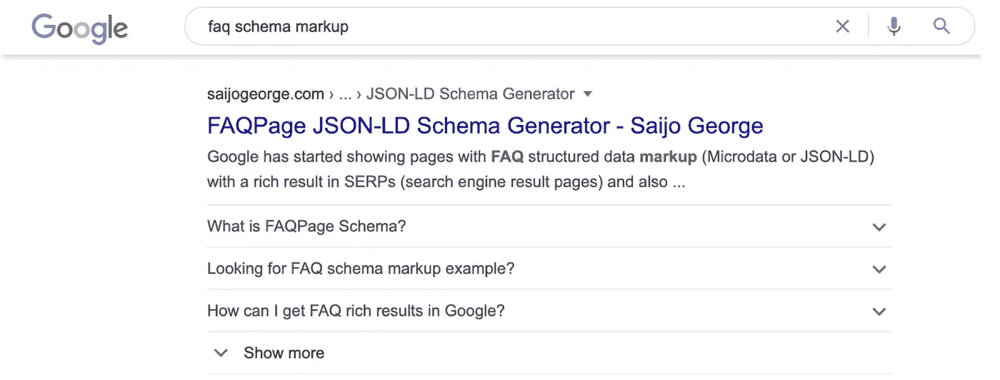
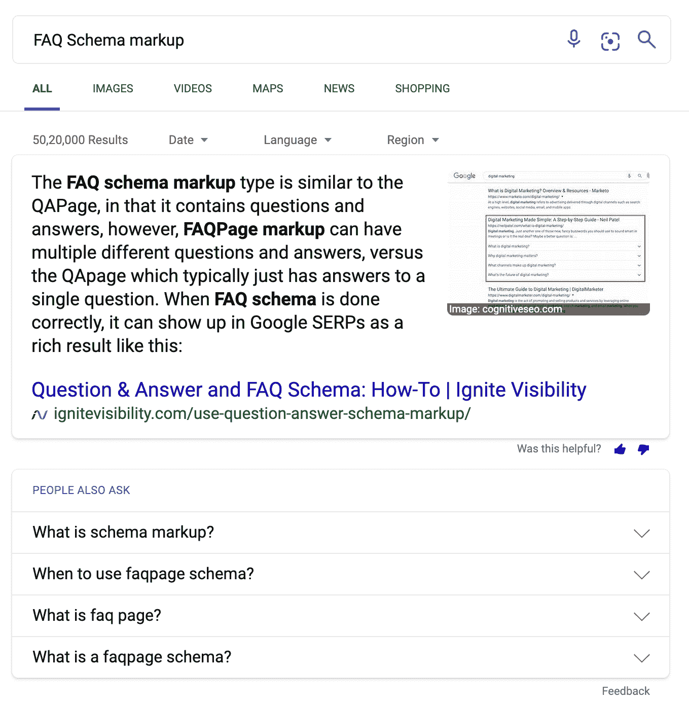
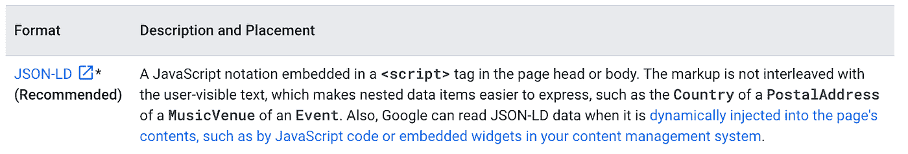

# 使用 FAQ 模式标记提升 SEO 的指南

> 原文：<https://medium.com/globant/guide-to-boost-seo-using-faq-schema-markup-e42e5f359860?source=collection_archive---------1----------------------->

Secrets to Improve Performance with FAQ Rich Snippets

如果你正在寻找一种方法来提高你的搜索引擎优化，常见问题模式标记可以帮助你。

根据 Neil Patel 的说法，只有不到 1%的企业在使用 FAQ 模式标记，这就是为什么你很容易在 Google SERPs 中获得第一页的特色片段。

但这是什么呢？您如何利用它的优势？

嗯，你来对地方了。我们将深入探讨为什么这很重要，以及如何开始…

什么是常见问题模式标记？

FAQ 模式标记是放在网页上的一段代码，用于帮助 Google 和其他搜索引擎为用户获得丰富的结果。

当我们提供一个常见问题页面或任何有关于它的 FAQ 的产品页面时，我们使用它。页面上的这段代码将在 SERP 上启用一个带有问题的可折叠菜单，点击后，您将看到答案。

这里的例子:

谷歌还强调 FAQ 模式标记，因为它可以使你的内容有资格直接在谷歌搜索和助手上显示这些 FAQ。

**FAQ 模式标记对 SEO 有多重要？**

如果您想立即提升自己的能力，并希望作为特色片段出现在 SERPs 上，那么添加 FAQ 模式标记会对您有所帮助。

*   它可以增加页面的整体可见性。
*   可以在常规搜索结果下方获得更多空间作为 FAQ。
*   让你的搜索结果与众不同，反过来会给你更多的点击率。

还能增加你在“人也问板块”的机会。尽管到目前为止 FAQ 模式标记和 People Also 部分之间没有关联，但是如果您为此优化您的内容并增加出现的机会，这并没有什么坏处。

这里的例子:

**我如何实现 FAQ 模式标记？**

有两种方法可以在网站页面上添加 FAQ 模式:

*   JSON-LD
*   微观数据

您需要有一点编码知识来实现网站页面上的 FAQ 模式，就像任何其他模式代码都需要它一样。您可以选择 JSON-LD 或 Microdata，然后始终坚持使用它。不建议在网页上混合两者。

以下是谷歌推荐在 developers.google.com 网站上使用的内容。

**1。JSON- LD:** Google 也推荐使用 JSON- LD 格式。在这两个选项之间更容易，您可以将代码放在页面的 header 部分。

**常见问题页面模式 JSON-LD 示例:**

<title>常见问题模式标记—模式</title>