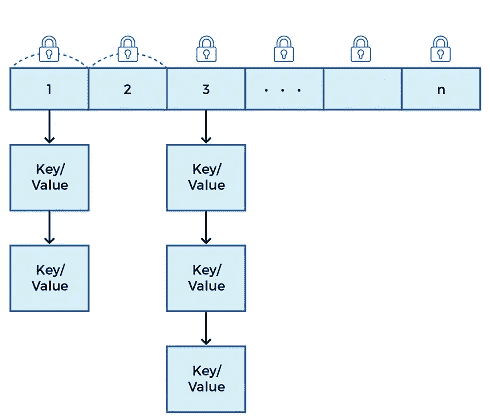

# Java 并发哈希表指南

> 原文：<https://medium.com/double-pointer/guide-to-concurrenthashmap-in-java-9ba810b5182d?source=collection_archive---------0----------------------->

*你可以在这里* *阅读本文用浏览器内代码执行的示例程序* [*。*](https://bit.ly/3qrS2C3)

***别忘了买你的*** [***Java 并发练习***](https://amzn.to/3K3E1WD) ***。请考虑支持我们上*** [***中***](https://bit.ly/3OvimpR) ***。|***[***uda city***](https://bit.ly/3JIpvl4)***|***[***Coursera***](https://imp.i384100.net/zaYBB0)***|***[***plural sight***](https://pluralsight.pxf.io/Ao7GGK)

*如果您正在面试，请查看我们的综合准备课程**[***Java 多线程工程面试***](https://bit.ly/2QfKXCK) ***。****

**