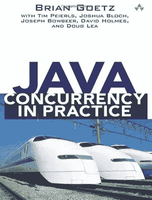

# Java 中的 ThreadLocalRandom 指南

> 原文：<https://medium.com/double-pointer/guide-to-threadlocalrandom-in-java-cdb683f2c024?source=collection_archive---------3----------------------->

*你可以在这里* *阅读本文用浏览器内代码执行的示例程序* [*。*](https://bit.ly/3mBBFlo)

***Don’t forget to buy your copy of*** [***Java Concurrency in Practice***](https://amzn.to/3K3E1WD)***.***

*如果您正在面试，请查看我们的综合准备课程**[***Java 多线程工程面试***](https://bit.ly/2QfKXCK) ***。****

****别忘了买你的*** [***Java 并发练习***](https://amzn.to/3K3E1WD)*

# *概观*