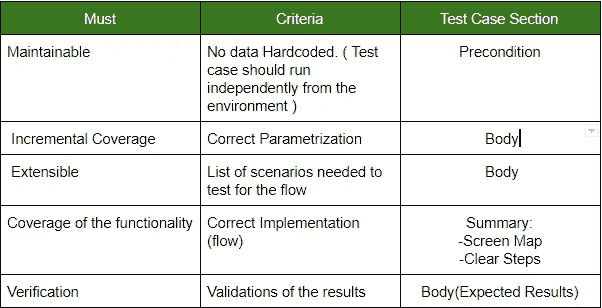
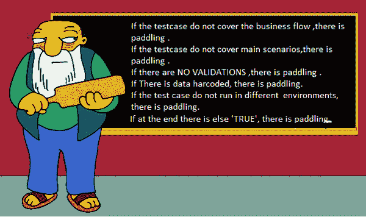

# 基于可维护自动化测试套件的测试策略测试用例改进指南

> 原文：<https://medium.com/globant/guideline-to-improve-test-cases-on-testing-strategies-based-on-maintainable-automated-test-suites-ec4908d52973?source=collection_archive---------1----------------------->

**简介**

该指南的目标是改善自动化团队需要投入的时间，以理解和实现功能测试用例。

这对于自动化过程比功能测试和/或回归晚一个 sprint 执行的测试策略，或者如果 E2E 测试用例在稍后阶段被自动化，是特别重要的。这将允许团队在不浪费时间的情况下完成这一过程，并获得有效的结果。

在这里你可以找到一些技巧，关于如何将基于功能知识的功能测试用例转换成任何需要自动化的人都可以实现的测试用例。

你需要记住的第一件事是，*为什么你作为一个功能测试人员希望你的测试用例在不久的将来自动化？*

这里你有你可以有的主要理由:

*   我厌倦了每次发布都这样。
*   我没有足够的时间去做所有我必须做的事情。
*   这是一件花费我很多时间的事情。
*   我想减少我对这个特定测试项目的参与。

答案很简单:如果有一个好的自动化测试基础可以依赖，那么你就可以继续前进。

**作为一名功能测试人员，我如何信任一个自动化测试用例？**

最好的方法是参与自动化测试创建的每个阶段。从测试本身的定义，需要涵盖的场景，测试的验收标准，最后在测试完成后对脚本进行功能审查。

如何提高测试的质量？

您需要记住，为了考虑一个测试用例是否准备好自动化，它通常应该包含比通常包含在手动回归期间运行它的测试用例更多的信息。

理解需要添加到测试用例中的信息的一个好方法是遵循**完成标准或验收标准**，它们应该应用于特定的自动化项目。不同的项目需要不同的完成标准和不同的信息。

例子:关于一个 done 准则(*必列*)与如何改进测试用例的关系。请记住，每个项目都应该符合与项目固有的特定需求相关的完成标准。

这里有一些与上述标准直接相关的提示

**可维护**

有很多自动化测试用例的例子可以只运行一次，下次你需要重新检查它时，你需要创建一组新的数据以便能够再次执行它。如果数据是硬编码的，手动执行通常比更新脚本更快。因此，功能团队将不再使用这些脚本。

为了避免这种情况，作为一个测试用例的前提条件的一部分，一个好的做法是提供一种方法(例如一个查询)来提供必要的测试数据。

示例:如果测试用例需要以特定的角色运行。不要只设置角色名，还要设置查找该信息的方式。它可以是一个数据库查询，或者是一个用户列表，如果环境不经常变化的话。总是想着尽可能减少维护，这样就不需要有商业知识来开发脚本。

**增量覆盖**

向脚本中添加参数可能是提高测试用例覆盖率的好方法，而不会重复不必要的代码。

示例:该流程与检查用户是活动的还是非活动的相关。假设通常测试是通过随机挑选用户来进行检查的。

如果有与用户年龄或性别相关的信息，则可以将其用作参数，以便在特定的测试套件运行中执行专门针对该数据部分的测试。

在脚本执行的数据创建中，参数非常重要。

**可扩展**

添加一个影响流程的场景列表是非常重要的，这样不仅可以涵盖功能的快乐之路。

还要记住，如果在测试过程中没有覆盖到的场景在 UAT 或生产中被检测到，那么它需要被添加到测试计划中，以便在下一次测试中提前发现它。

**功能覆盖面**

正如上表中提到的，改善功能测试和自动化测试之间双赢关系的一个技巧是团队的独立性。

作为一个好的实践，在测试用例的概要上包含 ***屏幕图*** 。这是用户需要执行的**路线**以到达特定工作流程的起点。这将确保在正确的业务流中开发脚本。

这在复杂的项目中非常重要，在这些项目中，相同的功能有多个入口点。例如，是否可以从详细信息页面和订单页面执行结账。为避免混淆，添加 ***屏幕地图。***

如何创建这个？

添加面包屑:将到达起点所需执行的页面/步骤按简单的顺序排列。

示例:

*登录- >主页- >教室标签- >学生子标签*

这意味着用户需要*登录*，在*主页*，选择*课堂标签*。在教室选项卡内，转到*学生子选项卡。*

**步骤**

编写步骤时应该考虑到自动化人员可能不具备所需的应用程序/业务知识。预期的结果和验证应该逐步添加。

示例:如果流中包含下拉菜单，则需要添加一个查询来验证应该在其上显示的选项或值列表。请记住，如果您添加了值列表，并且该列表在将来发生了变化，那么测试用例将需要维护。如果您添加查询来查找选项，则不需要它。

**如何识别自动化的测试用例？**

了解测试用例何时需要自动化是很重要的，因为执行该任务需要付出很大的努力。

1.  **基于参数**

请记住，参数取决于您正在处理的特定项目/应用程序。

以下是一些例子:

*   用不同数据集执行的测试用例
*   在不同浏览器上执行的测试用例
*   在不同环境中执行的测试用例
*   在不同用户集合上执行的测试用例
*   涉及大量数据的测试用例
*   有依赖关系的测试用例
*   需要特殊数据的测试用例。
*   需要包含在每个回归中的测试用例
*   数据创建。

如果您的项目有这些场景中的任何一个，那么自动化这些测试用例是一个很好的选择。

**2。ROI(投资回报)**

常用的工具 ***为了自动化而丢弃*** 一些测试用例

基本上，它是对运行自动化脚本而不是手动测试所节省的时间的度量。

ROI 应该是高的和递增的，以将测试用例的自动化视为一项好的投资。

示例:

*一个测试用例需要手动运行 5 分钟，并且在去年被分配给 2 个回归计划。(假设团队每个月有一个发布)。*

*由于测试用例前提条件的复杂性，自动化需要 24 小时。*

它被认为是自动化的好候选吗？

*回答:* ***没有***

作为功能和自动化团队之间的指导和协议，您可以设置功能评审的验收标准。

请记住，验收标准总是取决于项目，有时您会面临一些关于可用数据、基础设施、时间或预算的限制。在提出不可能实现的目标之前，要考虑到所有这些因素。

这是一个关于验收标准的非常生动的例子

