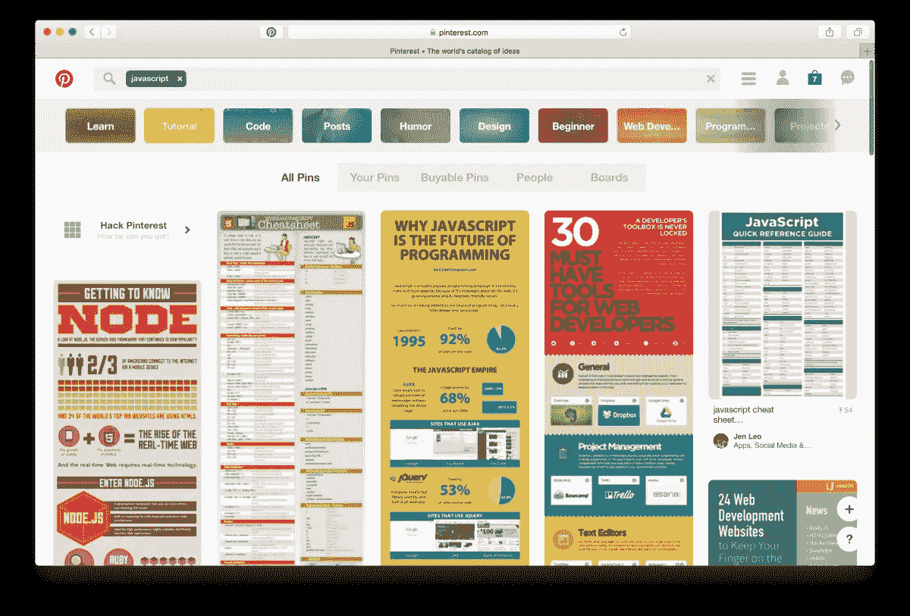
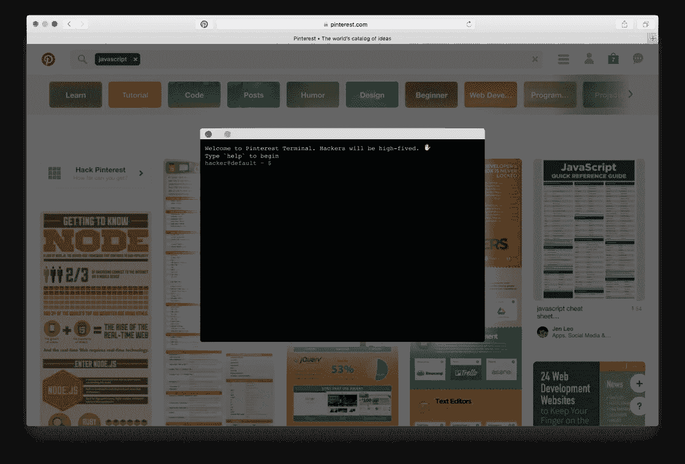

# 黑掉 Pinterest

> 原文：<https://medium.com/pinterest-engineering/hack-pinterest-611bf83fea36?source=collection_archive---------2----------------------->

Zack Argyle | Pinterest 工程师，核心体验

Pinterest 是众所周知的创造力天堂。在最近的一次黑客马拉松中，我们的工程团队发挥了同样的创造力，为 web 工程师制作了一个复活节彩蛋来测试他们的黑客技能。您可以通过在 Pinterest 上搜索与我们的网络堆栈相关的特定关键字来找到复活节彩蛋，例如“ [reactjs](https://www.pinterest.com/search/pins/?q=reactjs&rs=typed&term_meta[]=reactjs%7Ctyped) ”、“ [nodejs](https://www.pinterest.com/search/pins/?q=nodejs&rs=typed&term_meta[]=nodejs%7Ctyped) ”和“ [javascript](https://www.pinterest.com/search/pins/?q=javascript&rs=typed&term_meta[]=javascript%7Ctyped) ”。

一旦你搜索，你会在第一个搜索结果中看到“黑掉 Pinterest”的邀请。这会触发一个带有 bash 终端的弹出窗口，这应该是大多数工程师都熟悉的。简单来说，终端就是一个网页工程黑客游戏的接口。一个虚构的黑客组织已经破坏了系统，这取决于你按照线索，检索秘密的 bash 命令，看看他们在做什么。这是一个棘手的游戏，需要广泛的 web 工程知识来解析线索并找到隐藏的命令。

很好玩，但不仅仅是游戏。如果你读到最后，你将获得一个密钥，你可以用它给我们发送电子邮件，有机会赢得一张价值 50 美元的礼品卡，在 Pinterest 上通过[可购买的 pin 码](https://blog.pinterest.com/en/new-ways-shop-pinterest)购买超过 1000 万种独特的产品。

我们一直在寻找工程师加入我们的[工程组织](https://careers.pinterest.com/)的行列。想加入吗？继续黑下去。