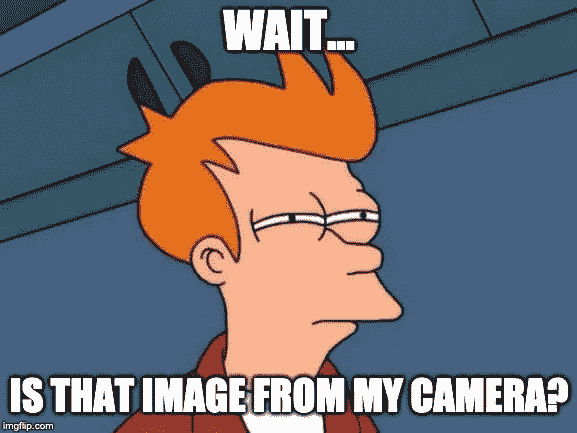

# Hack:关于 Android 摄像头的意图，你应该知道什么

> 原文：<https://medium.com/quick-code/hack-what-you-ought-to-know-about-the-android-camera-intent-a43af3769198?source=collection_archive---------0----------------------->

我过去在 Android 中做过的最有趣的项目之一包括在 react native 中编写的应用程序上实现一个工作摄像头模块。我不会详细介绍我们在完成这项任务时所面临的挑战，但我会在本文中分享我在整个经历中发现的亮点。

根据针对 android 开发人员的[文档](https://developer.android.com/training/camera/photobasics),在 android 应用程序上拍照的基础包括使用意图(对要执行的操作的抽象描述),它由以下步骤组成。

```
1) The [Intent](https://developer.android.com/reference/android/content/Intent.html)2) A call to start the external [Activity](https://developer.android.com/reference/android/app/Activity.html)3) The code to handle the image data.
```

很多时候，我们遵循堆栈溢出的代码片段/解决方案，期望找到我们想要的确切实现，结果只是在设备上运行应用程序，然后意识到首先阅读文档会更有意义。



如果你已经学习了一些/很多关于如何在 android 上捕捉和显示图像的教程，你会发现显示的图像(大多数时候)是模糊的。

我将带您完成一个基本的设置，以捕捉照片并在 Android 的图像视图上显示相同的照片。

## 1.创建主要活动(CaptureActivity.java)

这是所有奇迹发生的地方。

[View Entire File](https://gist.github.com/misshannah/4844c8ef2e7461e1218cb36d419a278e)

## 2.创建 XML 布局文件(activity_capture.xml)

这将定义您想要查看的视图项目。

```
*<?***xml version="1.0" encoding="utf-8"***?>* 
<**LinearLayout
    xmlns:android="http://schemas.android.com/apk/res/android"
    android:layout_width="match_parent"
    android:layout_height="match_parent"
    android:orientation="vertical"**>

    <**ImageView
        android:id="@+id/imageView"
        android:layout_width="match_parent"
        android:layout_height="wrap_content"
        android:adjustViewBounds="true"
        android:scaleType="fitXY"** />

</**LinearLayout**>
```

## 3.添加对清单文件(AndroidManifest.xml)的权限

这对于允许应用程序访问设备上的照相机并将图像存储在设备存储器上是很重要的。

```
<**uses-permission android:name="android.permission.READ_EXTERNAL_STORAGE"** />
<**uses-permission android:name="android.permission.WRITE_EXTERNAL_STORAGE"** />
<**uses-permission android:name="android.permission.CAMERA"** />
<**uses-permission android:name="android.permission.READ_PHONE_STATE"** />
<**uses-permission android:name="android.permission.ACCESS_NETWORK_STATE"** />

<**uses-feature
    android:name="android.hardware.camera.any"
    android:required="true"** />
<**uses-feature
    android:name="android.hardware.camera.autofocus"
    android:required="false"** />
```

现在我们已经设置好了所有重要的文件。您可以继续运行我们的应用程序。所有这些的要点是记住不要使用 onActivityResult 的**数据。**如这段代码所示。

```
**protected void** onActivityResult(**int** requestCode, **int** resultCode, Intent data) {
    **super**.onActivityResult(requestCode, resultCode, data);
    **if** (resultCode == ***RESULT_OK*** && requestCode == 100) {
        **mImageView**.setImageURI(**imageUri**);

    }

}
```

默认情况下，onActivityResult 返回的数据为 null，MediaStore 返回的默认路径是最后一张图库图片，而不是您的照片。您可以通过在代码中添加这些行来捕捉这一点。

```
**imageUri** = data.getData();
**if** (**imageUri** == **null**) {
    Toast.*makeText*(**this**, **"Missing Image"**, Toast.***LENGTH_SHORT***).show();
}
```

特别感谢一位 guru 开发者朋友。

[](https://www.linkedin.com/in/barnabas-jomo-09738561/) [## Barnabas Jomo -高级软件顾问- Safaricom Alpha | LinkedIn

### 我是一名软件工程师，在 web、移动(Android)和后端系统开发方面有 3 年多的经验。目前…

www.linkedin.com](https://www.linkedin.com/in/barnabas-jomo-09738561/) 

## **参考文献。**

[](/@rodrigolmti/android-get-camera-thumbnail-and-full-image-1bddfdc5347e) [## Android——获取相机缩略图和完整图像

### 你好，我叫罗德里戈，我是一名移动开发人员，今天我将教你如何从安卓相机获取图像…

medium.com](/@rodrigolmti/android-get-camera-thumbnail-and-full-image-1bddfdc5347e) [](https://stackoverflow.com/questions/6448856/android-camera-intent-how-to-get-full-sized-photo) [## Android 相机意图:如何获得全尺寸照片？

### 感谢贡献一个堆栈溢出的答案！请务必回答问题。提供详细信息并分享…

stackoverflow.com](https://stackoverflow.com/questions/6448856/android-camera-intent-how-to-get-full-sized-photo) 

> 这有帮助吗？几下掌声就够了！