# 黑客人类连接:一个精灵的故事

> 原文：<https://medium.com/airbnb-engineering/hacking-human-connection-the-story-of-awedience-ebf66ee6af0e?source=collection_archive---------1----------------------->

## 一个本土产品如何帮助 Airbnb 员工在孤独的时候感到联系更加紧密

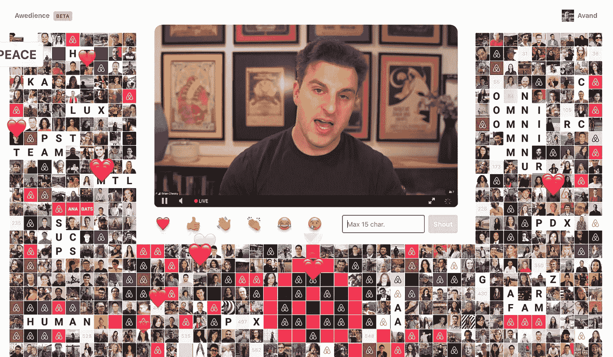

# 介绍

这是一个 Airbnb 员工在从未感到如此孤立的时期如何保持联系的故事。在这篇文章中，你将了解一个想法如何变成一个内部产品，现在是 Airbnb 运营的核心部分。

当你走进 Airbnb 办公室的大门时，你会感到一种既鼓舞人心又令人生畏的能量。在这家公司工作了五年多之后，我把这种双重性解释为 Airbnb 既是令人难以置信的企业家，又有抱负。

Airbnb 公司会议也不例外。布莱恩·切斯基和他的团队让我们的全体会议充满激情。我知道你在想什么:“激动人心的会议？!"但是严肃地说，我们所有的手不仅能提供信息，而且非常壮观。无论是为了声援工程而喝脱水虫子的奶昔，还是在热辣问答中吃辣鸡翅，我们的会议都是信息丰富、充满活力和引人入胜的。在忧郁的时刻，他们是人，是发自内心的。

疫情改变了这一切。感觉与演讲者有联系，感觉与我们的同龄人有联系，或者感觉演讲者与观众有联系，这些都消失了。相反，我们各自在笔记本电脑上观看演示者在 16:9 的矩形中流动。其他人同时在观看(根据邀请可以假设)，但这不可能被*感觉到*。受到启发，我开始解决这个问题，我想，“[我们有技术](https://en.wikipedia.org/wiki/The_Six_Million_Dollar_Man)，为什么我们不能看到并与所有观看直播的人互动？”

# 灵感

我们不可能知道在什么情况下灵感会找到我们，事后看来这似乎是完美的计划。

Airbnb 是一个基于联系和归属感的社区，这也是我们很多人来这里工作的原因。然而，在 2020 年 3 月，随着新冠肺炎的蔓延迫使我们就地躲避，我们努力寻找在公司文化中保留这些特质的方法。通过视频，表情符号重新定义了感觉与世界和彼此相连的含义。视频聊天帮助我们保持沟通，但它是[滑稽笨拙](https://www.youtube.com/watch?v=DYu_bGbZiiQ)，干巴巴的，毫无生气。如果这些技术让人觉得不自然，那是因为它们确实如此。我们都知道真实的人际关系是什么样的，但事实并非如此。

在《疫情》热播前的近两年时间里，我志愿帮助制作 Airbnb 的季度工程《全员》。我不知道的是，我实际上在研究这个问题，“如何让人们感觉联系更紧密？”无论是在我们的波特兰、西雅图和旧金山办公室举办一场以虎鲸为主题的接力赛，还是在礼堂播放实时聊天以吸引观众，我都在寻找培养人际关系的方法。

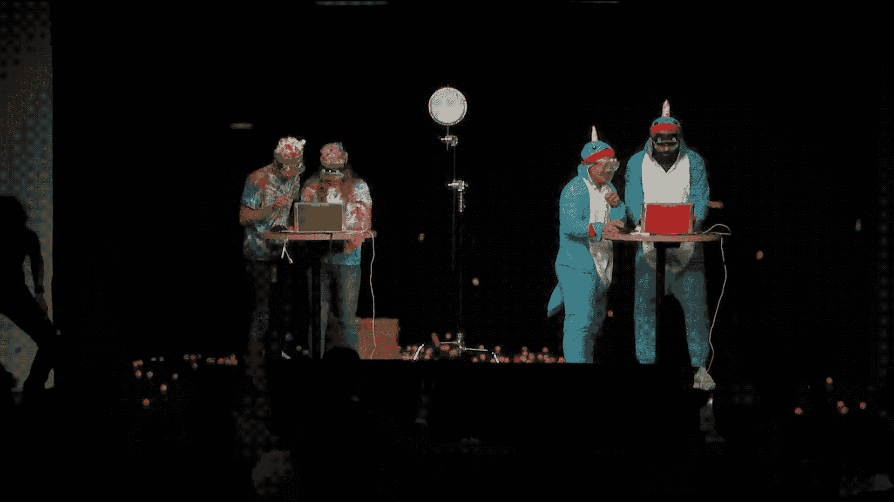

Pairs of engineers complete programming challenges, while being pelted with ping pong balls by the audience. This was just one of the many ridiculous segments of Nerds@, the engineering all-hands meeting I voluntarily produced for two years.

由于对活动制作的所有这些见解都被孤立在家中，因此毫不奇怪，当我看到我们的首席执行官布莱恩·切斯基(Brian Chesky)通过直播向数千名员工发表讲话时，我的注意力转移到了右上角显示有多少人在观看的小数字上。这些是我的同事，我的朋友——世界上最有才华的人。在我们孤立无援的情况下，唯一能捕捉到我们一起观看直播的体验的是总计数。Instagram 和 YouTube 允许人们在直播过程中用表情符号和评论来表达自己。在内部，我们不能。

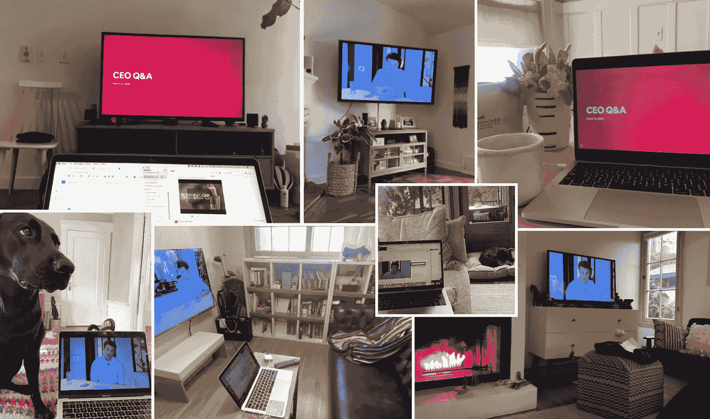

A look at life before Awedience: everyone watching the same stream at home alone, with the exception of some furry pals.

一个想法开始出现:用所有观众的网络摄像头的缩略图大小的小视频补充直播流，并用表情符号捕捉观众的情绪。这似乎很简单。

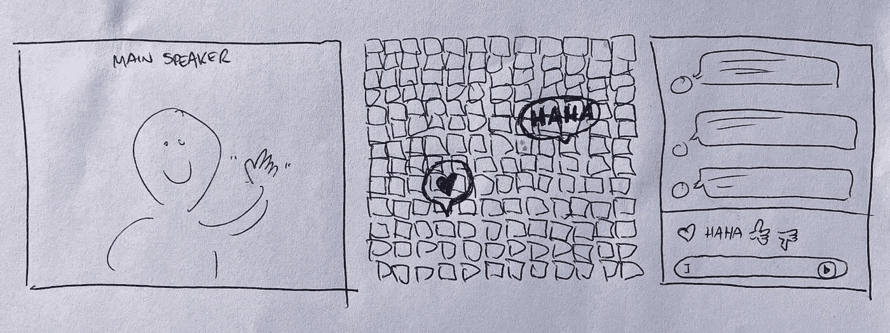

The original sketch. Simple, right?

然而，即使是这个概念也被证明是站不住脚的。我从未开发过完全实时的网络应用程序，可能需要几个月的时间来解决网络摄像头的问题。我没有几个月的时间。我只愿意花几天时间来看看这个想法是否有价值。

谷物企业家将会证明创意是廉价的——没有人会抄袭创意。只有*被证实的*想法会被复制，而这个想法肯定没有被证实。因此，我开始与我的一些同行和[斯捷潘·帕鲁纳什维利](https://www.linkedin.com/in/stepan-parunashvili-65698932)合作，帮助我们启动这个项目。“现在先看视频，”他说，“从我们公司目录上的个人资料图片开始。Firebase 可以处理所有实时的东西，我们已经有了一个内部认证服务。嘣！”

Stepan 继续为初期基础设施提供支持。我们需要一个名字，想了整整一分钟。这个产品是关于“观众”的,“aww”是一个观众在一起经历一些事情时发出的声音。激发“敬畏”也是这项工作的动机之一，所以我们决定选择“敬畏”

几个小时内，斯捷潘就完成了脚手架。人们可以登录并与其他用户一起[【hello world】](https://en.wikipedia.org/wiki/%22Hello,_World!%22_program)。我们的身份验证服务扮演了看门人的角色，保证应用程序在员工登录后可以访问他们的 LDAP 用户名。这个用户名使我能够从我们公司的目录中加载一张个人资料图片。 [Firebase](https://firebase.google.com/docs/database/) 充当实时数据库，React 位于它的上面，绑定(几乎直接)到 Firebase 事件。我终于可以专注于我的专业，用户界面和 UX。由于内嵌了 iframe，UI 很自然地形成了一个带有虚拟座位的 U 形礼堂。当你点击一个座位时，你的图片就会出现，当你做出反应时，表情符号就会从你的座位上飘出来，让所有人都能看到。你也可以写短消息，它们也会从你的座位上弹出，模拟向人群呼喊。

我们建造了一些东西。现在，有人在乎吗？

# 增长

注意力是一种极其宝贵的资源，有很多方法可以获得它。注意力通常是买来的。注意力可以从其他渠道转移。它甚至可以被偷。

但是注意力也可以通过*获得*。当人们喜欢一个产品时，它不仅有真正的持久力，而且会有机增长。因此，看人们是否热爱新事物的一个方法是什么都不说，然后观察。

我邀请了关系密切的同事参加一个全能比赛，看看会发生什么。凭直觉，他们坐下来，开始反应，并在整个会议中使用它。反馈是绝对积极的。一个设备没有做太多，但它做了，它做得足够好。

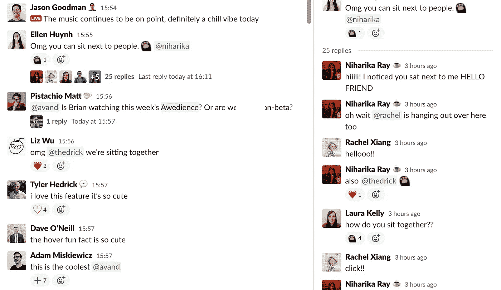

A glimpse into our company Slack: first reactions to Awedience at Airbnb.

当时，布莱恩主持全公司每周问答活动。我在全公司活动旁边创建了一个日历活动，并提供了另一个 URL，只邀请以前使用过日历的人。几个月之内，邀请就变得如此受欢迎，以至于在官方日历邀请中被作为次要选项。

随着越来越受欢迎，很难支持晚上和周末的服从。我请求我的团队给我几个月的时间将我的注意力转移到一个需求上，他们很支持我。唯一的要求是，我要在这段时间结束前弄清楚产品的未来，不要让事情变得没有结果。它会成为[在线体验](https://www.airbnb.com/s/experiences/online)的一部分吗？它会成为另一个团队路线图的一部分吗？我们甚至推测这可能是一个全新的行业。

虽然不断增加功能很诱人，但足智多谋现在是游戏的名字。一个设备在高峰时刻崩溃，所以性能过去是，现在仍然是最重要的特性。在我们实现节流之前，我们将反应直接绑定到我们的应用状态，这引发了大量的重新渲染:

一个粗糙的 *batchedThrottle* 函数减少了用户点击表情按钮时的渲染:

后来，通过将 React UI 从 Firebase 实时回调中分离出来，发现了额外的性能提升。最终，反应将在根本没有反应的情况下被本地管理:

我想探索更多的启示。在体育赛事中，参与者通常会举着标语、旗帜，甚至在身上涂上颜色来表达某种信息。在一个环境中复制这个是一个巨大的成功。与会者现在可以从座位上选择一种颜色、字母或图形的一部分来显示，而不是个人资料图片。人们早早出现，相互协调，拼出代表他们的团队、城市或公司的信息。结果很神奇。让你的邻居改变他们的座位照片并不容易。人们尽力与他人合作。同事之间的联系正在有机地发生，看到这一点令人激动。

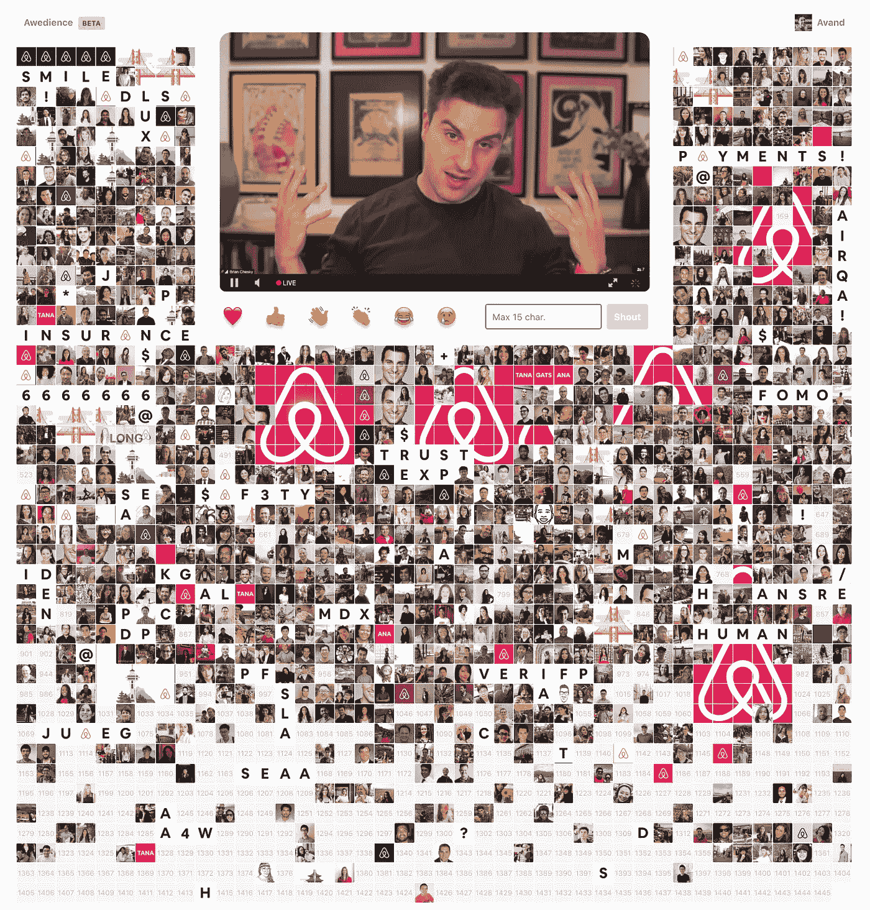

An earlier version of Awedience where people were spelling words, representing their teams, cities, and the company. Or the CEO’s face.

确保每个人都有足够的座位也是一个挑战。席位太少，部分人无法参与；太多了，观众席感觉空荡荡的。为了解决这个问题，组件做了一些它的 skeuomorphic 对应物不能做的事情:根据需要添加座位。对于一家如此注重归属感的公司所生产的产品来说，这一特性显得至关重要。后来，我们将通过增加座位密度来改进这一功能，这样几乎有 1000 人可以在“折叠线以上”看到

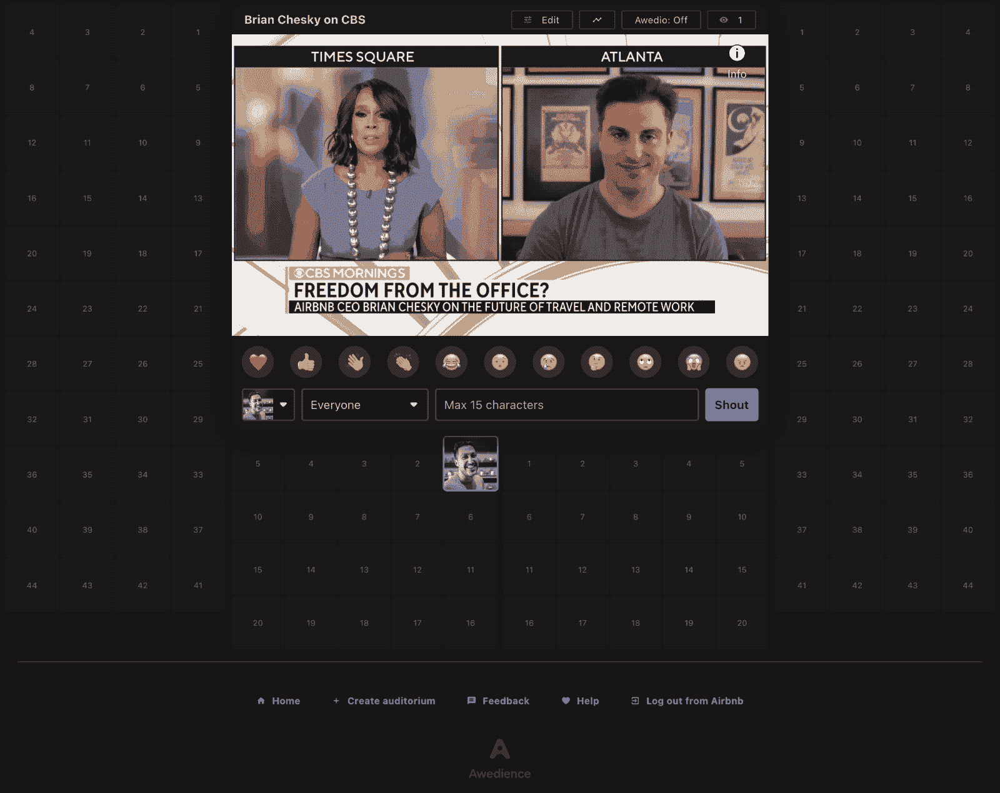

Adding rows of seats to the bottom worked for a long time but limited users from seeing everyone at once. It took the addition of virtual aisles to afford seats being added horizontally without compromising user-generated seat art.

自助服务功能也被列为优先事项。Brian 的员工立即想知道是什么内容刺激了参与度——这是一个他们自从去了 remote 后一直无法回答的问题。来自每个事件的累积数据被输送到一个图形库，用于快速和肮脏的分析。同样，我们的视频制作团队希望能够在不依赖我的情况下创建和编辑礼堂，因此自助工具也应运而生。

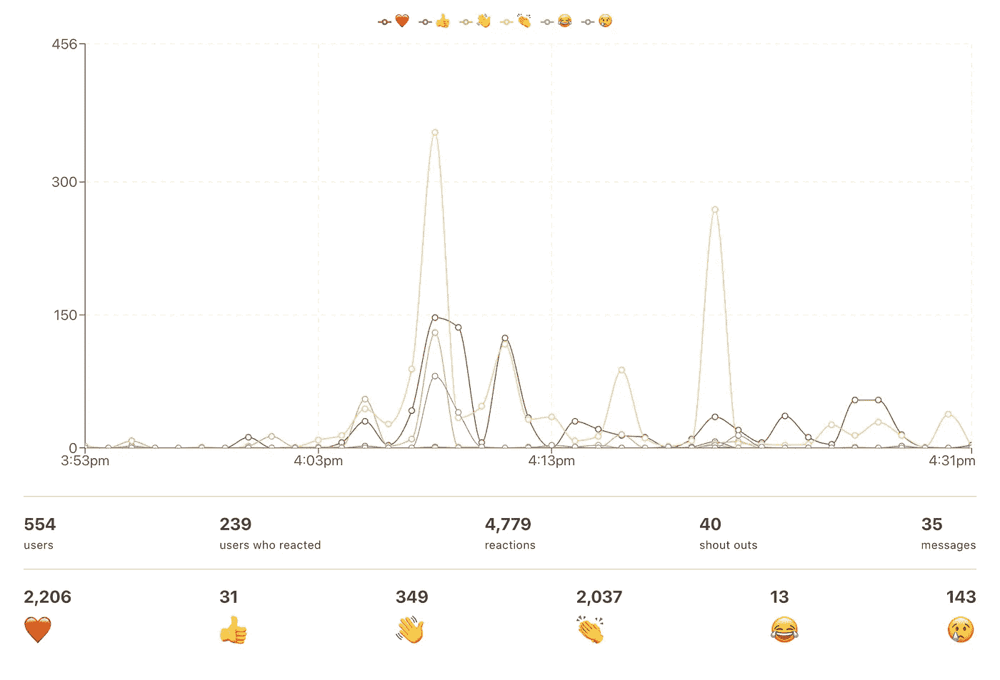

Awedience helps presenters understand exactly which parts of their presentation landed for their audience.

后来，在一次黑客马拉松中，我们甚至创造了掌声音效，这种音效可以根据观众的参与程度，从几个人鼓掌的声音自然地扩大到一片喧嚣。

[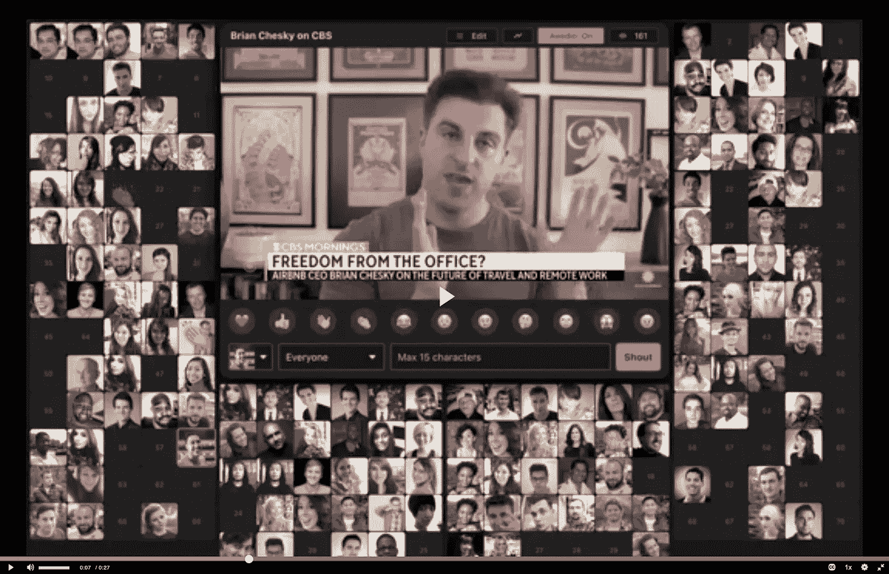](https://video.airbnb.com/media/t/1_o3egj5jk)

Awedio allows you to hear the audience’s applause reactions.

# 朋友圈

Awedience 让 Airbnb 又有了 Airbnb 的感觉。现在有一个地方，你可以看到每个人，并感觉与他们联系在一起。它已经成为庆祝时刻的家，也是一个我们可以在忧郁时刻坐在一起的地方。

当 Airbnb 宣布裁员时，我们安排了一次全体会议来表彰和感谢即将离职的员工。然而，随着 VPN 访问被削减到大约 2，000 名即将成为校友的人，一个设备突然只对被裁减的员工开放。常驻安全专家，[萨姆·凯雷](https://www.linkedin.com/in/keeleysam)，和我致力于使设备可以在 VPN 之外访问，并且几乎在一夜之间将认证切换到了 Google IAP。当创始人向公司致辞时，他们邀请即将离任的同事起立鼓掌，听众欣然接受。很难想象如果没有他们，我们会有怎样一个非个人的、孤独的送别。

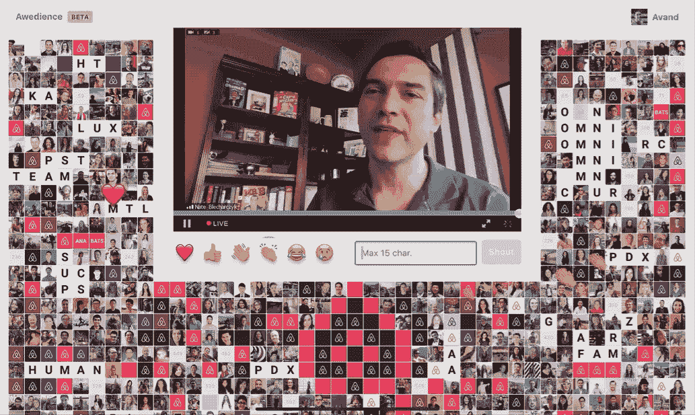

Hundreds of employees joined our founders in a virtual standing ovation for the members of our team that were let go as a result of the pandemic cut backs.

今年 5 月，在围绕乔治·弗洛伊德谋杀案的社会行动之后，该公司开会讨论黑人的命也是命运动。会议结束时，Brian 邀请公司默哀 8 分 46 秒。

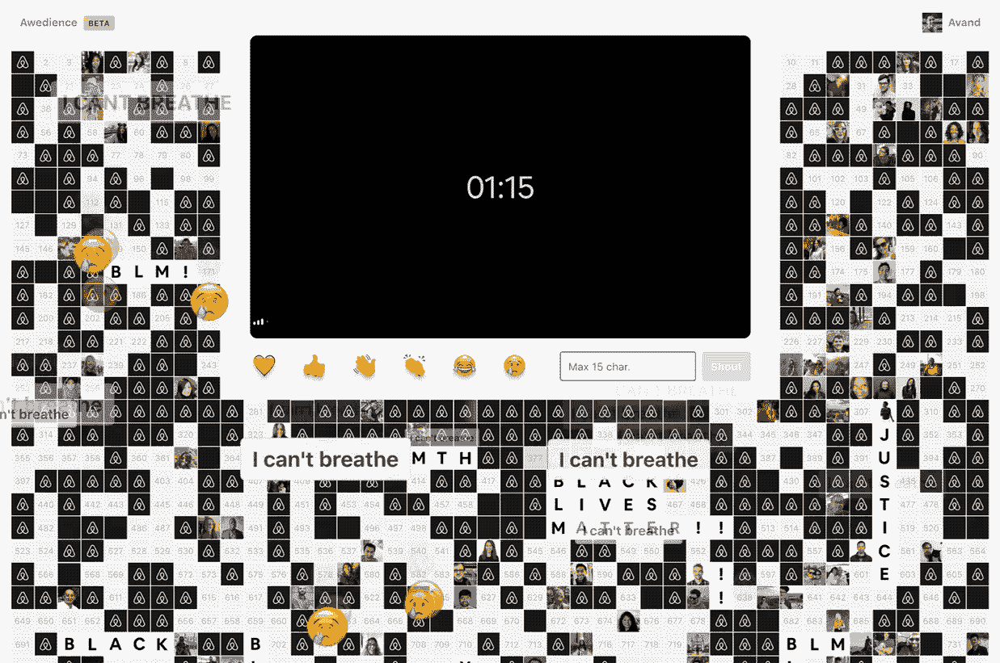

Employees join in a somber yet moving virtual moment of silence for George Floyd.

# 结论

在 Airbnb，Awedience 一直存在，现在得到了持续的支持和维护。通过与我们的员工体验团队合作，我们找到了一个可以长期使用的家。事实上，如果这是你感兴趣的工作，你甚至可以考虑加入我们的团队，帮助我们建立内部工具来培养联系——[我们正在招聘](https://careers.airbnb.com/positions/)！

我很幸运能为一家公司工作，这家公司创造空间，将这些类型的项目带入生活。Airbnb 是一个鼓舞人心的地方——严谨的创业精神和不断超越现状的承诺的结合和高潮。这就是你需要的那种环境，让像广告这样的创意蓬勃发展。

顺从不仅仅是激情和创造力的胜利。这个想法的火花就是:一个火花。用[理查德·布兰森](https://twitter.com/richardbranson/status/264067714266587136)的话说，“机会就像公共汽车——总有一辆会来。”如果没有许多才华横溢的同事的帮助和支持，就没有什么可写的了。

让人敬畏的是人。伟大的想法很少是一个人的想法或努力的结果。做不可思议的事情需要很多人。

# 承认

感谢斯捷潘·帕鲁纳什维利的推波助澜和基础设施建设。没有你，这是不可能的。谢谢你。

感谢萨姆·凯雷为整个公司实现和发展了无障碍环境。

感谢 Joe Gebbia 为昆虫创造了生长和进化的空间。

我以前团队的裴勇俊、艾莉森·弗雷林格、达瑞克·布朗和贾德·安廷，他们和我一起赌了一把。

感谢 Liz Kleinman 和 Beth Axelrod 为我继续这项工作创造了一个角色。

感谢 Shawdi Ilbagian Hahn、Dave O'Neill、Kylie McQuain、Kelly Bechtel、凯特·沃尔什、Benny Etienne、Carrie Kissell、李斯琦·汤普森、John Lawrence 和 Samantha Eaton 在保持公司参与和联系方面的合作和伙伴关系。

感谢 Cory Boldt、Steven McNellie、Garrett McGrath、Alex Lacayo、John Espey 和 Scott Ethersmith 对技术制作的帮助和创造力。

感谢 Jenna Cushner、Ortal Yahdav、Lucille Hua、Christian Williams、Shawn Terasaki、Brian Wallerstein、Ben Muschol、Mike Fowler、Jason Goodman、Caty Kobe、Joe Lencioni、Nicolas Haunold、Christian Baker、Alan Sun 和 Jacqui Watts 的早期贡献和反馈。

感谢 Kevin Swint、Danielle Zloto、Christine Berry、Federica Petruccio 和 Consuelo Hernandez 不断尝试在线体验和由此产生的强大见解。

感谢 Nicholas Roth、伊西·拉特纳、Jonathan Lieberman、Stephen Gikow、Steve Flanders、Lonya Breitel、Alan Shum、Brian Savage、Veronica Mariano、Allie Hastings、Alica 德尔瓦莱、Rajiv Patel 和 Emily Bullis 在保护 Awedience 的知识产权和促成外部合作方面给予的法律支持。

感谢萨拉·贝克总是把人们聚集在一起创作座椅艺术品。

Gaurav Mathur、Hope、Sean Abraham、Jessie Li、Vaithiyanathan Sundaram、Andy Yasutake、Virginia Vickery、Jonathan Rahmani、Andrew Pariser、Sunakshi Kapoor、Diane Ko、Biki Berry、Francisco Diaz、Erik Ritter、Tony、Mohsen Azimi、Bruce Paul、Omari Dixon、Sonia Anderson、CJ Cipriano、Chihwei Yeh、Arie Van Antwerp、Victor De Souza、Sam Shadwell、Deanna Bjorkquist、Jenna Cushner、Richard Kirk、Jake Silver、Alex Rosen

感谢 Stephanie Wei、Micah Roumasset、Ryland Harris、Waylon Janowiak 和 Ben Arnon 愿意尝试 Airbnb 之外的服务。

感谢杰里·查博拉、尼古拉斯·谢尔、瑞安·叶斯柏森、塞尔吉奥·加西亚·穆里略、韦斯·达吉特和 Millicast 的整个团队实现了实时流媒体。

Brett Bukowski，Cara Moyer，Nicki Williams，Dylan Hurd 和 Lauren Mackevich 在撰写这篇博客时给予的鼓励和支持。

最后感谢丹妮·查韦斯为灯泡供电。💡

**有兴趣在 Airbnb 工作？查看这些开放的角色:**

[air fam 产品高级软件工程师](https://careers.airbnb.com/positions/3714489/)

[保险平台员工技术项目经理](https://careers.airbnb.com/positions/3955056/)

[BizTech 全球运营部员工自动化工程师](https://careers.airbnb.com/positions/3988445/)

[运营工程师](https://careers.airbnb.com/positions/4003012/)

*所有产品名称、标识和品牌均为其各自所有者的财产。本网站中使用的所有公司、产品和服务名称仅用于识别目的。使用这些名称、标志和品牌并不意味着认可。*