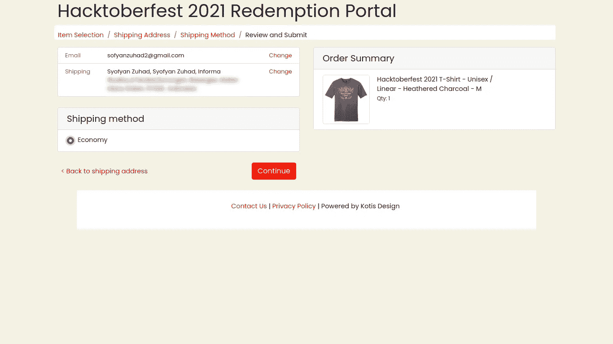

# Hacktoberfest, Bulannya Open Source

> 原文：<https://medium.easyread.co/hacktoberfest-bulannya-open-source-33512614afb6?source=collection_archive---------2----------------------->

## Pengalaman ngikutin hacktoberfest, dari pull-request sampai dapet kaos !

kaos hacktoberfest 2020–2021

Assalamu’alaikum Warahmatullahi Wabarakatuh…

[hacktoberfest](http://hacktoberfest.com) 2022

hacktoberfest 2021

> Updated: 29–09–2022

Terima kasih karena sudah ada yang nanya sebelumnya tetang hacktoberfest. Karena sebab itulah artikel ini ditulis, ternyata masih banyak para “anak IT” yang kurang tau, apa itu hacktoberfest?

## Hacktoberfest

Slogan yang dicanangkan pada hacktoberfest kali ini adalah:

> “Open source is changing the world — one contribution at a time.”

Open source merubah dunia — satu kontribusi setiap waktu #cmiiw

Tahun ini adalah kali ke delapan bagi haktoberfest sejak tahun 2014\. Jadi Hacktoberfest adalah acara yang diadakan untuk memeriahkan project open source yang diadakan oleh [DigitalOcean](http://digitalocean.com) .

Acara ini berlangsung sepanjang bulan oktober, dan mengajak semua orang baik itu penggemar, pemula, dan para developer professional sekalipun, juga komunitas developer tanpa pandang bulu untuk berkontribusi di berbagai macam project-project open source.

Kamu bisa berkontribusi dengan beberapa cara ini:

*   Membuat dan membagikan project open source-mu sendiri.
*   Berkontribusi untuk membantu mengembangkan project yang sudah ada.
*   Meng- *organize* event.
*   Membantu menjadi mentor bagi yang lain.
*   Berdonasi secara langsung ke project open source.

## Pengalaman

OK, jadi itulah kurang lebih pengertian hacktoberfest. Kali ini aku akan sharing tentang pengalaman tahun lalu ikut hacktoberfest dan dapet hadiah kaos.

Jadi untuk berkontribusi paling gampangnya sebagai “participant” yaitu mengirim pull-request (kalo di github). Minimal 4 pull-request (lebih banyak, lebih bagus).

[https://hacktoberfest.digitalocean.com/register](https://hacktoberfest.digitalocean.com/register)

Pertama, pastinya kamu harus melakukan registrasi dulu melalui halaman pendaftaran [hacktoberfest](https://hacktoberfest.digitalocean.com/register) . Hal ini berguna hanya untuk menghubungkan akun github / gitlab (sejauh ini baru 2 platform) untuk bisa di tracking oleh panitia dari hacktoberfest-nya, setiap kali kamu mengirim pull-request.

error

> **“if you previously participated in hacktoberfest with both github and gitlab linked, try authenticating again with the other.”**

Jika kalian menemukan error seperti diatas, kemungkinan salah satu akun github atau gitlab kalian pernah digunakan untuk mendaftar event hacktoberfest ini sebelumnya.

Maka kalian cukup mendaftar menggunakan akun yang belum pernah digunakan untuk hacktoberfest terakhir. Contoh: tahun 2021 aku ikut hacktoberfest pake akun github, jadi sekarang daftarnya pake akun gitlab. Penjelasannya aku juga kurang paham kenapa? Tapi cara daftarnya memang seperti itu. Sesuai pengalamanku barusan daftar untuk tahun ini.

progress

Selanjutnya pull-request kamu akan di- *review* oleh panitia hacktoberfest paling lama 2 minggu atau 14 hari. Ada beberapa peraturan dalam mengirimkan pull-request seperti yang disebutkan di halaman hacktoberfest.

Satu yang penting adalah, pull-requestnya harus diberi label `hacktoberfest-accepted` oleh si pemilik project. Hal ini akan dilakukan untuk mengecek apakah pull-request kamu valid ke project open source yang ada atau tidaknya. (tapi berdasarkan pengalaman yang lalu tidak terlalu ketat juga seleksinya)

Jika pada tahap pertama ini kamu lolos, maka kamu hanya perlu menunggu kabar dari panitia bahwa kamu bisa mendapatkan hadiah atau tidak. Jika berhasil, kamu akan mendapatkan email untuk meng- *claim* hadiah kaosnya yang isinya kurang-lebih seperti ini:

hacktoberfest 2020

Dan jika beruntung, kamu akan dikirimkan hadiah berupa kaos dan banyak stiker “developer” dari penyelenggara hacktoberfest. Kamu akan mendapatkan email untuk memilih ukuran baju yang kamu mau, dan juga memilih warna terang / gelap. Setelah itu, email konfirmasi tetang kaos yang kamu pesan akan dikirim seperti ini:

Prosesnya memang memakan waktu yang cukup lama, mengingat acara ini diikuti oleh seluruh penjuru dunia. Tapi tenang, karena hadiahnya tetap akan sampai di tujuan mungkin sekitar bulan Desember, atau bisa jadi tahun berikutnya.

*akan tetapi, untuk hacktoberfest tahun ini, hadiah kaos hanya terbatas untuk 500k orang pertama, selain itu akan mendapatkan hadiah berupa menanam pohon. Tapi tenang ini untuk memberikan dampak yang lebih positif daripada sekedar membagikan kaos.

Bagi kalian yang ingin berpartisipasi, bisa mengirim ke project open source yang bermanfaat bagi orang lain. Seperti dibawah ini:

 [## GitHub - syofyanzuhad/Laravel-Trik-Indonesia: Kumpulan trik laravel berbahasa indonesia

### Kumpulan " trik" berbahasa indonesia untuk menggunakan framework laravel. Berisi: 20 trik. Harap perhatikan juga cara…

github.com](https://github.com/syofyanzuhad/Laravel-Trik-Indonesia) 

> Update: Repo ini sudah terverifikasi loh untuk hacktoberfest !

And Finally. Alhamdulillah. Akhirnya saya dapat kesempatan untuk dikirimi kaos lagi.. 😂

kaos hacktoberfest 2021

Sekian. Semoga Bermanfaat.

Wassalamu’alaikum Warahmatullahi Wabarakatuh…