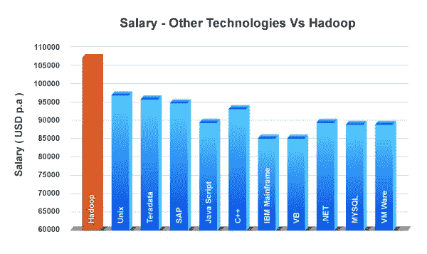

# 如何成为一名 Hadoop 开发者？-工作趋势和工资

> 原文：<https://medium.com/edureka/hadoop-developer-cc3afc54962c?source=collection_archive---------2----------------------->

**Hadoop 开发人员**是当前 IT 行业最令人向往、薪酬最高的角色。这份高质量的档案需要高超的技能才能以惊人的准确度处理海量数据。在本文中，我们将了解一名 Hadoop 开发人员的工作描述。

*   谁是 Hadoop 开发者？
*   如何成为一名 Hadoop 开发者？
*   Hadoop 开发人员所需的技能
*   薪资趋势
*   工作趋势
*   顶级公司招聘
*   Hadoop 开发者的未来
*   角色和职责

# 谁是 Hadoop 开发者？

Hadoop Developer 是一名专业的程序员，拥有 Hadoop 组件和工具的丰富知识。一个 Hadoop 开发者，基本上是设计、开发、部署 Hadoop 应用，有很强的文档技能。

# 如何成为一名 Hadoop 开发者？

要成为一名 Hadoop 开发者，你必须经历描述的**路线图**。

*   必须牢牢掌握 **SQL 基础知识**和**分布式系统**。
*   在 Java、Python、JavaScript、NodeJS 等语言方面有很强的编程技能
*   构建您自己的 Hadoop 项目，以便理解 **Hadoop** 的术语
*   熟悉 Java 是必须的。因为 Hadoop 是用 Java 开发的
*   计算机科学学士或硕士学位

# Hadoop 开发人员所需的技能

Hadoop 开发涉及多种**技术**和编程语言。下面列出了成为一名成功的 Hadoop 开发人员的重要技能。

*   **Hadoop** 及其**生态系统**的基础知识
*   能够使用 Linux 操作系统并执行基本命令
*   **实际操作**体验 **Hadoop 核心组件**
*   Hadoop 技术，如 **MapReduce、Pig、Hive、HBase。**
*   在**生态系统**中处理**多线程**和并发的能力
*   熟悉 **ETL 工具**和 **Flume** 和 **Sqoop** 等数据加载工具
*   应该能够与**后端**编程。
*   经验丰富的脚本语言，如 **PigLatin**
*   精通查询语言，如 **HiveQL**

# 薪资趋势

Hadoop Developer 是 IT 行业中最受欢迎的人物之一。基于社交媒体上提供的最新更新的工资估计显示，Hadoop 开发人员的平均工资高于任何其他专业人员。

现在让我们根据经验来讨论不同国家的 Hadoop 开发人员的薪资趋势。首先，让我们考虑一下美利坚合众国。根据经验，在这些领域工作的大数据专业人员的薪酬如下所述。

起薪从 **75，000 美元**到 **80，000 美元**的*入门级*薪资，另一方面，拥有 *20 年以上工作经验*的候选人将获得 **125，000 美元**到 **150，000 美元**的年薪。

其次是美国，我们现在将讨论英国 Hadoop 开发人员的薪资趋势。

在英国，对于初级开发人员来说，Hadoop 开发人员的工资趋势是从 **25，000 英镑到 30，000 英镑**开始，而另一方面，对于有经验的候选人来说，提供的工资是 **80，000 英镑到 90，000 英镑。**

其次是英国，我们现在将讨论印度 Hadoop 开发人员的薪资趋势。

在印度，Hadoop 开发人员的起薪趋势是从 **400，00 印度卢比**到 **500，000 印度卢比**，另一方面，对于有经验的候选人，提供的薪水是 **4，500，000 印度卢比**到 **5，000，000 印度卢比。**

# 工作趋势

*   从 2014 年**到 2019 年**Hadoop 的工作数量急剧增加。
*   从 2016 年 4 月**到 2019 年 4 月**已经上涨了近一倍。
*   **印度商业部门目前有 50，000 个与大数据相关的职位空缺。**
*   在全球市场上，印度贡献了 12%的 Hadoop 开发人员职位。
*   由于外包，印度海外工作的数量可能会以很快的速度增长。
*   几乎所有在印度的大型跨国公司都为印度的 Hadoop 开发者提供了**丰厚的薪水。**
*   **80%的市场**雇主都在寻找来自工程和管理领域的**大数据**专家。

# 顶级公司招聘

雇佣 Hadoop 开发人员最多的十家公司是，

*   **脸书**
*   **推特**
*   **领英**
*   **雅虎**
*   **易贝**
*   **中等**
*   **土坯**
*   **印孚瑟斯**
*   **认知**
*   **埃森哲**

# Hadoop 开发者的未来

**Hadoop** 是**未来依赖**的技术。大型企业需要 Hadoop 来存储、处理和分析他们的大数据。数据量呈指数级增长，对该软件的需求也是如此。

2018 年**，**，**全球大数据和商业分析市场**为 1690 亿美元，到 2022 年，预计将增长至**2740 亿美元。然而，普华永道的一份报告预测，到 2020 年，仅在美国，数据科学和分析领域就将有大约 270 万个工作岗位。**

如果你正在考虑**学习 Hadoop，**那么**这是一个完美的时机**

# 角色和职责

不同的公司有不同的数据问题，因此，开发人员的角色和职责需要不同的技能组合，以便能够用即时解决方案处理多种情况。Hadoop 开发人员的一些主要和一般的角色和职责如下。

*   开发 Hadoop 并以最佳性能**实施**
*   能够从不同的**数据源**中**加载** **数据**
*   **设计、构建、安装、配置**和**支持** Hadoop 系统
*   能够翻译详细设计中的复杂技术要求。
*   **分析**庞大的数据存储，发现真知灼见。
*   维护**安全**和**数据隐私。**
*   设计用于数据跟踪的**可扩展**和**高性能** web 服务。
*   **高速**数据查询。
*   **加载、部署**和**管理 **HBase 中的**数据。**
*   使用 **Zookeeper** 这样的调度器定义作业流
*   **集群**通过**动物园管理员**协调服务

到此，我们来结束这篇文章**。**我希望我已经让你了解了一些关于 **Hadoop 开发人员**的知识，以及所需的技能、角色和职责、工作趋势和薪资趋势。

如果你想查看更多关于人工智能、Python、道德黑客等市场最热门技术的文章，你可以参考 Edureka 的官方网站。

请留意本系列中解释大数据其他各方面的其他文章。

> 1. [Hadoop 教程](/edureka/hadoop-tutorial-24c48fbf62f6)
> 
> 2.[蜂巢教程](/edureka/hive-tutorial-b980dfaae765)
> 
> 3.[养猪教程](/edureka/pig-tutorial-2baab2f0a5b0)
> 
> 4.[地图缩小教程](/edureka/mapreduce-tutorial-3d9535ddbe7c)
> 
> 5. [HBase 教程](/edureka/hbase-tutorial-bdc36ab32dc0)
> 
> 6. [HDFS 教程](/edureka/hdfs-tutorial-f8c4af1c8fde)
> 
> 7. [Hadoop 3](/edureka/hadoop-3-35e7fec607a)
> 
> 8. [Sqoop 教程](/edureka/apache-sqoop-tutorial-431ed0af69ee)
> 
> 9.[水槽教程](/edureka/apache-flume-tutorial-6f7150210c76)
> 
> 10. [Oozie 教程](/edureka/apache-oozie-tutorial-d8f7bbbe1591)
> 
> 11. [Hadoop 生态系统](/edureka/hadoop-ecosystem-2a5fb6740177)
> 
> 12.[HQL](/edureka/hive-commands-b70045a5693a)的顶级蜂巢命令与实例
> 
> 13. [Hadoop 集群搭配亚马逊 EMR？](/edureka/create-hadoop-cluster-with-amazon-emr-f4ce8de30fd)
> 
> 14.[大数据工程师简历](/edureka/big-data-engineer-resume-7bc165fc8d9d)
> 
> 15.[大数据教程](/edureka/big-data-tutorial-b664da0bb0c8)
> 
> 16. [Hadoop 面试问题](/edureka/hadoop-interview-questions-55b8e547dd5c)

*原载于 2019 年 11 月 14 日*[*https://www.edureka.co*](https://www.edureka.co/blog/hadoop-developer/)*。*