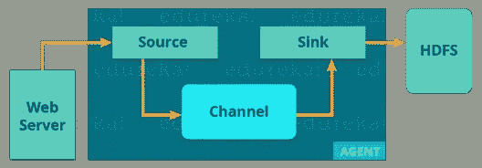

# Hadoop 生态系统—了解用于处理大数据的 Hadoop 工具

> 原文：<https://medium.com/edureka/hadoop-ecosystem-2a5fb6740177?source=collection_archive---------1----------------------->

Hadoop Ecosystem - Edureka

在之前关于 Hadoop 教程的博客中，我们讨论了 Hadoop、它的特性和核心组件。现在，下一步是了解 Hadoop 生态系统。在开始使用 Hadoop 之前，这是一个需要了解的基本主题。这篇 Hadoop 生态系统博客将让您熟悉全行业使用的大数据框架。

Hadoop 生态系统既不是编程语言，也不是服务，它是一个解决大数据问题的平台或框架。您可以将它视为一个套件，其中包含许多服务(摄取、存储、分析和维护)。让我们讨论一下，并简单了解一下服务是如何单独工作和协作的。

以下是 Hadoop 组件，它们共同构成了 Hadoop 生态系统，我将在本博客中逐一介绍:

*   **HDFS**->T2【Hadoop 分布式文件系统
*   **纱**->又一个资源谈判者
*   **MapReduce**->-*数据处理使用编程*
*   **火花** - >内存数据处理
*   **PIG，HIVE**->-*数据处理服务使用查询(类 SQL)*
*   **h base**->-*NoSQL 数据库*
*   **Mahout，Spark ml lib**->-机器学习
*   **Apache Drill**->-*Hadoop 上的 SQL*
*   **动物园管理员**->-管理集群
*   **oo zie**->-*作业调度*
*   **Flume，sq OOP**->-*数据摄取服务*
*   **Solr&Lucene**->搜索&索引
*   **Ambari**->-*提供、监控和维护集群*

# HDFS

*   ***Hadoop 分布式文件系统*** 是核心组件或者你可以说，是 Hadoop 生态系统的主干。
*   HDFS 就是其中之一，它使得存储不同类型的大型数据集(即结构化、非结构化和半结构化数据)成为可能。
*   HDFS 创造了一种对资源的抽象，从这里我们可以把整个 HDFS 看成一个整体。
*   它帮助我们在不同的节点上存储数据，并维护关于存储数据(元数据)的日志文件。
*   HDFS 有两个核心组件，即 **NameNode 和**DataNode。

1.  **NameNode** 是主节点，它不存储实际数据。它包含元数据，就像日志文件一样，或者可以说是内容表。因此，它需要较少的存储和较高的计算资源。
2.  另一方面，所有数据都存储在**数据节点**上，因此需要更多的存储资源。这些 DataNodes 是分布式环境中的商品硬件(如您的笔记本电脑和台式机)。这就是为什么 Hadoop 解决方案非常经济高效的原因。
3.  在写入数据时，您总是与 NameNode 通信。然后，它在内部向客户机发送一个请求，请求在各种 DataNodes 上存储和复制数据。

# 故事

将 YARN 视为您的 Hadoop 生态系统的大脑。它通过分配资源和调度任务来执行所有的处理活动。

*   它有两个主要组件，即**资源管理器和**节点管理器。

1.  **资源管理器**也是处理部门的一个主节点。
2.  它接收处理请求，然后相应地将部分请求传递给相应的节点管理器，在那里进行实际的处理。
3.  每个 DataNode 上都安装了节点管理器。它负责在每个 DataNode 上执行任务。
4.  **调度程序:**基于您的应用程序资源需求，调度程序执行调度算法并分配资源。
5.  **application manager:**当 application manager 接受作业提交时，与容器(即流程执行的数据节点环境)进行协商，以执行特定于应用的 ApplicationMaster 并监控进度。ApplicationMasters 是驻留在 DataNode 上的代理，它与容器通信，以便在每个 DataNode 上执行任务。ResourceManager 有两个组件，即**调度器**和**应用管理器**。

# MapReduce

它是 Hadoop 生态系统中处理的核心组件，因为它提供了处理逻辑。换句话说， ***MapReduce*** 是一个软件框架，它帮助编写在 Hadoop 环境中使用分布式和并行算法处理大型数据集的应用程序。

*   在一个 MapReduce 程序中， **Map()和 Reduce()** 是两个函数。

1.  **地图功能**执行过滤、分组、排序等动作。
2.  而 **Reduce 函数**聚合和汇总 map 函数产生的结果。
3.  Map 函数生成的结果是一个键值对(K，V ),它充当 Reduce 函数的输入。

让我们举上面的例子来更好地理解 MapReduce 程序。

我们有一个学生和他们各自系的样本案例。我们想计算每个系的学生人数。最初，Map 程序将执行并计算出现在每个系中的学生，产生如上所述的键值对。这个键值对是 Reduce 函数的输入。Reduce 函数将聚合每个系，计算每个系的学生总数，并产生给定的结果。

# 阿帕奇猪

*   ***猪*** 有两部分:**猪拉丁语**，该语言与**猪运行时不同，**为执行环境。你可以更好的理解为 Java 和 JVM。
*   支持*猪拉丁*语言，有类似 SQL 的命令结构。

因为每个人都不是来自编程背景。所以，阿帕奇猪缓解了他们。你可能很想知道是如何做到的？

好吧，我告诉你一个有趣的事实:

> **10 行猪拉丁=约。200 行 Map-Reduce Java 代码**

但是当我说在 Pig 作业的后端执行一个 map-reduce 作业时，不要感到惊讶。

*   编译器在内部将 pig latin 转换为 MapReduce。它产生一组连续的 MapReduce 作业，这是一个抽象(就像黑盒一样工作)。
*   PIG 最初是由雅虎开发的。
*   它为您提供了一个为 ETL(提取、转换和加载)构建数据流、处理和分析巨大数据集的平台。

## **猪是怎么工作的？**

在 PIG 中，首先，load 命令加载数据。然后，我们对其执行各种功能，如分组、过滤、连接、排序等。最后，你要么把数据转储到屏幕上，要么把结果存储回 HDFS。

# 阿帕奇蜂房

*   脸书为精通 SQL 的人创建了 HIVE。因此，HIVE 让他们在 Hadoop 生态系统中工作时有宾至如归的感觉。
*   基本上，HIVE 是一个数据仓库组件，它使用类似 SQL 的接口在分布式环境中执行读取、写入和管理大型数据集。

> **HIVE + SQL = HQL**

*   Hive 的查询语言叫做 Hive 查询语言(HQL)，和 SQL 很像。
*   它有两个基本组件: **Hive 命令行和 JDBC/ODBC 驱动**。
*   **Hive 命令行**接口用于执行 HQL 命令。
*   而 Java 数据库连接( **JDBC** )和对象数据库连接( **ODBC** )用于建立来自数据存储的连接。
*   其次，Hive 的可扩展性很强。因为，它可以服务于两个目的，即大数据集处理(即批量查询处理)和实时处理(即交互式查询处理)。
*   它支持 SQL 的所有原始数据类型。
*   您可以使用预定义的函数，或者编写定制的用户定义函数(UDF)来满足您的特定需求。

# 阿帕奇看象人

现在，让我们谈谈因机器学习而闻名的 Mahout。Mahout 为创建可扩展的机器学习应用程序提供了一个环境。

那么，**什么是机器学习？**

机器学习算法允许我们建立自我学习的机器，无需显式编程即可自行进化。基于用户行为、数据模式和过去的经验，它做出重要的未来决策。你可以称之为人工智能(AI)的后代。

## **看象人做什么？**

它执行**协作过滤、聚类和分类。**也有人认为**频繁项集缺失**是看象人的功能。让我们分别理解它们:

1.  **协同过滤:** Mahout 挖掘用户行为、他们的模式和他们的特征，并在此基础上预测和向用户提出建议。典型的用例是电子商务网站。
2.  **聚类:**它将一组相似的数据组织在一起，就像文章可以包含博客、新闻、研究论文等。
3.  **分类**:就是将数据分类归类到各个子部门，比如文章可以归类到博客、新闻、散文、研究论文等类别。
4.  **频繁项集丢失**:这里 Mahout 检查哪些对象可能会一起出现，如果它们丢失了，就给出建议。比如手机和机盖一般都放在一起。所以，如果你搜索一部手机，它也会向你推荐它的外壳。

Mahout 提供了一个命令行来调用各种算法。它有一个预定义的库，其中已经包含了不同用例的不同内置算法。

# 阿帕奇火花

*   ***Apache Spark*** 是一个分布式计算环境下的实时数据分析框架。
*   Spark 是用 Scala 编写的，最初是在加州大学伯克利分校开发的。
*   它执行内存中的计算，以提高 Map-Reduce 上的数据处理速度。
*   通过利用内存计算和其他优化，它在大规模数据处理方面比 Hadoop 快 100 倍。因此，它需要比 Map-Reduce 更高的处理能力。

如您所见，Spark 附带了高级库，包括对 R、SQL、Python、Scala、Java 等的支持。这些标准库增加了复杂工作流程中的无缝集成。此外，它还允许各种服务与其集成，如 MLlib、GraphX、SQL +数据帧、流服务等。来增强它的能力。

这是每个人心中很常见的问题:

***“Apache Spark:黑仔还是 Apache Hadoop 的救星？”—奥雷利***

这个问题的答案是——这不是苹果之间的比较。Apache Spark 最适合实时处理，而 Hadoop 旨在存储非结构化数据并在其上执行批处理。当我们将 Apache Spark 的能力(即高处理速度、高级分析和多重集成支持)与 Hadoop 在商用硬件上的低成本操作相结合时，它可以提供最佳结果。

这就是为什么许多公司一起使用 Spark 和 Hadoop 来处理和分析他们存储在 HDFS 的大数据。

# 阿帕奇 HBASE

*   ***HBase*** 是一个开源的、非关系的分布式数据库。换句话说，这是一个 NoSQL 数据库。
*   它支持所有类型的数据，这就是为什么它能够处理 Hadoop 生态系统中的任何事情。
*   它模仿 Google 的 BigTable，这是一个分布式存储系统，旨在处理大型数据集。
*   HBase 被设计为运行在 HDFS 之上，并提供类似 BigTable 的功能。
*   它为我们提供了一种存储稀疏数据的容错方式，这在大多数大数据用例中很常见。
*   HBase 是用 Java 编写的，而 HBase 应用程序可以用 REST、Avro 和 Thrift APIs 编写。

为了更好地理解，让我们举个例子。您有数十亿封客户电子邮件，您需要找出在电子邮件中使用了“投诉”一词的客户数量。需要快速(即实时)处理该请求。因此，这里我们在检索少量数据的同时处理大量数据集。为了解决这类问题，设计了 HBase。

# 阿帕奇演习

顾名思义，Apache Drill 用于钻取任何类型的数据。这是一个开源应用程序，它与分布式环境一起工作来分析大型数据集。

*   它是谷歌 Dremel 的复制品。
*   它支持不同种类的 NoSQL 数据库和文件系统，这是 Drill 的一个强大特性。比如 Azure Blob Storage，Google Cloud Storage，HBase，MongoDB，MapR-DB HDFS，MapR-FS，亚马逊 S3，Swift，NAS，本地文件。

因此，基本上，Apache Drill 背后的主要目标是提供可伸缩性，以便我们可以高效地处理 Pb 和 EB 的数据(或者可以说在几分钟内)。

*   Apache Drill 的主要功能在于 ***仅仅通过使用一个查询就可以组合多种数据存储。***
*   Apache Drill 基本上遵循 ANSI SQL。
*   它在支持数百万用户和服务他们对大规模数据的查询请求方面具有强大的可伸缩性。

# 阿帕奇动物园管理员

*   Apache Zookeeper 是任何 Hadoop 工作的协调者，包括 Hadoop 生态系统中各种服务的组合。
*   Apache Zookeeper 在分布式环境中协调各种服务。

在 Zookeeper 之前，在 Hadoop 生态系统中的不同服务之间进行协调是非常困难和耗时的。早期的服务在交互方面有很多问题，比如同步数据时的公共配置。即使配置了服务，服务配置的变化也会使其变得复杂和难以处理。分组和命名也是一个耗时的因素。

由于上述问题，引入了 Zookeeper。它通过执行**同步、配置维护、分组和命名节省了大量时间。**

虽然这是一个简单的服务，但它可以用来构建强大的解决方案。

像 Rackspace，Yahoo，易贝这样的大公司在他们的许多用例中都使用这项服务，因此，你可以对 Zookeeper 的重要性有所了解。

# 阿帕奇 OOZIE

考虑将 ***Apache Oozie*** 作为 Hadoop 生态系统内部的时钟和闹钟服务。对于 Apache 作业，Oozie 就像一个调度程序。它调度 Hadoop 作业，并将它们绑定在一起作为一个逻辑工作。

有两种工作:

1.  Oozie 工作流(oo zie workflow):这是一系列要执行的动作**。你可以假设它是一场接力赛。每个运动员等待最后一个人完成他的部分。**
2.  **Oozie 协调器**:这些是当数据对其可用时触发的 Oozie 作业。把这想象成我们身体中的反应-刺激系统。同样，当我们对外部刺激做出反应时，Oozie 协调器会对数据的可用性做出反应，否则它就会停止工作。

# 阿帕奇水槽

接收数据是我们 Hadoop 生态系统的重要组成部分。

*   ***Flume*** 是一项帮助将非结构化和半结构化数据吸收到 HDFS 中的服务。
*   它为我们提供了一个可靠的分布式解决方案，帮助我们**收集、聚合**和**移动大量数据集**。
*   它帮助我们从网络流量、社交媒体、电子邮件、日志文件等各种来源获取在线流数据。在 HDFS。

现在，让我们从下图中了解 Flume 的架构:

有一个 **Flume 代理**，它将来自不同数据源的流数据接收到 HDFS。从图中可以很容易理解 web 服务器表示数据源。Twitter 是流媒体数据的著名来源之一。

水槽代理有 3 个组件:**源、汇和通道**。

1.  **源**:接受来自输入流线的数据，并将数据存储在通道中。
2.  **通道:**作为本地存储器或主存储器。通道是 HDFS 中数据源和持久数据之间的临时存储。
3.  **Sink:** 然后，我们的最后一个组件(即 Sink)从通道收集数据，并将数据永久提交或写入 HDFS。

# APACHE SQOOP

现在，让我们谈谈另一种数据摄取服务，即***【Sqoop】***。Flume 和 Sqoop 的主要区别在于:

*   Flume 只将非结构化数据或半结构化数据引入 HDFS。
*   而 Sqoop 可以将结构化数据从 RDBMS 或企业数据仓库导入和导出到 HDFS，反之亦然。

让我们使用下图来了解 Sqoop 的工作原理:

当我们提交 Sqoop 命令时，我们的主任务被分成子任务，由单独的 Map 任务在内部处理。地图任务是子任务，它将部分数据导入 Hadoop 生态系统。总的来说，所有地图任务都会导入全部数据。

导出也以类似的方式工作。

当我们提交作业时，它被映射到地图任务中，这些任务从 HDFS 带来大量数据。这些块被导出到结构化数据目标。结合所有这些导出的数据块，我们在目的地接收整个数据，在大多数情况下，目的地是 RDBMS (MYSQL/Oracle/SQL Server)。

# 阿帕奇 SOLR 和 LUCENE

Apache Solr 和 Apache Lucene 是 Hadoop 生态系统中用于搜索和索引的两个服务。

*   Apache Lucene 基于 Java，这也有助于拼写检查。
*   如果说 Apache Lucene 是引擎，Apache Solr 就是围绕它打造的汽车。Solr 是一个围绕 Lucene 构建的完整应用。
*   它使用 Lucene Java 搜索库作为搜索和全文索引的核心。

# 阿帕奇·安巴里

Ambari 是一个 Apache 软件基金会项目，旨在使 Hadoop 生态系统更易于管理。

它包括用于**供应、管理和监控** Apache Hadoop 集群的软件。

Ambari 提供:

1.  **Hadoop 集群配置**:

*   它为我们提供了在多个主机上安装 Hadoop 服务的一步一步的过程。
*   它还处理集群上 Hadoop 服务的配置。

2. **Hadoop 集群管理:**

*   它为启动、停止和重新配置集群中的 Hadoop 服务提供了一个中央管理服务。

3. **Hadoop 集群监控:**

*   为了监控健康和状态，Ambari 为我们提供了一个仪表板。
*   **安珀警报框架**是一种警报服务，它在需要注意时通知用户。例如，如果一个节点关闭或节点上的磁盘空间不足，等等。

***最后，我想提请大家注意三件重要的事情:***

1.  Hadoop 生态系统的成功归功于整个开发者社区，许多大公司，如脸书、谷歌、雅虎、加州大学伯克利分校等。为增强 Hadoop 的功能贡献了自己的力量。
2.  在 Hadoop 生态系统中，关于一两个工具(Hadoop 组件)的知识不会有助于构建解决方案。你需要学习一套 Hadoop 组件，它们协同工作来构建一个解决方案。
3.  根据使用案例，我们可以从 Hadoop 生态系统中选择一组服务，并为组织创建量身定制的解决方案。

我希望这篇博客能给你带来信息和附加值。

如果你想查看更多关于人工智能、Python、道德黑客等市场最热门技术的文章，你可以参考 Edureka 的官方网站。

请留意本系列中解释大数据其他各方面的其他文章。

> 1. [Hadoop 教程](/edureka/hadoop-tutorial-24c48fbf62f6)
> 
> 2.[蜂巢教程](/edureka/hive-tutorial-b980dfaae765)
> 
> 3.[养猪教程](/edureka/pig-tutorial-2baab2f0a5b0)
> 
> 4.[地图缩小教程](/edureka/mapreduce-tutorial-3d9535ddbe7c)
> 
> 5. [HBase 教程](/edureka/hbase-tutorial-bdc36ab32dc0)
> 
> 6. [HDFS 教程](/edureka/hdfs-tutorial-f8c4af1c8fde)
> 
> 7. [Hadoop 3](/edureka/hadoop-3-35e7fec607a)
> 
> 8. [Sqoop 教程](/edureka/apache-sqoop-tutorial-431ed0af69ee)
> 
> 9.[水槽教程](/edureka/apache-flume-tutorial-6f7150210c76)
> 
> 10. [Oozie 教程](/edureka/apache-oozie-tutorial-d8f7bbbe1591)
> 
> 11.[大数据教程](/edureka/big-data-tutorial-b664da0bb0c8)
> 
> 12.[HQL 顶级配置单元命令及示例](/edureka/hive-commands-b70045a5693a)
> 
> 13. [Hadoop 集群搭配亚马逊 EMR？](/edureka/create-hadoop-cluster-with-amazon-emr-f4ce8de30fd)
> 
> 14.[大数据工程师简历](/edureka/big-data-engineer-resume-7bc165fc8d9d)
> 
> 15. [Hadoop 开发人员-工作趋势和薪水](/edureka/hadoop-developer-cc3afc54962c)
> 
> 16. [Hadoop 面试问题](/edureka/hadoop-interview-questions-55b8e547dd5c)

*原载于 2016 年 10 月 28 日 www.edureka.co***。**