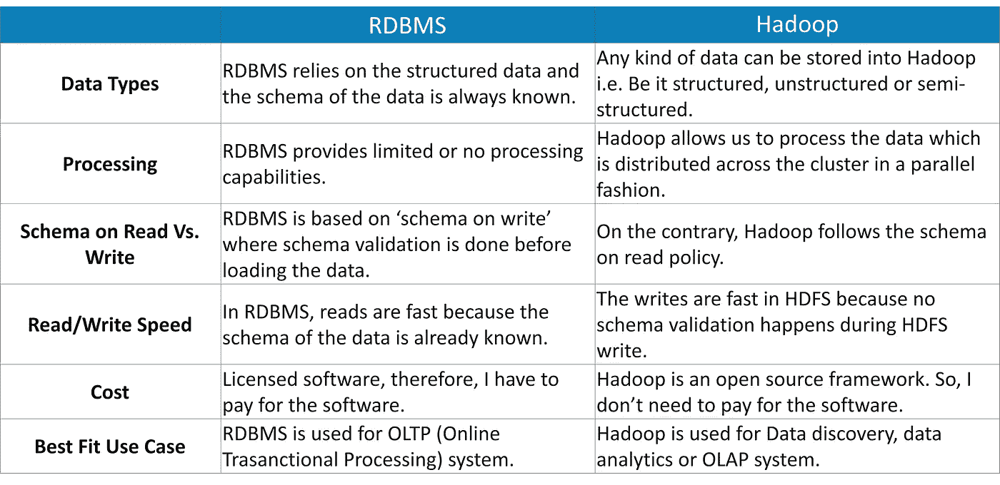
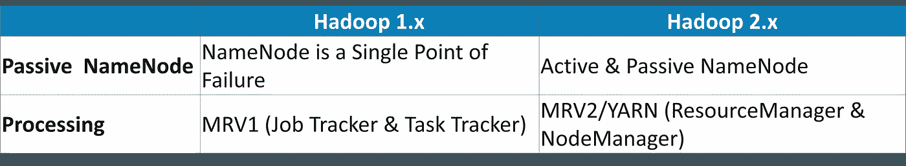
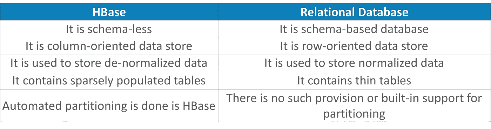

# 2021 年你必须准备的 50 个 Hadoop 面试问题

> 原文：<https://medium.com/edureka/hadoop-interview-questions-55b8e547dd5c?source=collection_archive---------0----------------------->

在这个 Hadoop 面试问题博客中，我们将涵盖所有常见问题，这些问题将帮助您以最佳解决方案赢得面试。但在此之前，让我告诉你对大数据和 Hadoop 专家的需求是如何持续增长的。

以下几个统计数据非常准确地反映了对 Hadoop 需求的增长:

*   *到 2019 年，大数据将推动 486 亿美元的年度支出——IDC。*
*   【Indeed.com 美国大数据 Hadoop 开发人员的平均工资是 135 万美元
*   【itjobswatch.co.uk】英国平均年薪 66250—66750 英镑

我想提请大家注意大数据革命。更早的时候，组织只关注运营数据，运营数据不到整个数据的 20%。后来，他们意识到分析整个数据会给他们带来更好的商业洞察力和决策能力。那是雅虎、脸书、谷歌等巨头。开始采用 Hadoop 和大数据相关技术。事实上，如今五分之一的公司正在转向大数据分析。因此，对大数据 Hadoop 工作的需求像任何事情一样在上升。所以，如果你想助推自己的事业，Hadoop 和 Spark 正是你需要的技术。这将永远给你一个好的开始，无论是作为一个新人还是有经验的人。

准备好这些顶级 Hadoop 面试问题，在蓬勃发展的大数据市场中获得优势，全球和本地企业，无论大小，都在寻找高质量的大数据和 Hadoop 专家。这份权威的 Hadoop 面试问题列表将带您浏览围绕 **Hadoop 集群**、 **HDFS、MapReduce** 、 **Pig** 、 **Hive、HBase** 的问答。这个博客是你下一份 Hadoop 工作的入口。

如果您在 Hadoop 面试中遇到了一些难题，但仍然不知道最佳答案，请将这些问题放在下面的评论部分。我们将很乐意回答这些问题。

与此同时，通过参加 Edureka 的 Hadoop 在线培训，您可以最大限度地利用大数据分析职业机会。点击下方了解更多信息。

1.关系数据库和 HDFS 的基本区别是什么？

以下是 HDFS 和关系数据库之间的主要区别:

## 2.解释“大数据”以及大数据的五个 V 是什么？

“大数据”是指大型复杂数据集的集合，这使得使用关系数据库管理工具或传统数据处理应用程序很难处理。捕获、管理、存储、搜索、共享、传输、分析和可视化大数据非常困难。大数据已经成为企业的机遇。现在，他们可以成功地从数据中获取价值，并且凭借增强的业务决策制定能力，比竞争对手拥有明显的优势。

♣提示:在这类问题中谈论 5v 是个好主意，不管它是否被特别问到！

*   **卷**:卷代表以指数速度增长的数据量，即以 Pb 和 EB 为单位。
*   **速度**:速度是指数据增长的速率，非常快。今天，昨天的数据被认为是旧数据。如今，社交媒体是数据增长速度的主要贡献者。
*   **多样性**:多样性是指数据类型的异构性。换句话说，收集的数据有多种格式，如视频、音频、csv 等。所以，这些不同的格式代表了数据的多样性。
*   **准确性**:准确性是指由于数据的不一致和不完整而对现有数据产生怀疑或不确定的数据。可用的数据有时会变得混乱，可能难以信任。对于多种形式的大数据，质量和准确性很难控制。数量往往是数据缺乏质量和准确性的原因。
*   **价值**:获得大数据固然很好，但除非我们能将其转化为价值，否则毫无用处。我说的将它转化为价值是指，它增加了组织的利益吗？从事大数据工作的组织是否实现了高 ROI(投资回报)？除非它通过处理大数据来增加他们的利润，否则它是无用的。

## 3.什么是 Hadoop 及其组件。

当“大数据”作为一个问题出现时，Apache Hadoop 作为一个解决方案应运而生。Apache Hadoop 是一个框架，为我们提供各种服务或工具来存储和处理大数据。它有助于分析大数据并从中做出业务决策，而使用传统系统无法高效地完成这些工作。

*♣提示:现在，在解释 Hadoop 的同时，你还应该解释 Hadoop 的主要组件，*即:

*   ***存储单元***–HDFS(NameNode，DataNode)
*   ***处理框架***–纱线(ResourceManager，NodeManager)

## 4.什么是 HDFS 和纱？

**HDFS** (Hadoop 分布式文件系统)是 Hadoop 的存储单元。它负责在分布式环境中将不同种类的数据存储为块。它遵循主从拓扑结构。

*♣提示:建议也解释一下 HDFS 组件，即*

*   ***NameNode*:**NameNode 是分布式环境中的主节点，它维护存储在 HDFS 的数据块的元数据信息，如块位置、复制因子等。
*   ***DataNode*:**DataNode 是从节点，负责在 HDFS 中存储数据。NameNode 管理所有的 DataNodes。

**YARN** (又一个资源协商者)是 Hadoop 中的处理框架，它管理资源并为进程提供执行环境。

*♣提示:同样，正如我们在 HDFS 中所做的，我们也应该解释纱线的两种成分:*

*   ***resource manager*:**它接收处理请求，然后相应地将部分请求传递给相应的节点管理器，在那里进行实际的处理。它根据需求为应用程序分配资源。
*   ***节点管理器* :** 节点管理器安装在每一个数据节点上，它负责每一个数据节点上任务的执行。

## 5.告诉我各种 Hadoop 守护进程及其在 Hadoop 集群中的角色。

通常，解决这个问题的方法是首先解释 HDFS 守护进程，即 NameNode、DataNode 和辅助 NameNode，然后继续解释 YARN 守护进程，即 ResorceManager 和 NodeManager，最后解释 JobHistoryServer。

*   **NameNode:** 主节点，负责存储所有文件和目录的元数据。它包含有关组成文件的数据块的信息，以及这些数据块在群集中的位置。
*   **Datanode:** 它是包含实际数据的从节点。
*   **辅助 NameNode:** 它定期将更改(编辑日志)与命名节点中的 FsImage(文件系统映像)合并。它将修改后的 FsImage 存储到持久存储中，可以在 NameNode 出现故障时使用。
*   ResourceManager: 它是管理资源和调度运行在 YARN 上的应用程序的中心机构。
*   **节点管理器:**它运行在从机上，负责启动应用程序的容器(应用程序在其中执行它们的部分)，监控它们的资源使用情况(CPU、内存、磁盘、网络)并将这些报告给资源管理器。
*   **JobHistoryServer:** 它在应用程序主机终止后维护有关 MapReduce 作业的信息。

# Hadoop HDFS 面试问题

## 6.将 HDFS 与网络连接存储(NAS)进行比较。

在此问题中，首先解释 NAS 和 HDFS，然后按如下方式比较它们的功能:

*   网络连接存储(NAS)是连接到计算机网络的文件级计算机数据存储服务器，为不同种类的客户端组提供数据访问。NAS 可以是为存储和访问文件提供服务的硬件或软件。而 Hadoop 分布式文件系统(HDFS)是一个使用商用硬件存储数据的分布式文件系统。
*   在 HDFS 中，数据块分布在集群中的所有机器上。而在 NAS 中，数据存储在专用硬件上。
*   HDFS 被设计为使用 MapReduce 范式，将计算转移到数据上。NAS 不适合 MapReduce，因为数据是与计算分开存储的。
*   HDFS 使用经济高效的商用硬件，而 NAS 是一种高成本的高端存储设备。

## 7.列出 Hadoop 1 和 Hadoop 2 的区别。

这是一个重要的问题，在回答这个问题时，我们必须主要关注两点，即被动 NameNode 和 YARN 架构。

*   在 Hadoop 1.x 中，“NameNode”是单点故障。在 Hadoop 2.x 中，我们有主动和被动的“命名节点”。如果主动“NameNode”失败，被动“NameNode”将接管。正因为如此，在 Hadoop 2.x 中可以实现高可用性。
*   此外，在 Hadoop 2.x 中，YARN 提供了一个中央资源管理器。使用 YARN，您现在可以在 Hadoop 中运行多个应用程序，所有应用程序共享一个公共资源。MRV2 是一种特殊类型的分布式应用程序，它在 YARN 之上运行 MapReduce 框架。其他工具也可以通过 YARN 执行数据处理，这在 Hadoop 1.x 中是个问题。

## 8.什么是主动和被动的“命名节点”？

在 HA(高可用性)架构中，我们有两个 NameNode—主动“NameNode”和被动“NameNode”。

*   主动“NameNode”是在集群中工作和运行的“NameNode”。
*   被动“NameNode”是一个备用“NameNode”，它具有与主动“NameNode”相似的数据。

当主动“NameNode”出现故障时，被动“NameNode”会替换群集中的主动“NameNode”。因此，集群永远不会没有“NameNode ”,因此它永远不会失败。

## 9.为什么要频繁地在 Hadoop 集群中删除或添加节点？

Hadoop 框架最吸引人的特性之一是它对商用硬件的*利用。然而，这导致 Hadoop 集群中频繁出现“DataNode”崩溃。Hadoop 框架的另一个显著特征是*根据数据量的快速增长进行扩展的简易性*。由于这两个原因，Hadoop 管理员最常见的任务之一就是在 Hadoop 集群中调试(添加)和停用(移除)“数据节点”。*

## 10.当两个客户端试图访问 HDFS 中的同一个文件时会发生什么？

HDFS 仅支持独占写入。

当第一个客户端联系“NameNode”以打开文件进行写入时，“NameNode”授予客户端创建该文件的租约。当第二个客户端尝试打开同一文件进行写入时，“NameNode”会注意到该文件的租约已经授予了另一个客户端，并将拒绝第二个客户端的打开请求。

## 11.NameNode 如何处理 DataNode 故障？

NameNode 定期从集群中的每个 DataNode 接收心跳(信号),这意味着 DataNode 运行正常。

块报告包含 DataNode 上所有块的列表。如果某个 DataNode 未能发送心跳消息，经过一段特定的时间后，它将被标记为失效。

NameNode 使用之前创建的副本将失效节点的数据块复制到另一个 DataNode。

## 12.当 NameNode 关闭时，您会怎么做？

NameNode 恢复过程包括以下步骤来启动和运行 Hadoop 集群:

1.  使用文件系统元数据副本(FsImage)启动新的 NameNode。
2.  然后，配置 DataNodes 和客户机，以便它们可以确认这个新的 NameNode，这是启动的。
3.  现在，新的 NameNode 将在加载完最后一个检查点 FsImage(用于元数据信息)并从 DataNodes 接收到足够多的块报告后开始为客户端提供服务。

然而，在大型 Hadoop 集群上，这种 NameNode 恢复过程可能会消耗大量时间，这在日常维护的情况下甚至会成为更大的挑战。

## 13.什么是检查点？

简而言之，“检查点”是一个获取文件系统映像、编辑日志并将其压缩成新文件系统映像的过程。因此，NameNode 可以直接从 FsImage 加载最终的内存状态，而不是重放编辑日志。这是一个非常有效的操作，减少了 NameNode 的启动时间。检查点由辅助 NameNode 执行。

## 14.HDFS 是如何容错的？

当数据存储在 HDFS 上时，NameNode 将数据复制到几个 DataNode。默认的复制因子是 3。您可以根据需要更改配置因子。如果一个 DataNode 出现故障，NameNode 会自动将数据从副本复制到另一个节点，并使数据可用。这在 HDFS 中提供了容错。

## 15.NameNode 和 DataNode 可以做商品硬件吗？

这个问题的聪明答案是，DataNodes 是像个人电脑和笔记本电脑一样的商品硬件，因为它存储数据，并且需要大量的数据。但是根据您的经验，您可以知道，NameNode 是主节点，它存储有关存储在 HDFS 的所有块的元数据。它需要很高的内存(RAM)空间，所以 NameNode 需要是一个内存空间很好的高端机器。

## 16.为什么我们对有大数据集的应用程序使用 HDFS，而不是在有很多小文件的时候？

与分布在多个文件中的少量数据相比，HDFS 更适合单个文件中的大量数据集。如您所知，NameNode 将关于文件系统的元数据信息存储在 RAM 中。因此，内存量限制了我的 HDFS 文件系统中的文件数量。换句话说，太多的文件会导致产生太多的元数据。而且，在 RAM 中存储这些元数据将成为一个挑战。根据经验，文件、数据块或目录的元数据需要 150 字节。

## 17.你如何定义 HDFS 的“街区”？Hadoop 1 和 Hadoop 2 中的默认块大小是多少？能改吗？

块是硬盘上存储数据的最小连续位置。HDFS 将每个存储为块，并在 Hadoop 集群中分发。HDFS 的文件被分解成块大小的块，作为独立的单元存储。

*   Hadoop 1 默认块大小:64 MB
*   Hadoop 2 默认块大小:128 MB

是的，可以配置块。可以在 hdfs-site.xml 文件中使用 dfs.block.size 参数来设置 Hadoop 环境中的块大小。

## 18.“jps”命令是做什么的？

“jps”命令帮助我们检查 Hadoop 守护进程是否正在运行。它显示了所有 Hadoop 守护进程，即 namenode、datanode、resourcemanager、nodemanager 等。在机器上运行。

## 19.在 Hadoop 中如何定义“机架感知”？

**机架感知**是一种算法，其中“NameNode”根据机架定义决定如何放置数据块及其副本，以最大限度地减少同一机架内“DataNodes”之间的网络流量。假设我们考虑复制因子 3(默认)，策略是“对于每个数据块，两个拷贝将存在于一个机架中，第三个拷贝存在于不同的机架中”。该规则被称为“副本放置策略”。

## 20.Hadoop 中的“推测执行”是什么？

如果一个节点看起来执行任务较慢，主节点可以在另一个节点上冗余地执行同一任务的另一个实例。然后，最先完成的任务将被接受，另一个将被杀死。这个过程被称为“推测执行”。

## 21.如何重启 Hadoop 中的“NameNode”或所有守护进程？

这个问题可以有两个答案，我们将讨论这两个答案。我们可以通过以下方法重启 NameNode:

1.  您可以使用***/sbin/Hadoop-daemon . sh stop namenode***命令单独停止 NameNode，然后使用*启动 NameNode。****/sbin/Hadoop-daemon . sh 启动 namenode*** 命令。
2.  要停止和启动所有守护程序，请使用**。** ***/sbin/stop-all。*** 然后使用。***/sbin/start-all . sh***命令，该命令将首先停止所有守护进程，然后启动所有守护进程。

这些脚本文件位于 Hadoop 目录下的 sbin 目录中。

## 22.“HDFS 块”和“输入分离”之间有什么区别？

“HDFS 块”是数据的物理划分，而“输入拆分”是数据的逻辑划分。HDFS 将数据划分为块，以便将块存储在一起，而为了处理，MapReduce 将数据划分为输入拆分，并将其分配给映射器函数。

## 23.说出 Hadoop 可以运行的三种模式。

Hadoop 可以运行的三种模式如下:

1.  ***单机(本地)模式*** :如果我们不做任何配置，这是默认模式。在这种模式下，Hadoop 的所有组件，如 NameNode、DataNode、ResourceManager 和 NodeManager，都作为一个 Java 进程运行。这使用本地文件系统。
2.  ***伪分布式模式*** :单节点 Hadoop 部署被认为是在伪分布式模式下运行 Hadoop 系统。在这种模式下，所有 Hadoop 服务，包括主服务和从服务，都在单个计算节点上执行。
3.  ***全分布式模式***:Hadoop 主服务和从服务在不同节点上运行的 Hadoop 部署称为全分布式模式。

# Hadoop MapReduce 面试问题

## 24.什么是“MapReduce”？运行“MapReduce”程序的语法是什么？

它是一个框架/编程模型，用于在使用并行编程的计算机集群上处理大型数据集。运行 MapReduce 程序的语法是**Hadoop _ jar _ file . jar/input _ path/output _ path**。

## 25.“MapReduce”程序的主要配置参数是什么？

用户需要在“MapReduce”框架中指定的主要配置参数有:

*   分布式文件系统中作业的输入位置
*   分布式文件系统中作业的输出位置
*   数据的输入格式
*   数据输出格式
*   包含地图函数的类
*   包含 reduce 函数的类
*   包含映射器、缩减器和驱动程序类的 JAR 文件

## 26.陈述我们无法在 mapper 中执行“聚合”(加法)的原因？为什么我们需要这个“减速器”呢？

这个答案包含了许多要点，所以我们将按顺序逐一介绍。

*   我们无法在 mapper 中执行“聚合”(添加)，因为在“mapper”函数中不会进行排序。排序仅发生在缩减器端，没有排序就无法进行聚合。
*   在“聚合”期间，我们需要所有映射器函数的输出，这可能无法在映射阶段收集，因为映射器可能运行在存储数据块的不同机器上。
*   最后，如果我们尝试在 mapper 上聚合数据，则需要在可能运行于不同机器上的所有 mapper 函数之间进行通信。因此，它将消耗很高的网络带宽，并可能导致网络瓶颈。

## 27.Hadoop 中“RecordReader”的用途是什么？

“InputSplit”定义了一个工作片段，但没有描述如何访问它。“RecordReader”类从数据源加载数据，并将其转换为适合“Mapper”任务读取的(键，值)对。“RecordReader”实例由“输入格式”定义。

## 28.解释“MapReduce 框架”中的“分布式缓存”。

分布式缓存可以解释为，MapReduce 框架提供的一种工具，用于缓存应用程序所需的文件。一旦你为你的工作缓存了一个文件，Hadoop 框架将使它在你映射/减少任务运行的每一个数据节点上可用。然后，您可以在映射器或缩减器作业中将缓存文件作为本地文件进行访问。

## 29.「还原者」之间是如何沟通的？

这是一个棘手的问题。“MapReduce”编程模型不允许“reducers”相互通信。“减速器”孤立运行。

## 三十岁。“MapReduce 分区器”是做什么的？

“MapReduce Partitioner”确保一个键的所有值都进入同一个“reducer ”,从而允许在“reducer”上均匀分布地图输出。它通过确定哪个“缩减器”负责特定的键，将“映射器”的输出重定向到“缩减器”。

## 31.你将如何编写一个自定义的分区？

按照以下步骤，可以轻松编写 Hadoop 作业的自定义分区程序:

*   创建一个扩展分区器类的新类
*   覆盖方法— getPartition，在 MapReduce 中运行的包装器中。
*   使用 set Partitioner 方法将自定义分区程序添加到作业中，或者将自定义分区程序作为配置文件添加到作业中。

## 32.什么是“合并器”？

“组合器”是一个小型的“缩减器”,执行本地的“缩减”任务。它从特定“节点”上的“映射器”接收输入，并将输出发送到“缩减器”。“合并器”通过减少需要发送给“缩减器”的数据量来帮助提高“MapReduce”的效率。

## 33.你对“SequenceFileInputFormat”了解多少？

“SequenceFileInputFormat”是一种用于在序列文件中读取的输入格式。它是一种特定的压缩二进制文件格式，针对在一个“MapReduce”作业的输出到另一个“MapReduce”作业的输入之间传递数据进行了优化。

序列文件可以作为其他 MapReduce 任务的输出生成，并且是从一个 MapReduce 作业传递到另一个作业的数据的有效中间表示。

# 阿帕奇猪面试问题

## 34.Apache Pig 比 MapReduce 有什么好处？

Apache Pig 是一个平台，用于分析大型数据集，将它们表示为雅虎开发的数据流。它旨在提供 MapReduce 的抽象，降低编写 MapReduce 程序的复杂性。

*   Pig Latin 是一种高级数据流语言，而 MapReduce 是一种低级数据处理范式。
*   不用在 MapReduce 中编写复杂的 Java 实现，程序员可以使用 Pig Latin 非常容易地实现相同的实现。
*   Apache Pig 将代码长度减少了大约 20 倍(据雅虎称)。因此，这将开发周期缩短了近 16 倍。
*   Pig 提供了许多内置的操作符来支持数据操作，如连接、过滤、排序、分类等。而在 MapReduce 中执行相同的功能是一项巨大的任务。
*   在 Apache Pig 中执行连接操作很简单。而在 MapReduce 中很难执行数据集之间的连接操作，因为它需要顺序执行多个 MapReduce 任务来完成工作。
*   此外，pig 还提供了 MapReduce 中没有的嵌套数据类型，如元组、包和地图。

## 35.猪拉丁有哪些不同的数据类型？

Pig Latin 可以处理两种原子数据类型，如 int、float、long、double 等。以及复杂的数据类型，如 tuple、bag 和 map。

原子数据类型:原子或标量数据类型是所有语言中使用的基本数据类型，如 string、int、float、long、double、char[]、byte[]。

复杂数据类型:复杂数据类型有 Tuple、Map、Bag。

## 36.你合作过的《猪拉丁》中有哪些不同的关系运算？

不同的关系运算符有:

1.  对于每个
2.  以...排序
3.  过滤
4.  组
5.  明显的
6.  加入
7.  限制

如果一些函数在内置操作符中不可用，我们可以通过编程创建用户定义的函数(UDF ),使用其他语言如 Java、Python、Ruby 等来实现这些功能。并将其嵌入脚本文件中。

## 37.什么是 UDF？

如果一些函数在内置操作符中不可用，我们可以通过编程创建用户定义的函数(UDF ),使用其他语言如 Java、Python、Ruby 等来实现这些功能。并将其嵌入脚本文件中。

# Apache Hive 面试问题

## 38.《蜂巢》中的“SerDe”是什么？

Apache Hive 是一个建立在 Hadoop 之上的数据仓库系统，用于分析脸书开发的结构化和半结构化数据。Hive 抽象了 Hadoop MapReduce 的复杂性。

“SerDe”接口允许您指示“Hive”应该如何处理记录。“SerDe”是“串行器”和“解串器”的组合。“Hive”使用“SerDe”(和“FileFormat”)来读写表的行。

## 39.默认的“Hive Metastore”可以同时被多个用户(进程)使用吗？

“Derby 数据库”是默认的“Hive Metastore”。多个用户(进程)不能同时访问它。它主要用于执行单元测试。

## 40.“Hive”存储表数据的默认位置是什么？

Hive 存储表数据的默认位置是/user/hive/warehouse 中的 HDFS 内部。

# Apache HBase 面试问题

## 41.什么是 Apache HBase？

HBase 是一个开源的、多维的、分布式的、可扩展的、用 Java 编写的 NoSQL 数据库。HBase 运行在 HDFS (Hadoop 分布式文件系统)之上，为 Hadoop 提供类似 BigTable (Google)的功能。它旨在提供一种存储大量稀疏数据集的容错方式。HBase 通过在大型数据集上提供更快的读/写访问来实现高吞吐量和低延迟。

## 42.Apache HBase 有哪些组件？

HBase 有三大组件，分别是 HMaster Server、HBase RegionServer 和 Zookeeper。

*   ***区域服务器*** :一张桌子可以分成几个区域。一组区域由区域服务器提供给客户。
*   ***HMaster*** :协调管理区域服务器(类似 HDFS 的 NameNode 管理 DataNode)。
*   ***ZooKeeper***:ZooKeeper 在 HBase 分布式环境中充当协调者的角色。它通过会话通信来帮助维护集群内部的服务器状态。

## 43.区域服务器的组件有哪些？

区域服务器的组件包括:

*   ***WAL*** :预写日志(WAL)是附着在分布式环境中每个区域服务器上的文件。WAL 存储尚未持久化或提交到永久存储器的新数据。
*   ***块缓存*** :块缓存驻留在区域服务器的顶层。它将经常读取的数据存储在存储器中。
*   ***MemStore*** :就是写缓存。它在将所有传入的数据提交到磁盘或永久内存之前存储这些数据。区域中的每个列族都有一个 MemStore。
*   ***HFile*** : HFile 存放在 HDFS。它在磁盘上存储实际的细胞。

## 44.解释 HBase 中的“WAL”？

预写日志(WAL)是附加到分布式环境中每个区域服务器的文件。WAL 存储尚未持久化或提交到永久存储器的新数据。它用于恢复数据集失败的情况。

## 45.提及“HBase”和“关系数据库”的区别？

HBase 是一个开源的、多维的、分布式的、可扩展的和用 Java 编写的 *NoSQL 数据库*。HBase 运行在 HDFS 之上，为 Hadoop 提供类似 BigTable 的功能。让我们看看 HBase 和关系数据库的区别。

# Apache Spark 面试问题

## 46.什么是阿帕奇火花？

这个问题的答案是，Apache Spark 是一个用于分布式计算环境中实时数据分析的框架。它执行内存中的计算来提高数据处理的速度。

通过利用内存中的计算和其他优化，它在大规模数据处理方面比 MapReduce 快 100 倍。

## 47.你能用任何特定的 Hadoop 版本构建“Spark”吗？

是的，人们可以为特定的 Hadoop 版本构建“Spark”。

## 48.定义 RDD。

RDD 是弹性分布数据集的首字母缩写，它是并行运行的操作元素的容错集合。RDD 中的分区数据是不可变的和分布式的，这是 Apache Spark 的一个关键组件。

# Oozie 和动物园管理员面试问题

## 49.什么是 Apache ZooKeeper 和 Apache Oozie？

Apache ZooKeeper 在分布式环境中协调各种服务。它通过执行同步、配置维护、分组和命名节省了大量时间。

Apache Oozie 是一个调度程序，它调度 Hadoop 作业并将它们绑定在一起作为一个逻辑工作。有两种工作:

*   ***Oozie 工作流*** :这些是要执行的一系列动作。你可以假设它是一场接力赛。每个运动员等待最后一个人完成他的部分。
*   ***Oozie 协调器*** :这些是当数据对其可用时触发的 Oozie 作业。把这想象成我们身体中的反应-刺激系统。同样，当我们对外部刺激做出反应时，Oozie 协调器会对数据的可用性做出反应，否则它就会停止工作。

## 50.如何在 Hadoop 中配置一个“Oozie”作业？

“Oozie”与 Hadoop 堆栈的其余部分集成，支持几种类型的 Hadoop 作业，如“Java MapReduce”、“流 MapReduce”、“Pig”、“Hive”和“Sqoop”。

我希望这篇文章能给你带来信息和附加值。

如果你想查看更多关于人工智能、Python、道德黑客等市场最热门技术的文章，那么你可以参考 [Edureka 的官方网站。](https://www.edureka.co/blog?utm_source=medium&utm_medium=content-link&utm_campaign=bigdata_interview_questions)

请留意本系列中解释大数据其他各方面的其他文章。

> 1. [Hadoop 教程](/edureka/hadoop-tutorial-24c48fbf62f6)
> 
> 2.[蜂巢教程](/edureka/hive-tutorial-b980dfaae765)
> 
> 3.[养猪教程](/edureka/pig-tutorial-2baab2f0a5b0)
> 
> 4.[地图缩小教程](/edureka/mapreduce-tutorial-3d9535ddbe7c)
> 
> 5.[h 基础教程](/edureka/hbase-tutorial-bdc36ab32dc0)
> 
> 6. [HDFS 教程](/edureka/hdfs-tutorial-f8c4af1c8fde)
> 
> 7. [Hadoop 3](/edureka/hadoop-3-35e7fec607a)
> 
> 8. [Sqoop 教程](/edureka/apache-sqoop-tutorial-431ed0af69ee)
> 
> 9.[水槽教程](/edureka/apache-flume-tutorial-6f7150210c76)
> 
> 10. [Oozie 教程](/edureka/apache-oozie-tutorial-d8f7bbbe1591)
> 
> 11. [Hadoop 生态系统](/edureka/hadoop-ecosystem-2a5fb6740177)
> 
> 12.[HQL 顶级蜂巢命令示例](/edureka/hive-commands-b70045a5693a)
> 
> 13. [Hadoop 集群搭配亚马逊 EMR？](/edureka/create-hadoop-cluster-with-amazon-emr-f4ce8de30fd)
> 
> 14.[大数据工程师简历](/edureka/big-data-engineer-resume-7bc165fc8d9d)
> 
> 15. [Hadoop 开发人员-工作趋势和工资](/edureka/hadoop-developer-cc3afc54962c)
> 
> 16.[大数据教程](/edureka/big-data-tutorial-b664da0bb0c8)

*原载于*[*https://www.edureka.co*](https://www.edureka.co/blog/interview-questions/top-50-hadoop-interview-questions-2016/)*。*