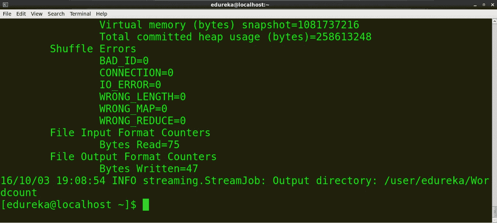

# Hadoop 流:用 Python 编写 Hadoop MapReduce 程序

> 原文：<https://medium.com/edureka/hadoop-streaming-58e003a39923?source=collection_archive---------0----------------------->


随着数字媒体、物联网以及其他发展的出现，每天生成的数字数据量呈指数级增长。这种情况给创建下一代工具和技术来存储和操作这些数据带来了挑战。这就是 Hadoop 流的用武之地！下图描绘了自 2013 年以来全球每年生成的数据的增长情况。IDC 预计，2025 年每年创建的数据量将达到 180 Zettabytes！


资料来源:IDC

IBM 表示，每天都有近 2.5 万亿字节的数据被创建，其中 90%的数据是在过去两年中创建的！存储如此庞大的数据量是一项具有挑战性的任务。Hadoop 可以比传统的企业数据仓库更高效地处理大量结构化和非结构化数据。它将这些巨大的数据集存储在分布式计算机集群中。Hadoop Streaming 使用 MapReduce 框架，该框架可用于编写处理海量数据的应用程序。

由于 MapReduce 框架是基于 Java 的，您可能会想，如果一个开发人员没有 Java 方面的经验，他/她将如何使用它。嗯，开发人员可以使用他们喜欢的语言编写 mapper/Reducer 应用程序，并且不需要太多 Java 知识，使用 *Hadoop Streaming* 而不是切换到 Pig 和 Hive 等新工具或技术。

# 什么是 Hadoop 流？

Hadoop Streaming 是 Hadoop 发行版附带的一个实用程序。可以用来执行大数据分析的程序。Hadoop 流可以使用 Python、Java、PHP、Scala、Perl、UNIX 等语言来执行。该实用程序允许我们使用任何可执行文件或脚本作为映射器和/或缩减器来创建和运行映射/缩减作业。例如:

$ HADOOP _ HOME/bin/HADOOP jar $ HADOOP _ HOME/HADOOP-streaming . jar

-输入 myInputDirs

-输出 myOutputDir

-制图仪/垃圾箱/猫

-减压器/箱/厕所

## 参数描述:


# Python MapReduce 代码:

```
mapper.py
#!/usr/bin/python
import sys
#Word Count Example
# input comes from standard input STDIN
for line in sys.stdin:
line = line.strip() #remove leading and trailing whitespaces
words = line.split() #split the line into words and returns as a list
for word in words:
#write the results to standard output STDOUT
print'%s    %s' % (word,1) #Emit the word
```


reducer.py

```
#!/usr/bin/python
import sys
from operator import itemgetter
# using a dictionary to map words to their counts
current_word = None
current_count = 0
word = None
# input comes from STDIN
for line in sys.stdin:
line = line.strip()
word,count = line.split('   ',1)
try:
count = int(count)
except ValueError:
continue
if current_word == word:
current_count += count
else:
if current_word:
print '%s   %s' % (current_word, current_count)
current_count = count
current_word = word
if current_word == word:
print '%s   %s' % (current_word,current_count)
```


**跑:**

1.  用以下内容创建一个文件，命名为 word.txt。

猫老鼠狮子鹿老虎狮子大象狮子鹿

2.将 mapper.py 和 reducer.py 脚本复制到上述文件所在的同一文件夹中。


3.打开终端并找到文件的目录。命令:ls:列出目录中的所有文件 cd:更改目录/文件夹


4.查看文件的内容。
命令:猫*文件名*


> mapper.py 的内容

*命令:cat mapper.py*


> reducer.py 的内容

命令:cat *reducer.py*


我们可以在本地文件(例如:word.txt)上运行 mapper 和 reducer。为了在 Hadoop 分布式文件系统(HDFS)上运行 Map 和 reduce，我们需要 *Hadoop Streaming jar。*因此，在我们在 HDFS 上运行脚本之前，让我们在本地运行它们，以确保它们运行良好。

>运行映射器

命令:*cat word . txt | python mapper . py*


>运行 reducer.py

命令:*cat word . txt | python mapper . py | sort-k1，1 | python reducer.py*


我们可以看到映射器和缩减器正在按预期工作，因此我们不会面临任何进一步的问题。

**在 Hadoop 上运行 Python 代码**

在 Hadoop 上运行 MapReduce 任务之前，将本地数据(word.txt)复制到 HDFS

>示例:*HDFS DFS-put source _ directory Hadoop _ destination _ directory*

命令:*HDFS DFS-put/home/edu reka/MapReduce/word . txt/user/edu reka*


**复制 jar 文件的路径**

基于 jar 版本的 Hadoop Streaming jar 的路径是:

*/usr/lib/Hadoop-2.2 . x/share/Hadoop/tools/lib/Hadoop-streaming-2.2 . x . jar*

在您的终端上找到 Hadoop Streaming jar 并复制路径。

命令:

ls/usr/lib/Hadoop-2 . 2 . 0/share/Hadoop/tools/lib/Hadoop-串流-2.2.0.jar


**运行 MapReduce 作业**

命令:

*Hadoop jar/usr/lib/Hadoop-2 . 2 . 0/share/Hadoop/tools/lib/Hadoop-streaming-2 . 2 . 0 . jar-file/home/edu reka/mapper . py-mapper . py-file/home/edu reka/reducer . py-input/user/edu reka/word-output/user/edu reka/word count*



Hadoop 为统计和信息提供了一个基本的 web 界面。当 Hadoop 集群运行时，在浏览器中打开 [http://localhost:50070](http://localhost:50070) 。下面是 Hadoop web 界面的截图。


现在浏览文件系统，找到生成的字数统计文件，以查看输出。下面是截图。


我们可以使用以下命令在终端上看到输出

命令:*Hadoop fs-cat/user/edu reka/word count/part-00000*


您现在已经学习了如何使用 Hadoop Streaming 执行用 Python 编写的 MapReduce 程序！如果你想查看更多关于人工智能、Python、道德黑客等市场最热门技术的文章，你可以参考 Edureka 的官方网站。

请留意本系列中解释大数据其他各方面的其他文章。

> *1。* [*Hadoop 教程*](/edureka/hadoop-tutorial-24c48fbf62f6)
> 
> *2。* [*蜂巢教程*](/edureka/hive-tutorial-b980dfaae765)
> 
> *3。* [*养猪教程*](/edureka/pig-tutorial-2baab2f0a5b0)
> 
> *4。* [*贴图减少教程*](/edureka/mapreduce-tutorial-3d9535ddbe7c)
> 
> *5。* [*HBase 教程*](/edureka/hbase-tutorial-bdc36ab32dc0)
> 
> *6。* [*HDFS 教程*](/edureka/hdfs-tutorial-f8c4af1c8fde)
> 
> *7。* [*Hadoop 3*](/edureka/hadoop-3-35e7fec607a)
> 
> *8。* [*Sqoop 教程*](/edureka/apache-sqoop-tutorial-431ed0af69ee)
> 
> 9。 [*水槽教程*](/edureka/apache-flume-tutorial-6f7150210c76)
> 
> *10。* [*Oozie 教程*](/edureka/apache-oozie-tutorial-d8f7bbbe1591)
> 
> *11。* [*Hadoop 生态系统*](/edureka/hadoop-ecosystem-2a5fb6740177)
> 
> *12。*[*HQL 顶级蜂巢命令与示例*](/edureka/hive-commands-b70045a5693a)
> 
> *13。* [*Hadoop 集群搭配亚马逊 EMR？*](/edureka/create-hadoop-cluster-with-amazon-emr-f4ce8de30fd)
> 
> *14。*T56*大数据工程师简历*
> 
> *15。* [*Hadoop 开发者-工作趋势与薪资*](/edureka/hadoop-developer-cc3afc54962c)
> 
> *16。* [*大数据教程*](/edureka/big-data-tutorial-b664da0bb0c8)

*原载于 2016 年 10 月 3 日*[*https://www.edureka.co*](https://www.edureka.co/blog/hadoop-streaming-mapreduce-program/)*。*