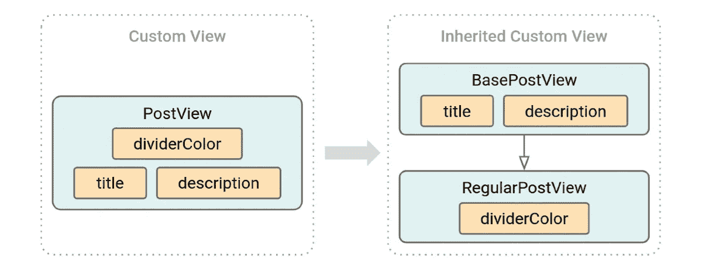
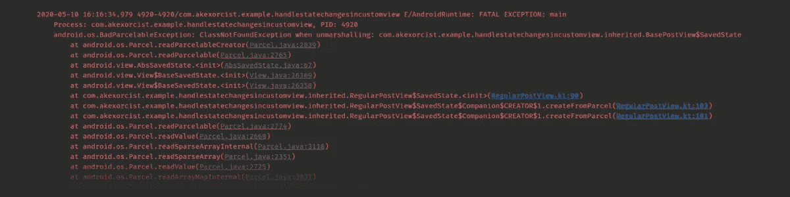
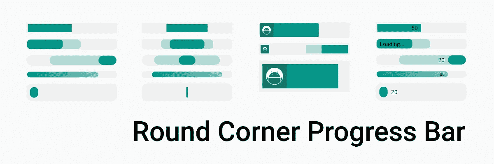
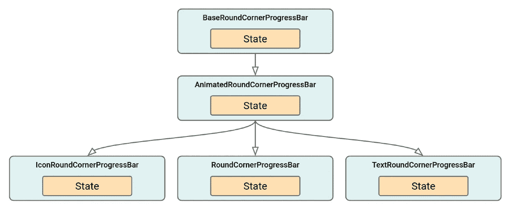

# 在继承的自定义视图中处理 Android 状态更改

> 原文：<https://medium.com/google-developer-experts/handle-android-state-changes-in-inherited-custom-view-60c77a121abf?source=collection_archive---------1----------------------->

使用非继承和继承的自定义视图

Photo by [Annie Spratt](https://unsplash.com/@anniespratt?utm_source=medium&utm_medium=referral) on [Unsplash](https://unsplash.com?utm_source=medium&utm_medium=referral)

在 Android 中，有一些我们称之为“状态变化”的行为，它们可能在许多情况下发生。平台是否会终止应用程序，以便为当前活动的应用程序或配置更改回收内存，这些配置更改会使用新配置重新创建运行活动的上下文。为了防止应用程序中的数据发生这些变化，我们必须处理每个活动、片段和视图中的状态。

使用来自 Android 框架或第三方库(正确处理状态更改)的现有视图，状态更改将由它自己处理。但是，当您创建自己的视图(称为“自定义视图”)时，您必须在自定义视图中添加额外的代码来处理状态更改。

比如我的`PostView`里面包含了 3 个状态(`title`、`description`、`dividerColorResId`)。

为了支持状态变化，我必须实现`onSaveInstanceState`和`onRestoreInstanceState`，并处理其中的所有状态。

如您所见，处理状态变化，您需要从`BaseSavedState`扩展而来的`SavedState`，以便在`onSaveInstanceState`被调用时将数据转换到 Parcelable，并从 Parcelable 恢复数据。

但是当状态直接改变时，Android 系统不持有 Parcelable。Parcelable 将被转换为 Parcelable 并保存在系统中，并在状态恢复时转换回 Parcelable。这就是为什么我们必须声明从`Parcelable.Creator`创建的`CREATOR`，以便通过`createFromParcel`将包裹转换回`SavedState` (Parcelable)

这段代码是在自定义视图中处理状态更改的一个常见示例。

不幸的是，它与**继承的自定义视图**不兼容。

# 继承自定义视图，如何？

取代单一(非继承)自定义视图，将代码分为基类和派生类。

`BasePostView`中的代码将是

而`RegularPostView`将会是

这两个类通过一个定制视图以相同的方式处理状态变化。`title`和`description`由`BasePostView`处理`dividerColorResId`由`RegularPostView`处理。

一切似乎都很好，直到应用程序崩溃，同时应用程序进程改变状态。

BasePostView.SavedState not found in RegularPostView when restoring from state change by the application process

# 这是怎么回事？

在继承的自定义视图中，使用`BaseSavedState`表示`SavedState`，使用`Parcelable.Creator`表示`CREATOR`只有在状态因配置变化而变化时才有效，而不是应用程序进程的状态变化。

在 Android 中，当用户长时间将你的应用程序放在后台时，Android 系统可能会通过杀死你的应用程序的进程来回收内存。而且能够在用户再次打开你的应用时恢复数据。

当应用程序进程从状态更改中恢复时，需要使用`CREATOR`中的类加载器进行宗地到可打包宗地的转换。但是在上面的例子中没有类加载器。所以`RegularPostView`不能恢复`BasePostView`中的状态(从`super`开始)。

从应用程序进程的状态更改中恢复，需要`CREATOR`中的类加载器进行宗地到可打包宗地的转换。但是在上面的例子中没有类加载器。所以`RegularPostView`无法恢复`BasePostView`中的状态(来自`super`)。

要以这种方式测试你的应用，只需将你的应用放入后台，在 Android Studio 的 Logcat 中点击`Terminates selected Android Application`，然后再次重新打开你的应用。

在谈如何解决这个问题之前。我们来谈谈…

# 为什么我使用继承的自定义视图而不是一个单独的自定义视图？

根据前面的示例代码，您可能会说“只需将所有代码保存在一个类中，因为它是自定义视图，仅此而已”。

我使用继承的定制视图的原因是定制进度条的 [RoundCornerProgressBar 库](https://github.com/akexorcist/RoundCornerProgressBar)。

在这个库中，我创建了 6 种具有共同逻辑的进度条。所以使用继承的自定义视图更适合将来维护它。(可重复使用+可维护=👍👍👍)

How I designed the class structure in RoundCornerProgressBar library

所有的类都有自己的状态要处理。所以`BaseSavedState`和`Parcelable.Creator`不再为我的库工作了。

然后，让我们回到前面的代码。

# 要在继承的自定义视图中解决这个问题

**首先是**，将`BaseSavedState`替换为`AbsSavedState`(这允许您确保保存层次结构中所有类的状态)到自定义视图的层次结构中的所有类。

`AbsSavedState`还有一个支持类加载器的`constructor(source: Parcel, loader: ClassLoader?)`。为了向后兼容，必须是来自`androidx.customview.view.AbsSavedState`的`AbsSavedState`,因为`android.view.AbsSavedState`的构造函数在 API 级别 24 或更高的版本中可用。

`androidx.customview.view.AbsSavedState`在 Android Jetpack 库的 CustomView 库中，也包含在 AppCompat 库中。

**第二个**，用`Parcelable.ClassLoader`替换`Parcelable.Creator`(允许创建者接收创建对象的类加载器)到自定义视图的层次结构中的所有类。

然后，再次测试自定义视图在每个状态下的变化行为。终于成功了！🎉🎉🎉

# 结论

使用`AbsSavedState`和`Parcelable.ClassLoaderCreator`来处理继承的自定义视图中的状态变化，这允许我们保存/恢复层次结构中所有类的状态。

即使是单个定制视图，如果你的项目包含两个定制视图，在它们中使用`AbsSavedState`和`Parcelable.ClassLoaderCreator`比在非继承和继承之间分离代码风格要好。

**您的项目中没有继承的自定义视图？不要担心。`BaseSavedState`和`Parcelable.Creator`仍然适用于您的自定义视图，无需替换。**

最后是本文的示例代码。请参见下面的链接

 [## akexorcist/HandleStateChangesInCustomView

### 在自定义视图和继承的自定义视图中处理 Android 状态更改—akexorcist/HandleStateChangesInCustomView

github.com](https://github.com/akexorcist/HandleStateChangesInCustomView) 

# 参考

*   [ABS saved state—Android Jetpack 中的 CustomView 库【API 引用】](https://developer.android.com/reference/kotlin/androidx/customview/view/AbsSavedState)
*   可包装的。ClassLoaderCreator [API 引用]