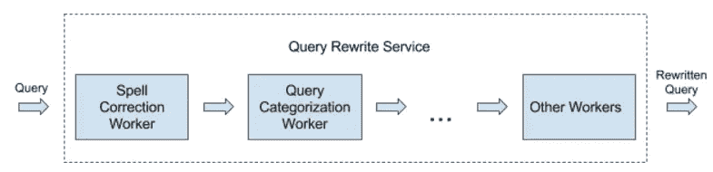
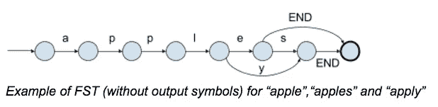

# 大规模处理大型数据集

> 原文：<https://medium.com/pinterest-engineering/handling-large-data-sets-at-scale-b45a6b82983c?source=collection_archive---------0----------------------->

Tim Koh |发现网站 Pinterest 工程师

每天都有数百万人在 Pinterest 上搜索创意。自从两年前推出[搜索指南](https://blog.pinterest.com/en/2-billion-monthly-idea-searches-and-counting)以来，我们现在每月处理 20 亿个搜索查询。我们的搜索栈的核心组件是我们的查询重写服务，我们用它来理解查询并根据需要重写它。我们在这个服务中进行许多键-值对查找，所以选择正确的数据结构至关重要。

键值对结构的一个常见解决方案是内存中的 HashMap，但是由于几个原因我们遇到了这个问题。首先，随着内存占用的持续增长，我们面临着垃圾收集问题，比如长时间的 GC 暂停。其次，将数据加载到内存变得越来越慢，这使得重新启动服务变得非常痛苦，并减缓了开发速度。但是我们太超前了。让我们先来看一下服务的简要概述。

## 体系结构

当开始搜索时，查询被传递给系统中的不同员工。每个工作线程执行一次重写，并输出最终重写的查询。工作人员需要访问各种数据源来做出重写决定。每个数据源都是一个键值存储，员工可以多次访问。例如，拼写校正工作者做许多查找来找到有效的和最可能的拼写校正。

## 要求

现在我们对系统有了一个简单的了解，接下来我们来谈谈需求。当我们为键值结构使用内存中的哈希映射时，服务的延迟小于 10ms，我们希望保持这种状态。因为我们对每个搜索查询都要进行多次查找，所以我们决定不依赖外部数据源，因为往返延迟代价太高。我们还需要较低的堆内存占用，以避免垃圾收集问题。最后，我们希望减少服务的启动时间。

我们探索了两种不同的解决方案，每一种都有自己的局限性。然而，我们认识到，如果我们结合解决方案，结果对我们很好。

## 有限状态转换器

有限状态转换器(FST)是一种特殊的有限状态，它将一个输入符号序列转换成另一个符号序列。FST 可以表示为有向图，其中每个节点表示一种可能的状态，每个边表示从一种状态到另一种状态的可能转换。每个边与一个输入符号和一个输出符号相关联。FST 可以通过从初始状态遍历图并累积与遍历的边相关联的输出符号来转换输入符号。FST 广泛用于自然语言处理。

因为 FST 将输入符号存储为直接图中的边，所以当字符串很短并且有许多重叠字符时，它可以有效地存储一组字符串。例如，一组字符串{“apple”、“apple”、“apply”}共享公共前缀“appl”的相同状态和边。另一方面，内存中的哈希映射需要存储原始字符串，因为不能保证它们的哈希值是唯一的。

Lucene 在 Java 中提供了 FST 的[实现](https://lucene.apache.org/core/6_1_0/core/org/apache/lucene/util/fst/package-summary.html)，所以我们构建了一个简单的基于 FST 的键值存储，其中键是从我们的搜索文档中提取的 NGram，值是这些 NGram 的归一化频率。一个烫手的工作从我们的搜索文档中提取 n gram，从提取的 n gram 构建 FST，并将 FST 二进制存储到亚马逊 S3 上。基于 FST 的 NGram 存储用于我们的索引管道和查询理解服务，以帮助分析搜索文档和查询。通过从内存哈希映射存储切换到基于 FST 的存储，我们将查询理解服务的内存消耗降低了 90%。

## HFile

[HFile](http://blog.cloudera.com/blog/2012/06/hbase-io-hfile-input-output/) 是 HBase 中使用的文件格式。我们使用 HBase 版本 0.98.13 来保持与其他系统的兼容性，但相同的概念也应该适用于其他版本。我们使用 HBase 中的代码作为库，直接从本地磁盘读取 HFile，而不是向 HBase 数据库发送网络请求。是的，磁盘读取很慢，但是 bloom filters 和缓存的使用改进了这个过程。使用 HFiles 对我们很有效，所以在这里我们将分享一些我们探索过的想法(因为如果它对我们有效，它也可以对你有效！).

在决定哪些数据集可以使用 HFiles 时，一个主要因素是数据的性质及其访问模式。因为 HFile 读取可以由一个 [bloom filter](https://en.wikipedia.org/wiki/Bloom_filter) 来保护，所以它在大多数查找是为了寻找数据集中不存在的键的情况下工作得非常好。例如，大多数拼写纠正查询都不是有效的单词，bloom filter 防止我们进行不必要的磁盘读取。

缓存还有助于减少磁盘读取次数。HBase 附带了一个[块缓存](http://hortonworks.com/blog/hbase-blockcache-101/)实现，我们几乎可以开箱即用(是的，其中涉及到一些调整，例如决定使用哪个缓存实现，以及为缓存分配多少堆内和/或堆外内存)。(这篇[博客文章](http://www.n10k.com/blog/blockcache-101/)很好地解释了不同的实现，[这篇文章](http://www.n10k.com/blog/blockcache-showdown/)提供了对其进行调整的见解。)不同的实现允许我们在堆外内存或磁盘(如 SSD)中缓存堆上的项目。当然，这是性能和您可以提供的数据量之间的权衡。然而，这使得 HFile 可以扩展到更大的数据集，因为我们不局限于堆。

另一个重要的考虑因素是用于数据的编码和/或压缩算法。(这些链接提供了关于选择正确算法的信息，[链接 1](https://archive.cloudera.com/cdh5/cdh/5/hbase-0.98.6-cdh5.3.8/book/compression.html) 和[链接 2](http://hadoop-hbase.blogspot.com/2016/02/hbase-compression-vs-blockencoding_17.html) 。)是否使用编码和/或压缩的问题并不明显，取决于数据和用例。显而易见的权衡是数据的大小与检索的速度，但是还有其他更微妙的考虑。例如，编码允许在缓存中存储较小的块大小，因此可以容纳更多的数据，但解码需要时间。此外，压缩使数据变得更小，因此磁盘读取速度更快，但是，解压缩也需要时间。另一个问题是在块被缓存之前还是之后对其进行解压缩。

从 HFiles 提供数据解决了上述两个问题。不需要将数据加载到内存中，这大大减少了启动时间，并且用于缓存的堆内存量是可配置的，因此我们可以对此进行调整以避免垃圾收集问题。此外，随着我们的数据规模不断增长，可扩展性的便利性是一大优势。使用 HFile 还为我们提供了产品改进的机会，因为我们能够支持在服务时需要大量数据的产品更改。

## 结论

FST 和 HFiles 都是解决我们面临的问题的好方法。由于使用 FST 节省了空间，我们可以将较小的数据集放在堆上。我们发现 FST 比 hfile 快一点，所以我们尽可能地使用 FST，对于太大而不适合内存的数据集使用 hfile。服务大型数据集的能力也为依赖大量数据的新产品功能带来了机会。通过使用这些结构，我们稳定了我们的系统，并使我们的开发人员更加快乐。

*致谢:感谢 Keita Fujii 共同撰写这篇文章并在我们的系统中实现 FSTs，也感谢 Roger Wang 在重要的优化方面提供的技术指导和帮助。*