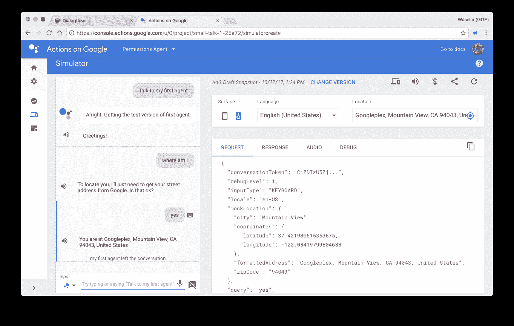

# 使用 Google 上的 DialogFlow 和 Actions 处理权限

> 原文：<https://medium.com/google-developer-experts/handling-permissions-with-dialogflow-and-actions-on-google-b08c8f228c00?source=collection_archive---------0----------------------->

> **更新 2019:本博客中使用的代码示例显示了已被弃用的 SDK v1。SDK v2 迁移流程请参考** [**此链接**](https://developers.google.com/actions/reference/nodejs/lib-v1-migration) **。如有疑问，请在** [**栈溢出**](https://stackoverflow.com/questions/tagged/actions-on-google) **或** [**Google+社区**](https://g.co/actionsdev) **上发帖。**

在为 Google Assistant 构建操作时，为了提供丰富的用户体验，您可能需要获取用户的姓名或位置。因为我经常被问到这个问题，所以我认为向您介绍处理这个用例的必要步骤会很有趣。让我们开始吧。

要获取她保存在谷歌账户上的用户名或位置，你需要请求她授予你访问权限；为此，你需要和她交谈，问她你需要获取什么样的信息。

让我们先写下用户“莉莉娅”和行动“R2D2”之间的对话“快乐之路”:

*   莉莉娅:让 R2D2 找到我
*   R2D2:要找到你，我只需要从谷歌上得到你的街道地址。可以吗？
*   莉莉娅:当然
*   R2D2:你现在位于美国加利福尼亚州山景城谷歌总部。

现在，让我们打开[对话流](https://dialogflow.com)来设计这个对话。

# TL；dr；

你着急吗？以下是处理权限工作流要遵循的步骤:

1.  创建一个将由 DialogFlow 触发的意图，其角色是向您的应用程序发送一个操作。
2.  在您的应用程序中，使用 [askForPermission](https://developers.google.com/actions/reference/nodejs/AssistantApp#askForPermission) ()助手让 Google 上的操作询问用户允许或拒绝您的应用程序访问她的私人信息。
3.  创建将由“**actions _ intent _ PERMISSION**”特殊事件触发的第二个意图，其作用是向您的应用程序发送一个操作。
4.  在您的应用程序中，使用 [isPermissionGranted](https://developers.google.com/actions/reference/nodejs/AssistantApp#isPermissionGranted) ()助手来检查用户的响应。使用正确的助手访问用户的信息。

# 在 DialogFlow 中设计对话

为了询问并访问用户的位置，我们需要创建两个意图:

1.  **request_permission** :当用户询问位置时，会触发这个意图。
2.  **user_info** :这一意图将由谷歌上的 Actions(阅读下文)的一个特殊事件触发。

下面是这个演示应用程序的服务器端代码(使用 Firebase 的[云函数):](https://firebase.google.com/docs/functions/)

## “请求许可”意图

在这个意图中，我们将提供一组示例话语，DialogFlow 将使用这些示例话语来匹配和触发这个意图，即:“找到我的位置”或“定位我”。

一旦这个意图被触发，我们将向我们的应用程序发送一个名为" **request_permission** "的动作。您可以随意命名此操作；但是要确保在 DialogFlow 和代码中使用相同的名称。

在应用程序端，我们将注册由 DialogFlow 发送的" **request_permission** "操作。我们将使用这个动作来调用[askForPermission](https://developers.google.com/actions/reference/nodejs/AssistantApp#askForPermission)helper 方法，提供我们想要访问权限的原因，即:“**来定位您**”，以及[DEVICE _ PRECISE _ LOCATION](https://developers.google.com/actions/reference/nodejs/AssistantApp#SupportedPermissions)权限。请参见下面代码中的第 8–10 行:

> 调用这个方法将发送一个**PLACEHOLDER _ FOR _ PERMISSION**响应到 Google 上的动作，这将触发"**来定位你，我只需要从 Google 上获得你的街道地址。可以吗？**消息。

## “用户信息”的意图

当用户回答问题:“**要找到你，我只需要从谷歌得到你的街道地址就可以了。可以吗？**”。

事实上，当 Actions On Google 问这个问题，用户回答“是”或“否”(同意或拒绝)；Google 上的 Actions 将向 DialogFlow 发送一个名为“**actions _ intent _ PERMISSION**”的事件。我们将利用这一事件来触发这一特定意图。一旦意图被触发，我们将确保向我们的应用程序发送“ **user_info** ”动作。

在应用程序中，我们将注册“user_info”操作，并确保检查用户是授予还是拒绝权限。为此，我们调用 [isPermissionGranted](https://developers.google.com/actions/reference/nodejs/AssistantApp#isPermissionGranted) 助手方法。我们还使用 [getDeviceLocation](https://developers.google.com/actions/reference/nodejs/AssistantApp#getDeviceLocation) 方法从 Google 访问用户的位置。请参见下面代码中的第 12–27 行:

# 好了

您可以在动作模拟中测试您的动作:

# 奖金

你知道吗？您可以通过 Firebase 的云功能在 DialogFlow 中直接构建和管理实现。因此，只需在内联编辑器中使用上面提供的代码，然后点击 deploy。现在，您已经准备好为 Google Assistant 测试您的操作。

*在 Twitter 上关注我*[*@ manekinekko*](https://twitter.com/manekinekko)*了解更多关于助手和 web 平台的信息。*