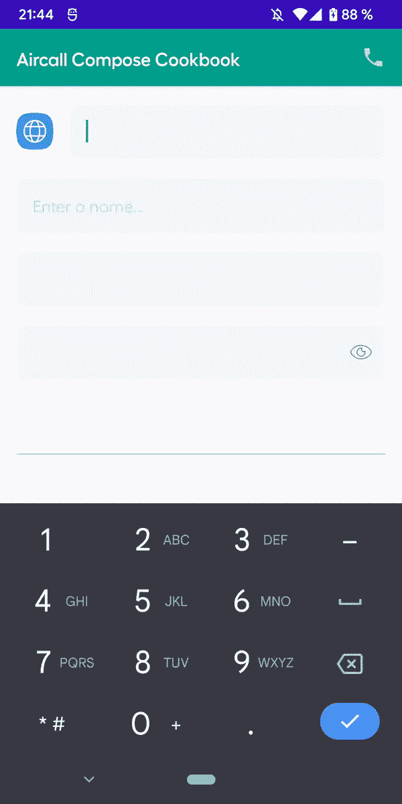

# 亲手用 Jetpack 编写 VisualTransformation 来创建电话号码格式化程序

> 原文：<https://medium.com/google-developer-experts/hands-on-jetpack-compose-visualtransformation-to-create-a-phone-number-formatter-99b0347fc4f6?source=collection_archive---------0----------------------->

在 Aircall，我们目前正在用 Jetpack Compose 重写我们的设计系统，这是 Google 制作的新 UI 框架。我们的 UI 组件之一是一个文本输入，它根据电话号码的来源国家将电话号码格式化为国际格式。有了 View UI toolkit，我们可以使用一个[**PhoneNumberFormattingTextWatcher**](https://developer.android.com/reference/android/telephony/PhoneNumberFormattingTextWatcher)来格式化输入文本，这个工具从 API 1 开始就可用了。但是到目前为止，Jetpack Compose 还没有实现类似的功能。在这篇文章中，我们将讲述我们是如何设法创建一个可靠的选择，用 [**可视化转换**](https://developer.android.com/reference/kotlin/androidx/compose/ui/text/input/VisualTransformation) 进行组合。

# VisualTransformation 解释

首先，让我们看一下 **VisualTransformation** 接口，了解它是如何工作的，以及如何使用它来格式化 **TextField** 的输入文本。

为了过滤文本，您需要实现 ***filter()*** 函数，该函数把要转换的原始文本作为一个参数，并返回一个[**transformed text**](https://developer.android.com/reference/kotlin/androidx/compose/ui/text/input/TransformedText)，所有的神奇都发生在这里！如果我们看一下构造函数，它需要一个 ***文本*** (将被转换)和一个[**offset mapping**](https://developer.android.com/reference/kotlin/androidx/compose/ui/text/input/OffsetMapping)**，这提供了原始文本和新文本之间的双向映射。这意味着我们需要实现从原来的和**到**的转换**。****

**让我们来看看框架提供的密码转换，看看 OffsetMapping 是如何工作的:**

**在这里，实现非常简单，因为我们只需要转换输入文本，其中每个字符都将被替换为掩码，因此文本将具有相同的长度。转换后的文本将包含映射文本，而 ***偏移映射*** 将处理转换。这里，由于我们没有任何额外的字符显示在返回的文本中，这两个函数将返回原始的偏移量。**

**如果我们需要在格式化文本中显示额外的字符，比如信用卡格式，这两种转换可能会变得更复杂。**

**如果我们想每 4 位数增加一个破折号，这里是 **OffsetMapping** 的实现。当我们转换原始文本时，只要我们到达一个新的 4 位数，我们就返回原始偏移量+破折号的数量。相反，当我们到达相关的 4 位数块时，我们将返回转换后的文本的偏移量减去破折号的数量。**

**现在我们已经很好地了解了用于构建国际电话号码格式化程序的 **VisualTransformation** 接口。让我们看看如何通过 [**libphonenumber**](https://github.com/google/libphonenumber) 库来实现格式化。**

# **将文本格式化为电话号码**

**为了格式化 TextField 的输入文本，我们使用了以下由 Google 开发和维护的库。**

** [## GitHub-Google/libphonenumber:Google 常用的 Java、C++和 JavaScript 库，用于解析…

### Google 的通用 Java、C++和 JavaScript 库，用于解析、格式化和验证国际电话号码…

github.com](https://github.com/google/libphonenumber) 

如果我们看一下[**PhoneNumberFormattingTextWatcher**](https://developer.android.com/reference/android/telephony/PhoneNumberFormattingTextWatcher)的实现，我们可以看到它使用电话号码库的内部版本来格式化输入文本。这将是对原文进行格式编排的坚实基础。

为了在输入时格式化文本，我们将使用一个来自库的 **PhoneNumberUtil** 实例的[**AsYouTypeFormatter**](https://github.com/google/libphonenumber/blob/master/java/libphonenumber/src/com/google/i18n/phonenumbers/AsYouTypeFormatter.java)。在构建新实例时，不要忘记使用正确的**区域设置**，以便为键入的电话号码设定所需的格式。

格式将取决于光标位置和最后一个非分隔符(*又名*键入数字的最后一位)。

为了正确地重新格式化输入，我们查看了来自 [Android Sources](https://android.googlesource.com/platform/frameworks/base/+/master/telephony/java/android/telephony/PhoneNumberFormattingTextWatcher.java#130) 中**PhoneNumberFormattingTextWatcher**的 ***reformat()*** 方法的实现，并对其进行了调整以适应我们的用例:

现在我们已经根据需要重新格式化了输入文本，我们将计算 VisualTransformation 所需的偏移量，以便在输入中进行适当的光标管理。

为了计算偏移量，我们将对格式化文本的每个字符进行迭代。首先，我们将检查该字符是否是分隔符，以便将该字符的索引存储在一个专用列表中，一个用于原始到转换后的文本，另一个用于其他方式。

在处理格式化文本时，我们将记录电话号码中出现的特殊字符的数量。这将帮助我们存储正确的索引，以便在从格式化形式转换到原始形式时保持光标的正确位置。

换句话说，当你想要编辑一个数字时，你可以点击它，光标就会在正确的位置。

现在我们有了完成电话号码格式化程序所需的一切，让我们看看如何构建这个新的电话号码输入，以及它在设计系统中的外观。

# 用撰写功能格式化电话号码

如果我们把所有的部分放在一起，我们的**文本字段**就有了一个全新的电话号码 **VisualTransformation** :

这是它在新的 Aircall 设计系统中的外观，PhoneNumberTextField 由一个图像和一个文本字段组成，前者显示国旗，后者显示格式化的电话号码。

使用 Compose，我们可以很容易地访问和设置文本转换参数的值，并对**PhoneNumberVisualTransformation()**进行新的定义，如下所示。

然后，我们可以构建一个自定义的 Composable，它可以检测国家代码并设置相应的标志，或者直接选择国家标志，以避免在输入文本中键入国际扩展名。多亏了 **VisualTransformation** ，文本输入将被实时格式化。

*PhoneNumberInput*

**

**使用 Jetpack Compose 创建这个电话号码格式化程序在许多方面都非常有趣:使用 **VisualTransformation** 理解框架的新部分，或者探索 Android 源代码以了解事情如何在幕后工作。Compose 允许我们非常容易地构建高度可定制的组件，即使我们必须从 Android 核心 API 重新实现一些东西。**

**这个格式化程序还不完善，可以改进，就像当你长按键盘上的退格键时，电话号码并没有被完全删除。**

**非常感谢 Aircall Android 团队将这个伟大的组件带入生活！🔥**

**如果你有任何问题，请不要犹豫，在推特上联系我🤓**