# 程序员节快乐:Kotlin 文章系列中的完整收集处理和特别开放研讨会提供🥳

> 原文：<https://blog.kotlin-academy.com/happy-programmers-day-complete-collection-processing-in-kotlin-articles-series-and-special-open-dab17fa62321?source=collection_archive---------3----------------------->

亲爱的程序员们！🙂庆祝国际程序员节的时间到了！🥳

程序员节在一年中的第 256 天庆祝——选择这一天是因为这是可以用一个 8 位字节表示的不同值的数量，以及小于 365 的 2 的最高幂。
多酷啊！
📣📣📣📣📣📣📣📣📣📣📣📣📣📣📣📣📣📣📣📣📣📣📣📣

下面是今天特别新闻简报内容的简要列表:

**柯特林文章系列**全集加工**马尔钦·莫斯卡兹 a:**

👉[kot Lin 中的采集处理:基本功能](https://kt.academy/article/fk-cp-basic)
👉[科特林采集处理:折叠缩小](https://kt.academy/article/fk-cp-fold)👉[kot Lin 中的收集处理:使用索引](https://kt.academy/article/fk-cp-indexed)
👉[kot Lin 中的收款处理:拖放](https://kt.academy/article/fk-cp-drop-take)
👉[kot Lin 中的收集处理:查找、计数、](https://kt.academy/article/fk-cp-find-count) 和检查条件
👉[kot Lin 中的收集处理:分组元素](https://kt.academy/article/fk-cp-grouping)和
👉[kot Lin 中的采集处理:关联元素](https://kt.academy/article/fk-cp-associate)
👉[kot Lin 中的收集处理:排序、洗牌和反转](https://kt.academy/article/fk-cp-sorting)
👉[kot Lin 中的集合处理:开窗、压缩和分块](https://kt.academy/article/fk-cp-windowing)
👉[kot Lin 中的收集处理:结束](https://kt.academy/article/fk-cp-ending)

文章是来自**功能 Kotlin** 书的部分。你可以在这里找到这本书的早期版本。📖

❗特惠— **3 场公开工作坊** ❗
👉[科特林花冠开放工场](https://kt.academy/workshop/coroutines/form/public/coroutinesOct2022/register)👉[Python 开放工作坊中的机器学习](https://kt.academy/workshop/machineLearningPython/form/public/machineLearningPythonOct2022/register)
👉[高级科特林开放式车间](https://kt.academy/workshop/kotlinAdvanced/form/public/advancedKotlinOct2022/register)

查看时事通讯末尾的特价信息

尽情享受吧！🙃

[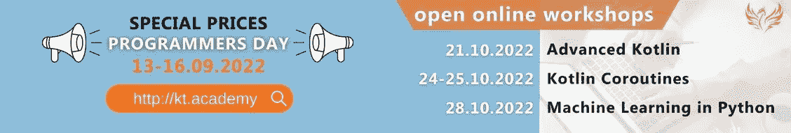](http://kt.academy)

函数式编程最有用的应用之一是**集合处理**。让我们了解基本的集合处理函数。这也是由**Marcin moska a**撰写的关于**函数集合处理函数**的系列文章的开始。

第一部分:
**基本功能**👇

[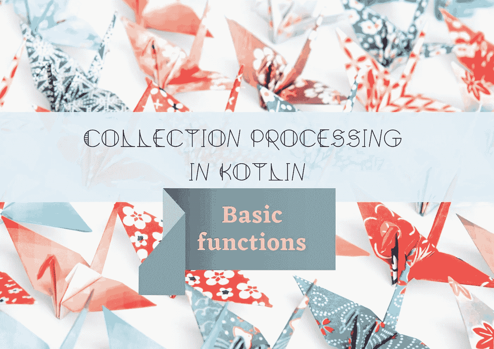](https://kt.academy/article/fk-cp-basic)

[Collection processing in Kotlin: Basic functions](https://kt.academy/article/fk-cp-basic)
You can find the early access to the book below 👇
[[Early Access] Functional… by Marcin Moskała [PDF/iPad/Kindle] (leanpub.com)](https://leanpub.com/kotlin_functional)

几乎所有**采集处理功能背后都有折叠支架。** Fold 和 reduce 是我们的超级代理，当我们找不到更具体的集合处理函数时，我们可以使用它们。

第二部分:
**折叠缩小**👇

[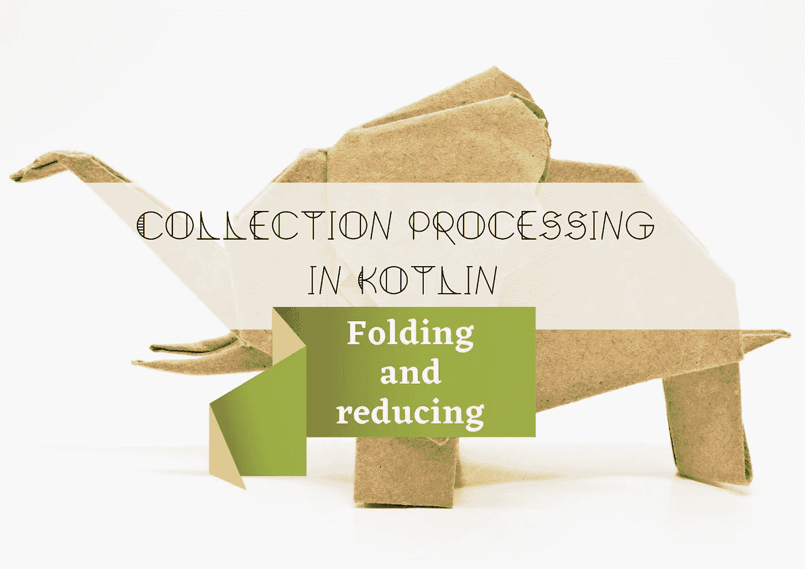](https://kt.academy/article/fk-cp-fold)

[Collection processing in Kotlin: Folding and reducing](https://kt.academy/article/fk-cp-fold)
🔻 You can find the Early Access to the book below 👇
[[Early Access] Functional… by Marcin Moskała [PDF/iPad/Kindle] (leanpub.com)](https://leanpub.com/kotlin_functional)

仅仅因为我们使用一个函数处理函数，并不能阻止我们使用索引。让我们了解一下重要函数的**within index 和 indexed 变体。**
第三部分:
**使用索引**👇

[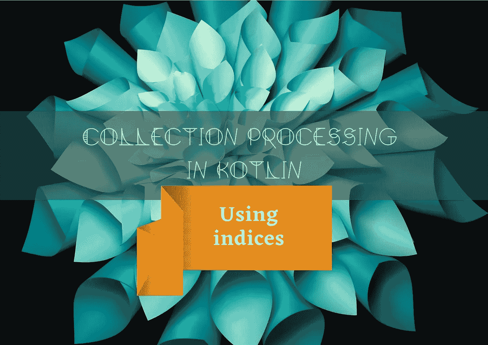](https://kt.academy/article/fk-cp-indexed)

[Collection processing in Kotlin: Using indices](https://kt.academy/article/fk-cp-indexed)
🔻 You can find the Early Access to the book below 👇
[[Early Access] Functional… by Marcin Moskała [PDF/iPad/Kindle] (leanpub.com)](https://leanpub.com/kotlin_functional)

如何取除第一个 n 以外的所有的前 n 个元素？来学习一下 **drop，take，dropLast，takeLast。**
第四部分:
**落而取之👇**

[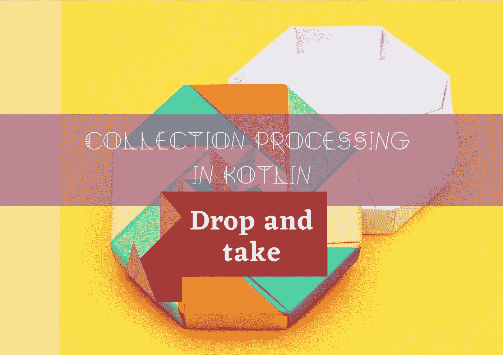](https://kt.academy/article/fk-cp-drop-take)

[Collection processing in Kotlin: Drop and take](https://kt.academy/article/fk-cp-drop-take)
🔻 You can find the Early Access to the book below 👇
[[Early Access] Functional… by Marcin Moskała [PDF/iPad/Kindle] (leanpub.com)](https://leanpub.com/kotlin_functional)

让我们学习一下**寻找元素**，计算那些满足谓词的元素，或者检查所有元素的谓词。
第 5 部分:
**查找、计数和检查条件👇**

[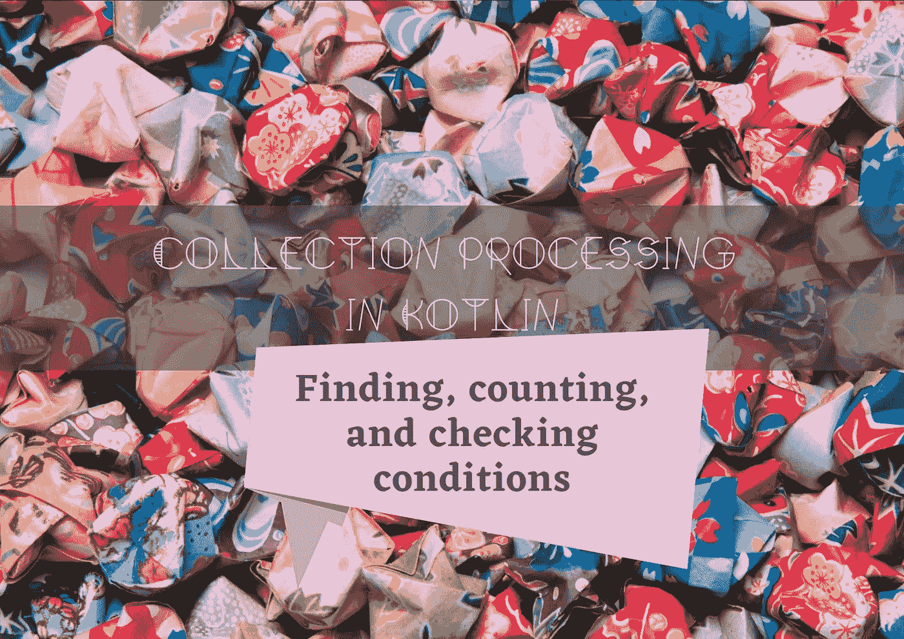](https://kt.academy/article/fk-cp-find-count)

[Collection processing in Kotlin: Finding, counting, and checking conditions](https://kt.academy/article/fk-cp-find-count)
🔻 You can find the Early Access to the book below 👇
[[Early Access] Functional… by Marcin Moskała [PDF/iPad/Kindle] (leanpub.com)](https://leanpub.com/kotlin_functional)

我们如何在 Kotlin 中对集合元素进行分组，这在各种算法中有什么用？
第六部分:
**分组元素👇**

[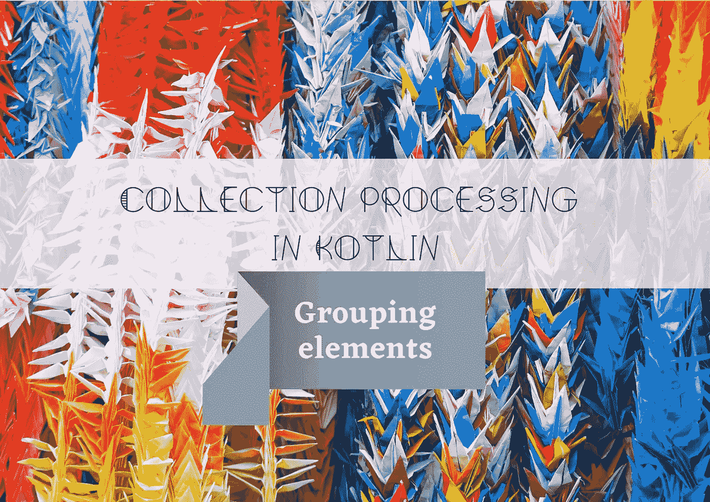](https://kt.academy/article/fk-cp-grouping)

[Collection processing in Kotlin: Grouping elements](https://kt.academy/article/fk-cp-grouping)
🔻 You can find the Early Access to the book below 👇
[[Early Access] Functional… by Marcin Moskała [PDF/iPad/Kindle] (leanpub.com)](https://leanpub.com/kotlin_functional)

我们如何使用**关联函数**将集合转换成地图？
第七部分:
**关联元素**👇

[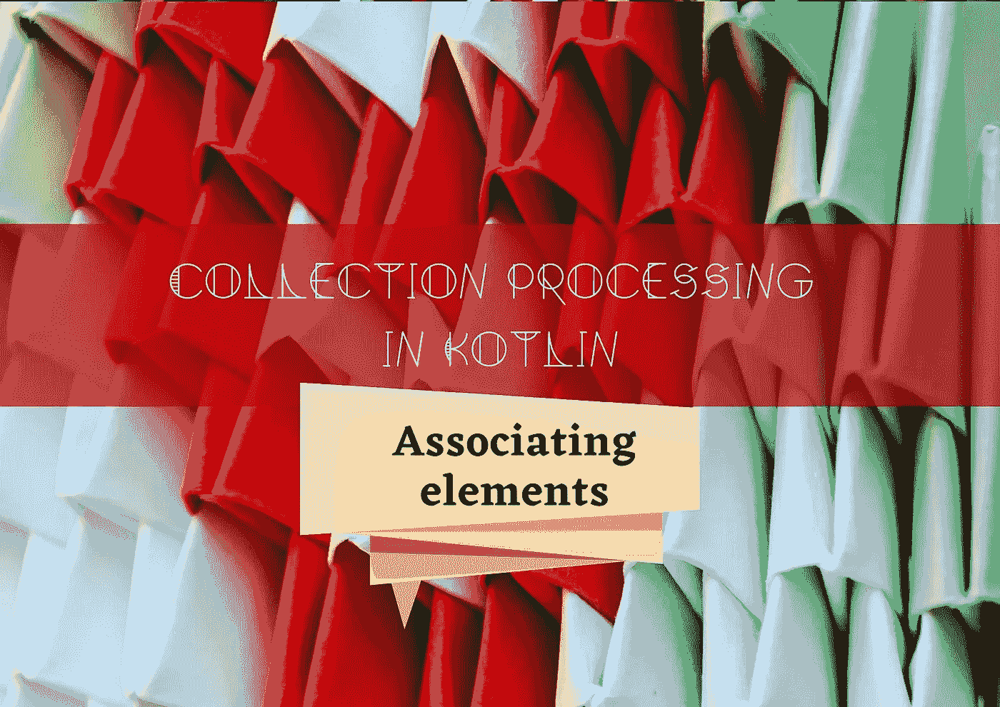](https://kt.academy/article/fk-cp-associate)

[Collection processing in Kotlin: Associating elements](https://kt.academy/article/fk-cp-associate)
🔻 You can find the Early Access to the book below 👇
[[Early Access] Functional… by Marcin Moskała [PDF/iPad/Kindle] (leanpub.com)](https://leanpub.com/kotlin_functional)

使用元素的顺序、键或多个键对元素进行排序…在 Kotlin 中了解**对集合进行排序。
第八部分:
**排序、洗牌和反转**👇**

[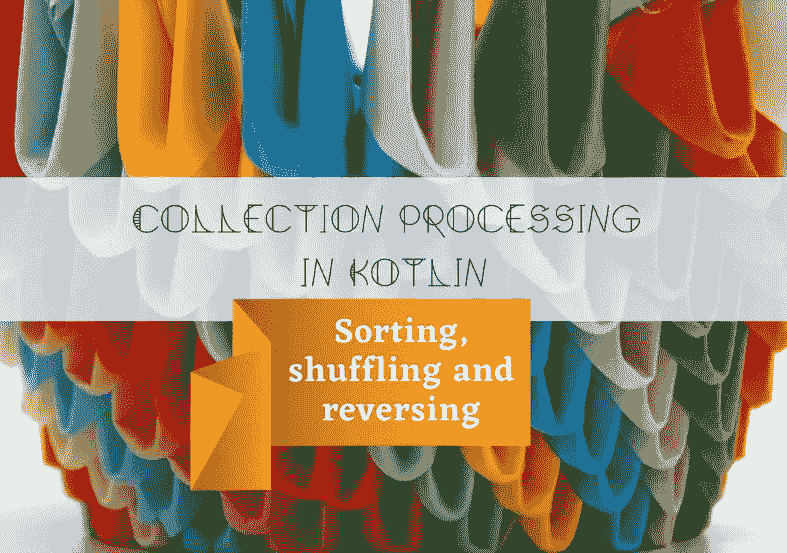](https://kt.academy/article/fk-cp-sorting)

[Collection processing in Kotlin: Sorting, shuffling, and reversing](https://kt.academy/article/fk-cp-sorting)
🔻 You can find the Early Access to the book below 👇
[[Early Access] Functional… by Marcin Moskała [PDF/iPad/Kindle] (leanpub.com)](https://leanpub.com/kotlin_functional)

先来了解一下最神秘的两个集合处理函数:**开窗和分块。**
第九部分:
**开窗、压缩和分块**👇

[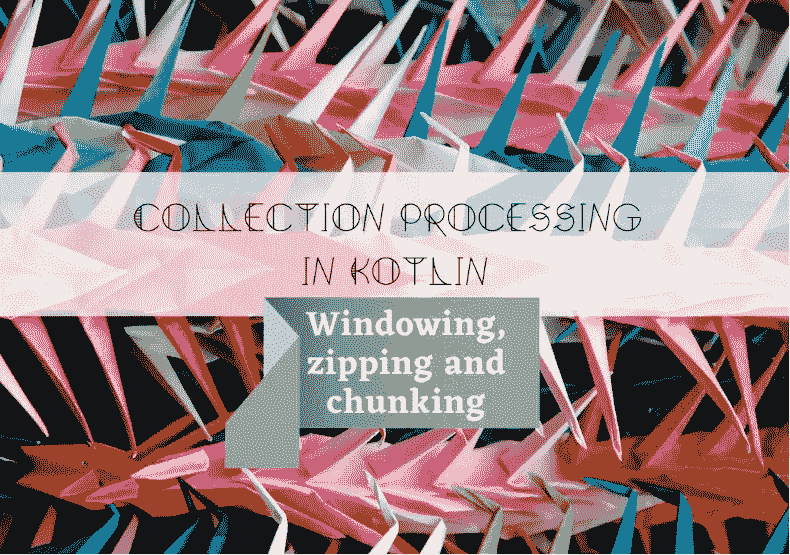](https://kt.academy/article/fk-cp-windowing)

[Collection processing in Kotlin: Windowing, zipping, and chunking](https://kt.academy/article/fk-cp-windowing)
🔻 You can find the Early Access to the book below 👇
[[Early Access] Functional… by Marcin Moskała [PDF/iPad/Kindle] (leanpub.com)](https://leanpub.com/kotlin_functional)

由**Marcin moska a**撰写的收集处理系列的最后一篇文章，其中我们将了解 **joinToString、**以及在 Kotlin 中处理不同种类对象的一般概念。
第十部:
**结局**👇

[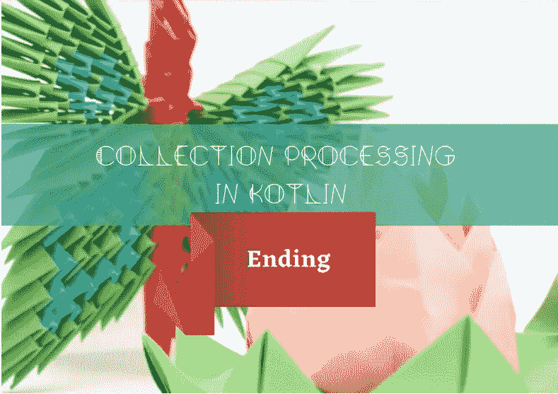](https://kt.academy/article/fk-cp-ending)

[Collection processing in Kotlin: Ending](https://kt.academy/article/fk-cp-ending)
🔻 You can find the Early Access to the book below 👇
[[Early Access] Functional… by Marcin Moskała [PDF/iPad/Kindle] (leanpub.com)](https://leanpub.com/kotlin_functional)

[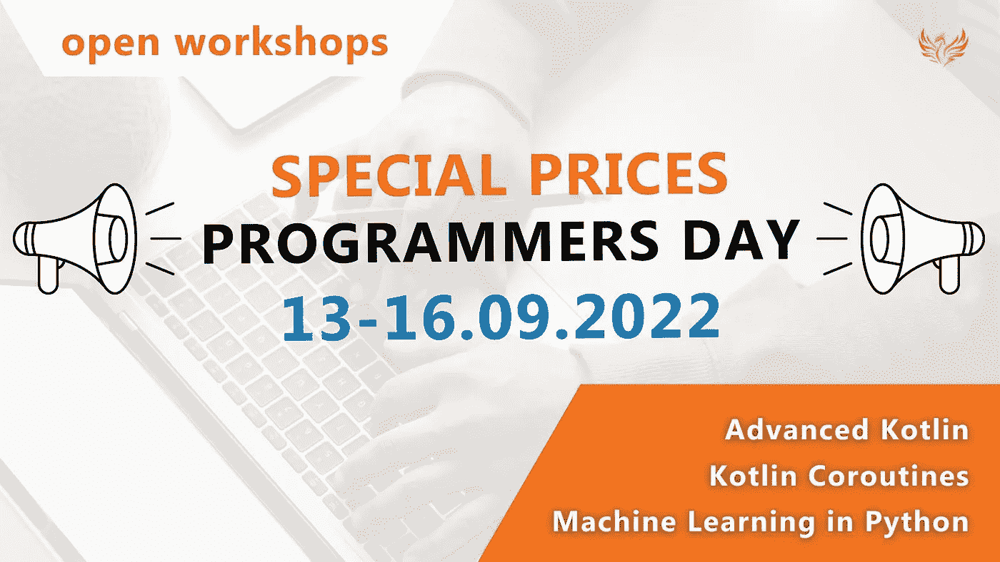](http://kt.academy)

❗特价❗

👉[科特林协同程序开放工作坊](https://kt.academy/workshop/coroutines/form/public/coroutinesOct2022/register)由**马尔钦·莫斯卡兹**
与代码程序员日 **— 250 €**

[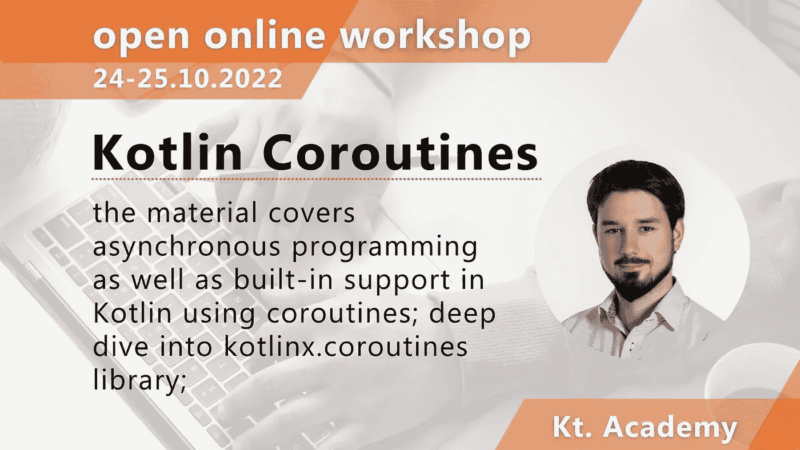](https://kt.academy/workshop/coroutines#register)

👉[Python 开放工作坊](https://kt.academy/workshop/machineLearningPython/form/public/machineLearningPythonOct2022/register)中的机器学习 **Mateusz Dorobek**
与代码程序员日— **150 €**

👉[Aleksander Ihnatowicz**主持**高级 Kotlin 开放式工作坊](https://kt.academy/workshop/kotlinAdvanced/form/public/advancedKotlinOct2022/register)。
同代码程序员节— **150 €**

[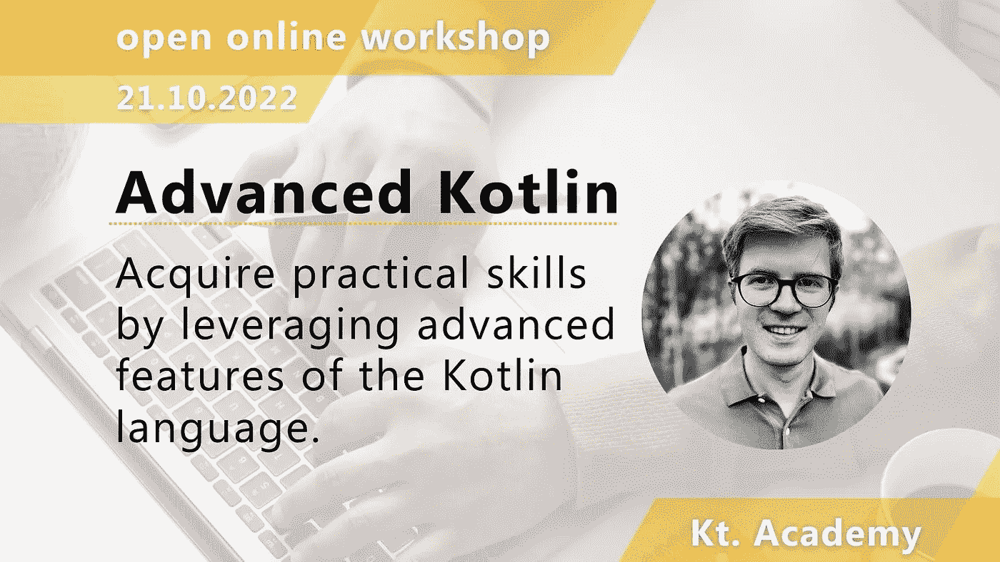](https://kt.academy/workshop/kotlinAdvanced#register)

选择最适合您的一个，并立即注册。
**代码验证:仅限 9 月 13 日—16 日！**

🥳🥳🥳🥳🥳🥳🥳🥳🥳🥳🥳🥳🥳🥳🥳🥳🥳🥳🥳🥳🥳🥳🥳🥳

快乐编码，享受你的特殊日子！🥳:这就是我们今天的全部内容🙂

如果你有什么想告诉我们的，请回复这封邮件让我们知道！💌

敬请期待！👌
Kt。学院团队

www: [kt.academy](https://kt.academy/)
博客:[blog.kotlin-academy.com](http://blog.kotlin-academy.com/)
推特 EN:[@ ktdotsacademy](https://twitter.com/ktdotacademy)
推特 PL:[@ ktdotsacademypl](https://twitter.com/ktdotacademyPL)
FB:[@ ktdotsacademy](https://www.facebook.com/KtDotAcademy)
LinkedIn:[@ Kt。学院](https://www.linkedin.com/company/kt-academy/)

