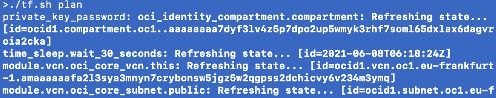

# 强化 OCI Terraform 提供商身份验证安全性

> 原文：<https://medium.com/oracledevs/hardening-the-oci-terraform-provider-authentication-security-c0f2b92ffb3a?source=collection_archive---------0----------------------->


如果你想从你的机器*，*上运行 Terraform 脚本，你需要确保你是安全的。Terraform 非常强大，如果一个流氓演员设法冒充你，他们可能会完全访问你的 OCI 环境，这取决于你被授权做什么。

如果您刚刚开始使用 OCI，您可能已经创建了一个*未加密的 API 密钥*，并在您的 OCI CLI 和/或 Terraform 脚本中使用了它。如果有，*请删除它，现在！*

如何知道自己使用的是未加密的密钥？如果你的地形看起来像这样

```
provider "oci" {
  tenancy_ocid          = "ocid1.tenancy.oc1......"
  user_ocid             = "ocid1.user.oc1......"
  fingerprint           = "aa:bb:cc:dd:ee:ff:..."
  private_key_path      = "~/.oci/mykey.pem"
}
```

并且它工作，那么是的，你正在使用未加密的密钥。你怎么知道？因为如果密钥被加密，OCI 提供者将不会抱怨丢失密码短语。

我大概不用强调这有多糟糕，对吧？只是用了“你有的东西”。有些东西会被偷。我确信您的本地存储和备份驱动器都是加密的，但是您仍然不应该在任何生产环境中使用未加密的密钥。

**使用密码加密密钥**

假设你有一个密码加密的密钥(如果你没有，请遵循这些步骤[),故事还没有结束。问题是，如何管理密码短语本身？](https://docs.oracle.com/en-us/iaas/Content/API/Concepts/apisigningkey.htm)

```
provider "oci" {
  tenancy_ocid          = "ocid1.tenancy.oc1......"
  user_ocid             = "ocid1.user.oc1......"
  fingerprint           = "aa:bb:cc:dd:ee:ff:..."
  private_key_path      = "~/.oci/mykey.pem"
  private_key_password  = "hunter2"
}
```

那显然不是解决方案。这并不比使用未加密的密钥更好，在我的书中，这甚至更糟。

显然，我们需要将密码作为变量传递，但是我们如何安全地做到这一点呢？

人们希望将变量声明为 sensitive 会使 tf 编写 echo:

```
provider "oci" {
  ...
  private_key_password  = var.private_key_password
}variable private_key_password {
  sensitive=true
}
```

但是目前，tf 只在打印 plan/apply 时编辑变量输出，而在明文中愉快地回应它。也许那并不可怕，但我对此不太满意。*有一个 tf* [*问题*](https://github.com/hashicorp/terraform/issues/28122) *要改一下，*以防你想给你的+1。


那现在怎么办？设置 TF_VAR 或传递 passphrase 作为参数会更糟糕，因为您的 passphrase 会出现在您的 shell 历史文件中。呀！

另一种方法是创建一个简单的 shell 脚本，提示输入密码，分配一个变量并调用 terraform，如下所示:

```
read -r -s -p "private_key_password: " TFPWD
TF_VAR_private_key_password=$TFPWD terraform "$@"
```

这个脚本会提示输入密码短语，而*不会回显。*然后 in 会给 TF_VAR_ variable 赋值，并调用 terraform，传递任何参数给它。


提示 terraform 使用加密密钥执行后:



好的一面是，只要 terraform 在运行，密码就会保存在内存中。一旦它完成并且控制返回到 bash，*变量就消失了*。

诚然，这并没有消除风险，因为控制你的机器的黑客也可能安装键盘记录器，但至少我们增加了另一个攻击者需要解决的问题。

**跳过密钥，使用安全令牌认证**

还有另一个选择，就是根本不用按键！相反，您可以将提供者配置为[使用安全令牌](https://docs.oracle.com/en-us/iaas/Content/API/SDKDocs/clitoken.htm)认证。

假设您已经安装了 OCI CLI，首先调用

```
oci session authenticate
```

你将需要选择 OCI 地区，一旦你这样做，它将打开一个网页浏览器，并验证你对 OCI 租赁。一旦您通过验证，它将询问您想要创建的配置文件名:

```
Completed browser authentication process!Enter the name of the profile you would like to create:
```

我把我的叫做“tf”(没有引号)。现在，我可以配置提供者使用令牌:

```
provider "oci" {
  auth = "SecurityToken"
  config_file_profile = "tf"
}
```

记住，代币只有一个小时的有效期。您可以使用以下内容刷新它

```
oci session refresh --profile <profile_name>
```

但是一旦过期，就从

```
oci session authenticate
```

用相同的配置文件名保存它(在我的例子中是“tf”)，你就可以开始了！

*这不是甲骨文的官方博客。这里的信息可能过时或不正确。观点是我自己的。*