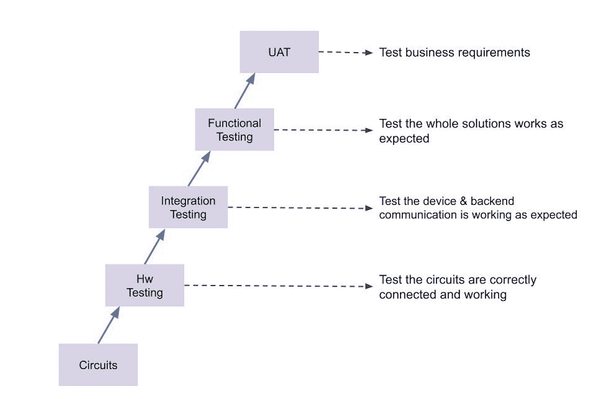
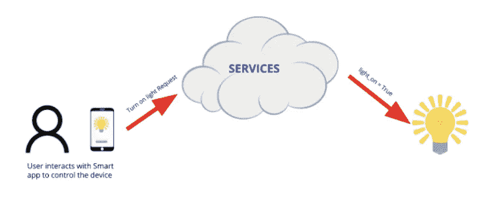
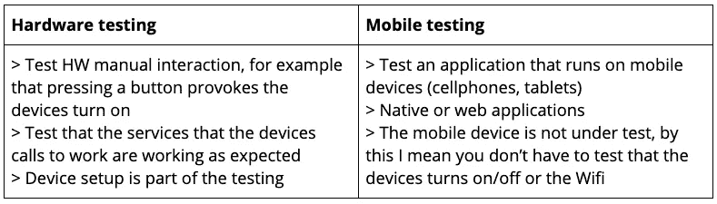
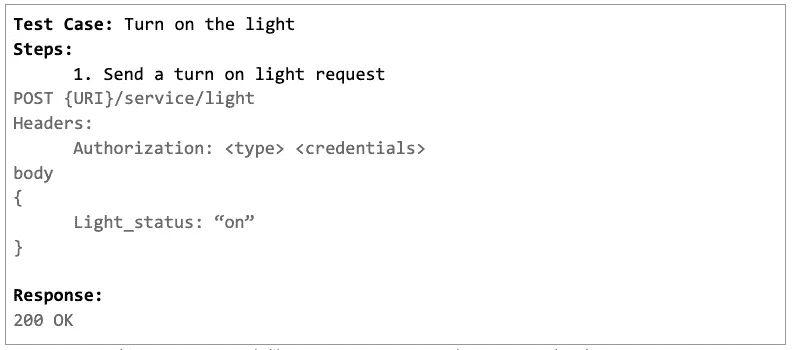
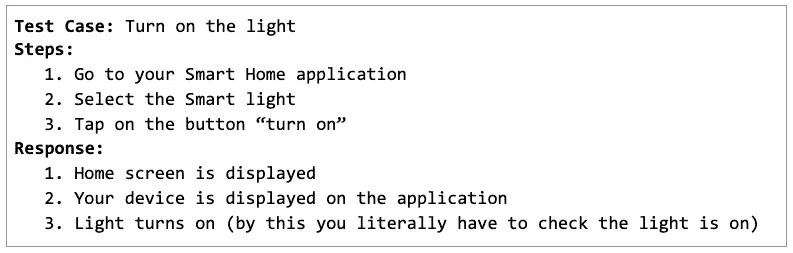

# 硬件测试

> 原文：<https://medium.com/globant/hardware-testing-80c1eb698ae6?source=collection_archive---------0----------------------->

# 第一部分。集成测试

阿德里安娜·罗伯斯

在我们开始讨论如何测试一个硬件之前，我们先来记住*硬件的定义。*硬件是一种由电路、电缆、塑料、金属等构成的东西，用于完成一项功能，比如当你不在家时，一个摄像头可以用来监视你的家，或者一个智能手表可以帮助你连接到手机的主要功能，并跟踪你的锻炼计划，这只是举几个硬件例子。

现在，你正在考虑所有那些可以在你家里安装的设备，以创建一个“智能家居”和无限的可能性，让它们相互通信，并拥有难以置信的功能，如运行一个*智能程序*(指令序列)来武装你的家，锁门和打开你的相机，所有这些都是通过说“嘿，谷歌/Siri/Alexa …我会回来的”，现在想象一下测试团队必须分析和设计的所有组合，以测试所有这些，并让所有这些设备在你家里按预期工作。这仅仅是个开始，在这篇文章中，你将会有一个关于这个测试是如何完成的良好基础。

## 你需要知道什么？

由于软件测试有不同的级别(您可能还记得 ISTQB 中的 V 模型)，硬件测试也有不同的级别。

如标题所示，我将讨论集成测试级别，根据我在硬件测试团队的经验，硬件级别由电气工程师完成，单元测试由开发团队完成。

首先要记住的是，每当你通过按下按钮、触摸屏幕或者只是通过说*“Alexa……”*/*“嘿，谷歌……”*/*“Siri……”*来与一些硬件进行交互时，你的动作会被转换为调用服务的请求，该服务会检索你的硬件可以解释的响应，并执行你所请求的功能。

进行硬件集成测试(调用服务)时，需要考虑以下几点:

*   快乐路径需要测试，例如，当你发送改变颜色灯、开/关灯、改变温度(智能恒温器)、锁门(智能锁)、流式传输家庭摄像机等请求时。
*   授权测试，重要的是测试当您使用无效凭证进行请求时，服务是否检索到错误。
*   错误场景，您需要验证错误消息和代码是否正确处理了格式错误的请求。

为了澄清硬件功能测试和集成测试之间的区别，当您进行硬件功能测试时，您将测试:

*   与设备的财务互动
*   例如，通过查看灯是否亮或门锁是否锁好来验证设备的功能。
*   使用不同的凭据登录智能应用程序，并确认您看不到智能设备或无法与之交互。

还有一点需要强调的是，硬件测试不同于移动测试，当你进行移动测试时，你是在测试移动版本的应用程序或网站，但你不是在进行硬件测试，你只是使用硬件(手机)作为工具来测试应用程序。

Compares HW testing VS Mobile Testing

准备好，你将会做很多后端测试。

## 我们来做硬件集成测试吧！

在我们所有的测试过程中，您需要识别和理解业务需求，分析它们，并定义测试用例。当您定义这些测试用例时，您将使用硬件调用的后端作为测试主题来编写它们，并编写测试用例来验证功能对硬件的影响(您与设备交互的测试用例)。

让我们做一个练习。智能灯可以执行 3 个基本功能(仅举几个例子)，开/关、改变光强度和改变光的颜色。后端集成的一个例子是:

**TIP**: To execute this you can use tools like Postman, SOAP UI, Curl, Rest Assured and so on.

以上面的同一个例子为例，验证这一点的测试用例实际上会引发设备中的某些问题:

现在，您可能会想“那么我必须测试两次，一次直接调用后端，另一次通过与设备交互”，答案是否定的，您不必进行两次相同的测试，我的建议是通过后端进行大部分测试，因为后端更快，如果后端响应正常，您可以 70%确定您的设备将完成功能，但另外 30%是基本的硬件交互测试，您需要确保功能正常工作。例如，在后端，您可以进行格式错误的请求，发送带有无效凭据的请求，打开灯两次并验证第二次发送错误，您可以发送要设置的无效颜色，在前端，您可以测试基本功能，即当您打开/关闭时，它会工作，当您选择一种颜色时，它会改变。

## 结论

进行硬件测试不同于进行移动测试，当您进行这种测试时，请确保您熟悉后端测试，并且如果您打算在硬件测试集成级别开始进行自动化测试，我建议您从服务自动化测试方法开始，所有需要与硬件交互的测试都将手动完成。您可以为设备使用仿真器，但在健全性测试中，确保后端和真实硬件正确通信，确保功能和要求得到满足始终是非常重要的。

这仅仅是个开始，在下一篇文章中，我将讨论自动化、报告和虚拟设备。