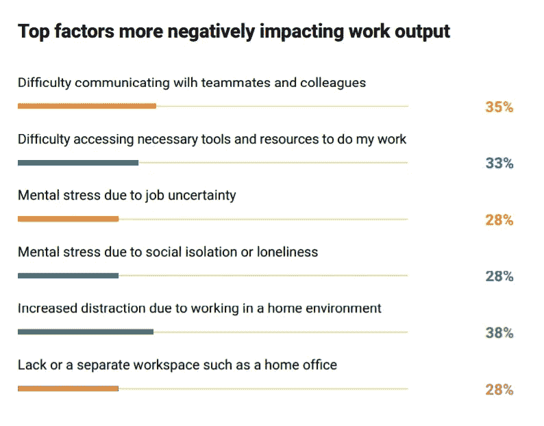

# 利用技术培育公司文化

> 原文：<https://medium.com/globant/harnessing-technology-to-foster-company-culture-9fe66d127d64?source=collection_archive---------1----------------------->

在不确定的时代，人们正在适应远程交互和活动，公司正在转向 Zoom 和 Google Meet 等数字工具，以执行日常任务并保持联系。尽管如此，如果你不采取具体措施将人们聚集在一起，办公室缺乏随意的互动会很快对生产力和积极性产生影响。反过来，这可能会逐渐腐蚀，最终甚至破坏你的公司文化。

许多公司发布了研究，以了解在家订单对工作场所生产率的影响。在 Globant，我们[调查了 900 多名美国员工](https://www.globant.com/stay-relevant/sentinel-report/supporting-employee-productivity-during-covid-19)，发现 49%的人表示他们的工作产出减少了。YouGov 强调指出 [25%的人](https://amp-usatoday-com.cdn.ampproject.org/c/s/amp.usatoday.com/amp/3061862001)感觉他们的生产力下降了。在欧洲，Forrester Research 报告称[近三分之一的人](https://www.com-magazin.de/praxis/digitalisierung/virus-digitalisierung-vorantreibt-2544127.html)对自己的工作效率不满意，几乎一半的人希望尽快回到办公室。

但是，除了工作效率之外，这些发现最重要的一点可能是，43%的人说他们与同事的交流比疫情之前少了，51%的人说他们在家工作感到孤独。这对于从员工的精神健康到组织的创新能力等方方面面都有着长期的影响。

Source: *Globant report “*[*Supporting Employee Productivity During Covid-19*](https://www.globant.com/stay-relevant/sentinel-report/supporting-employee-productivity-during-covid-19)*”*

因此，对于组织来说，创建和实施策略来维持同事之间的健康关系、培养公司价值观和保持组织精神的活力是至关重要的。这种战略是我们确定的构成“扩大组织”的三大支柱之一，即应用技术变得更加灵活和创新。这三大支柱是:

1.  **利用科技促进文化交流&人际关系**
2.  **需要促进协作和生产力的组织结构**
3.  **战略性使用人工智能增强团队能力**

在这篇文章中，我们想把重点放在第一个支柱上——利用技术来培养文化和人际关系。

**利用技术提升你的文化**

越来越多的领导者希望通过技术来帮助识别和改善员工对组织价值观的认知和体验。这就是我们所说的“增强文化”的核心。建立了增强文化的公司能够有效地使用人工智能和其他工具来培养人类行为最重要的方面，从而提高在家工作时的生产力；联系、理解和认可他人的能力。

因此，强化文化给专业领域带来了情感联系——这是实现目标和创新的关键因素。

像 [StarMeUp OS](https://os.starmeup.com/en.html) 这样的数字平台，利用数据和见解帮助组织创造一个让人们充满激情和活力的氛围。例如，“ [BeThere](https://os.starmeup.com/en/solutions/extend-organizational-culture.html) ”是一个内部社交网络，是一个类似 Instagram 的应用程序，员工可以在这里分享成为公司一员的感受。其他解决方案使员工能够轻松分享信息，向同事提供认可和积极反馈。

这些数字文化平台的优势包括文化洞察力，如分析和预测员工参与度、个人领导潜力、坚持公司价值观等。这种解决方案不仅允许公司实时了解组织动态，而且也是获得文化洞察力的优秀解决方案，这对于组织计划的成功至关重要。

StarMeUp 操作系统的另一个关键方面是其预测能力，高管和经理可以使用真实的指标来制定决策、创建未来情景以及制定短期和长期计划。

**数字文化平台是扩大合作的核心组成部分**

我们知道人们认为对于建立伟大的公司文化至关重要的组成部分。[我们在 2019 年的研究](https://www.starmeup.com/blog/en/people-analytics/how-technology-enhances-organizational-culture/)显示了 4 个关键驱动因素:对技能的认可、持续的反馈、与同事的互动以及参与创新计划。在当今物理距离遥远的世界，数字平台在维护和培养这些驱动因素方面变得至关重要。它展示了在“新常态”下，如何有效利用技术来实现文化上的个人联系变得至关重要。这意味着商业领袖需要展望一个以技术为核心的加强合作的新世界。