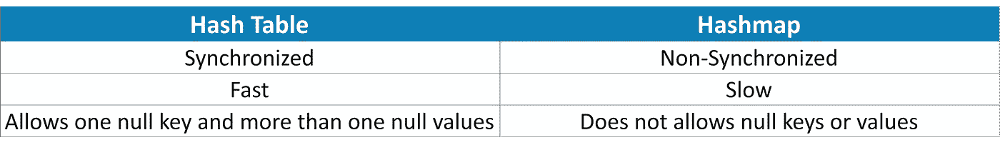
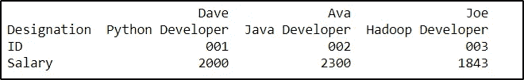

# Python 中的散列表和散列表

> 原文：<https://medium.com/edureka/hash-tables-and-hashmaps-in-python-3bd7fc1b00b4?source=collection_archive---------0----------------------->


Hash Table and HashMap in Python — Edureka

数据需要多种存储和访问方式。最重要的实现之一包括哈希表。在 Python 中，这些哈希表是通过内置的数据类型(即字典)来实现的。在本文中，您将学习什么是 Python 中的哈希表和哈希表，以及如何使用字典实现它们。

在继续之前，让我们看看所有的讨论主题:

*   Python 中什么是哈希表或者哈希表？
*   哈希表 vs 哈希表
*   创建词典
*   创建嵌套词典
*   使用字典对哈希表执行操作

1.  访问值
2.  更新值
3.  删除项目

*   将字典转换成数据帧

# Python 中什么是哈希表或者哈希表？

在计算机科学中，哈希表或哈希表是一种将键映射到其值对的数据结构(实现抽象数组数据类型)。它基本上利用了一个计算索引值的函数，这个索引值又保存了要搜索、插入、删除等的元素。这使得访问数据变得简单而快速。通常，哈希表存储键值对，并且使用哈希函数生成密钥。

Python 中的哈希表或哈希映射是通过内置的字典数据类型实现的。Python 中字典的键是由哈希函数生成的。字典的元素是没有顺序的，它们可以被改变。

字典的一个例子可以是雇员姓名和他们的雇员 id 的映射，或者是学生姓名和他们的学生 id 的映射。

接下来，让我们看看 Python 中哈希表和 hashmap 的区别。

# 哈希表 vs 哈希表:Python 中哈希表和哈希表的区别



# 创建词典:

可以通过两种方式创建词典:

*   使用花括号({})
*   使用 *dict()* 函数

## 使用花括号:

Python 中的字典可以使用花括号创建，如下所示:

**举例:**

```
my_dict={'Dave' : '001' , 'Ava': '002' , 'Joe': '003'}
print(my_dict)
type(my_dict)
```

**输出:**

{ '戴夫':' 001 '，'艾娃':' 002 '，'乔':' 003'}
字典

## 使用 dict()函数:

Python 有一个内置函数， *dict()* ，可以用来在 Python 中创建[字典](https://www.edureka.co/blog/sort-dictionary-by-value-in-python/)。例如:

**示例:**

```
new_dict=dict()
print(new_dict)
type(new_dict)
```

**输出:**

{}
字典

在上面的例子中，创建了一个空字典，因为没有键值对作为参数提供给 dict()函数。如果您想要添加值，您可以执行以下操作:

**例如:**

```
new_dict=dict(Dave = '001' , Ava= '002' , Joe= '003')
print(new_dict)
type(new_dict)
```

**输出:**

{ '戴夫':' 001 '，'艾娃':' 002 '，'乔':' 003'}
字典

# 创建嵌套词典:

嵌套字典基本上是位于其他字典中的字典。例如:

**举例:**

```
emp_details = {'Employee': {'Dave': {'ID': '001',
                                     'Salary': 2000,
                                     'Designation':'Python Developer'},
                            'Ava': {'ID':'002',
                                    'Salary': 2300,
                                    'Designation': 'Java Developer'},
                            'Joe': {'ID': '003',
                                    'Salary': 1843,
                                    'Designation': 'Hadoop Developer'}}}
```

# 使用字典对哈希表执行操作:

在 Python 中，可以通过字典对散列表执行多种操作，例如:

*   访问值
*   更新值
*   删除元素

## 访问值:

可以通过多种方式访问字典的值，例如:

*   使用键值
*   使用函数
*   实现 for 循环

## 使用关键值:

可以使用如下键值来访问字典值:

**举例:**

```
my_dict={'Dave' : '001' , 'Ava': '002' , 'Joe': '003'}
my_dict['Dave']
```

**输出:'** 001 '

## 使用函数:

有许多可以使用的内置函数，如 get()、keys()、values()等。

**举例:**

```
my_dict={'Dave' : '001' , 'Ava': '002' , 'Joe': '003'}
print(my_dict.keys())
print(my_dict.values())
print(my_dict.get('Dave'))
```

**输出:**

字典值(['戴夫'，'艾娃'，'乔'])
字典值(['001 '，' 002 '，' 003'])
001

## 实现 for 循环:

for 循环允许您通过迭代轻松地访问字典的键值对。例如:

```
my_dict={'Dave' : '001' , 'Ava': '002' , 'Joe': '003'}
print("All keys")
for x in my_dict:
    print(x)       #prints the keys
print("All values")
for x in my_dict.values():
    print(x)       #prints values
print("All keys and values")
for x,y in my_dict.items():
    print(x, ":" , y)       #prints keys and values
```

**输出:**

所有键
戴夫
艾娃
乔
所有值
001
002
003
所有键和值
戴夫:001
艾娃:002
乔:003

# 更新值:

字典是可变的数据类型，因此，您可以在需要时更新它们。例如，如果我想将名为 Dave 的雇员的 ID 从“001”更改为“004 ”,并且如果我想将另一个键-值对添加到我的字典中，我可以执行以下操作:

**例如:**

```
my_dict={'Dave' : '001' , 'Ava': '002' , 'Joe': '003'}
my_dict['Dave'] = '004'   #Updating the value of Dave
my_dict['Chris'] = '005'  #adding a key-value pair
print(my_dict)
```

**输出:** { '戴夫':' 004 '，'艾娃':' 002 '，'乔':' 003 '，'克里斯':' 005'}

# 从字典中删除项目:

有很多函数可以让你从字典中删除条目，比如 *del()、pop()、popitem()、clear()、*等等。例如:

**例如:**

```
my_dict={'Dave': '004', 'Ava': '002', 'Joe': '003', 'Chris': '005'}
del my_dict['Dave']  #removes key-value pair of 'Dave'
my_dict.pop('Ava')   #removes the value of 'Ava'
my_dict.popitem()    #removes the last inserted item
print(my_dict)
```

**输出:** { '乔':' 003'}

上面的输出显示，除了' Joe: 003 '之外的所有元素都已经使用各种函数从字典中删除了。

# 将字典转换成数据帧:

正如您之前看到的，我已经创建了一个嵌套字典，其中包含员工姓名和映射到它的详细信息。现在，为了制作一个清晰的表格，我将使用 pandas 库，以便将所有内容作为一个数据帧。

**例如:**

```
import pandas as pd
emp_details = {'Employee': {'Dave': {'ID': '001',
                                     'Salary': 2000,
                                     'Designation':'Python Developer'},
                            'Ava': {'ID':'002',
                                    'Salary': 2300,
                                    'Designation': 'Java Developer'},
                            'Joe': {'ID': '003',
                                    'Salary': 1843,
                                    'Designation': 'Hadoop Developer'}}}
df=pd.DataFrame(emp_details['Employee'])
print(df)
```

**输出:**



我希望你清楚本教程中与你分享的所有内容。这就把我们带到了关于 Python 中的哈希表和哈希表的文章的结尾。确保你尽可能多的练习，恢复你的经验。

如果你希望查看更多关于人工智能、DevOps、道德黑客等市场最热门技术的文章，那么你可以参考 [Edureka 的官方网站。](https://www.edureka.co/blog/?utm_source=medium&utm_medium=content-link&utm_campaign=hash-tables-and-hashmaps-in-python)

请留意本系列中的其他文章，它们将解释 Python 和数据科学的各个方面

> 1.[Python 中的机器学习分类器](/edureka/machine-learning-classifier-c02fbd8400c9)
> 
> 2.[Python Scikit-Learn Cheat Sheet](/edureka/python-scikit-learn-cheat-sheet-9786382be9f5)
> 
> 3.[机器学习工具](/edureka/python-libraries-for-data-science-and-machine-learning-1c502744f277)
> 
> 4.[用于数据科学和机器学习的 Python 库](/edureka/python-libraries-for-data-science-and-machine-learning-1c502744f277)
> 
> 5.[Python 中的聊天机器人](/edureka/how-to-make-a-chatbot-in-python-b68fd390b219)
> 
> 6. [Python 集合](/edureka/collections-in-python-d0bc0ed8d938)
> 
> 7. [Python 模块](/edureka/python-modules-abb0145a5963)
> 
> 8. [Python 开发者技能](/edureka/python-developer-skills-371583a69be1)
> 
> 9.[哎呀面试问答](/edureka/oops-interview-questions-621fc922cdf4)
> 
> 10.[Python 开发者简历](/edureka/python-developer-resume-ded7799b4389)
> 
> 11.[Python 中的探索性数据分析](/edureka/exploratory-data-analysis-in-python-3ee69362a46e)
> 
> 12.[带 Python 的乌龟模块的贪吃蛇游戏](/edureka/python-turtle-module-361816449390)
> 
> 13. [Python 开发者工资](/edureka/python-developer-salary-ba2eff6a502e)
> 
> 14.[主成分分析](/edureka/principal-component-analysis-69d7a4babc96)
> 
> 15. [Python vs C++](/edureka/python-vs-cpp-c3ffbea01eec)
> 
> 16.[刺儿头教程](/edureka/scrapy-tutorial-5584517658fb)
> 
> 17. [Python SciPy](/edureka/scipy-tutorial-38723361ba4b)
> 
> 18.[最小二乘回归法](/edureka/least-square-regression-40b59cca8ea7)
> 
> 19. [Jupyter 笔记本小抄](/edureka/jupyter-notebook-cheat-sheet-88f60d1aca7)
> 
> 20. [Python 基础知识](/edureka/python-basics-f371d7fc0054)
> 
> 21. [Python 模式程序](/edureka/python-pattern-programs-75e1e764a42f)
> 
> 22.[Python 中的生成器](/edureka/generators-in-python-258f21e3d3ff)
> 
> 23. [Python 装饰器](/edureka/python-decorator-tutorial-bf7b21278564)
> 
> 24. [Python Spyder IDE](/edureka/spyder-ide-2a91caac4e46)
> 
> 25.[Python 中使用 Kivy 的移动应用](/edureka/kivy-tutorial-9a0f02fe53f5)
> 
> 26.[十大最佳学习书籍&练习 Python](/edureka/best-books-for-python-11137561beb7)
> 
> 27.[用 Python 实现机器人框架](/edureka/robot-framework-tutorial-f8a75ab23cfd)
> 
> 28.[使用 PyGame 的 Python 中的贪吃蛇游戏](/edureka/snake-game-with-pygame-497f1683eeaa)
> 
> 29. [Django 面试问答](/edureka/django-interview-questions-a4df7bfeb7e8)
> 
> 30.[十大 Python 应用](/edureka/python-applications-18b780d64f3b)
> 
> 31.[Python 中什么是套接字编程](/edureka/socket-programming-python-bbac2d423bf9)
> 
> 32. [Python 3.8](/edureka/whats-new-python-3-8-7d52cda747b)
> 
> 33.[支持向量机](/edureka/support-vector-machine-in-python-539dca55c26a)
> 
> 34. [Python 教程](/edureka/python-tutorial-be1b3d015745)

*原载于 2019 年 10 月 21 日 https://www.edureka.co**的* [*。*](https://www.edureka.co/blog/hash-tables-and-hashmaps-in-python/)