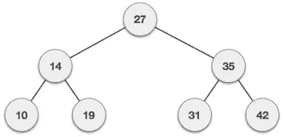
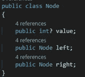
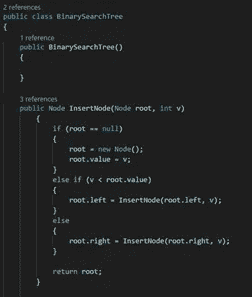
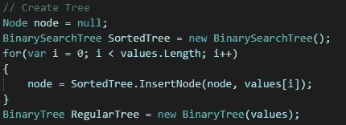
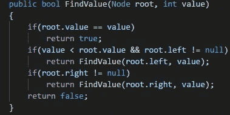
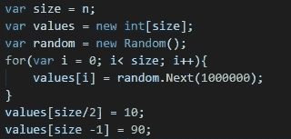
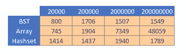
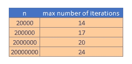

# 哈希表 vs 二分搜索法树:速度

> 原文：<https://medium.com/quick-code/hashsets-vs-binary-search-trees-speed-aa86853f7c63?source=collection_archive---------0----------------------->

我读了一些关于二分搜索法树以及它们是如何被设计成快速搜索的，这让我很好奇。与这些树中的一个相比，从一个简单的 hashset 中查找结果如何。

让我们更好地定义这个问题:

**给定一个长度为 n 的数据结构<int>——在这个结构中找到一个已知值并推断出这个结构中不存在一个值需要多长时间。**

考虑一个长度为 5 的数组:

[1，2，3，4，5] —找到数组中的值 4 并发现 6 不在数组中需要多长时间。

一场精彩的老对决是找到答案的唯一方法*

*除了谷歌、书籍、互联网、同事和任何知道如何编程的人。

# 竞争者:

不起眼的**阵作为对照组**。

**哈希集< int >** —因为我们在这个实验中只使用整数，所以我们将使用哈希集(一个字典，其中 key == Hashed(value))

**二叉查找树** —不是中的内置数据类型。Net 相对容易创建，并以快速搜索著称

# 搜索树:

BST 不是我们在日常编程中使用的数据结构，所以这里简单介绍一下我是如何创建我的 BST 的。

BST 是节点的集合(见下文)。每个节点都有一个值，并且不超过两个其他节点—左侧和右侧。小于父节点的每个子节点存储在左侧，大于父节点的每个子节点存储在右侧。

A BST

使用 BST 的优点是，您不必遍历整个数据结构来查找值或执行某种排序算法。

A Node on the tree

使用递归函数创建树相对简单:

这叫作像这样:

Setting up the tree

这里值得一提的是，我知道这段代码的效率有多低。我们最终还是会枚举整个数组，递归也会占用内存，但是请记住，我们在这里测试查找的速度，所以我们暂时忽略这个问题。

要在 BST 上搜索一个值，我们只需:

Searching algorithm

为了做这个实验，我创建了一个样本数据集:

数组中间的值和数组末尾的值是我们要搜索的值，以及一个不存在的变量(1000001)。

为了公平起见，我在数组中使用了从 200k 整数开始的 Log10(n)标度。

# 结果是:

所以我不得不记录滴答的结果，因为无论你如何努力，在 8 核 4Ghz 处理器上做这个操作永远不会慢。

结果显示…平局。多么乏味。

可以预见，数组搜索时间以 O(n)的方式与数据集的大小成比例。然而，二叉查找树算法和哈希表。Contains()方法似乎花费了相同的时间。

最初，我对 BST 算法的性能感到惊讶。但仔细想想，终究不是那么令人惊讶。

节点上的 FindValue 方法将调用 Log2(n)的最大值，其中 n 是初始样本大小(因为这是 BST 的最大深度)。

请参见下表:

将样本中的项目数量增加 10 倍只需要额外的 3-4 次方法调用，这实际上等于根本不需要时间。伟大的结果。

这意味着它和 hashset 查找一样高效，速度快得惊人！

在我们宣布二叉查找树胜利之前，这个实现(显然远非完美)拥有的内存是 hashset 的近 10 倍，创建它需要的时间也是 hashset 的近 10 倍。我怀疑，虽然无数小时的研究已经投入到精炼和完善散列表中，大约 45 分钟用于创建我的二叉查找树。

仍然:

哈希集 1–0 英国夏令时