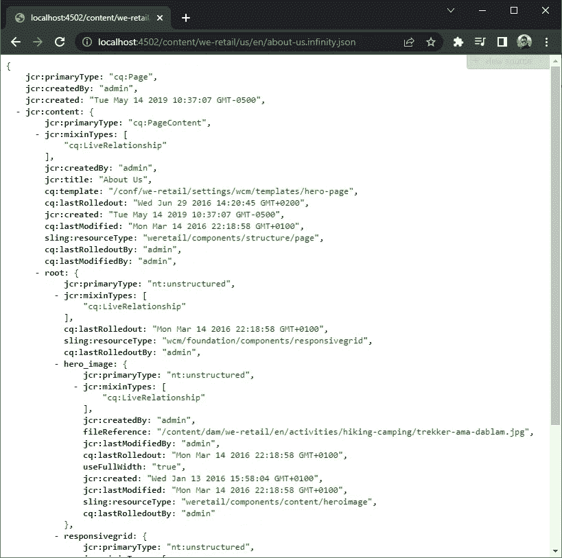
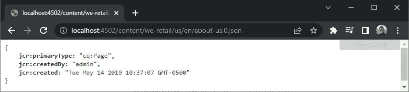
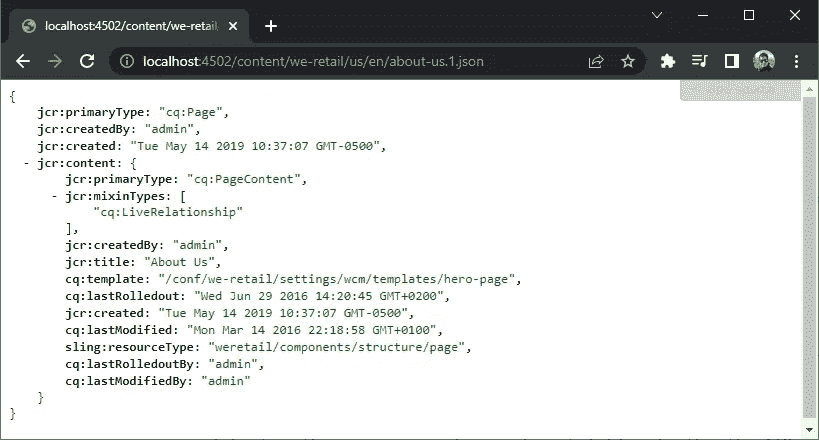
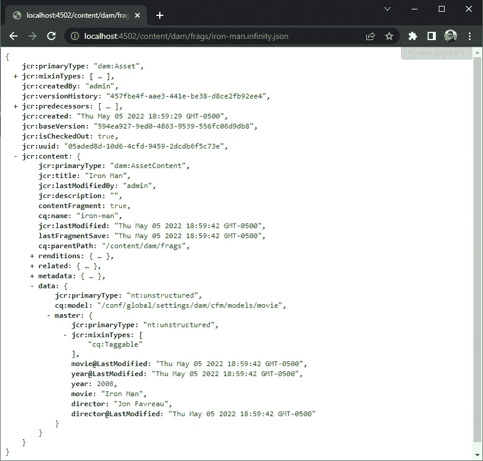
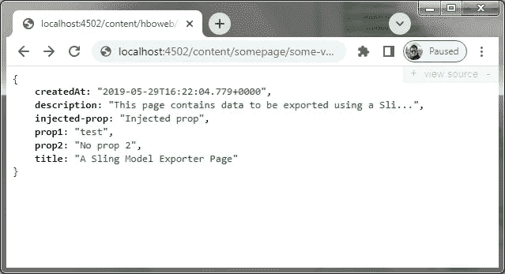
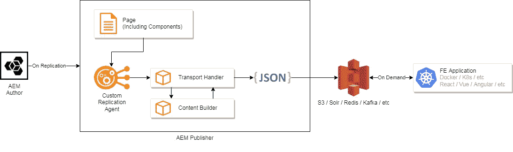
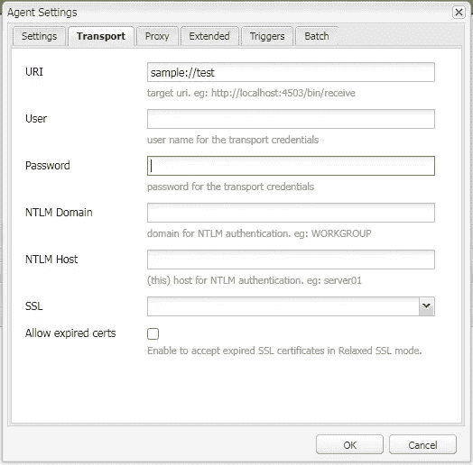
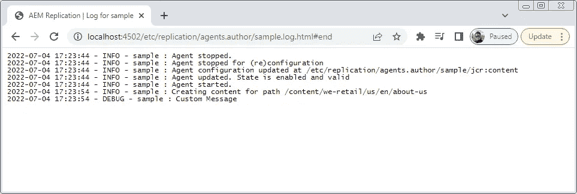
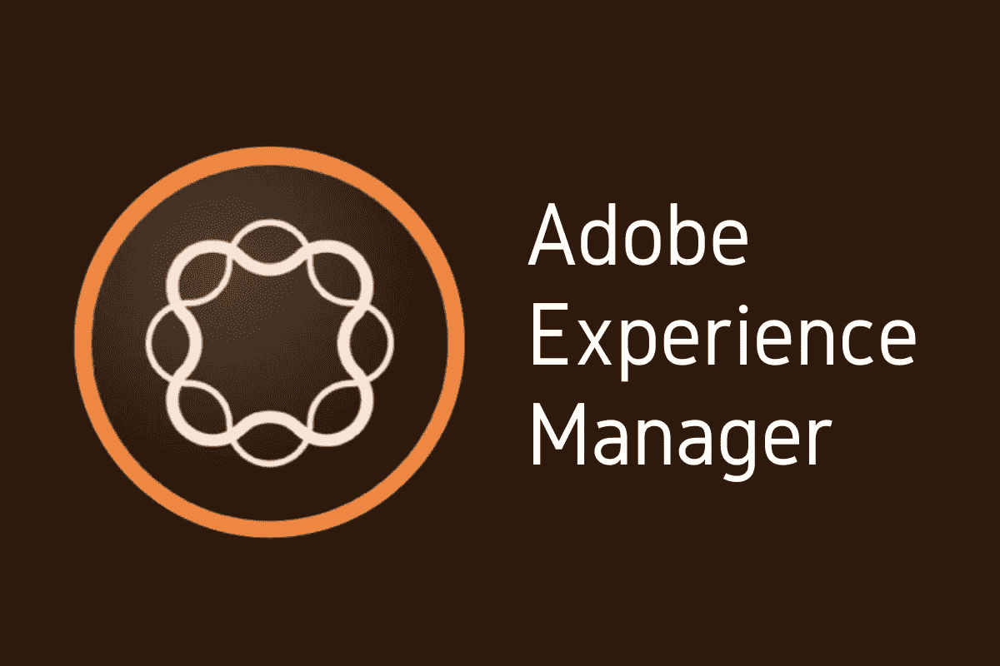

# 无头 AEM 接近

> 原文：<https://medium.com/globant/headless-aem-approaches-3ef1252c445d?source=collection_archive---------0----------------------->

当它们开始出现时，内容管理系统遵循一个单一的架构，负责内容管理、交付、页面呈现和缓存，这意味着开发人员通常需要了解每个特定 CMS 的工作方式，以便能够根据项目的需要对其进行定制。

许多现代 CMS 仍然提供这种 headful 或传统的方法，但大多数也开始支持 headless 交付，包括 Adobe Experience Manager (AEM)。在本文中，我们将快速浏览一下 AEM 可以实现的五种不同的无头交付方法。

## 什么是无头交付，我为什么需要它？

简而言之，无头交付从 CMS 那里拿走了页面渲染的责任。CMS 将数据作为 API 公开，其他应用程序可以使用它来处理和呈现数据。这对于全渠道交付、解耦架构、可伸缩性、面向未来等非常有用。

并不是所有的项目都需要它，需要根据具体情况进行分析，但是如果以上任何一个都是一个问题，那么考虑去 headless 是一个好主意。

## JSON 方法

AEM 添加对无头交付的支持已经有一段时间了，从简单地交换*开始。html* 的扩展名为。 *infinity.json* 到一个已发布的资源。这是 AEM 的 Sling 模型实现的一部分。

这样做将检索存储在特定资源中的原始 JCR (Java Content Repository)属性，并将其显示为 JSON 树。

JSON Approach (about-us.infinity.json)

*Infinity* 在这种情况下意味着 API 将显示的子节点的数量，这可以更改为 0 以仅显示顶级属性，1 以显示顶级加 1，等等。

JSON Approach (about-us.0.json)

JSON Approach (about-us.1.json)

这种方法在大多数情况下都能创造奇迹，尽管它也有一些缺点:

*   它仍然依赖 AEM 的 dispatcher 和 publisher 实例来访问，这意味着尽管渲染不再是 CMS 的责任，但它仍然需要缓存数据并将其直接交付给第三方应用程序，这可能会带来可扩展性问题。
*   它是不可变的，因为它只是 AEM 中存储数据的可视化表示，所以它包含了许多不必要的信息，很难解析。

## 内容片段

内容片段是没有任何表示层的模型的实例，它们本质上是遵循定义的模式的数据块。片段可以以多种方式使用，包括将它们链接到一个组件以检索存储在其中的信息，或者只是作为数据优先资源。

这些实体作为资产存储在 AEM 中，还附带了一个 OOTB JSON API，可以用来直接检索数据。

JSON Representation of a Content Fragment

对于第三方应用程序来说，这与前面的方法有相同的缺点，即调度程序仍然需要处理这些请求和不变性，尽管数据存储在`jcr:content/data`下，所以开箱即用会更整洁一些。

## 吊索模型出口商

虽然上述方法可行，但是通过使用 Sling 模型导出器可以实现更健壮的东西。这些基本上允许公开一个 Sling 模型的属性，但是可以修改以适应特定的命名约定，可以插入代码来转换现有的属性或者注入额外的属性。因为它是一个完全成熟的类，它允许任何可能需要的操作(例如，基于模型的属性查询节点，进行计算，等等。)然后将该数据显示为有效载荷的一部分。它提供了很大的灵活性，可以通过像`JsonIgnore`这样的注释显示或隐藏特定的属性。

An example of a Sling Model Exporter payload (resource.model.json)

这个例子可以使用如下的类来实现。这个类让 AEM 知道，对于资源类型`test/sampleModel`，它将通过访问资源地址并添加`model.json`来使用这个模型导出器，就像我们使用`infinity`修饰符一样。

我们可以使用`@JsonProperty`注释并赋予它一个值来注入属性，并且我们可以在属性的`get`方法中执行操作。使用`PostConstruct`注释，我们可以访问其他 JCR 资源并执行更昂贵的计算，查看参考资料以获得关于如何使用它们的更详细的描述。

Sample Sling Model Exporter

## GraphQL API

还有 AEM 6.5 附带的 GraphQL API，专门用于处理内容片段。利用内容片段的数据优先方法，AEM 合并了一个 GraphQL 实例(graph QL)。

通常，GraphQL 中的模式是强类型的，因此在使用之前必须对它们进行定义和结构化。然而，在 AEM 中，模式是基于内容片段模型生成的，该模型可以根据业务需求进行修改，并将根据这些变化自动更新所述模型。

该实现超出了本文的范围，但是 GraphQL 接口仍然是通过 dispatcher 提供的，因为所有以前的方法都是这样做的。当我们需要完全解耦的东西时会发生什么？

## 自定义复制/传输

有时候，出于多种原因，如性能、平台可用性、有限的网络等，项目需要一个完全解耦的架构。

自定义复制提供了对数据流及其存储位置的完全控制，这可能是 AWS、ElasticSearch、Solr、Kafka、SQS 等公司的 S3 桶。

Diagram of a decoupled application using Custom Transport

从开发的角度来看，这是最费力的，需要最大的努力，但是，它允许一个真正解耦的环境，不直接依赖于 AEM 的 dispatcher 或 publisher 实例。

首先，您需要创建一个`TransportHandler`，一个传输处理程序允许我们挂钩到复制机制，以便构建我们自己的解决方案。AEM 已经与该实现捆绑在一起，用于 author 和 publisher 上的开箱即用复制代理。

传输处理程序的实现基本上需要两件主要的事情，一个是确定是否使用定制代理的`canHandle`方法，另一个是负责大部分流程的`deliver`方法。在这里您可以添加一个自定义的 ContentBuilder 来管理内容，否则它将尝试发送整个页面，就像在创作和发布之间那样。下面是一种基本方法:

Sample Custom Transport

这需要与此复制代理的实例一起进行，它可以在 miscadmin 面板上创建。为了确保使用自定义传输，我们需要指定 URI 来使用处理程序上的那个。通常情况下，您会在这里添加一个用户和密码，以及其他配置选项，如 S3 存储桶的名称，可能还有 AWS 凭证等。

Custom Agent Settings

最后，当一个资源发布后，您可以查看日志，看看它是否通过了。在这种情况下，我们会看到添加到日志中的自定义消息。

Custom Agent Log

最后，这允许一个完全解耦的架构，不依赖于分发器来提供内容，如前所述，这是最费开发精力的，但提供了很大的灵活性。我们将在以后的文章中进行更详细的讨论。

> 注意，在 AEM Cloud 中，使用 [Sling 内容分发](https://sling.apache.org/documentation/bundles/content-distribution.html)发布内容。不再支持自定义复制代理或传输，需要通过 EventHandler 来处理。

## 结论

使用 Adobe Experience Manager 实现无头交付有许多不同的方法，其中许多我们甚至没有包括在内，如自定义 Servlets、QueryBuilder API、Assets CRUD 操作等。在这篇文章中，我们只是触及了这个主题的表面，给出了一些实现这种响应的最常见的方法，希望这是一个好的起点。编码快乐！

## 参考

*   [用于内容片段的 AEM graph QL API | Adobe Experience Manager](https://experienceleague.adobe.com/docs/experience-manager-cloud-service/content/headless/graphql-api/content-fragments.html?lang=en)
*   [在 AEM | Adobe Experience Manager 中开发吊索模型导出器](https://experienceleague.adobe.com/docs/experience-manager-learn/foundation/development/develop-sling-model-exporter.html?lang=en#:~:text=Sling%20Model%20Exporter%20is%20a%20feature%20of%20the,and%20later.%20The%20use-case%20for%20Sling%20Model%20Exporter)