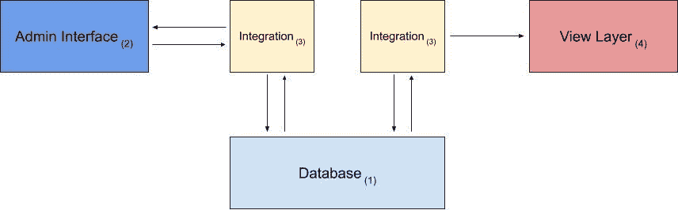
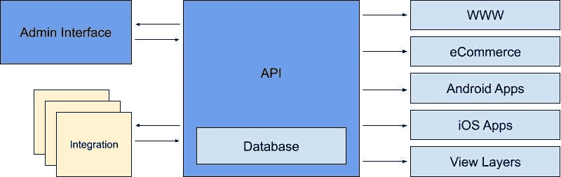
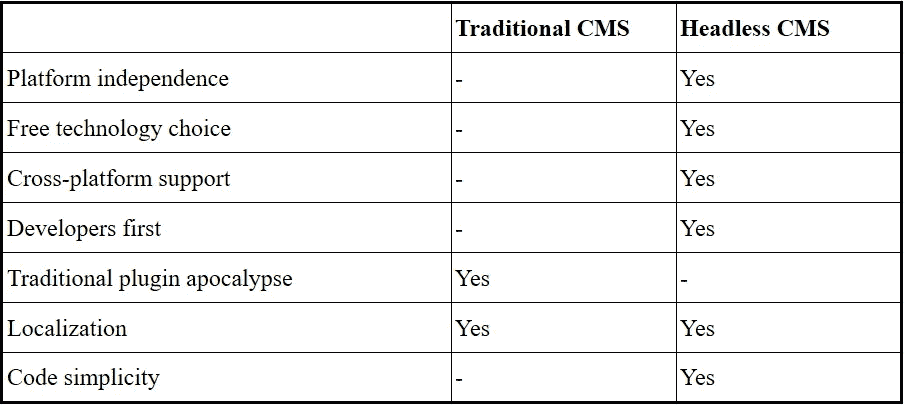
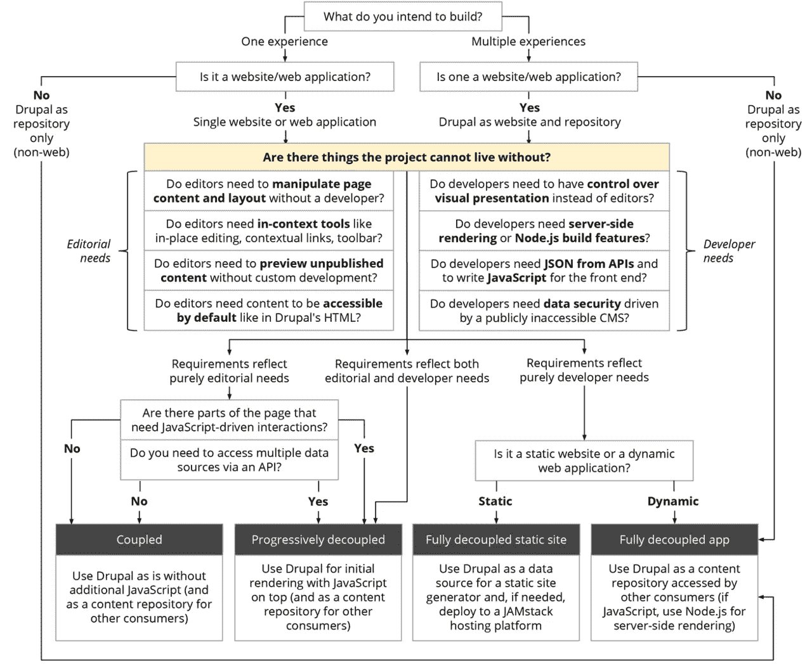

# 无头 CMS

> 原文：<https://medium.com/globant/headless-cms-dc3a567e8777?source=collection_archive---------0----------------------->

# 什么是无头 CMS？

headless CMS 是一个仅后端的内容管理系统(CMS ),从头开始构建为内容、结构和配置存储库，使信息可以通过 RESTful API 访问，以便在任何设备上显示。

术语“无头”来自于将“头”(前端，网站)从“身体”(后端，内容存储库)上砍掉的概念。无头 CMS 保留了一个添加内容的接口和一个 RESTful API (JSON，XML ),以便在您需要的任何地方提供内容。由于这种方法，一个无头的 CMS 并不关心你的内容如何以及在哪里显示。无头 CMS 只有一个焦点:存储和交付结构化内容和配置。

无头 CMS 的对等物通常被称为单片、常规或耦合 CMS。

Monolithic, regular, or coupled CMS

让我们来看看单片 CMS 实现及其特性集:

1.  用于内容读写的数据库。
2.  允许编辑管理内容的管理界面。
3.  读写一体化。
4.  实际的前端将数据库中的数据与 HTML 结合起来。

要将它转换成一个无头 CMS，我们只需从堆栈中删除特性四。CMS(实际网站)的头被直接砍掉了。留下来的是一个允许内容管理(Admin UI)和阅读(API:组合集成)的应用程序。

Headless CMS

除了使用单片 CMS 之外，一个网站不能只用一个无头 CMS 来构建。无头 CMS 将磁头从其堆栈中分离出来，因此在设计上缺少这一点。因此，开发者必须自己制作网站，并使用 headless CMS 的内容交付 API 来加载内容。

自己创建整个网站似乎是一项艰巨的任务，但通过将 CMS 与前端分离，开发人员可以选择他们已经熟悉的任何技术，而不需要学习特定 CMS 的技术。

另一个巨大的好处是，一个开发人员也可以专注于自己的工作，而无需处理现有技术的缺陷。因此，更容易为谷歌页面速度优化页面，甚至重新启动网站的一部分，而不需要关心内容。

# 让我们比较一下这两种方法

**单片 CMS 的优点**

*   整体式 CMS 不需要在基础设施上进行大量投资；他们中的大多数人只需要一个托管账户。
*   它易于设置和部署。
*   因为它们易于管理，所以非常适合于单个站点。

**单片 CMS 的缺点**

*   定制网站的前端可以与耦合 CMS 的挑战，因为它提供了有限的选项来定制 UX/用户界面。
*   扩展基础设施是一项挑战，因为它依赖于数据库的可伸缩性。
*   单片 CMS 不像其他架构那样安全。黑客可以进入管理门户的后端，这可能会给网站的前端带来潜在的风险。

**无头 CMS 的优点**

*   由于其架构，无头 CMS 比耦合 CMS 更快地交付内容。
*   这样更安全。可以在第三方目的地发布文件，隐藏网站后端，让黑客很难攻击你的网站。
*   软件升级仅影响 CMS 应用程序，不影响实时网站。即使后端出现停机，前端也能继续运行，没有任何障碍。

**无头 CMS 的弊端**

*   无头 CMS 的配置和部署比耦合 CMS 更复杂。你必须定制它们。
*   与开发系统前端相关的前期成本可能会很高。

# 我需要一个无头 CMS 吗？

这个问题的答案很简单，但对你帮助不大:看你的要求了。存在一个 CMS 比另一个 CMS 突出的用例，反之亦然。为了帮助您做出决定，让我们快速了解一下好处:

更好地解释一下并尝试扩展这个表，我们可以说最常听到的无头 CMS 用例是:

*   用你熟悉的技术建立一个网站。
*   使用 JavaScript 框架(VueJS、ReactJS 等)的网站、Web 应用。
*   用静态网站生成器(Jekyll，中间人)创建的网站。
*   原生移动应用(iOS 和/或 Android)。
*   丰富博客和电子商务网站的内容和产品信息。

此外，无头 CMS 不仅限于网站，无头 CMS 可以通过 API 将您的内容直接发送到您需要的地方。由于这种无头方法，内容可以在 iOS 应用程序、Android 应用程序以及你能想到的任何平台和技术上使用，因此，对于移动和网络开发者来说是一个强大的选择。

一些 CMS，或者支持它们的社区，提供了大量的信息来帮助我们正确地选择最适合每个实现的 CMS 类型。举个例子，Drupal 社区的 Dries Buytaert 创建并发布了下图:

To better understand how to use this diagram, I recommend visiting the blog of Dries Buytaert (its author) by following this link: [https://dri.es/how-to-decouple-drupal-in-2019](https://dri.es/how-to-decouple-drupal-in-2019)

总之，我们可以说，如果我们彻底研究我们的项目，并诚实地回答图表中的问题，我们将会找到最适合我们的 CMS 类型。

# 无头 CMS 选项的世界

我们可以找到关于 WordPress 和 Drupal 的信息，并且会发现它们已经在尝试进入 headless 或者至少提供一个 API 方法。

上面提到的两个选项都工作得很好，但是试图让 CMS 以一种它们最初没有被设计的方式工作。以下是一些无头 CMS 选项，您可能想看看，以找到最适合您的选项:

*   黄油 CMS
*   内容堆栈
*   满足的
*   dotCMS
*   穆拉
*   驾驶舱 CMS
*   核心 DNA
*   Craft CMS
*   Zesty.io
*   直接图
*   Dato CMS
*   GraphCMS
*   宇宙 JS
*   Kontent.ai (Kentico)
*   Prismic.io
*   粗体(五种字体)
*   头脑清楚
*   斯克里维托
*   Sitecore
*   DNN Evoq 内容
*   斯特拉皮
*   索洛德夫
*   敏捷 CMS
*   Ingeniux CMS
*   第一精神(电子精神)
*   网络 CMS
*   救生筏
*   核心媒体内容云
*   布鲁姆里奇
*   皇冠峰
*   玉兰不育系
*   站点有限性
*   eZ 平台
*   外部服务器

也有其他的选择，但是从特性和概念来看，这些才是你应该考虑的平台。

# 摘要

这篇文章将涵盖什么是真正的无头 CMS 的基础知识。您将了解到 Storyblok、Contentful 或 Prismic 等无头 CMS 与 Drupal、Adobe Experience Manager、WordPress、Sitecore 等传统 CMS 之间的主要区别。