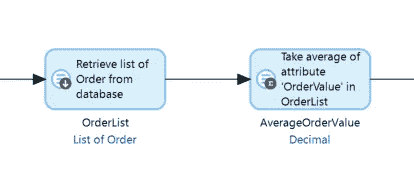
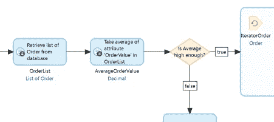

# Mendix 的健康和效率

> 原文：<https://medium.com/mendix/health-and-efficiency-in-mendix-86a02a4c70a3?source=collection_archive---------2----------------------->

Health and Efficiency in Mendix

# 所有应用程序都可能效率低下，包括 Mendix 应用程序。低效率可能在开发过程中几乎看不到，只有当应用程序进入批量或压力测试时才会出现问题。然而，确实可以在开发过程中识别出常见的模式，并立即做出改进。

在这个简短的系列中，我想介绍一些简单的——和不那么简单的——可以使 Mendix 应用程序更高效的方法。理想的结果应该是一个应用程序在尽可能短的时间内完成工作，消耗尽可能少的资源。

# 总是吗？

号码

有时，在可读和可维护的**选项**或更高度优化的版本**巧妙的**和**更高效的******但难以理解的**之间会有一个**权衡，这将是你或其他将来必须维护代码的开发人员的一个问题。****

********

**这是团队在开发过程中或者在调查性能问题时做出的判断，高质量的注释或文档可能有助于促进对不清楚的代码的理解。**

**同样，**某事运行**越频繁，从**提高效率**中获益**的可能性就越大。一个可以优化为花费 5 分钟而不是 10 分钟，但一个月只运行一次的动作，在寻求效率增益时可能不应该是重点，而一个每天运行数千次的动作的半秒效率增益肯定是更高的优先级。****

# **黄金老歌**

**Mendix 中的一些设计模式以前已经被强调过，但是值得再次访问，因为有时新的和经验丰富的开发人员会忽略它们。**

# **环路环路**

****

**当使用循环在微流**中创建或修改对象时，在**列表**和**提交**列表**之外的**循环**中收集同类型的新/修改对象。**

**而不是:**

****

**您可以使用:**

****

**这将意味着在新的和改变的对象的过程结束时，有一个用于订单对象的单个提交**和另一个用于 OrderUpdateAudit 对象的提交**。**提交可能会很昂贵**因为每一次提交都需要您的应用程序运行一次到数据库的往返行程，并且每次往返行程都会带来开销，所以批量提交可以减少往返行程的数量，从而降低开销。**

# **让你的聚合体飞起来！**

****

**Mendix 运行时在优化由您编写的低代码导致的数据库查询方面走得太远，例如，在您的微流中，您可以在 retrieve activity 之后立即放置一个 **list 聚合活动:****

****

**这导致**运行时**对数据库**执行一条语句**，该语句将计算订单上订单值的平均值。订单记录根本不会被检索到应用程序中，也不会实际生成订单列表。这将使执行速度更快。**

**然而，可以通过在之后重用生成的列表来打破这种优化。**

****

**现在，OrderList 在聚合运行后再次被使用(作为 IteratorOrder 循环的数据源)，这意味着 Mendix 恢复到标准行为，执行检索将所有记录加载到 OrderList 中，然后通过向下扫描该列表中的记录来计算平均值。**

****

**在这些情况下，运行两次的**检索** **活动****——一次让**聚合使用**，另一次让**获取记录列表**，可能会更快**。这在本例中特别适用，因为第二次检索(现在是 IteratorOrder 循环的源)仅在计算的平均值足够大时运行，因此如果平均值很低，则根本不会检索列表。******

# **使用纳米流代替微流**

****

****微流**是在 **Mendix** **服务器**上执行的强大代码动作，通常由用户的 Mendix 客户端发起。纳米流可以执行许多与微流相同的活动，尽管在某些情况下，它们的工作方式与微流不同。最大的区别是，纳米流运行在 **Mendix 客户端**(用户的浏览器或本地应用程序)中，这可以使纳米流比执行类似功能的微流具有更大的效率优势。**

****

**这个微流是从用户界面上的一个按钮调用的，它实现了一个可以更新被显示对象的业务规则。单击该按钮会导致从 Mendix 客户端向服务器上的应用程序发出一个调用，请求运行微流并将结果返回给客户端。**

****

**这种纳米流也做同样的事情。在功能上，它几乎与微流相同，但是整个操作在用户的 Mendix 客户机中执行，因此从客户机到服务器的调用、在服务器上执行代码以及将结果返回给客户机都不会发生。这减少了网络流量，并避免了服务器在为用户执行更改时被中断。**

**使用纳米流并不总是一个好主意。如果您的 Nanoflow 需要调用微流作为其功能的一部分，那么您可能无法保存任何东西，因为仍然会发生网络交互和服务器中断。如果您的纳米流需要调用多个微流，或者需要从数据库中检索更多数据来执行其功能，那么使用纳米流而不是微流很可能会适得其反。**

# **下次…**

**我希望你喜欢读这篇文章。我的下一篇文章将解决我遇到的一个非常具体的性能问题，给出一个使用 Java 动作的解决方案。**

**您的应用程序是否存在性能问题？请在评论中告诉我！**

## **阅读更多**

 **[## 实施 Mendix 最佳发展实践

### 1 简介本文档可用作采用一致的命名和建模约定的参考，同时…

docs.mendix.com](https://docs.mendix.com/howto/general/dev-best-practices/)**  **[## 为应用性能实施社区最佳实践

### 1 简介本文档由 Mendix 社区创建并为其服务。它收集了以下方面的最佳性能实践…

docs.mendix.com](https://docs.mendix.com/howto/general/community-best-practices-for-app-performance/)**  **[## MxAssist 性能机器人

### 描述 Mendix Studio Pro 中的 MxAssist 性能机器人。

docs.mendix.com](https://docs.mendix.com/refguide/mx-assist-performance-bot/)** 

***来自发布者-***

***如果你喜欢这篇文章，你可以在我们的* [*中页*](https://medium.com/mendix) *找到更多喜欢的。对于精彩的视频和直播会话，您可以前往*[*MxLive*](https://www.mendix.com/live/)*或我们的社区*[*Youtube PAG*](https://www.youtube.com/c/MendixCommunity/community)*e .***

***希望入门的创客，可以注册一个* [*免费账号*](https://signup.mendix.com/link/signup/?source=direct) *，通过我们的* [*学苑*](https://academy.mendix.com/link/home) *获得即时学习。***

**有兴趣加入我们的社区吗？加入我们的 [*松弛社区频道*](https://join.slack.com/t/mendixcommunity/shared_invite/zt-hwhwkcxu-~59ywyjqHlUHXmrw5heqpQ) *。***