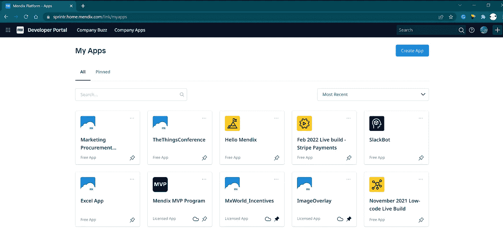
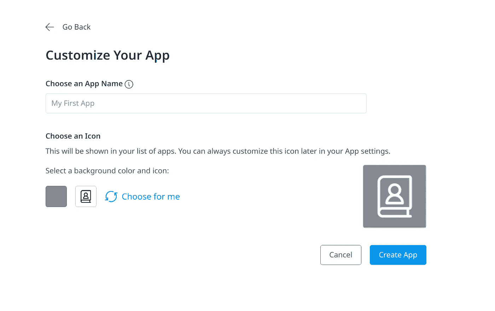
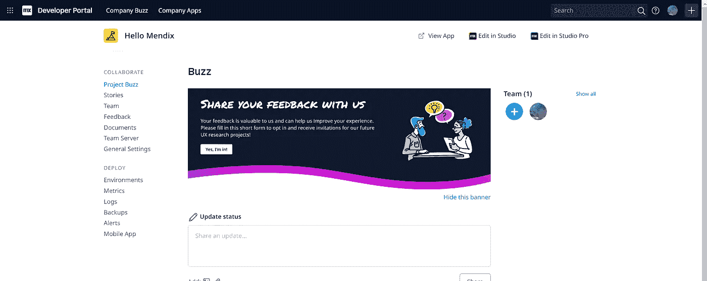
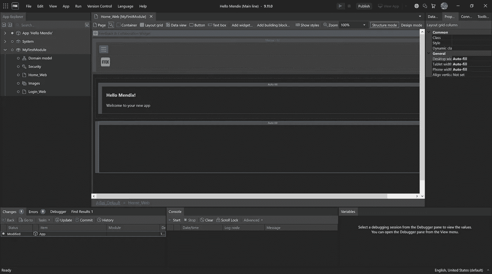

# 在 Mendix 中创建、运行和部署 Hello World 应用程序

> 原文：<https://medium.com/mendix/hello-mendix-1132869100be?source=collection_archive---------6----------------------->

Hello Mendix! Create, Run and Deploy a Hello World App in Mendix

# 在我发表的所有关于真正技术问题的博客中，当人们问我关于平台的简单问题时，总是让我感到惊讶。为了补救这一点，我写了一系列快速而中肯的操作方法，涵盖了每个应用程序都需要的基本但重要的东西…从创建和部署应用程序开始。

Hello Mendix — Create & Deploy a Hello World App

## 如何使用 Mendix 创建和部署 Hello World 应用程序？

从[开发者门户](https://sprintr.home.mendix.com/link/myapps)开始，点击右上角的**创建应用**，逐步完成整个流程。

Mendix Developer Portal

输入应用名称，选择图标和应用颜色，点击“**创建应用**

Mendix Create New App

> 这些仅在您的开发者门户上可见，而不是实际应用的图标和颜色

Mendix App view in Developer Portal

一旦平台完成了你的项目，点击“E **dit in Studio Pro** 将应用下载到你的开发机器上并开始构建。

什么是 Mendix Studio Pro: 它是面向专业开发人员的 Mendix IDE。有关安装的更多信息，请阅读文档页面[此处](https://docs.mendix.com/howto/general/install)。

当项目下载并在 Studio Pro 中打开后，我们可以通过按下 **Ctrl + G** 并搜索“ **home_web** ”来快速打开我们的默认主页。

打开页面，点击标题为“**主页**”的自动生成标签，并输入“ **Hello Mendix！**"来更新标题。

Mendix Home page open in Mendix Studio Pro

就是这样，你可以点击 **F5 在本地**运行测试，或者**点击 Studio Pro 右上角的【发布】**，**将你的 app** 部署到 **Mendix Cloud。这是一个免费的实时环境**，每个 Mendix 应用程序都可以使用。

运行或发布后，只需点击“**查看应用**”即可首次启动您部署的应用。

有关点击“发布”会发生什么的更多信息，请查看“引擎盖下”系列(链接如下)，有关我们平台的更多信息，您可以前往[https://docs.mendix.com/](https://docs.mendix.com/)开始学习。

## 阅读更多

 [## 安装 Mendix Studio Pro - Studio Pro 9 操作指南| Mendix 文档

### Mendix Studio Pro 使您能够在 Mendix 平台上构建应用程序。本指南将指导您完成以下步骤…

docs.mendix.com](https://docs.mendix.com/howto/general/install)  [## Studio Pro 概述- Studio Pro 9 指南| Mendix 文档

### Mendix Studio Pro 是一款用于创建、查看和编辑 Mendix 应用程序的工具。一个 Studio Pro 实例可以…

docs.mendix.com](https://docs.mendix.com/refguide/studio-pro-overview)  [## App Explorer - Studio Pro 9 指南| Mendix 文档

### 应用浏览器显示你的应用的完整结构，包括模块中的所有文档:应用浏览器…

docs.mendix.com](https://docs.mendix.com/refguide/project-explorer) 

*来自发布者-*

*如果你喜欢这篇文章，你可以在我们的* [*中页*](https://medium.com/mendix) *找到更多喜欢的。对于精彩的视频和直播会话，您可以前往*[*MxLive*](https://www.mendix.com/live/)*或我们的社区*[*Youtube PAG*](https://www.youtube.com/c/MendixCommunity/community)*e .*

*希望入门的创客，可以注册一个* [*免费账号*](https://signup.mendix.com/link/signup/?source=direct) *，通过我们的* [*学苑*](https://academy.mendix.com/link/home) *获得即时学习。*

有兴趣加入我们的社区吗？你可以加入我们的 [*Slack 社区频道*](https://join.slack.com/t/mendixcommunity/shared_invite/zt-hwhwkcxu-~59ywyjqHlUHXmrw5heqpQ) *或者那些想要更多参与的人，看看加入我们的*[*Meetups*](https://developers.mendix.com/meetups/#meetupsNearYou)*。*