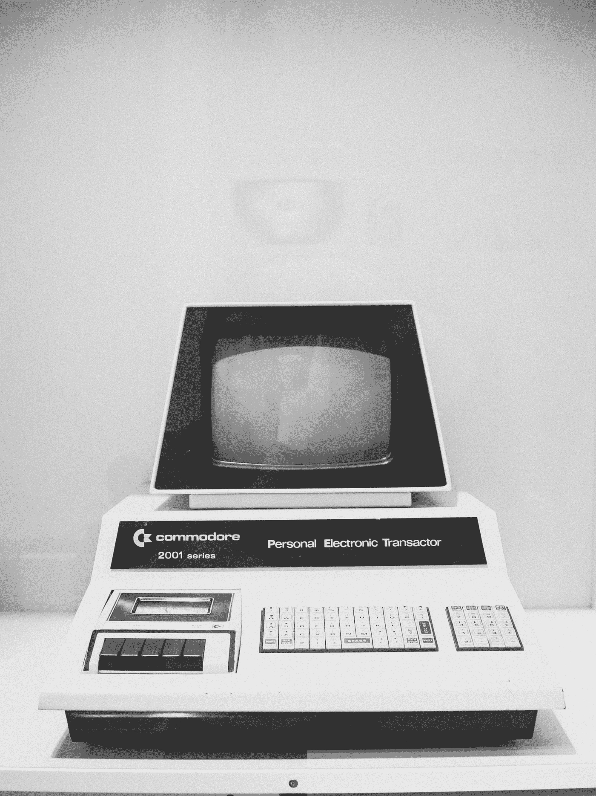

# 你好，世界 _ 这只是开始

> 原文：<https://medium.com/quick-code/hello-world-its-only-the-beginning-2772d9b95a89?source=collection_archive---------2----------------------->

## 一个耸人听闻的故事，当第一行代码被写出来的时候

Photo by [Anastasia Dulgier](https://unsplash.com/@dulgier?utm_source=medium&utm_medium=referral) on [Unsplash](https://unsplash.com?utm_source=medium&utm_medium=referral)

从我写第一行代码到现在已经过了很长时间…如果我没记错的话，那是 1990 年。

我曾见过我父亲在他的 Commodore PC-1 上写东西，他似乎多次高兴，多次悲伤，但他总是继续在键盘上打字。

几年后，我明白了他只是在做一个程序，允许从坐标开始计算地理空间距离，只是出于个人爱好。

直到有一天他告诉我:

> 你会尝试吗？

显示器开着，黑色背景，绿色光标似乎在告诉你*你还在等什么？*

我还是个孩子，刚刚开始学习字母和字母表，所以我父亲给我口授:

> 现在输入… 10 打印再见马可

我记得我用一个手指打出了指令，但在我的脑海里我不知道我在做什么。

编程语言是 GW-BASIC，需要定义每条指令的代码行数。

PRINT 的简单指令允许您在控制台输出上显示文本。

下一步:

> 现在我们需要执行并尝试代码…

他说的*处决*是什么意思？这是我第一次听到这个词，我对这个*的执行*充满了期待。

按下 F2 键，GW-BASIC IDE 消失在后台，屏幕的左上方出现了“Ciao Marco”字样:这是不可能的……这太不可思议了。

Photo by [Ben White](https://unsplash.com/@benwhitephotography?utm_source=medium&utm_medium=referral) on [Unsplash](https://unsplash.com?utm_source=medium&utm_medium=referral)

我刚刚编写并执行了我的第一行代码:太棒了。

在这种情况发生后，我不得不和父亲一起尝试编码，这让我意识到这是世界上最好的事情。

这个电子盒完成了我在键盘上敲的所有工作。我向机器提交了一份订单，它对我作出了回应。

快乐的感觉很快就被一个编辑错误打断了。

Photo by [Charles](https://unsplash.com/@charlesdeluvio?utm_source=medium&utm_medium=referral) on [Unsplash](https://unsplash.com?utm_source=medium&utm_medium=referral)

在我的脑海里，我曾经认为这台机器很漂亮，但很精致:只有当你用它的语言说话时，它才能理解。

> 我需要学习另一种语言。

我被许多不同的感觉包裹着，从编写和执行一段代码的快乐，到不得不学习一种新语言的恐惧，这种语言与自然语言大不相同。

> 为结果高兴！

从这一刻起，我就对编程语言和 IT 着迷了，并且我已经为它们奉献了我的一生。

在我的学习和工作中，我又经历了几次这种感觉:害怕在编码时犯错误，高兴地将你的工作软件投入生产。

非常感谢我的父亲给了我这个小小的机会。

***感谢您的宝贵时间！***